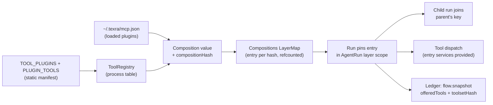

# The plugin architecture: plugins as data, a pinned composition per run

This note describes how plugins work on `main` as of 2026-09-24. It is the
owner of the topic; the rulings it relies on are in the
[architecture rulings ledger](./2026-08-01-architecture-rulings-ledger.md), and
the [Effect-native runtime system design](../../proposed/architecture/2026-09-10-effect-native-runtime-system-design.md)
records how this departs from the `ToolRegistry` it proposed.

## Owner rulings

Four owner decisions (2026-09-23 and 2026-09-24) frame the work:

- **Everything is a plugin.** Each extensible subsystem gets a typed
  contribution list keyed by a stable plugin id, installed by code at
  startup. The rulings ledger records this in the amendment to "`defineTool`'s
  default `R` is frozen SDK surface", which also opened the SDK tool contract
  to change.
- **No new formats.** Plugins are TypeScript data in the tree, not a manifest
  file format. The one user-authored input, MCP servers, reuses Claude Code's
  `.mcp.json` shape. Agents stay YAML, skills stay `SKILL.md`.
- **Effect unstable modules are allowed** for this work. The MCP client spawns
  servers through `effect/unstable/process` (`src/tools/mcp/mcpServer.ts`).
- **LOC is not the gate.** Several PRs in this line net-add lines (#13089 +76,
  #13093 +179, #13094 +52); each states what it removed instead.

## Plugins are data with stable ids

`src/tools/plugins.ts` holds `TOOL_PLUGINS`, one list of
`{ id, toolNames, name, category, description, availability?, injectedWhen?, layer?, skills?, ... }`
(#13084). It imports no tool implementation. Every tool belongs to exactly
one plugin; two hidden plugins, `core` and `setup`, own the tools no dashboard
card lists. The ids are the persisted toggle keys. From this one list the
tree derives the dashboard items for all three hosts, the probe set
(`src/tools/pluginAvailability.ts`, `src/tools/toolProbes.ts`), first-install
toggle seeding, install and auth actions, and the `texra tools` guides.

Tools themselves are plain values (#13083): `defineTool` returns an object
with `definition`, execution flags, `guard` and `call`. `BaseTool` is deleted,
and the SDK exports `DefinedTool`.

`src/tools/registry.ts` maps plugin id to `{ toolName: tool }` and builds
`TOOL_TABLE` from it. `satisfies` checks against the manifest make these type
errors: a missing or extra tool name, an unknown or duplicate plugin id, a
tool name claimed by two plugins, empty `toolNames`, and a toggleable plugin
without `availability`.

## The Composition value

A run's toolset is a function of one value, `Composition`
(`src/tools/composition.ts`, #13089):

- `plugins`: enabled plugin ids, sorted (switches and probes applied);
- `disabled`: ids the user switched off;
- `loaded`: loadable plugins the declared tools name, each with its spec and a
  revision (see MCP below);
- `host` and `approvalPromptsUnavailable`;
- `tools`: the agent's declared tools, in order;
- `injected`: the manifest's `injectedWhen` tools whose setting is on.

`compositionHash` is a sha256 over the key-sorted JSON. The offered registry
is rebuilt from the composition's plugin list over the process table, never
narrowed from a larger registry in place. Run-local tools such as the
structured-output terminal tool are added on top in
`src/agent/runtime/agentToolResolution.ts`, which warns if one shadows a
table tool.

## Compositions LayerMap, run pinning and subagent join

`ToolRegistry` and `Compositions` (`src/tools/toolTable.ts`,
`src/tools/compositions.ts`) are process services provided by
`installProcessRuntime` (`src/controllers/session/sessionLayer.ts`), which
installs `toolRegistryLayer` from `src/tools/registry.ts`: `toolTableLayer`
applied to `TOOL_TABLE` and the MCP loader (#13089, #13090). `Compositions` is a `LayerMap` keyed by
`CompositionKey` (hash plus value).

- **Pin.** `resolveAgentTools` pins the run's composition in the caller's
  scope; `AgentRun` (`src/agent/runtime/run/AgentRun.ts`) resolves in its
  layer scope, so the pin lasts until the run's layer is released. Switching
  a plugin on or off affects only runs opened after the switch.
- **Join.** A delegated child (LLM delegation, workflow-script `agent()`, the
  native subagent strategy) receives the parent's key through its launch
  options beside `approvalPromptsUnavailable` and joins that entry instead of
  resolving switches again. It keeps its own declared tools, injections and
  gates. A resumed run resolves its own composition.
- **Lifetime.** An entry closes when the last run holding it releases it
  (`LayerMap` over `RcMap`, no idle TTL). A failed build caches nothing. A
  composition with different switches builds beside the one in use.
- **Plugin layers.** A plugin that owns resources sets `layer: true` and puts
  one static layer in `PLUGIN_LAYERS` (`src/tools/registry.ts`, empty today).
  All entries build through the map's one `MemoMap`, so compositions that
  share a plugin share one build of its layer. Tool dispatch provides the
  pinned entry's services to each call
  (`src/agent/runtime/loop/toolUseDispatch.ts`).

Nothing about the pin is persisted. The composition is the fourth lifetime
(process, composition, run, call); the rulings ledger entry "A run pins one
composition from a process `Compositions` `LayerMap`; plugins may own layers"
records it and forbids a second composition cache, an idle TTL, `Layer.fresh`
on a plugin layer and a child re-resolving its parent's plugins.

The Lean server pool stays a process service, not the lean4 plugin's layer:
its port differs by host, the dashboard and the lean4 probe read it outside
any run, the probe decides whether lean4 is in a composition at all, and idle
servers are meant to outlive a run.

## Offered-tool record and the resume rule

A tool-use run records `offeredTools` (names in offer order) and
`toolsetHash` on `ToolUseSnapshotStateSchema`
(`src/shared/schemas/runFlowState.ts`), written by the opening `flow.snapshot`
through the one ledger writer (#13088). The hash covers each tool's
`{ name, parameters }` with every `description` keyword removed: the tool's
own and, since #13111, each schema node's. Rewording a tool's or a
parameter's documentation is therefore not drift.

On resume, `agentRunLayer` offers **recorded ∩ available** in recorded order.
A resume never gains a tool it was not offered. Each missing tool is logged
at warn and reaches the run transcript; a hash mismatch with all tools present
warns the same way. A call to a tool not in the offered set gets a
model-visible `tool_unavailable` error result and the turn continues
(`src/agent/runtime/loop/toolUseDispatch.ts`). Reflection runs advertise no
tools and record none.

## Loadable plugins: MCP servers

Local stdio MCP servers from `~/.texra/mcp.json` are the first loadable plugin
kind (#13092). `src/tools/mcp/mcpConfig.ts` validates the file with Zod; an
invalid entry is skipped and the resolving run's transcript says why. Each
server becomes a `LoadedPlugin` with id `mcp:<name>`, a `spec` and an
`acquire`, loaded through `mcpPluginLoader` in `src/tools/registry.ts`.

- An agent gets a server's tools by naming `mcp__<server>__<tool>` or
  `mcp__<server>__*` in its YAML `tools:`. A run that names no MCP tool reads
  no file and starts no server.
- `Composition.loaded` carries the spec (command, args, env names) and a
  revision: an HMAC of env values under a per-process key, so values never
  enter the composition but an edit still yields a new composition. Open runs
  keep the old server; compositions naming the same spec and revision share
  one process, which stops with the last composition holding it.
- The client is the repo's Effect JSON-RPC connection (`src/tools/jsonRpc.ts`,
  moved from the Lean code, with newline framing and a `ping` answer).
- Every MCP call goes through the one approval authority: the tool declares a
  `guard.bash` string, so `guardedToolCall`
  (`src/agent/runtime/loop/toolGuard.ts`) routes it to `requestBashApproval`
  (`src/tools/approval/bashApproval.ts`). MCP tools require approval, are
  `slow`, and are not `parallelSafe`.
- A server that fails to start yields no tools and a transcript warning; the
  composition still builds.

Deferred: project-level `.texra/mcp.json` (needs a content-hash trust prompt),
HTTP/SSE transports, `tools/list_changed`, resources/prompts/sampling, and a
dashboard card for servers.

## Other contribution lists

The same rule (static data, stable id, installed once, no runtime register or
unregister, no plugin state, no event channel) now covers:

- **Model providers** (#13094). `MODEL_PROVIDER_PLUGINS` in
  `src/shared/constants/modelProviderPlugins.ts` merges seven per-provider
  tables into one descriptor per provider. Compile-time checks fail the build
  when an llm-zoo provider lacks a `compatibilityKey` or a stated `baseUrl`.
  Wire protocols, key redaction patterns and state keys stay core.
- **CLI slash commands** (#13093). `installSlashCommands` in
  `packages/cli/src/chat/tui/commands/slashRegistry.ts` installs the
  contributions built in `registerBuiltins.tsx` and throws on a duplicate id,
  name or alias.
- **Skill sources** (#13114). `src/skills/skillSources.ts` folds
  `SkillSourceContribution`s by tier from a fixed table; the fold stamps the
  scope, so a contribution cannot choose one. `ToolPlugin.skills: true` lets a
  tool plugin ship skills: lean4's five Lean skills live in
  `packages/extension/resources/plugins/lean4/skills/`, passed to
  `hostSkillContributions` from `src/platform/defaults/nodeHost.ts`. Plugin
  skills are not gated by the plugin's switch.
- **Bundled agent directories.** `ToolPlugin.agents: true` lets a tool plugin
  ship bundled tool-use agents: lean4's five Lean agents live in
  `packages/extension/resources/plugins/lean4/agents/`. The host bootstrap
  installs those directories with `installPluginAgentDirectories`
  (`src/agent/index/BundledAgentDirectories.ts`), and the `builtInToolUse`
  scan pools them with the core directory. They are the same YAML in the same
  persisted source, so agent keys do not change and no agent source is added.

## What is deliberately core

These are not plugin surfaces, and a proposal to open one needs its own owner
decision:

- **Agent sources.** Agents are one unified YAML format loaded by
  `src/agent/runtime/agentLoad.ts` from its fixed sources (bundled
  `packages/extension/resources/agents/`, user, remote). A plugin-contributed agent kind would be a second
  format and a second loader for the same thing. A plugin's bundled agents
  (above) add directories to the existing `builtInToolUse` source, not a
  source or a kind.
- **Prompt sections.** `src/agent/prompt/PromptBuilder.ts` owns the system
  prompt, which is recorded on the snapshot next to `offeredTools`. Plugin
  prompt fragments would make the recorded prompt depend on inputs the
  composition does not capture.
- **The run loop.** `src/agent/runtime/loop/toolUse.ts` and `reflection.ts`
  are the only run programs. v1 plugins have no hooks and no task kinds, so a
  plugin cannot add a step, a node or a wait.
- **The ledger.** `appendBatch` on the run ledger
  (`src/shared/session/runLedger.ts`) is the one writer. Plugins own no durable state and no
  event channel; the offered-tool record goes through the existing snapshot.
- **Approval authority.** One approval queue and policy, pinned by
  `src/test-kernel/architecture/approvalPolicyAuthorityRatchet.vitest.ts`.
  Plugin tools, MCP included, request approval through it rather than
  carrying their own.

## Prior art: what was adopted and what was rejected

Adopted from pi Pico5:

- stable plugin ids, used as persisted keys;
- tool names unique across plugins, a clash failing loudly (here at compile
  time for the static table, at startup for slash commands and skill sources);
- no hooks, task kinds, plugin-owned state or event channels in v1;
- code re-registers everything at startup, and contribution registries are
  rebuilt rather than mutated;
- the run pins its composition, a child joins its parent's, and a changed
  composition builds beside the old one with refcounted revisions;
- resume offers what was recorded and is still available, loudly naming what
  is gone (adapted in #13088 to a model-visible error result).

Adopted from deepseek-harness: presets reduced to data (the `Composition`
value, so a named preset can later be a stored composition) and the
`mcp__<server>__<tool>` naming scheme.

Rejected:

- `Composition.skills`, a `SkillSources` service, and select-only/except
  grouping of skill roots (#13114); claiming Lean skills by name in the shared
  bundled root instead of moving them;
- the Lean pool as a plugin layer (#13090);
- an idle TTL on the `Compositions` map, `Layer.fresh` on plugin layers, and
  per-composition plugin layers;
- `@modelcontextprotocol/sdk` (a Promise client inside an Effect layer) and
  `McpSchema` with `RpcClient` (needs a custom stdio protocol and still does
  not answer server requests) for the MCP client (#13092);
- a manifest file format, runtime register/unregister, and gating plugin
  skills on the run's composition (left as a separate owner decision).
