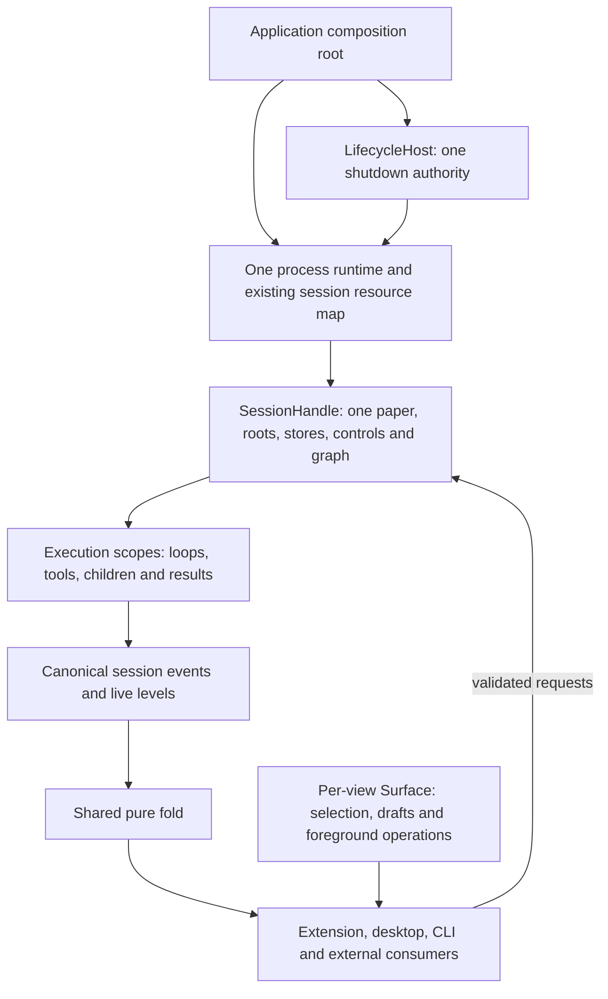

# Agent SDK architecture: one runtime, explicit ownership, direct consumers

**Recommendation:** make `@texra-ai/agent` the supported entry to TeXRA's existing runtime.
The extension, desktop, CLI and external applications use the same session, execution,
request and observation contracts. Complete the current owners and delete the competing
paths. Keep the shared fold; introduce no SDK orchestration wrapper, second session registry,
host projection, persistence mirror or generic plugin interpreter.

**Status:** proposal for review, not a ratified implementation plan or a claim of readiness.
The API sketch below describes proposed semantics; it is not currently executable.
This document is intended to settle ownership and consumer contracts before expanding exports.

**Companion proposal:** the [view replication evaluation](./2026-09-05-event-fold-versus-view-replication-evaluation.md)
reopens the G1/G2 transport choice retained here. The ownership and lifecycle contracts in
this document apply to either transport. Runtime-owned publication is the companion's
leading hypothesis, conditional on its comparison gate; the two documents do not jointly
ratify a transport cutover. References below to input-only transport describe this
proposal's original baseline and remain subject to that evaluation.

## 1. Evidence and scope

Reviewed TeXRA main `47b7e8522a7dfe0d13b1a46c547cd49d9f1ef997` (M), lane 4
`d7b2df96682f03230c15d7e0363bbee1351feb3d` (L4), and the runtime/substrate proposals
at `bc00f7ee5321aae71b4e5f7a575553e886ac52d2` (D). The latter are proposals on
#11843, not landed runtime behavior. These are historical evidence pins: later changes
to main or the lane branches require their own verification. The linked reproductions
do not establish the current status of every finding. Unpublished remote-session work
is outside these findings.

The [lane-4 review][review-l4] reproduced cold-attach failure, saved-draft pruning,
incorrect asynchronous draft routing and a stale inquiry answer accepted into a newer
turn. It also identified redundant text accumulation and component-owned draft completion.
The [SDK review][review-sdk] reproduced separate per-run transcript stores feeding a graph
shared by storage root. These failures demonstrate ownership problems that import counts
and package builds cannot establish or exclude.

### Relationship to existing decisions

| Document                                                                             | Preserve                                                                                                                 | Clarification or amendment proposed here                                                                                                                                                                                                        |
| ------------------------------------------------------------------------------------ | ------------------------------------------------------------------------------------------------------------------------ | ----------------------------------------------------------------------------------------------------------------------------------------------------------------------------------------------------------------------------------------------- |
| [July 9 SDK north star][north-star]                                                  | First-party clients become SDK consumers; no extra wrapper, unenforced package or speculative definition framework       | Readiness must include full lifecycle and interaction behavior, beyond the previously measured bootstrap and import reductions                                                                                                                  |
| [One-fold PRD][one-fold], G1–G7                                                      | Same pure fold, input-only transport, local Surface, replacement deletes, Effect inside and Promises outside             | Subscription owns a reader; the application owns final runtime disposal. Replay readiness is authoritative membership, not an empty view. Shared recording presence belongs to its process owner; its result belongs to its originating Surface |
| [Effect migration PRD][effect-prd], R1/R5/R6                                         | One managed runtime per process, scoped execution, external AbortSignal boundary, LifecycleHost shutdown order/deadlines | Expose the existing shutdown's completion and incomplete outcome to embedders; do not create a second shutdown coordinator                                                                                                                      |
| [September 4 runtime proposal][runtime-proposal] and [substrate decision][substrate] | Their coordinated ledger/loop and storage cutover, C1–C10, existing retention/redaction decisions                        | SDK API does not expose checkpoint files, SQL tables, raw stores or temporary bridges. This proposal does not independently ratify or implement that cutover                                                                                    |
| [September 4 readiness assessment][readiness]                                        | Historical source counts remain historical evidence                                                                      | Its “no structural refactor is warranted” verdict is insufficient for the new ownership failures and public-consumer requirements; use the acceptance scenarios in section 11                                                                   |

The public names retain TeXRA's meanings. A **session is a paper/workspace**, not a chat thread.
`StreamTabId`, `ExecutionId`, aggregate identity and checkpoint identity keep the one-fold
PRD's rules. A fresh launch has fresh run/stream identity; resume keeps the retained logical
execution identity. A resumed worker is a new live scope, not a resurrected JavaScript object.
There is no additional SDK Thread object or second identifier hierarchy.

One explicit implementation-contract amendment is proposed in section 4: published views
become stable immutable values at the existing fold owner. This preserves G1/G2 and changes
the current latest-only mutable accumulator contract for all consumers. Adoption requires
the performance evidence specified there; it is not an already-demonstrated simplification.

## 2. What the reference systems establish

These are source comparisons, not benchmarks or endorsements of whole implementations.

| Reference and pin                   | Useful design evidence                                                                                                                                                                                            | TeXRA decision                                                                                                |
| ----------------------------------- | ----------------------------------------------------------------------------------------------------------------------------------------------------------------------------------------------------------------- | ------------------------------------------------------------------------------------------------------------- |
| OpenCode stable v1.18.29, `02a167e` | Its [SDK][oc-stable] separates a generated client from starting a server process                                                                                                                                  | Separate execution ownership from client attachment; do not require an HTTP server for an in-process embedder |
| OpenCode development, `e289456`     | [Location graphs][oc-locations] own resources; [session admission][oc-admission] persists identified input before waking execution; [event reads][oc-events] subscribe before history and drain by durable cursor | Adopt explicit scope/key alignment, admission versus completion, and gap-free durable reads                   |
| Codex TypeScript, `588b781`         | [Thread handles][codex-ts] address durable history while a turn invokes a child; [iterator cleanup][codex-exec] kills that invocation                                                                             | Keep durable identity distinct from execution; a TeXRA view iterator must own only its reader                 |
| Codex Rust, same pin                | [ThreadManager][codex-manager] reports completed, failed and timed-out shutdowns and retains incomplete threads                                                                                                   | Incomplete cleanup remains observable and owned                                                               |
| Claude Agent SDK Python, `b1b838b`  | [Client][claude-client] separates sending, receiving, interruption and disconnection; permission requests carry correlation and tool identity                                                                     | Separate reader cancellation, execution control and client/runtime disposal                                   |
| Cline, `dac3b35`                    | [CLI][cline-cli] consumes published core; [runtime host][cline-host] owns sessions and [shutdown][cline-shutdown] awaits resources                                                                                | Make real applications consume the supported authority and expose its lifecycle directly                      |

Important limits affect the choices:

- OpenCode's [beta documentation][oc-docs] and current [private SDK-next source][oc-next]
  are different maturity levels. The source builds an in-memory HTTP router; the current
  TUI still uses the earlier generated client. Neither is evidence that TeXRA needs an
  in-process HTTP translation path or a completed first-party migration.
- Claude's [external SessionStore][claude-store] mirrors CLI-local transcripts and
  materializes history for resume. TeXRA owns its engine and should have one persistence
  authority instead of importing that topology.
- Cline's [hub stop][cline-stop] detaches while local stop shuts down; its
  [CLI event normalization][cline-events] reconciles multiple event forms. Those
  ambiguities are not part of this proposal.
- Cline supplies [explicit tool invocation context][cline-tools], but its
  [plugin hook policy][cline-policy] can override configured tool policy. Extension
  convenience alone does not define which policy must win.

## 3. Owners and allowed dependencies

These are resource owners, not a stack of forwarding classes. Public methods are defined
at the owning modules; exporting them must not create another object that stores the same
state or repeats admission, translation or cleanup.



The arrows show ownership or data/control flow, not new modules to implement.

| Owner                         | Owns                                                                | Must not own                                                             |
| ----------------------------- | ------------------------------------------------------------------- | ------------------------------------------------------------------------ |
| Application / LifecycleHost   | Process ports, runtime initialization, ordered bounded shutdown     | A separate per-host execution engine                                     |
| Existing session resource map | Acquisition and lifetime of each paper's complete session resources | A graph chosen by root but backed by an unrelated caller's private store |
| SessionHandle                 | Roots, stores, executions, controls, approvals and graph            | Another copy of view-instance selection or drafts                        |
| Execution scope               | Model/tool work, cancellation, children, live attempt and result    | A private replacement for the paper's store or approval authority        |
| View subscription / port      | Interest, replay generation/cursors, delivery, reader scope         | Execution lifetime or domain-state reconstruction                        |
| Surface                       | Selection, drafts, pending foreground operations, workbench layout  | Runtime status, approval truth or persisted conversation                 |
| Workbench resource owner      | Paper/view/tab-addressed PTY, browser and PDF handles               | Process-global current-paper lookup after an operation was admitted      |

Move acquisition of the complete session resources into the existing `Sessions` resource
map. Do not add an SDK map alongside it. Today [SessionKey][session-key] includes a supplied
store but compares only the storage root; [SDK construction][sdk-construction] creates one
store per invocation. The target makes independent store injection at this shared boundary impossible.

Opening the same session twice returns access to the same owner. It must not reconstruct
stores or silently accept conflicting root/storage configuration. The application retains
that owner until explicit session closure or process shutdown. Reader detachment never
closes it. Internal references and scopes remain implementation details.

Session handles returned to helpers are borrowed access to that application-owned session;
they carry no implicit disposal obligation. Whole-session closure is an operation on the
application's runtime owner, not on the borrowed handle. Helpers dispose only subscriptions
and foreground scopes they acquired. This avoids a second access/refcount registry and
prevents a helper's `finally` from shutting down another caller's paper work.

## 4. Public contract: expose intent and lifetime

The package boundary uses Zod-derived data types, Promises and AsyncIterables. It does not
export Effect services, raw database access, mutable registries, host widgets or internal
constructor graphs. First-party callers get no privileged deep-import execution path.

The following names are illustrative; implementation should retain an existing suitable
public name. The ownership and results are the proposed contract.

```ts
const runtime = await openRuntime({ platform: nodePlatform(processOptions) });

try {
  const paper = await runtime.openSession({ roots });
  const views = paper.subscribeView({
    interests: [],
    signal: viewAbort.signal,
  });

  // Observe independently of executing. Closing views only detaches this reader.
  const rendering = renderViews(views);

  const run = await paper.start({ agent: 'polish', instruction, model });
  views.replaceInterests([{ streamId: run.streamId }]);
  await paper.request({
    kind: 'followUp.send',
    streamId: run.streamId,
    text: 'Keep the theorem statements unchanged.',
  });

  const result = await run.result;
  viewAbort.abort();
  await rendering;
} finally {
  const shutdown = await runtime.close();
  reportIncompleteShutdown(shutdown);
}
```

This is a semantic sketch, not a second SDK wrapper to add around the current package.
`openRuntime` consolidates the actual composition-root acquisition and exposes
LifecycleHost closure. `openSession` acquires the existing owner. `start` is the
public admission entry of the existing launch path. None owns duplicate execution state.

| Operation           | Completion means                                                                         | Lifetime effect                                                              |
| ------------------- | ---------------------------------------------------------------------------------------- | ---------------------------------------------------------------------------- |
| Open runtime        | Process ports and runtime services are acquired once                                     | Application owns them; reject a conflicting second process runtime           |
| Open session        | Roots and complete session resources are acquired                                        | Application retains the session independently of readers                     |
| Start / resume      | Validation and admission succeeded; return the live handle and its completion Promise    | Execution has its own scope; completion is separately awaited                |
| Session request     | Named command was accepted or rejected by its authority                                  | Never imply that admitted model work or a follow-up has finished             |
| Subscribe view      | Iterator acquires replay and then observes the shared view                               | Abort/return closes only this subscription                                   |
| Interrupt execution | Interruption was applied and owned live work settled, or an explicit failure is returned | Leaves retained history according to the durable-state policy                |
| Close session       | New work is gated, owned work and writes settle, resources release                       | Does not delete retained history; fails/reports if shutdown is incomplete    |
| Delete retained run | Canonical tombstone/deletion transaction succeeds under existing ownership rules         | Does not silently interrupt an active owner or erase unrelated data          |
| Close runtime       | Existing LifecycleHost shutdown completes with an observable report                      | Process resources release in the established order, subject to its deadlines |

Start/resume returns the admitted live handle and its completion Promise. Resume preserves
retained logical execution/stream identity but creates a new live scope and a fresh Promise;
it never reuses a settled handle. Each live scope settles its own `AgentFlowResult`.
WAITING remains nonterminal. A follow-up admitted into active execution adds input without
creating another completion Promise. Continuing terminal execution uses resume admission.
The current public trace iterator is narrowed or retired only in the same change that
moves its consumers to the canonical observation contract; no parallel SDK event vocabulary
is introduced.

Each subscription exposes initial transcript interests and replacement of that reader's
interests, using the existing transcript-subscription schema. Listing remains available;
the session unions interests across readers. Replacement starts that reader's new replay
generation. Closing it removes only its interests. Callers never subscribe to every
transcript merely to compensate for a missing public selection API.

**Published views are immutable values.** A consumer may retain a yielded view across an
`await`; its cursor and all reachable Maps, arrays and objects must describe that same
publication. Consumers must not mutate them. The current [latest-only accumulator][fold-mutation]
reuses Maps and transcript arrays, so this is an explicit proposed amendment to its public
ownership contract, not a claim that the implementation already supplies snapshots.

Implement stable publication at the existing fold owner for every consumer, sharing
unchanged branches and batching inputs before publication. Do not deep-clone in an SDK
adapter or create a second view representation. This carries real performance obligations:
copying growing transcript arrays or session-wide Maps on every event can be quadratic.
Representative cold replay, sustained text updates, allocation and retained-version
measurements are a hard implementation gate. Coalescing alone does not make mutable
branches stable. If the implementation cannot meet that gate, revisit this decision
explicitly; never ship mutable views under an immutable-looking AsyncIterable contract.

### Package surface

Keep `packages/agent`, `@texra-ai/agent`, `/node` and the existing `/schemas` surface.
Do not create `@texra/core` or a package per concern. A browser-safe public subpath for
the pure fold and session wire values earns its place when extension/desktop/trace-viewer
consume it; it must not import Node/runtime acquisition. The Tier-1 manifest names exact
exports and actual consumers. Root exports must not become a broad dump of implementations.

Custom process ports and workspace roots remain separate. Remove the package's current
`AgentPlatform extends Platform` roots coupling as consumers move to explicit sessions.
No caller should supply the same roots to every run or know bootstrap registration order.

## 5. One execution and request authority

### Launch and resume

Host preparation produces the canonical agent configuration and selected inputs.
Native file pickers, editor actions and window presentation remain host operations.
Validation, model/tool resolution, lease acquisition, run registration and execution start
belong to the existing runtime admission path.

Consolidate the host-neutral part of `HostRequest.launch` into that path. If it needs a
wire request, extend the existing request schema and handler; do not create an SDK command
bus. Native reveal/open behavior consumes the resulting identity and does not launch again.

Resume loads the existing retained execution state and acquires its execution lease.
With the proposed ledger cutover, resumability follows the runtime proposal's
outcome-independent snapshot-plus-no-live-owner rule, including completed continuable
runs. Until that cutover, use the current canonical resume owner; do not simulate it in
the package by reconstructing conversation from display rows. Workflow relaunch creates
fresh stream/execution identity under the existing checkpoint exclusion rules.

### Follow-ups and stale requests

A request ID correlates one response; domain identity identifies what can be changed.
Approval replies name the pending approval. Inquiry replies name thread and turn.
Draft operations retain their originating view/session/draft target. Reusing a request ID
must never be treated as proof that a later domain revision is the intended target.

A successful follow-up acknowledgment transfers responsibility for the complete payload
to the runtime's existing follow-up owner. The loop releases its batch lease only after
the corresponding model-input rows commit, as the runtime proposal requires. Do not
describe pre-cutover in-memory admission as crash-durable. Durable admission must use
the agreed event schema and transaction, not a new SDK outbox or compatibility writer.

Two responses to the same pending decision race at the runtime mutation boundary:
one settles it, the other receives the existing unavailable/stale error. Selection,
button state or an earlier frontend check cannot authorize the mutation.

### Errors

Keep existing typed request errors and `AgentFlowResult` domain outcomes. Operational
request failure rejects once at the Promise boundary; the transport serializes the same
error. A terminal agent failure is its result; it is not separately synthesized from text.
Cancellation remains distinct from failure. Internal causes are logged once and surfaced
under the existing reference/redaction policy. No empty success, repaired-looking default
or second error parser may mask a failed write or broken contract.

## 6. One fold, no intermediate business projections

Keep G1/G2. A renderer receives canonical input and runs the same pure fold as the TUI.
Components read `SessionView` and `Surface` directly. Ports own transport concerns:
encoding, redaction, delivery, interest and scope. They do not compute another status,
rollup, transcript shape or view patch.

A reference-preserving signal publication may connect the fold to Lit. It must not retain
a second semantic model or require a component lifecycle hook to complete an operation.

### Replay is a contract, not a timing assumption

1. Register the durable tail/wake reader before taking the replay boundary; drain by
   canonical commit/aggregate cursors so replay and live reads cannot leave a hole.
2. Publish an authoritative listing completion before a consumer interprets absence as
   removal. Filtering or transcript eviction is never an authoritative deletion.
3. Ensure existence/history inputs reach the fold before live text suffixes that depend
   on them. Initial live levels and their subsequent changes must come from the same
   ordered producer boundary.
4. Deliver those dependencies in order all the way into the fold. Splitting a valid frame
   into independently merged queues cannot discard that guarantee.
5. Generation replacement invalidates old replay delivery, not admitted commands or
   pending draft operations. Port/Surface teardown follows those foreground owners' own
   cancellation rules. A detected
   input gap produces an explicit reader failure or the existing fresh-subscription
   protocol; swallowing it cannot establish a correct prefix.
6. View publication retains only the latest unpublished level. Durable event delivery
   backpressures where the transport supports it; otherwise an explicit bounded outstanding
   delivery limit terminates an overloaded reader. Transient text coalesces by row and
   restarts from the current level after replacement. Bounds include receiver-unacknowledged
   delivery, not just the framer's queue. Resume durable reads from their cursor; never drop
   durable rows and keep reporting a healthy reader. Numeric limits require measured budgets.

This completes the existing producer/reader path. It adds no replay coordinator alongside
the bridge and fold owner, and no secondary transcript cache. OpenCode's durable
subscribe-before-history pattern is useful evidence; its transient streams do not prove
TeXRA's text-ordering contract.

### Concrete deletion targets

| Existing path                                                                       | Change at its owner                                                                          | Delete together                                                         |
| ----------------------------------------------------------------------------------- | -------------------------------------------------------------------------------------------- | ----------------------------------------------------------------------- |
| [SessionFrames.inflight][frames-inflight] plus fold-owned text                      | Choose one authoritative live prefix at the correct scope; transport forwards ordered inputs | Unused second text accumulator and its maintenance API                  |
| [Draft.polished/transcribed][draft] → [composer willUpdate][composer] → draft.text  | Apply the response once at the originating Surface                                           | Intermediate result fields and component-owned completion writes        |
| Composer optimistic clear → text-only rejection restoration                         | Surface retains the complete submitted payload until admission settles                       | Partial restoration and split payload ownership                         |
| [Extension][extension-ops] and [desktop][desktop-ops] copy neutral request behavior | Existing request orchestration performs polishing and pasted-image persistence               | Duplicate neutral branches                                              |
| Per-paper recording closures around one process recorder                            | Recorder owns the original port/request; Stop separately acknowledges its caller             | Parallel recorder policy and result retargeting                         |
| Renderer-global workbench and paper-selection reload                                | Resources retain paper/view/tab identity; selection changes visibility                       | Reload as session switching and global current-paper resource ownership |

Nothing derived is persisted beyond the substrate's named exception. The runtime's
`foldRunState` and the display `fold` have different durable obligations: one reconstructs
execution inputs/control state, the other produces the canonical view. They read the same
agreed ledger and must not implement competing versions of the same business fact.
A UI renderer never recreates either from private event cases.

Draft admission retains and temporarily locks the complete submitted draft until its
acknowledgment. Longer operations capture a draft edit revision: polish replaces text only
if that revision is unchanged; otherwise it completes as stale and preserves the newer
edit. Dictation appends once to its originating surviving draft's current text, preserving
edits made during recording. A closed/deleted origin discards that foreground result under
the existing recording contract. These decisions belong to the Surface owner; selection
changes never select a new destination, and no component consumes a temporary result field.

## 7. Cross-cutting responsibility audit

| Concern                                | Sole semantic authority                                                       | What hosts / SDK consumers supply                                         |
| -------------------------------------- | ----------------------------------------------------------------------------- | ------------------------------------------------------------------------- |
| Configuration                          | Existing validated setting-write path; workspace config belongs to its roots  | User input and native storage ports; no copied SDK config store           |
| Effective approval policy              | Session approval authority applies policy and settles pending decisions       | Decisions through the same request contract; no SDK approval manager      |
| Models and context                     | Existing model invocation/handler and run model cell                          | Model choice and provider capabilities; no public second context pipeline |
| Tools                                  | Existing resolution and dispatch inside the execution scope                   | Declared tools and explicit tool selection constraints                    |
| Delegation                             | Existing child dispatch and execution registry, with parent scope/lease rules | Child intent; no SDK agent-team registry                                  |
| Persistence / resume                   | Session storage authority and coordinated ledger cutover                      | Session roots and retained identity; no transcript mirror                 |
| Status, usage, transcript and topology | Canonical published facts and shared fold                                     | Presentation preferences; no consumer status synthesis                    |
| Drafts and selection                   | Originating Surface                                                           | User edits; no process-global current selection                           |
| Files and external resources           | Explicit roots and owner at operation admission                               | Native filesystem/editor/process capabilities                             |
| Shutdown                               | LifecycleHost coordinates actual resource owners                              | Application requests shutdown and handles incomplete completion           |

A setting value and effective live approval policy are different concerns; their existing
validated transition stays explicit. Consolidation must not erase the approval side effect
by replacing the settings entry with a bare storage write.

Subagents run through the same invocation path and own scoped child work. A child cannot
broaden the parent's tool/policy ceiling by selecting a different agent or supplying tools.
Any deliberately detached work must transfer ownership through the existing named mechanism;
closing the parent reader is not that transfer.

Parent-stream deletion is not blanket child deletion or interruption. Preserve substrate
C9: child streams remain independent aggregates and re-root/detach when their parent is
removed; execution and inquiry dependents follow their own stream. Session/process shutdown
settles its owned live work, while a reader closing or parent tombstone does not acquire
that shutdown meaning.

## 8. Extensibility without a plugin framework

The first supported extensions are the existing real seams: tools, provider/model
capabilities, agent-directory sources, and host capabilities. Do not add a generic
before/after hook bus, plugin event vocabulary or dependency-injection container.

Evolve `defineTool` / `ITool` in place. A tool invocation receives explicit session and
execution identity, tool-call identity, cancellation, scoped filesystem/capability access,
and the canonical output emitter. Derive it from existing RunContext/RunScope; do not store
another copy of the current workspace or model in a plugin registry.

Separate two caller intentions:

- Tool definitions contribute implementations to the resolved inventory.
- Tool selection constrains which registered implementations may be advertised/executed.

Resolve those once at admission using the current tool resolver. A supplied tool list must
not misleadingly imply exclusivity when it is an overlay. Duplicate names fail unless the
caller explicitly requests replacement through the existing resolver; implicit last-writer
replacement is not the public contract.
Freeze the selected implementation for a call; hot replacement must not advertise one
implementation and execute another under its name.

Policy enforcement remains in dispatch and the existing approval authority. Extensions may
request decisions or narrow capability; they cannot silently expand an effective denial
through a hook return. Custom JavaScript remains trusted application code, not an OS
sandbox. Process/filesystem isolation is a separate host capability and is not promised by
the term plugin.

Any extension that acquires a process, connection or watcher attaches its finalizer to the
actual runtime/session/run scope that acquired it. It does not get a global resource bag
or a second lifecycle. Public teardown callbacks use Promises; Effect stays internal.

Programmatic decisions and UI decisions use the same pending-request authority. A headless
consumer that supplies no decision capability receives an explicit unavailable result when
interaction is required; it must not silently grant permission or wait forever. An optional
callback is a delivery capability of the existing interaction owner, not another manager
that tracks pending approvals.

Establish session-level decision-delivery capabilities when its owner is acquired, and reject
conflicting configuration on later opens. Per-run package calls no longer attach presenters.
The current latest-attachment-wins behavior of `SessionHostInteractions.use` must not let
caller B become caller A's approval presenter after session consolidation. A host's explicit
view routing still lives inside that established capability and the existing execution
interaction scope; independent SDK helpers cannot replace it by launching another run.

## 9. Shutdown and closure

Preserve Effect PRD R6 exactly: LifecycleHost is the single shutdown coordinator; BEFORE
settles or reaches its deadline before ON, each phase runs FIFO, and each has its existing five-second
abort-then-advance deadline. Scope finalizers do not replace this with unbounded LIFO
application shutdown.

Consolidate the following resource order into the existing registrations:

1. Gate new session/run admission and settle or cancel pending foreground requests.
2. Interrupt owned executions and their scoped children; await their settlement within
   the lifecycle's budget.
3. Flush accepted durable work, transcript/usage output and artifacts in the established
   order while storage is still available.
4. Release session stores, leases and graphs when their users have stopped.
5. Dispose the managed runtime and process resources in the prescribed phase.

These are orderly-settlement dependencies, not a guarantee that timed-out work has stopped.
On a phase deadline LifecycleHost aborts and advances, including bounded runtime disposal
in ON. Owners must not perform dependency-sensitive normal cleanup as though settlement
succeeded. Incomplete resources remain identified and unavailable for reacquisition.
Process closure is terminal: repeating `runtime.close()` returns the same report, without
retrying abandoned handlers or reopening a runtime in that process.

Expose a shutdown report that distinguishes completed work, failures and deadline-abandoned
work. A resolved callback after a deadline must not make the report claim complete disposal.
Do not remove an incompletely stopped resource from an ownership registry and then pretend
another caller can safely acquire it. Forced process exit is the host's final decision;
a timeout does not establish an external tool's side effect was rolled back.

`runtime.close()` invokes that existing process authority. `runtime.closeSession(key)`
instead uses the named session's existing owner and gates only that session's admissions;
it never invokes process LifecycleHost or affects another paper. Choose one five-second
settlement budget for this explicit session close, using the existing drain operations.
On expiry return incomplete and keep that owner closing/unavailable for replacement until
its actual settlement; do not release an in-use store as a successful close. Neither
operation registers a second package-only drain or shutdown coordinator.

## 10. Alternatives and decision

| Alternative                                  | Benefit                                                                           | Cost / reason not selected                                                                                                                                   |
| -------------------------------------------- | --------------------------------------------------------------------------------- | ------------------------------------------------------------------------------------------------------------------------------------------------------------ |
| Direct in-process authority, shared fold     | Fits existing TeXRA hosts, paper sessions, Effect runtime and replay requirements | Requires completing public ownership and replay contracts; selected                                                                                          |
| Mandatory daemon and generated client        | Process isolation and remote/multi-application access                             | Adds startup, transport, deployment and handoff obligations before a demonstrated need                                                                       |
| Embedded HTTP router behind local SDK        | Reuses a remote protocol implementation                                           | Adds codecs/middleware to every local call; TeXRA already has a common typed request authority                                                               |
| Host-prepared view snapshots                 | Simplifies renderer replay obligations                                            | Changes G2 and introduces a view transport; defer unless a measured requirement outweighs the current single-fold design                                     |
| Borrowed latest-only public views            | Preserves the current mutable accumulator                                         | Imposes synchronous-read and retention restrictions on external consumers; prefer stable publication at the same fold owner, subject to the performance gate |
| SDK facade over current host/bootstrap paths | Small initial API surface                                                         | Retains hidden lifetime/approval/store duplication; rejected                                                                                                 |
| Universal plugin/middleware framework        | Broad interception and customization                                              | Distributes cross-cutting policy and creates another interpreter; rejected                                                                                   |

A later remote deployment can serialize the same commands and events at its actual process
boundary. It must not make a local consumer pass through HTTP or maintain a second domain API.
This proposal does not add that server now.

## 11. Delivery, deletions and acceptance

Use complete ownership changes, not a new compatibility system running beside the old one.
Coordinate with the active lanes; a new SDK workstream must not overwrite their shared files.

1. **Settle session and shutdown ownership.** Refactor the existing resource-map acquisition
   and SessionHandle construction together. Remove package per-run store/initialization
   choreography. Validate two simultaneous runs on one paper and two papers in one process.
2. **Complete lane 4 and lane 5 contracts.** Repair causal replay, request identity and Surface
   ownership. Delete the specific intermediate states and copied neutral branches in section 6.
   Keep lane 5's recorded-session NDJSON byte identity; it is an explicit event-export contract,
   not another UI business projection.
3. **Move the first complete host workflow through the public contract.** Start with the CLI,
   then extension and desktop. Publish only exports exercised by these consumers and an external
   embedding example. Delete migrated deep imports and host ceremony in the same change.
4. **Coordinate the ledger/runtime cutover separately but atomically for its data.** The two
   loop families, workflow journal and importer adopt the agreed durable shape together.
   Do not expose an intermediate checkpoint backend or introduce a second SDK persistence mode.
   Session ownership repairs need not wait for SQL; durable storage changes follow its owner.
5. **Package readiness.** Build and run the external example against the packed artifact with
   documented setup, no repository aliases, no hidden global registration order, and browser-safe
   imports for renderers. npm publication remains a separate release decision.

One executable external example and a small set of durable-boundary scenarios are stronger
evidence than a new test per internal module:

- Two SDK runs on one paper share the same store/graph; another paper remains isolated.
- Detaching one reader leaves executions and another reader alive; explicit close settles its
  owned work and reports a forced/deadline outcome honestly.
- Cold replay with live text produces a usable view; saved drafts survive loading.
- Changing one reader's transcript interest during replay leaves other readers correct
  and does not cancel its already admitted foreground operations.
- A consumer retaining one published view across `await` sees its original cursor and
  contents while newer publications arrive; replay and sustained-update allocation remain
  within measured budgets, without quadratic transcript copying per event.
- Rejected admission retains the full draft; delayed results update only their originating draft.
- Concurrent approval and stale inquiry responses cannot settle a newer decision.
- Two SDK callers sharing a paper cannot replace each other's decision presenter or
  close the application-owned session by disposing their own reader.
- Resume uses retained execution state and its lease; no conversation reconstruction from UI rows.
- A real custom tool gets correct identity/cancellation and cannot accidentally bypass configured
  dispatch policy through tool selection or delegation.
- Switching papers preserves other papers' workbench resources.
- Existing NDJSON and result-JSON consumers retain their specified contracts.

Extend existing behavioral suites for reproduced failures and the package example. Do not add
tests for trivial forwarding, type/schema guarantees, or internal seams about to be deleted.

### Proposed decisions for owner review

Adopt the direct runtime/session ownership model, preserve one-fold input-only transport,
consolidate existing request/approval/lifecycle authorities, restrict extensions to named
capability seams, adopt stable published views subject to the performance gate, and make
complete first-party/public-package workflows the readiness gate.
Ratification changes the acceptance criteria and ownership contract; it does not claim the
current branches implement them.

## 12. Validation of this proposal

This is a design artifact grounded in pinned source and the posted reviews. TeXRA's prior
diagnostics establish the named failures; they do not prove the proposed implementation.
External comparisons are source inspections, not operational benchmarks. No production code,
database format or runtime API changes are included in this document.

Three independent source investigations informed the draft; a second review challenged
lifetime, replay and cross-cutting semantics. The revision incorporates their findings on
approval presenter ownership, session versus process closure, resumed-result identity,
reader interests, stable observations, overload behavior and same-draft concurrent edits.
Document formatting, pinned TeXRA source paths, Markdown references and Mermaid syntax
were checked. No implementation benchmark or runtime validation of the proposed API is claimed.

[north-star]: https://github.com/LionSR/TeXRA/blob/47b7e8522a7dfe0d13b1a46c547cd49d9f1ef997/docs/proposals/2026-07-09-agent-sdk-north-star.md
[one-fold]: https://github.com/LionSR/TeXRA/blob/47b7e8522a7dfe0d13b1a46c547cd49d9f1ef997/docs/prds/2026-09-03-prd-one-fold-three-renderers.md
[effect-prd]: https://github.com/LionSR/TeXRA/blob/47b7e8522a7dfe0d13b1a46c547cd49d9f1ef997/docs/prds/2026-08-26-effect-4-runtime-migration.md
[runtime-proposal]: https://github.com/LionSR/TeXRA/blob/bc00f7ee5321aae71b4e5f7a575553e886ac52d2/docs/proposals/2026-09-04-agent-runtime-on-effect.md
[substrate]: https://github.com/LionSR/TeXRA/blob/bc00f7ee5321aae71b4e5f7a575553e886ac52d2/docs/proposals/2026-09-03-persistence-substrate-decision.md
[readiness]: https://github.com/LionSR/TeXRA/blob/47b7e8522a7dfe0d13b1a46c547cd49d9f1ef997/docs/proposals/2026-09-04-agent-sdk-readiness-reverify.md
[review-l4]: https://github.com/LionSR/TeXRA/pull/11883#issuecomment-5552053089
[review-sdk]: https://github.com/LionSR/TeXRA/issues/11864#issuecomment-5552054795
[session-key]: https://github.com/LionSR/TeXRA/blob/47b7e8522a7dfe0d13b1a46c547cd49d9f1ef997/src/controllers/session/sessionLayer.ts#L85
[sdk-construction]: https://github.com/LionSR/TeXRA/blob/47b7e8522a7dfe0d13b1a46c547cd49d9f1ef997/packages/agent/src/index.ts#L275
[frames-inflight]: https://github.com/LionSR/TeXRA/blob/d7b2df96682f03230c15d7e0363bbee1351feb3d/src/shared/session/sessionFrames.ts#L297
[fold-mutation]: https://github.com/LionSR/TeXRA/blob/47b7e8522a7dfe0d13b1a46c547cd49d9f1ef997/src/shared/session/sessionFold.ts#L36
[draft]: https://github.com/LionSR/TeXRA/blob/d7b2df96682f03230c15d7e0363bbee1351feb3d/src/shared/session/surface.ts#L50
[composer]: https://github.com/LionSR/TeXRA/blob/d7b2df96682f03230c15d7e0363bbee1351feb3d/packages/extension/src/progressView/frontend/components/SessionComposer.ts#L302
[extension-ops]: https://github.com/LionSR/TeXRA/blob/d7b2df96682f03230c15d7e0363bbee1351feb3d/packages/extension/src/progressView/extensionHostRequests.ts#L891
[desktop-ops]: https://github.com/LionSR/TeXRA/blob/d7b2df96682f03230c15d7e0363bbee1351feb3d/packages/desktop/src/main/desktopHostRequests.ts#L723
[oc-stable]: https://github.com/anomalyco/opencode/blob/02a167e048d3bd7299225068d79e4fce5c830d67/packages/sdk/js/src/index.ts
[oc-locations]: https://github.com/anomalyco/opencode/blob/e2894562f8ba943d72172d10b727c24d5f650c16/packages/core/src/location-services.ts
[oc-admission]: https://github.com/anomalyco/opencode/blob/e2894562f8ba943d72172d10b727c24d5f650c16/packages/core/src/session.ts#L346
[oc-events]: https://github.com/anomalyco/opencode/blob/e2894562f8ba943d72172d10b727c24d5f650c16/packages/core/src/event.ts#L565
[oc-next]: https://github.com/anomalyco/opencode/tree/e2894562f8ba943d72172d10b727c24d5f650c16/packages/sdk-next
[oc-docs]: https://opencode.ai/v2/docs/build/sdk
[codex-ts]: https://github.com/openai/codex/blob/588b781ab4924ce7352488394028e63d74cf807f/sdk/typescript/src/thread.ts#L40
[codex-exec]: https://github.com/openai/codex/blob/588b781ab4924ce7352488394028e63d74cf807f/sdk/typescript/src/exec.ts#L196
[codex-manager]: https://github.com/openai/codex/blob/588b781ab4924ce7352488394028e63d74cf807f/codex-rs/core/src/thread_manager.rs#L1204
[claude-client]: https://github.com/anthropics/claude-agent-sdk-python/blob/b1b838b1c5730a7a0b270915a79b15861a8ca716/src/claude_agent_sdk/client.py#L236
[claude-store]: https://github.com/anthropics/claude-agent-sdk-python/blob/b1b838b1c5730a7a0b270915a79b15861a8ca716/src/claude_agent_sdk/types.py#L2325
[cline-cli]: https://github.com/cline/cline/blob/dac3b35ba485dbab3b5a73aca239b0d07ce071cf/apps/cli/src/session/session.ts#L29
[cline-host]: https://github.com/cline/cline/blob/dac3b35ba485dbab3b5a73aca239b0d07ce071cf/sdk/packages/core/src/runtime/host/local-runtime-host.ts#L255
[cline-shutdown]: https://github.com/cline/cline/blob/dac3b35ba485dbab3b5a73aca239b0d07ce071cf/sdk/packages/core/src/runtime/host/local-runtime-host.ts#L2250
[cline-stop]: https://github.com/cline/cline/blob/dac3b35ba485dbab3b5a73aca239b0d07ce071cf/sdk/packages/core/src/hub/runtime-host/hub-runtime-host.ts#L1267
[cline-events]: https://github.com/cline/cline/blob/dac3b35ba485dbab3b5a73aca239b0d07ce071cf/apps/cli/src/runtime/session-events.ts#L69
[cline-tools]: https://github.com/cline/cline/blob/dac3b35ba485dbab3b5a73aca239b0d07ce071cf/sdk/packages/shared/src/agent.ts#L189
[cline-policy]: https://github.com/cline/cline/blob/dac3b35ba485dbab3b5a73aca239b0d07ce071cf/sdk/packages/agents/src/agent-runtime.ts#L1709
