# TeXRA agent architecture: own the LLM package, replace the graph

Status: proposed

Date: 2026-09-06. Status: research and recommended design, not an implemented migration or a change to the binding PRDs.

**Build TeXRA's own Effect-native LLM package from the model handlers, and give the agent runtime one explicit durable interpreter.** Learn from the latest Effect AI, OpenCode, Pi, and effect-agent designs; do not adopt their LLM or agent frameworks. The opportunity is to remove TeXRA's accumulated internal interfaces while making its provider and document capabilities easier to develop.

This follows the owner's latest direction: TeXRA is small enough to make an aggressive architectural cutover. Preserving PocketFlow, `IModelHandler`, or provider-class compatibility is not an objective. Preserving useful behavior—reasoning continuation, background generation, approvals, document output, and safe recovery—is.

The detailed studies are:

- [Architectural review and required contract revisions](./2026-09-06-agent-architecture-review.md): preserves the reflection pipeline and identifies four open runtime/LLM contract gaps. Read alongside the proposed APIs below; this remains a design draft.
- [Interactive HTML architecture explorer](./2026-09-06-agent-architecture.html): current/proposed diagrams, turn recovery, all 41 handler members, and upstream references. Opens locally without network assets.
- [Agent loops, durable phases, and recovery](./2026-09-06-agent-loop-architecture-study.md).
- [Turning the model handlers into TeXRA's LLM package](./2026-09-06-llm-package-architecture-study.md).
- [Source pins, reproducible census, and offline probe](../../evidence/2026-09-06-agent-architecture/README.md).

## Decision in concrete terms

| Concern                                                                                   | Recommended owner                                                         | What disappears                                                                         |
| ----------------------------------------------------------------------------------------- | ------------------------------------------------------------------------- | --------------------------------------------------------------------------------------- |
| One provider turn, wire conversion, stream parsing, typed provider options                | New `packages/llm`, proposed name `@texra-ai/llm`; our code and contracts | `IModelHandler`, the generic handler superclass, SDK-shaped types in agent control flow |
| Turns, reflection rounds, follow-ups, tool settlement, manual retry                       | TeXRA runtime, written in Effect 4                                        | PocketFlow nodes, graph wiring, action strings, `ModelInvocationNode` lifecycle         |
| Recovery, admission, ownership, durable history                                           | One `RunLedger` over the agreed SQLite substrate                          | Whole-flow JSON checkpoints and the replaced file claims; no second workflow engine     |
| Templates, prefill files, output markers, document assembly and compilation               | TeXRA document/workflow policy and `OutputPipeline`                       | These responsibilities inside `ModelHandler`                                            |
| Model catalog, subscription selection, credential refresh, quotas and billing attribution | TeXRA application services composed above the LLM package                 | Global platform/config/auth reads from provider implementations                         |
| Views and exported traces                                                                 | Redacted projections of committed runtime facts                           | Treating display events or streamed deltas as a resumable conversation                  |

Effect supplies typed effects, scopes, streams, interruption, and bounded concurrency. **It does not choose the durable state machine.** The runtime must make every externally meaningful transition explicit. The LLM package supplies one provider turn; it must not quietly run local tools or own the conversation.

**Preserve the reflection pipeline itself.** Context preparation, TeX counting, media extraction, the response cycle and output processing retain their ordering, inner continuations and outer round structure. Express those stages as Effect programs sharing the LLM package and runtime capabilities with tool-use; replacing PocketFlow does not authorize changing their behavior.

## Why the current direction still feels unclear

The [September 4 runtime proposal](./2026-09-04-agent-runtime-on-effect.md) already contains substantial crash-recovery design. It specifies initial persistence, completed responses, compaction replacement, tool intent/results, output reconciliation, and snapshot-based replay. Calling it merely “replace PocketFlow with a while loop” would be inaccurate.

The unresolved coherence is elsewhere:

1. **Three changes are interleaved:** execution mechanics, durable state representation, and the model/provider boundary. The proposal names `ModelInvoker`, but largely leaves the current handler abstraction underneath it.
2. **The visible loop is simpler than its continuation contract.** `runTurn(s)` resumes at a folded phase, but the complete phase algebra, legal commands, and authority for each transition are not collected in one implementable specification.
3. **The proposed conversation rows still assume provider-native messages.** Extracting a canonical LLM package later would change the ledger payload again. Decide the new message and continuation contract before implementing the ledger's model rows.
4. **The schema policy needs precision.** We can keep Zod as the author of TeXRA's data contracts and use Effect for execution. Effect-native does not require us to import Effect AI's domain model or reproduce every Zod schema in Effect Schema.

The best contribution here is the missing joint runtime/LLM design, followed by its implementation inside the existing cutover program. Another general cleanup survey would not resolve these questions.

## What the latest references actually teach

| Reference examined                                     | Evidence status at the pin                                                                              | Lesson to use                                                                                                                                                             | Scope to leave with that project                                                            |
| ------------------------------------------------------ | ------------------------------------------------------------------------------------------------------- | ------------------------------------------------------------------------------------------------------------------------------------------------------------------------- | ------------------------------------------------------------------------------------------- |
| OpenCode `packages/llm/DESIGN.md`                      | Latest checked-in discussion draft; proposed `@opencode-ai/ai` API is not implemented by that document  | Separate one provider turn from an automatic model run; portable requests from executable models; deployment settings from generation defaults; clean break from old APIs | Its automatic tool loop, public provider patch framework, mandatory feature/catalog surface |
| OpenCode `packages/llm` and new `packages/core` runner | Implemented private package and new runner; runner says durable continuation recovery is a future slice | Real package boundary around protocols/transports; Effect-native runtime calls generation below its own orchestration                                                     | Its incomplete recovery boundary and migration path                                         |
| Pi `packages/agent/src/harness` and `packages/ai`      | Implemented new durable harness; coding-agent worker integration is experimental                        | Explicit durable operation phases, intent before I/O, separate LLM library, recorded and current replay permission                                                        | Its Promise-based execution substrate and application-specific storage design               |
| effect-agent engine/thread split                       | Implemented at the pinned source; beta package                                                          | One interpreter, completed-response gate, batch preflight, fenced durable attempts, declared recovery decisions                                                           | Its large general-purpose framework and feature surface                                     |
| Effect 4 AI and Workflow modules                       | Current source and installed `effect@4.0.0-rc.112`; unstable APIs                                       | Small provider-turn boundary, scoped resources, native concurrency, honest distinction between generation and orchestration                                               | Their LLM package, `Chat` history ownership, or another persistence engine                  |

Sources: [OpenCode latest design][oc-design], [new runner][oc-runner], [Pi harness][pi-drive], [Pi package][pi-ai], [effect-agent interpreter][ea-runtime], [Effect LanguageModel][effect-lm]. These are architectural references, not dependency recommendations. We intentionally do not base the target on older OpenCode/Pi loops or the historical Effect v3 package layout.

## The target worth being aggressive about

**Own one useful abstraction: a model can execute exactly one provider turn.** An immutable configured model has `generateTurn` and `streamTurn`; request and result values are serializable; provider-required opaque data survives normalization. TeXRA owns these types and implementations. Existing SDKs may remain foreign transports wrapped once at their actual I/O edge. There is no new `IModelHandler` facade forwarding to the old classes.

**Make the runtime the sole tool and continuation authority.** Model deltas may render immediately, but local tools begin only after a complete, validated response is committed. Recovery can then reuse that response rather than paying for another generation or guessing what tool calls existed. Follow-ups, retries, compaction, and reflection output are explicit durable transitions, not mutable handler flags.

**Use one release to retire the old architecture.** Develop the new package and runtime on the integration branch, switch all real consumers, and delete the graph and superclass there. Do not introduce a supported old-handler/new-package bridge or two history stores. An importer for explicitly retained released user data is a bounded storage concern; it does not preserve the old runtime API. Existing retention decisions remain binding until deliberately amended.

This is not a recommendation to acquire every fashionable dependency. The stack is already modern: TypeScript, Effect 4, Zod 4, the selected SQLite substrate, native provider APIs, and pnpm packages. The leap is a smaller ownership model and direct use of those tools.

## Concrete work and collision boundaries

The issue/PR state below was read on September 6. It is coordination evidence, not a promise that work remains unclaimed.

| Work                                                 | Existing authority / live state                                                                                                         | Contribution from this study                                                                                                         |
| ---------------------------------------------------- | --------------------------------------------------------------------------------------------------------------------------------------- | ------------------------------------------------------------------------------------------------------------------------------------ |
| Pure Effect, no PocketFlow, no pass-through adapters | [PR #11919](https://github.com/LionSR/TeXRA/pull/11919), open at `b20530ac80607c41fe8eb325d75fd7273072f688`; records the owner's ruling | Follow this direction; do not restart the graph-versus-Effect debate                                                                 |
| SQLite persistence substrate                         | [#11867](https://github.com/LionSR/TeXRA/issues/11867), explicitly owned by another session                                             | Supply the required atomic transition and fencing contract; do not create a competing database layer                                 |
| Runtime loops and recovery, lane D                   | [#11868](https://github.com/LionSR/TeXRA/issues/11868), part of the same cutover                                                        | Give that lane the phase/command matrix and integrate the LLM boundary into its scope                                                |
| Durable continuation representation                  | [September runtime proposal](./2026-09-04-agent-runtime-on-effect.md), with corrections recorded in #11919                              | Replace “provider-native message array” as a permanent runtime API with the package's canonical message plus typed continuation data |
| Model-handler package design                         | This study; not established as an unassigned GitHub implementation lane                                                                 | Agree the contract with lane D, then allocate a concrete provider/package slice against the current file ownership list              |

The clean independent deliverable is this design and its evidence. Production work on `ModelInvocationNode`, flow code, transcript/storage, or handler Effect conversions would intersect active work. “Few assigned issues” would not establish that those files are free.

## Implementation order and deletion gates

1. **Set the joint contract.** Finalize the package's message/turn/continuation values and the runtime's durable phase table together. Amend the runtime proposal in one place; other PRDs should point to it. Resolve who owns background operation handles, compaction installation, tool outcomes, and accounting before coding their rows.
2. **Build the real LLM package.** Implement canonical schemas and streaming events, then port the existing providers directly to Effect. A helper call must work without a `SessionHandle`, platform singleton, output file, or agent category. A resumed Responses/Interactions call must preserve provider continuation. Both are first-class package consumers, not separate backends.
3. **Replace both runtime families against that package and ledger.** Tool-use and reflection share generation, admission, settlement, and recovery primitives; their document/control policies remain explicit. The runtime's tool gateway is the only local executor.
4. **Integrate once with the substrate lane.** Move ownership claims/fences and retained-data import with the code that takes authority. Remove `src/agent/node`, handler inheritance, raw SDK message unions in runtime state, and retired tests in the same cutover release.

These are implementation stages inside one target, not a sequence of compatibility products. Do not freeze the new ledger around the old handler API simply to start stage 1 earlier.

## Evidence and acceptance

The source census found **71 handler TypeScript files, 21,370 physical lines, and a 41-member `IModelHandler` port** at TeXRA `cc22843af3fa7d8457b6899266a6e04bf15067e9`. Counts include comments and blanks and are not a deletion forecast. The important findings are the actual mixed responsibilities, detailed in the LLM study.

An offline probe against installed Effect 4 verifies that disabling tool resolution returns a tool call without executing a handler or requiring its handler layer. Default resolution runs the tool in that generation but does not issue the next model call. This establishes a reference boundary only; it does not validate our future package or any provider integration.

Acceptance for the implementation should protect consequential behavior: provider continuation fidelity; no tool dispatch from an incomplete response; no repeated committed tool result; explicit unknown outcomes for ambiguous mutations; retry-route accounting; follow-up/compaction atomicity; document output reconciliation; stale-owner rejection. Those are stronger criteria than matching class methods or achieving an estimated line-count reduction.

No production code, dependencies, existing proposal, or external issue was changed by this study. The canonical source snapshot, scripts, diagrams, validation results, and limitations are in the [evidence directory](../../evidence/2026-09-06-agent-architecture/README.md).

[oc-design]: https://github.com/anomalyco/opencode/blob/337fd144d2ba144743368f78d9579a99cce175bd/packages/llm/DESIGN.md
[oc-runner]: https://github.com/anomalyco/opencode/blob/337fd144d2ba144743368f78d9579a99cce175bd/packages/core/src/session/runner/llm.ts
[pi-drive]: https://github.com/earendil-works/pi/blob/9767ba275f3e9a5ee0f5c5342249b629ab1b2282/packages/agent/src/harness/runtime/drive.ts
[pi-ai]: https://github.com/earendil-works/pi/blob/9767ba275f3e9a5ee0f5c5342249b629ab1b2282/packages/ai/package.json
[ea-runtime]: https://github.com/danieljvdm/effect-agent/blob/bedf7f8f016a50724390f436939488cf348a5400/packages/engine/src/internal/agent-runtime.ts
[effect-lm]: https://github.com/Effect-TS/effect/blob/77f85fe1613348f5c990016b49dc97e252576c82/packages/effect/src/unstable/ai/LanguageModel.ts
