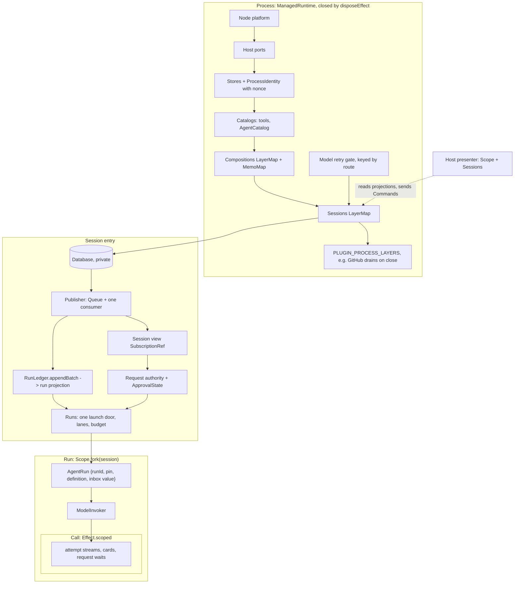

# Core concepts: thirteen nouns, one owner each, laid out on Effect lifetimes

Baseline: `origin/main` at `4311c54176`. This note defines the vocabulary the
rest of the architecture is checked against. It does not replace
[the session-core programme](./2026-09-26-effect-native-session-core.md) (#13350).
Each of that programme's moves fixes the owner of one concept below, and this
note says which concept each move serves.

It came from three read-only passes over `main`:

- an audit of who owns each concept today, with a violation list;
- a mapping of each concept onto Effect v4 (rc.117) primitives and lifetimes;
- an adversarial critique of the concept set against deepseek-harness and pi
  Pico5.

## Names

Two names are proposed, pending the owner's choice:

- **History** replaces "log" and "ledger". It is the append-only rows, and
  the only truth.
- **Projection** replaces "fold". It is anything computed from history.

The code keeps its current identifiers (`SessionEvents`, `RunLedger`,
`foldRunState`, `SessionView`) until a PR touching them renames them.

Three words the code uses for different things are split:

| Word in the code                     | Means                          | Name here     |
| ------------------------------------ | ------------------------------ | ------------- |
| `RuntimeRequest`                     | host → core commands           | **Command**   |
| `HostRequest`                        | core → host capabilities       | **Host port** |
| `request.opened` / `request.decided` | a wait on a human or authority | **Request**   |

Inside a run, a **turn** is one user or synthetic input answered by the model,
and a **step** is one model call. `state.round` counts steps today. A
workflow **round** is a turn opened by the round policy.

## The concepts

| Concept               | Definition                                                                                                                                                                                                                                                                                              | Lifetime and scope                                                                                           | Effect shape                                                                                                                                                 | Owner                                                                                              |
| --------------------- | ------------------------------------------------------------------------------------------------------------------------------------------------------------------------------------------------------------------------------------------------------------------------------------------------------- | ------------------------------------------------------------------------------------------------------------ | ------------------------------------------------------------------------------------------------------------------------------------------------------------ | -------------------------------------------------------------------------------------------------- |
| **Process**           | One Effect graph per OS process: host ports, stores, catalogs, compositions and sessions                                                                                                                                                                                                                | process: `ManagedRuntime` at each host root, closed by `disposeEffect`                                       | one `ProcessLayer`; hosts call `ManagedRuntime.make` over it; the SDK composes the layer and never owns a runtime                                            | `installProcessRuntime` (`src/controllers/session/sessionLayer.ts`), to become `ProcessLayer`      |
| **Session**           | One storage root: its history, publisher, projections, live runs and requests. A conversation is a root run inside it.                                                                                                                                                                                  | session: `LayerMap` entry, explicit close (`idleTimeToLive: infinity`)                                       | `Sessions` tag over a `LayerMap<SessionKey, Session>`                                                                                                        | `sessionLayer.ts`, `SessionHandle.ts`                                                              |
| **History**           | Append-only rows per aggregate, in root-wide commit order. One publisher per (process, root). The claim holder is the only appender of an aggregate.                                                                                                                                                    | durable, format-stamped                                                                                      | the `SessionEvents` publisher: `Queue` inbox plus one consumer fiber; jobs `publish` / `exclusive` / `detach`; only the publisher holds append               | `SessionEvents.ts`, `sessionEvent.ts`; claims in `Database.ts`                                     |
| **Projection**        | Anything computed from history. Two named ones: the **run projection** (strict; the resume authority) and the **session view** (tolerant; display only).                                                                                                                                                | run projection: a value per run; view: session                                                               | run projection: the `RunState` value returned by `RunLedger.appendBatch`, never a Ref. View: a `SubscriptionRef` written by one fiber from the row `Stream`. | `runStateFold.ts`, `sessionFold.ts`                                                                |
| **Run**               | One `run` aggregate with an identity, a parent edge and a driver. It is pinned at open to a composition, an agent definition and a continuation policy. The native driver is the tool-use loop. A child run is a run with a parent edge; lineage (parent) and supervision (owner) are separate facts.   | run: `Scope.fork(session)`, closed when the run fiber exits; history lasts beyond it                         | a run `Layer` (`AgentRun`, `ModelInvoker`, `RunLedger`) launched through one door, `Runs.launch`, from the session's context                                 | `loop/toolUse.ts`, `loop/rounds.ts`, `run/AgentRun.ts`, `runRegistry.ts`, `childRunLoop.ts`        |
| **Input**             | Every message to a run: user, child report, peer, subscription, or a turn opened by the continuation policy. Each is a `followup.queued` row on the run's aggregate.                                                                                                                                    | row until `followup.consumed`; the in-process inbox lives with the run                                       | a value on the run's own entry, passed explicitly; **never a context tag**                                                                                   | `src/agent/followUp/`, `FollowUps.ts` (#13348)                                                     |
| **Agent**             | A resolved definition (settings, prompt, declared tools, category) from an ordered catalog of sources: bundled, user, remote, `plugin:<id>`.                                                                                                                                                            | catalog: process, rebuilt from empty on refresh; definition: recorded at run open                            | an `AgentCatalog` process service holding a `SubscriptionRef` of resolved agents                                                                             | `agentRegistry.ts`, `agentLoad.ts` (target: one loader)                                            |
| **Plugin**            | A manifest row plus entries in fixed tables, one per extension point, keyed by plugin id and checked with `satisfies`. One on/off unit. Built-in plugins contribute code tables; loaded plugins (MCP, installed Claude Code and Codex plugins) contribute data and composition-lifetime resources only. | a table's value type is its lifetime (rule R4)                                                               | no runtime object and no hooks                                                                                                                               | `pluginManifest.ts`, `registry.ts`, each seam's owner module                                       |
| **Composition**       | What a run gets: preset × the agent's tools × host × probe results, as a hashable key. A **preset** is a stored set of switches.                                                                                                                                                                        | key: a value; entry: refcounted in a process `LayerMap`, held by the scopes of the runs that pin it          | `CompositionKey` (`Equal`/`Hash`) plus the `Compositions` `LayerMap`, with one `MemoMap`                                                                     | `composition.ts`, `compositions.ts`                                                                |
| **Call**              | A model call or a tool call inside a run. A model call is binding → invoker → attempt, gated, priced and retried, with `ModelInvoker` its only caller. A tool call is offered set → guard → request → result, with a loop-owned card.                                                                   | call: `Effect.scoped` per attempt or tool call; a binding lives in its own `Scope.fork(run)`, closed on swap | scoped handles for streams, cards and request waits                                                                                                          | `ModelInvoker.ts`, `run/modelBinding.ts`, `loop/toolUseDispatch.ts`, `loop/toolGuard.ts`           |
| **Request**           | A wait on a human or authority (approval, retry, question). The **authority** is a pure `decide(state, payload)` run inside the publisher job that appends `request.opened`. The **wait** is a call-scoped `Deferred`. Approval policy and grants are its state and are rebuilt from rows.              | authority: session; each wait: call                                                                          | `ApprovalState` as a `SubscriptionRef` value on the session entry; decisions are rows                                                                        | `SessionRequests.ts`, `runApprovalQueue.ts`                                                        |
| **Host**              | **Ports** (process-layer inputs: secrets, editor model, dialogs) plus a **presenter** (a scoped program that reads projections and sends Commands). It decides no recorded fact.                                                                                                                        | ports: process; presenter: window or activation scope, parallel to sessions                                  | ports: `Layer.succeed`; presenter: `Effect<void, E, Scope \| Sessions>`                                                                                      | `packages/{extension,desktop,cli}`, `hostRunActions.ts`                                            |
| **Application state** | Settings and app state that are current values, not history.                                                                                                                                                                                                                                            | durable                                                                                                      | `CurrentValues` with one `modify` per write (a single `BEGIN IMMEDIATE`)                                                                                     | Zod catalog; target per the [current-value decision](./2026-09-22-current-value-state-decision.md) |

Not concepts in their own right:

- **Pin** is a property of Run: the run scope's refcounted hold on a
  composition entry, plus the facts on its opening snapshot.
- **Continuation policy** is a property of Run chosen at open. It is one
  source of Input.
- **Claim** is History's write authority per aggregate.
- **Trace** is the run's producer of display rows.
- **Workspace roots** are the Session key plus a Host port.
- **Output** is the documents plugin's facts, which hosts present.

## Invariants

1. **One writer.**
   - Per (process, root), every durable append is a job on the one publisher,
     and commit order is enqueue order.
   - Per aggregate, only the claim holder appends.
   - Per row type there is one writing function: ledger rows through
     `RunLedger.appendBatch`, `run.end` through `finalizeRun`, request rows
     through the request authority.
   - Claims and GC stay in SQL.
2. **History is the only truth.**
   - A fact is one row type.
   - A persisted derivation is admissible only as a checkpoint that rows
     rebuild and that loses every conflict with them.
   - What reached the model (prompt, offered tools, composition, agent
     definition) can be rebuilt from the run's rows.
3. **Decisions read the run projection or the publisher, never the session
   view.** The view is for display.
4. **One owner, one lifetime.** Every piece of mutable state is a Layer or a
   scoped value at exactly one lifetime: process, session, composition, run,
   call, or host scope. There are no module variables and no WeakMaps keyed by
   another concept's handle.
5. **No ambient reads across instances.** A run never reads another run's
   state from context. A child is launched from the session's context, not
   from its parent's fiber.
6. **Plugins contribute to fixed tables.**
   - Each extension point has one core call site and resolves its contributors
     from the run's pinned composition.
   - There is no register or unregister, and no hook.
   - A plugin's switch gates every contribution it makes: tools, skills,
     agents, continuation and layers.
7. **Changes apply at run open.** A root run records its composition and
   definition at open. A child joins its parent's pin and may only narrow.
   Resume re-pins what was recorded and names loudly what is missing. Nothing
   changes inside a run.
8. **Core decides; hosts present.** Any decision whose result is recorded
   (request decisions, admission, outcomes) is made in core and committed as a
   row. A host supplies a human's answer as a Command, and runs only effects
   that cannot change a verdict.

## Effect rules

These are meant for AGENTS.md.

- **R1. Tag or value.** A `Context.Service` must satisfy all three:
  1. it is a capability, not an identity or state;
  2. its provider is fixed for its whole lifetime;
  3. every fiber that can inherit it, a forked child run included, would be
     right to use the same provider.

  Everything that identifies or belongs to one instance is a value on its
  owner, passed as an argument: `runId`, the inbox, the pinned key,
  `ApprovalState`, a request's `Deferred`.

  `Effect.serviceOption` is banned on run- and session-lifetime tags. It has
  `R = never`, so an inherited tag never shows up in a type; this is how the
  #13348 bug hid. It is allowed only for optional process ports.

- **R2. One launch door.** Every run starts through `Runs.launch`, built once
  with `FiberMap.makeRuntime` over the session's context. `forkDetach` or
  `FiberMap.run` from a tool-call fiber is banned for launching a run, because
  every Effect fork starts with the caller's context. A child's link to its
  parent is data. Where a child must start in place, seal the context first
  with `Context.omit` over the run-lifetime keys.
- **R3. `R` versus arguments.** Put in `R` the capabilities whose provider is
  fixed for the enclosing lifetime. Pass as arguments anything that selects an
  instance, carries per-call data or holds per-instance state. Never add a tag
  to avoid threading a parameter.
- **R4. A table's value type is its lifetime.**
  - Composition lifetime:
    - `PLUGIN_TOOLS`: values.
    - `PLUGIN_LAYERS`: layers built through the `Compositions` `MemoMap`,
      shared and refcounted.
  - Process lifetime: `PLUGIN_PROCESS_LAYERS`, merged into `ProcessLayer`.
    GitHub requires `Sessions`, so its finalizer drains before sessions
    close, with no hook.
  - Session lifetime: `PLUGIN_SESSION_LAYERS`.
  - Chosen per run at open: `PLUGIN_CONTINUATIONS` and `PLUGIN_DRIVERS`,
    plain functions.
  - Data: `PLUGIN_EVENT_ARMS`, each arm with its tier and projection slice.
- **R5. One writer, in code.**
  - Only `sessionEventsLayer` holds append. Build it with
    `Layer.provide(database)`, not `provideMerge`, so the session context gets
    only read access.
  - Read-modify-append goes through `exclusive`. Ordering comes from the queue
    and `withPerKeyLane`, never from `Semaphore(1)`, which barges.
- **R6. Exposing projections.**
  - `SubscriptionRef` is for current-value readers (presenters, admission
    checks). Debounce high-rate readers.
  - A row `Stream` is for readers that need every row in order: NDJSON,
    export, SDK events and resume.
  - One fiber writes each projection. `getUnsafe` is allowed only at a
    synchronous host boundary.
- **R7. Effect's `unstable/*` modules.**
  - Keep `http`, `sql` with its own `reactivity`, `encoding` and `process`.
    `process` becomes the one spawn path for plugin-owned processes.
  - Reject `rpc` (Effect Schema, +231 KB per webview), `eventlog`
    (duplicates history), `workflow`/`cluster` (duplicate ledger resume), `ai`
    (`packages/llm` owns the model) and `persistence`.
- **Other rules.**
  - Every service method is an `Effect.fn('Owner.method')`.
  - Errors are `Data.TaggedError`. `Error` is allowed only at host ports.
  - In-memory lifecycle states are `Data.TaggedEnum`, not optional-field bags.
  - A `ManagedRuntime` exists only at composition roots.

## Layer graph

The lifetimes nest as process ⊃ session ⊃ run ⊃ call. A composition is
process-owned and refcounted by runs across sessions. Host scopes run
parallel to sessions.

Four dependency cycles exist today and are cut by the programme:

- `SessionHandle` ↔ `RunRegistry` callbacks;
- core shutdown naming GitHub;
- `@agent` ↔ `@tools` through `AgentEngine` and `continuationPolicy` importing
  `@tools/goal`;
- `src/platform/processRuntime.ts` naming upper layers.

## Where main stands

The audit counts violations per concept against the invariants above: Process
12, Session 8, History 10, Projection 14, Run 11, Plugin 15, Composition 8, Pin
6, Continuation 7, Request 22, Host 20.

The full list, with `file:line` for each item, is in
[`2026-09-26-core-concepts/audit.md`](./2026-09-26-core-concepts/audit.md).
The Effect mapping and the critique are beside it, as
[`effect-mapping.md`](./2026-09-26-core-concepts/effect-mapping.md) and
[`critique.md`](./2026-09-26-core-concepts/critique.md). The ones to fix first, because they are wrong
behavior rather than structure:

| #   | Defect                                                                                                                                          | Evidence                                                                                                     | Invariant |
| --- | ----------------------------------------------------------------------------------------------------------------------------------------------- | ------------------------------------------------------------------------------------------------------------ | --------- |
| 1   | Four `requiresApproval` tools have no call-time gate and run unprompted on GUI hosts                                                            | `ConfigTools.ts:141`, `UnsetApiKeyTool.ts:84`, `InvokeCommandTool.ts:94`, `InstallVscodeExtensionTool.ts:84` | 8         |
| 2   | Five tools are approved as `bash` (MCP, codex, claude_code, wolfram, send_to_terminal), so approve-for-session on one is blanket shell approval | `toolGuard.ts:74-91`                                                                                         | 8         |
| 3   | Every approval bypass is lost on resume in a new process, and the resume republishes an empty snapshot over the durable row                     | `AgentLaunchContext.ts:378-391`                                                                              | 2         |
| 4   | CLI `never` auto-approves workflow-script proposals                                                                                             | `settleApprovals.ts:69-71`, `proposalFlow.ts:200-202`                                                        | 8         |
| 5   | A workflow child inherits its parent's follow-up lease (fixed by #13348)                                                                        | `toolUse.ts:149`                                                                                             | 5         |
| 6   | Nothing is pinned across resume: the composition and the definition are re-read live                                                            | `executeAgent.ts:403`, `agentLoad.ts`                                                                        | 7         |
| 7   | `removeRun` and app-state rows append outside the publisher                                                                                     | `Database.ts:1013-1083`, `appStateStore.ts:72-87`                                                            | 1         |
| 8   | The composition key depends on a module cache, and the CLI never probes                                                                         | `toolAvailability.ts:174,347`                                                                                | 7         |
| 9   | The CLI rewrites a run's outcome after its terminal decision                                                                                    | `packages/cli/src/commands/workflow.ts:375-414`                                                              | 8         |
| 10  | One skill project's roots may widen the file allowlist for every session (inferred)                                                             | `externalRoots.ts:68`, `runtimeSkills.ts:235`                                                                | 4         |

## Enforcement

Each invariant gets a guard in the same programme. A concept with no guard
will drift back.

| Invariant                    | Guard                                                                                                                                                                             |
| ---------------------------- | --------------------------------------------------------------------------------------------------------------------------------------------------------------------------------- |
| 1 One writer                 | an architecture test: only `SessionEvents.ts` and `RunLedger.ts` reference `appendAll` / `appendPrepared`; one writing module per row type (a table over `SessionEvent['type']`)  |
| 2 History is truth           | the `sessionEventFormat` fingerprint already exists; add "model-visible means recorded", checked by a round-trip test that the snapshot rebuilds the offered tools and definition |
| 3 Decisions read projections | an architecture test forbidding `runView(`, `readView(` and `getUnsafe(…view)` in `src/agent/**` and `src/tools/**` outside an allowlist that only shrinks                        |
| 4 One owner                  | a ratchet on module-level `let`, `new Map(` and `new WeakMap(` in `src/**` production files (baseline about 30, shrink only)                                                      |
| 5 No ambient reads           | a lint rule: `Effect.serviceOption` only on the process-port allowlist; `forkDetach` banned in `src/agent/**` except the allowlisted foreign boundaries                           |
| 6 Plugins                    | the existing `satisfies` tables, plus a test that every contribution kind reads the plugin's switch                                                                               |
| 7 Changes at open            | a test that resume re-pins the recorded composition key and definition digest                                                                                                     |
| 8 Core decides               | the existing approval-authority ratchet, extended to bypass writes and to host packages deciding request kinds                                                                    |

## How the #13350 moves map onto the concepts

| Concept                | Moves                                                                           |
| ---------------------- | ------------------------------------------------------------------------------- |
| Process                | 4                                                                               |
| Session                | 6                                                                               |
| History                | 1 (the publisher's one writer; de-dup cuts); 12 (application state off history) |
| Projection             | 1 (the lineage read; decisions off the view)                                    |
| Run                    | 3 (one launch door, terminals); 10 (Input)                                      |
| Agent                  | 11                                                                              |
| Plugin and Composition | 2                                                                               |
| Call                   | 7 (trace lifetimes); 8 (model calls through `ModelInvoker`)                     |
| Request                | 9; 5 (one behavior per decision)                                                |
| Host                   | 5; 13                                                                           |

## Open

- **Names.** History and Projection, or others. Owner's call.
- **Presets.** Stored switches only, or stored compositions? The critique
  argues switches only, because a composition also carries the agent's tools
  and probe results.
- **Settings read mid-run.** Retry limit, compaction threshold and binding
  knobs are read live today. Pin them at open, or rule them live explicitly.
