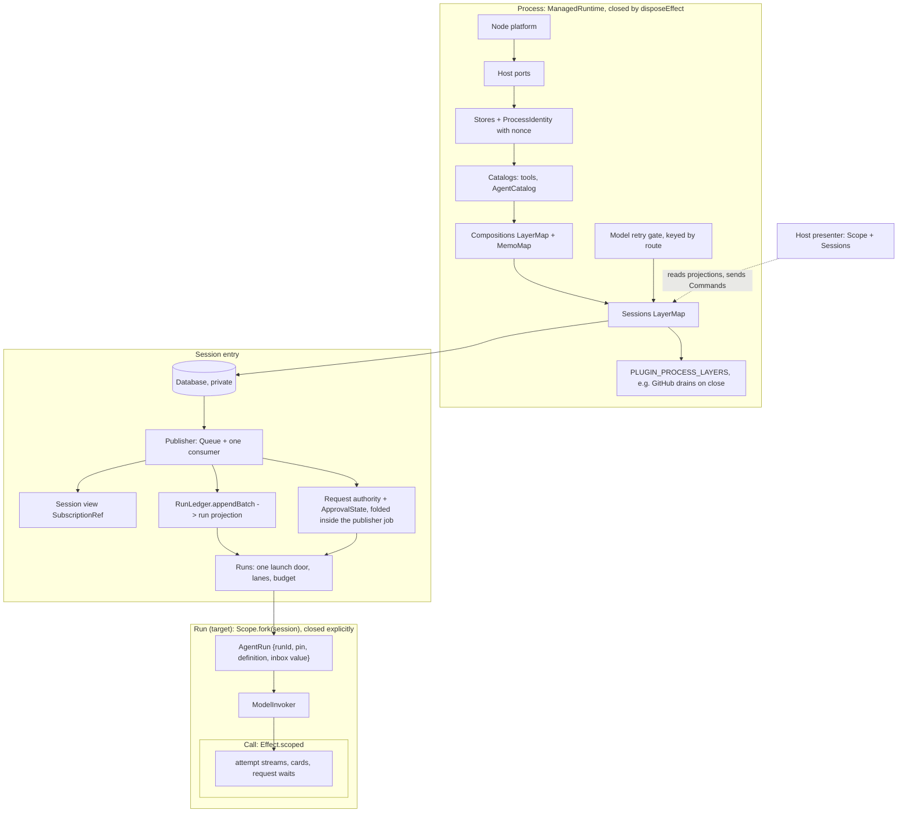

# Core concepts: thirteen nouns, one owner each, laid out on Effect lifetimes

Baseline: `origin/main` at `a53db0e`, which includes #13359, #13348, #13355,
#13361 and #13350. The audits beside this note ran on `4311c54176`; every
claim below was re-checked on `a53db0e`. This note defines the vocabulary the
rest of the architecture is checked against. It does not replace
[the session-core programme](./2026-09-26-effect-native-session-core.md)
(#13350, merged), which is the bounded delivery plan and owns no topic.
Each of that programme's moves fixes the owner of one concept below, and this
note says which concept each move serves.

It came from three read-only passes over `main`:

- an audit of who owns each concept today, with a violation list;
- a mapping of each concept onto Effect v4 (rc.117) primitives and lifetimes;
- an adversarial critique of the concept set against deepseek-harness and pi
  Pico5.

## Names

Two names are proposed, pending the owner's choice:

- **History** replaces "log" and "ledger". It is the append-only rows, and
  the only truth for run and session facts. Current values are a separate
  authority (invariant 9).
- **Projection** replaces "fold". It is anything computed from history.

The code keeps its current identifiers (`SessionEvents`, `RunLedger`,
`foldRunState`, `SessionView`) until a PR touching them renames them.

Three words the code uses for different things are split:

| Word in the code                     | Means                          | Name here     |
| ------------------------------------ | ------------------------------ | ------------- |
| `RuntimeRequest`                     | host → core commands           | **Command**   |
| `HostRequest`                        | core → host capabilities       | **Host port** |
| `request.opened` / `request.decided` | a wait on a human or authority | **Request**   |

Inside a run, a **turn** is one user or synthetic input answered by the model,
and a **step** is one model call. `state.round` counts steps today. A
workflow **round** is a turn opened by the round policy.

## The concepts

| Concept               | Definition                                                                                                                                                                                                                                                                                                                                                                                                                                                                                            | Lifetime and scope                                                                                                                                                                                                                                  | Effect shape                                                                                                                                                 | Owner                                                                                              |
| --------------------- | ----------------------------------------------------------------------------------------------------------------------------------------------------------------------------------------------------------------------------------------------------------------------------------------------------------------------------------------------------------------------------------------------------------------------------------------------------------------------------------------------------- | --------------------------------------------------------------------------------------------------------------------------------------------------------------------------------------------------------------------------------------------------- | ------------------------------------------------------------------------------------------------------------------------------------------------------------ | -------------------------------------------------------------------------------------------------- |
| **Process**           | One Effect graph per OS process: host ports, stores, catalogs, compositions and sessions                                                                                                                                                                                                                                                                                                                                                                                                              | process: `ManagedRuntime` at each host root, closed by `disposeEffect`                                                                                                                                                                              | one `ProcessLayer`; hosts call `ManagedRuntime.make` over it; the SDK composes the layer and never owns a runtime                                            | `installProcessRuntime` (`src/controllers/session/sessionLayer.ts`), to become `ProcessLayer`      |
| **Session**           | One storage root: its history, publisher, projections, live runs and requests. A conversation is a root run inside it.                                                                                                                                                                                                                                                                                                                                                                                | session: `LayerMap` entry, explicit close (`idleTimeToLive: infinity`)                                                                                                                                                                              | `Sessions` tag over a `LayerMap<SessionKey, Session>`                                                                                                        | `sessionLayer.ts`, `SessionHandle.ts`                                                              |
| **History**           | Append-only rows per aggregate, in root-wide commit order. One publisher per (process, root). The claim holder is the only appender of an aggregate.                                                                                                                                                                                                                                                                                                                                                  | durable, format-stamped                                                                                                                                                                                                                             | the `SessionEvents` publisher: `Queue` inbox plus one consumer fiber; jobs `publish` / `exclusive` / `detach`; only the publisher holds append               | `SessionEvents.ts`, `sessionEvent.ts`; claims in `Database.ts`                                     |
| **Projection**        | Anything computed from history. Two named ones: the **run projection** (strict; the resume authority) and the **session view** (tolerant; display only).                                                                                                                                                                                                                                                                                                                                              | run projection: a value per run; view: session                                                                                                                                                                                                      | run projection: the `RunState` value returned by `RunLedger.appendBatch`, never a Ref. View: a `SubscriptionRef` written by one fiber from the row `Stream`. | `runStateFold.ts`, `sessionFold.ts`                                                                |
| **Run**               | One `run` aggregate with an identity, a parent edge and a driver. It is pinned at open to a composition, an agent definition and a continuation policy. The native driver is the tool-use loop. A child run is a run with a parent edge; lineage (parent) and supervision (owner) are separate facts.                                                                                                                                                                                                 | run: today the scope of the run layer; target `Scope.fork(session)`, closed explicitly (`Scope.close` in `Effect.onExit`) when the run fiber exits; history lasts beyond it                                                                         | a run `Layer` (`AgentRun`, `ModelInvoker`, `RunLedger`) launched through one door, `Runs.launch`, from the session's context                                 | `loop/toolUse.ts`, `loop/rounds.ts`, `run/AgentRun.ts`, `runRegistry.ts`, `childRunLoop.ts`        |
| **Input**             | Every message to a run: user, child report, peer, subscription, or a turn opened by the continuation policy. Each is a `followup.queued` row on the run's aggregate.                                                                                                                                                                                                                                                                                                                                  | row until `followup.consumed`; the in-process inbox lives with the run                                                                                                                                                                              | a value on the run's own entry, passed explicitly; **never a context tag**                                                                                   | `src/agent/followUp/`, `FollowUps.ts` (#13348)                                                     |
| **Agent**             | A resolved definition (settings, prompt, declared tools, category) from an ordered catalog of sources: bundled, user, remote, `plugin:<id>`.                                                                                                                                                                                                                                                                                                                                                          | catalog: process, rebuilt from empty on refresh; definition: recorded at run open                                                                                                                                                                   | an `AgentCatalog` process service holding a `SubscriptionRef` of resolved agents                                                                             | `agentRegistry.ts`, `agentLoad.ts` (target: one loader)                                            |
| **Plugin**            | A manifest row plus entries in fixed tables, one per extension point, keyed by plugin id and checked with `satisfies`. One on/off unit (target: today plugin skills are not switch-gated, [`plugin-architecture.md:191`](../../implemented/architecture/2026-09-24-plugin-architecture.md), and bundled agents join unconditionally). Built-in plugins contribute code tables; loaded plugins (MCP, installed Claude Code and Codex plugins) contribute data and composition-lifetime resources only. | a table's value type is its lifetime (rule R4)                                                                                                                                                                                                      | no runtime object and no hooks                                                                                                                               | `src/tools/pluginManifest.ts`, `src/tools/registry.ts`, each seam's owner module                   |
| **Composition**       | What a run gets: preset × the agent's tools × host × probe results, as a hashable key. A **preset** is a stored set of switches. A child whose tools differ gets its own key for its narrowed set, and shares its parent's layer resources through the one `MemoMap`.                                                                                                                                                                                                                                 | key: a value; entry: refcounted in a process `LayerMap`, held by the scopes of the runs that pin it                                                                                                                                                 | `CompositionKey` (`Equal`/`Hash`) plus the `Compositions` `LayerMap`, with one `MemoMap`                                                                     | `composition.ts`, `compositions.ts`                                                                |
| **Call**              | A model call or a tool call inside a run. A model call is binding → invoker → attempt, gated, priced and retried, with `ModelInvoker` its only caller. A tool call is offered set → guard → request → result, with a loop-owned card.                                                                                                                                                                                                                                                                 | call: `Effect.scoped` per attempt or tool call. Binding, target: its own `Scope.fork(run)`, closed explicitly on swap; today every binding lives in the one run-scope child and replaced bindings are released at run close (`AgentRun.ts:141-150`) | scoped handles for streams, cards and request waits                                                                                                          | `ModelInvoker.ts`, `run/modelBinding.ts`, `loop/toolUseDispatch.ts`, `loop/toolGuard.ts`           |
| **Request**           | A wait on a human or authority (approval, retry, question). The **authority** is a pure `decide(state, payload)` run inside the publisher job that appends `request.opened`. The **wait** is a call-scoped `Deferred`. Approval policy and grants are its state and are rebuilt from rows.                                                                                                                                                                                                            | authority: session; each wait: call                                                                                                                                                                                                                 | `ApprovalState` folded synchronously inside the publisher job that decides (a `SubscriptionRef` only mirrors it for readers); decisions are rows             | `SessionRequests.ts`, `runApprovalQueue.ts`                                                        |
| **Host**              | **Ports** (process-layer inputs: secrets, editor model, dialogs) plus a **presenter** (a scoped program that reads projections and sends Commands). It decides no recorded fact.                                                                                                                                                                                                                                                                                                                      | ports: process; presenter: window or activation scope, parallel to sessions                                                                                                                                                                         | ports: `Layer.succeed`; presenter: `Effect<void, E, Scope \| Sessions>`                                                                                      | `packages/{extension,desktop,cli}`, `hostRunActions.ts`                                            |
| **Application state** | Settings and app state that are current values, not history.                                                                                                                                                                                                                                                                                                                                                                                                                                          | durable                                                                                                                                                                                                                                             | `CurrentValues` with one `modify` per write (a single `BEGIN IMMEDIATE`)                                                                                     | Zod catalog; target per the [current-value decision](./2026-09-22-current-value-state-decision.md) |

Not concepts in their own right:

- **Pin** is a property of Run: the run scope's refcounted hold on a
  composition entry, plus the facts on its opening snapshot.
- **Continuation policy** is a property of Run chosen at open. It is one
  source of Input.
- **Claim** is History's write authority per aggregate.
- **Trace** is the run's producer of display rows.
- **Workspace roots** are the Session key plus a Host port.
- **Output** is the documents plugin's facts, which hosts present.

### Refinements from the reference comparison

Comparing the target with OpenCode v2, pi Pico v5 and deepseek-harness adds
these details to the concepts above:

- **Input has lanes and settles.**
  - A `steer` input arrives at the next step boundary; a `queue` input waits
    until the run is idle. Only direct user input may steer. Peer messages
    and child reports land at the turn boundary, as the
    [session-messaging](./2026-09-25-session-messaging.md) owner decision
    rules (no mid-turn steering by another run).
  - Every input ends either answered, with a link to the answer row, or
    unanswered with a reason (withdrawn, stale, run failed).
  - A queued input can be withdrawn.
  - Admission is idempotent on a caller-supplied ID.
  - All three references have this.
- **Run has two edges.**
  - `parent` is lineage: who started it; it keeps history and forks.
  - `owner` is supervision: who controls it, abort cascade and idle
    traversal.
  - Both are recorded at creation, and detaching changes the owner and keeps
    the parent.
  - An abort is a durable mark that cascades along owner edges.
  - Pico v5 and deepseek-harness have this.
- **A tool declares replay safety separately from parallel safety.** After a
  crash, a call is re-run automatically only if the tool was declared safe to
  replay when it was offered. `parallelSafe` no longer implies it.
- **Request uses one action × resource ruleset** for every tool kind (deny
  wins, patterns can be saved), so no tool is approved "as bash". A delegated
  child defaults to `never`, bounded by what its parent was allowed.
- **The SDK exposes two streams:**
  - a durable one, resumable from a commit cursor;
  - a live one, which may drop.

  Presenters start from a snapshot and then follow with no gaps.

## Central primitives

The owner ruled on 2026-09-27 that TeXRA should support:

- changes live, at any step;
- third-party plugins that bring code;
- flexible writers of history.

Five shared primitives make that one mechanism instead of one mechanism per
pluggable kind. Each is built from Effect v4 primitives the repo already uses:
`SubscriptionRef`, `RcMap`/`LayerMap`, `Scope`, `FiberSet` and `Queue`. Every
pluggable kind is data inside them: tools, agents, skills, prompt sections,
continuation policies, drivers, model providers, MCP servers and event
schemas.

1. **Registry: one generational catalog.**

   ```ts
   interface Registry<K, V> {
     readonly current: SubscriptionRef<Generation<K, V>>; // latest, rebuilt from active contributions
     readonly pin: Effect<Generation<K, V>, never, Scope>; // refcounted; drains when released
     readonly contribute: (
       owner: PluginId,
       entries: ReadonlyMap<K, V>,
     ) => Effect<void, RegistryConflict, Scope>; // withdrawn when the owner's scope closes
   }
   interface Generation<K, V> {
     readonly id: GenerationId;
     readonly digest: string;
     readonly entries: ReadonlyMap<K, V>;
   }
   ```

   - Any change rebuilds a new immutable generation from the active
     contributions, never patching in place (OpenCode's rule).
   - Old generations live while pinned, then drain (Pico v5).
   - A name clash between owners is rejected loudly.
   - The existing per-kind catalogs become instances of it: the agent
     registry's epoch logic, the skill-source fold, the tool-availability
     cache, `MODEL_PROVIDER_PLUGINS`, and `Compositions`.

2. **Plugin: one scoped contributor, built-in or loaded.**

   ```ts
   interface PluginModule<R> {
     readonly id: PluginId;
     readonly revision: ContentHash;
     readonly layer?: Layer<never, PluginError, R>; // R = the capabilities it may use
     readonly contributes: Contributions; // typed entries for named registries
   }
   // Plugin.load(module): Effect<LoadedPlugin, PluginError, Scope | Trusted>
   ```

   - Built-in plugins, installed Claude Code and Codex plugins, MCP servers
     and third-party code modules all go through `load`. Code arrives by
     dynamic `import()`.
   - Unloading or replacing a plugin closes its `Scope`. That withdraws its
     contributions from every registry, and the registries rebuild while old
     generations drain.
   - A plugin receives only the services in its `R`, so Effect's types are the
     capability system.
   - Its fibers live in a `FiberSet` owned by its scope. A failure is contained
     there and recorded, never swallowed.

3. **History: one commit line, many typed writers, an open schema
   registry.**
   - `History.writer(pluginId)` returns a scoped handle that may append only
     that plugin's event types, as jobs on the one publisher queue. Order and
     atomicity stay single-line, while plugins write their own state.
   - Event schemas are a Registry keyed by plugin, type and version. A row
     whose schema is not loaded is kept byte for byte and decoded when the
     plugin returns.
   - Each plugin migrates its own versions lazily, so one plugin's schema
     change does not reset the store.
   - Projections are Registry entries as well: `init`, `apply` and the slice
     they own.
4. **Step: the one boundary where change happens and is recorded.**
   - `Step.open(run): Effect<StepContext, never, Scope>` pins every registry
     the run uses as one snapshot, a vector of generation ids.
   - Before the model request it writes a change row with the difference from
     the previous step's snapshot (tools, prompt text). This is
     deepseek-harness's recorded change and OpenCode's context epoch in one
     rule.
   - A tool call checks its tool's identity (definition digest plus plugin
     revision) against the snapshot that offered it, and a stale call is
     rejected.
   - A resumed step re-opens from the recorded snapshot where it can. What is
     missing leaves the run blocked, not failed.
   - A preset is a saved selection that feeds the snapshot.
5. **Trust: capabilities and approval for anything that loads.**
   - Every loaded plugin revision, identified by content hash, needs a trust
     decision through the core request authority, recorded as a row.
   - The decision covers exactly the capabilities in the plugin's `R`.
   - A new hash is a new revision and is untrusted until approved.
   - An untrusted-by-default plugin can run in a worker or child process.

Each owner requirement maps onto these primitives:

| Requirement           | Primitives                            |
| --------------------- | ------------------------------------- |
| Live changes anywhere | Registry + Step                       |
| Third-party code      | Plugin + Trust                        |
| Flexible writers      | History writers + the schema registry |

The #13350 moves become "put X on the Registry" or "route Y through History",
and each such PR deletes the old per-kind mechanism.

### What this revises in the plugin architecture

The central primitives reverse four decisions of the
[plugin architecture](../../implemented/architecture/2026-09-24-plugin-architecture.md),
which stays the owner of plugins until the owner confirms this revision. Each
reversal follows from the owner's 2026-09-27 ruling above (live changes,
third-party code, flexible writers):

- **Switch-gated skills and agents.** It rules "Plugin skills are not gated by
  the plugin's switch" (`:190-191`) and pools bundled plugin agents with the
  core directory (`:192-198`). Invariant 6 withdraws both when a plugin is
  switched off, so one switch hides everything a plugin contributes.
- **Runtime load and unload.** It rejects "runtime register/unregister"
  (`:172-173`, `:272-273`). Plugin + Registry make loading and unloading a
  scope's open and close.
- **Plugin-owned durable state and event channels.** It rules "Plugins own no
  durable state and no event channel" (`:231-232`, `:252`).
  `History.writer(pluginId)` and `PLUGIN_EVENT_ARMS` give a plugin typed rows
  on the one commit line, never a second channel.
- **Drivers.** It rules "no hooks and no task kinds" (`:227-229`), and
  `toolUse.ts` stays the only run program. `PLUGIN_DRIVERS` is not a task
  kind: a driver is a plugin's contribution to the existing child-run seam
  (Codex, Claude, workflow script already live in plugins), and the native
  driver stays core.

## Decisions for the next two years

The owner decided these on 2026-09-27, choosing in each case the option that
still fits in two years: sync across devices, remote runs, many clients, and a
third-party plugin ecosystem.

1. **History is designed for replication now.**
   - It stays SQLite per project root today, but every row gets an identity
     that is unique across machines: `(aggregate_id, seq)` with globally unique
     aggregate ids (run ids are already UUIDs) plus the writing process's
     `origin`.
   - `commit` stays a local cursor, and per-aggregate order is the only order
     replication has to preserve.
   - A `Storage` port with a conformance suite (as Pico v5 has) lets a remote
     or replicated backend be added later without touching the runtime.
   - Claims stay per aggregate. A replicated backend inherits them as the one
     write authority.
2. **One protocol between core and every client.**
   - Hosts, the SDK and any future web, mobile or remote client use one typed
     protocol:
     - **Commands** into core;
     - **projection streams** out: a snapshot of the current view, then every
       later change in order with none missed;
     - a **durable history stream** that can resume from a cursor;
     - a **live stream** for transient progress, which may drop.
   - It is defined with Zod and carried in-process today. The same messages
     can cross a process or network boundary later, so hosts cannot diverge in
     behavior.
   - This absorbs #13350 move 5 (wire realignment) and move 7's SDK streams.
3. **Plugins may own durable state, through an open schema registry.** See
   Central primitives 3:
   - typed writers per plugin;
   - per-plugin versions with lazy migration;
   - rows from a missing plugin kept byte for byte;
   - one decode site that looks up the registry, and one commit line.

   This replaces "plugin arms inside the one closed union", which made every
   plugin schema change a whole-store format bump.

4. **Plugin code: one general contract, staged delivery.** Every slot is a
   typed port that can be served in-process or, later, by another process.
   - **Version 1:**
     - third-party tools, prompts and resources run out of process through
       MCP, which already exists;
     - third-party data (skills, agents, commands) comes through installed
       Claude Code and Codex plugins;
     - deep slots (continuation policy, drivers, event types, layers) take
       in-process code from built-in and trusted plugins only, with trust per
       content hash.
   - **Later, if the ecosystem needs it:** out-of-process deep slots over the
     same port contracts. They run inside the loop on every step, so they need
     a protocol with round trips on the hot path.
   - The owner will discuss version 1's scope before it is built.

## Invariants

1. **One writer.**
   - Per (process, root), every durable append is a job on the one publisher,
     and commit order is enqueue order.
   - Per aggregate, only the claim holder appends.
   - Per row type there is one writing function: ledger rows through
     `RunLedger.appendBatch`, `run.end` through `finalizeRun`, request rows
     through the request authority.
   - Claims and GC stay in SQL.
2. **History is the only truth for run and session facts.** Current values
   (settings, application state) are a separate authority by the accepted
   [current-value decision](./2026-09-22-current-value-state-decision.md); see
   invariant 9.
   - A fact is one row type.
   - A persisted derivation is admissible only as a checkpoint that rows
     rebuild and that loses every conflict with them.
   - What reached the model can be rebuilt from the run's rows: the rendered
     system prompt (text or digest plus text), the exact tool declarations
     offered, the composition with plugin revisions, and the agent definition.
     Names plus a description-stripped hash are not enough.
   - This is asserted at runtime, not only in a test: in development and CI,
     `ModelInvoker` fails a request that cannot be rebuilt from the rows
     (deepseek-harness does this on every request).
   - An uncertain storage failure (the commit may or may not have landed) is
     fatal for the session. Nothing inside the publisher's write line does
     I/O, so one slow check cannot stall every append (Pico v5).
3. **Decisions read the run projection or the publisher, never the session
   view.** The view is for display.
4. **One owner, one lifetime.** Every piece of mutable state is a Layer or a
   scoped value at exactly one lifetime: process, session, composition, run,
   call, or host scope. There are no module variables and no WeakMaps keyed by
   another concept's handle.
5. **No ambient reads across instances.** A run never reads another run's
   state from context. A child is launched from the session's context, not
   from its parent's fiber.
6. **Plugins contribute typed entries to registries.**
   - A plugin (built in, installed or third-party code) contributes typed
     entries to named registries from inside its own `Scope`. Loading and
     unloading at runtime are allowed.
   - Each extension point has one core call site that reads its registry
     through the step's snapshot.
   - There are no untyped hooks and no ordered listener chains.
   - A plugin's switch or unload withdraws every contribution it made: tools,
     skills, agents, continuation, layers and schemas.
7. **Changes apply at step boundaries and are recorded; the durable run and
   its activations are separate contracts.**
   - Each step pins a snapshot of every registry it reads and records the
     difference from the previous step before its model request. Nothing
     changes mid-call.
   - A child reads the same registries and may only narrow what its parent's
     step offered. It records its own narrower offered set.
   - A run can have several activations (a live fiber, a model binding, a
     composition hold). The recorded facts belong to the durable run; the
     resources belong to the activation.
   - Every activation, fresh or resumed, records its exact offered set and
     plugin revisions (on `run.activate`) before its first model request, so
     each request is rebuildable from rows.
   - **Resume offers the recorded tools that are still available and still
     the same tool.** This keeps the ruled `recorded ∩ available` rule
     ([rulings ledger](../../implemented/architecture/2026-08-01-architecture-rulings-ledger.md),
     2026-09-23: a resumed run resolves its own composition) and adds an
     identity check; it does not re-pin a recorded composition. A tool is the same when its definition digest and its
     plugin revision match what was recorded. A changed or missing tool is not
     offered, and a call to it gets `tool_unavailable`.
   - **Blocked, not failed.** If the run's driver, agent or a required plugin
     is missing, the resume leaves the run blocked with a recorded reason. It
     ends only by an explicit stop.
   - A long conversation sees a change at its next step, recorded as a row.
     Only the step where something changed pays a prompt-cache miss.
8. **Core decides; hosts present.** Any decision whose result is recorded
   (request decisions, admission, outcomes) is made in core and committed as a
   row. A host supplies a human's answer as a Command. A host port may do
   fallible work, such as publishing output, and return a fact that core needs
   before it commits the outcome. Pure presentation subscribes afterwards and
   cannot change a verdict.
9. **One authority per kind of fact.** Resumable execution facts live in
   history. Settings and other current values live in `CurrentValues`.
   Transient observations such as stream chunks live on the live trace and are
   never rows.
10. **One shutdown protocol, owned by core.** Core stops admission, drains
    accepted deliveries, settles runs and releases resources, in that order,
    within the implemented deadline (`SESSION_CLOSE_DEADLINE_MS`,
    `sessionLayer.ts:59`; rulings ledger, retired entry at `:316`):
    past it, remaining work is interrupted and the incomplete cleanup is
    reported, so a call that never settles cannot hold shutdown forever.
    Explicit session close while the process keeps running follows the same
    protocol. Hosts invoke it. Plugins acquire and release their resources in
    their typed layers, ordered by layer dependencies, not hooks.

## Effect rules

These are meant for AGENTS.md.

- **R1. Tag or value.** A `Context.Service` must satisfy all three:
  1. it is a capability, not an identity or state;
  2. its provider is fixed for its whole lifetime;
  3. every fiber that can inherit it, a forked child run included, would be
     right to use the same provider.

  Everything that identifies or belongs to one instance is a value on its
  owner, passed as an argument: `runId`, the inbox, the pinned key,
  `ApprovalState`, a request's `Deferred`.

  `Effect.serviceOption` is banned on run- and session-lifetime tags. It has
  `R = never`, so an inherited tag never shows up in a type; this is how the
  #13348 bug hid. It is allowed only for optional process ports. Since
  #13348 this already holds on main: the only calls are the allowlisted
  `SupabaseAuth`, `EditorModel`, `InlineComments` and `ToolMissingReporter`,
  so the rule is a regression guard.

- **R2. One launch door.** Every run starts through `Runs.launch`, built once
  with `FiberMap.makeRuntime` over the session's context. `forkDetach` or
  `FiberMap.run` from a tool-call fiber is banned for launching a run, because
  every Effect fork starts with the caller's context. A child's link to its
  parent is data. Where a child must start in place, seal the context first
  with `Context.omit` over the run-lifetime keys.
- **R3. `R` versus arguments.** Put in `R` the capabilities whose provider is
  fixed for the enclosing lifetime. Pass as arguments anything that selects an
  instance, carries per-call data or holds per-instance state. Never add a tag
  to avoid threading a parameter.
- **R4. A table's value type is its lifetime.**
  - Composition lifetime:
    - `PLUGIN_TOOLS`: values.
    - `PLUGIN_LAYERS`: layers built through the `Compositions` `MemoMap`,
      shared and refcounted.
  - Process lifetime: `PLUGIN_PROCESS_LAYERS`, merged into `ProcessLayer`.
    `Sessions` consumes the GitHub service (`sessionLayer.ts`), so the edge
    runs `Sessions` → plugin; the plugin's typed drain runs as a step of the
    core shutdown protocol (invariant 10), with no hook. A plugin layer that
    required `Sessions` would be a Layer cycle.
  - Session lifetime: `PLUGIN_SESSION_LAYERS`.
  - Chosen per run at open and changed only at a recorded step boundary:
    `PLUGIN_CONTINUATIONS` and `PLUGIN_DRIVERS`, plain functions.
  - Data: `PLUGIN_EVENT_ARMS`, each arm with its tier and projection slice.
- **R5. One writer, in code.**
  - Only `sessionEventsLayer` holds append. Build it with
    `Layer.provide(database)`, not `provideMerge`, so the session context gets
    only read access.
  - Read-modify-append goes through `exclusive`. Ordering comes from the queue
    and `withPerKeyLane`, never from `Semaphore(1)`, which barges.
- **R6. Exposing projections.**
  - `SubscriptionRef` is for presenters. Admission and every other decision
    read the run projection or the publisher (invariant 3). Debounce
    high-rate readers.
  - A row `Stream` is for readers that need every row in order: NDJSON,
    export, SDK events and resume.
  - One fiber writes each projection. `getUnsafe` is allowed only at a
    synchronous host boundary.
- **R7. Effect's `unstable/*` modules.**
  - Keep `http`, `sql` with its own `reactivity`, `encoding` and `process`.
    `process` becomes the one spawn path for plugin-owned processes.
  - Reject `rpc` (Effect Schema, +231 KB minified, +71 KB gzipped, per webview), `eventlog`
    (duplicates history), `workflow`/`cluster` (duplicate ledger resume), `ai`
    (`packages/llm` owns the model) and `persistence`.
- **Other rules.**
  - Every service method is an `Effect.fn('Owner.method')`.
  - Errors are `Data.TaggedError`. `Error` is allowed only at host ports.
  - In-memory lifecycle states are `Data.TaggedEnum`, not optional-field bags.
  - A `ManagedRuntime` exists only at composition roots.

## Layer graph



The lifetimes nest as process ⊃ session ⊃ run ⊃ call. A composition is
process-owned and refcounted by runs across sessions. Host scopes run
parallel to sessions.

Four dependency cycles exist today and are cut by the programme:

- `SessionHandle` ↔ `RunRegistry` callbacks;
- core shutdown naming GitHub;
- `@agent` ↔ `@tools` through `AgentEngine` and `continuationPolicy` importing
  `@tools/goal`;
- `src/platform/processRuntime.ts` naming upper layers.

## Where main stands

The audit counts violations per concept against the invariants above, on
`4311c54176`, **before** #13359 and #13348 merged: Process 12, Session 8,
History 10, Projection 14, Run 11, Plugin 15, Composition 8, Pin 6,
Continuation 7, Request 22, Host 20. These are pre-merge figures; "Assumes
#13359" below lists the items those two PRs settled. The defect table below is
re-checked on `a53db0e`.

The full list, with `file:line` for each item, is in
[`2026-09-26-core-concepts/audit.md`](./2026-09-26-core-concepts/audit.md).
The Effect mapping and the critique are beside it, as
[`effect-mapping.md`](./2026-09-26-core-concepts/effect-mapping.md) and
[`critique.md`](./2026-09-26-core-concepts/critique.md). The ones to fix first, because they are wrong
behavior rather than structure:

| #   | Defect                                                                                                                                                                                                                                                                                                                                                                                        | Evidence                                                                                                     | Invariant |
| --- | --------------------------------------------------------------------------------------------------------------------------------------------------------------------------------------------------------------------------------------------------------------------------------------------------------------------------------------------------------------------------------------------- | ------------------------------------------------------------------------------------------------------------ | --------- |
| 1   | Four `requiresApproval` tools have no call-time gate and run unprompted on GUI hosts; the only reader of `requiresApproval` withholds them only when prompts are unavailable (`agentToolResolution.ts:289-294`)                                                                                                                                                                               | `ConfigTools.ts:142`, `UnsetApiKeyTool.ts:85`, `InvokeCommandTool.ts:97`, `InstallVscodeExtensionTool.ts:87` | 8         |
| 2   | Five tools are approved as `bash` (MCP, codex, claude_code, wolfram, send_to_terminal), so approve-for-session on one is blanket shell approval                                                                                                                                                                                                                                               | `toolGuard.ts:74-91`                                                                                         | 8         |
| 3   | Every approval bypass is lost on resume in a new process, and the resume republishes the in-memory (empty) snapshot over the durable row                                                                                                                                                                                                                                                      | `AgentLaunchContext.ts:378-391`, `SessionHandle.ts:402-406`                                                  | 2         |
| 4   | Headless runs (`never`, and `ask` with no prompt surface) approve workflow-script proposals in core **without recording a decision**. The approval itself is deliberate: `proposalFlow.ts:192-199` explains that the proposal is a review surface, not the security gate, and bash and edits stay denied downstream. The defect is only the missing `request.opened` / `request.decided` rows | `settleApprovals.ts:69-71`, `approvalPolicy.ts:109-113`, `proposalFlow.ts:192-202`                           | 2, 8      |
| 5   | A workflow child inherits its parent's follow-up lease (**fixed**: #13348)                                                                                                                                                                                                                                                                                                                    | `toolUse.ts:149-150`                                                                                         | 5         |
| 6   | The agent definition is re-read live on resume, and resumed tools get no identity check. Re-resolving the composition is the ruled behaviour (ledger 2026-09-23) and is kept                                                                                                                                                                                                                  | `executeAgent.ts:393`, `agentLoad.ts`                                                                        | 7         |
| 7   | `removeRun` and app-state rows append outside the publisher                                                                                                                                                                                                                                                                                                                                   | `Database.ts:1013-1073`, `appStateStore.ts:76`                                                               | 1         |
| 8   | The composition key depends on a module cache, and the CLI probes only after a credential change, never at startup                                                                                                                                                                                                                                                                            | `toolAvailability.ts:174,344`                                                                                | 7         |
| 9   | The CLI decides a run's outcome (non-cancelled becomes FAILED) instead of returning a fact for core to decide                                                                                                                                                                                                                                                                                 | `packages/cli/src/commands/workflow.ts:397-400`                                                              | 8         |
| 10  | One skill project's roots may widen the read-only file allowlist for every session (inferred)                                                                                                                                                                                                                                                                                                 | `externalRoots.ts:66`, `runtimeSkills.ts:235`                                                                | 4         |

## Assumes #13359

#13359 ("retire seven dual systems and pass-through layers from the
2026-09-26 debt audit") is taken as merged. It settles or narrows these items
in the concept model and the audit:

| Concept                  | What #13359 settles                                                                                                                                                                                       | Still open after it                                                                                                                                           |
| ------------------------ | --------------------------------------------------------------------------------------------------------------------------------------------------------------------------------------------------------- | ------------------------------------------------------------------------------------------------------------------------------------------------------------- |
| History (claim)          | `runLiveness.ts` is deleted, so the aggregate claim is the only liveness authority (`probeChild`, `claimStanding`)                                                                                        | the three claim doors; the follow-up leases as second in-process owners (move 10)                                                                             |
| Run (child edge)         | `ChildRunPort` is the one child-run handle contract; the dead `createChildRun` fields, the `childRunId` echo and the `registerChildRun` forward are gone                                                  | the launch door (R2); lineage vs supervision                                                                                                                  |
| Call (model)             | `Model.generateTurn` is gone, so `completedTurn(streamTurn(...))` is the one turn path. Subscription providers are data: one `SubscriptionOAuthError`, and policies carrying their token endpoint.        | compaction and `helperModel` bypassing `ModelInvoker` (move 8). The retry gate is decided: process scope, keyed by wire route (#13350 move 8)                 |
| Trace (producer of rows) | `AgentTrace` keeps `emit` and its real producer surface; the six sugar emitters are gone, so #13350 move 7 PR 4 has nothing left to rename                                                                | stage, stream and card lifetimes (move 7 PRs 1–3)                                                                                                             |
| Process (module slots)   | the first-call-wins `getCliSecrets` singleton is deleted; the extension serves `AgentDirectories` as a layer; `bootstrapHost` reads `host` and `secrets` from the runtime's `SetupPlatform` and `Secrets` | the rest of the roughly 28 slots, including `initProcessSettingHost`, the `agentDirectories` watcher singleton, skills, the catalog and `AppSignals` (move 4) |
| Host                     | the Tools and LaTeX settings pages have one shared body (`settingsToolCommands.ts`), so the plugin-toggle side effect is no longer restated by the extension and desktop                                  | the CLI toggle path; the five per-host decisions (Request)                                                                                                    |
| Output (documents)       | one `runDiff` entry for latexdiff; the duplicate host verbs and wrappers are gone                                                                                                                         | presentation from facts (move 13)                                                                                                                             |

Two audit findings #13359 left for owner decisions are the same as this
note's open requests:

- follow-ups to an interrupted run, which is #13350 decision 8;
- one approval-policy authority, which is #13350 decision 7 and invariant 8.

## Enforcement

Each invariant gets a guard in the same programme. A concept with no guard
will drift back.

| Invariant                    | Guard                                                                                                                                                                                                                                                                                           |
| ---------------------------- | ----------------------------------------------------------------------------------------------------------------------------------------------------------------------------------------------------------------------------------------------------------------------------------------------- |
| 1 One writer                 | an architecture test over **call sites**, not references: `Database.ts` may define `appendAll` / `appendPrepared`; the only production invocations are inside the `SessionEvents` publisher; one writing module per row type (a table over `SessionEvent['type']`)                              |
| 2 History is truth           | the `sessionEventFormat` fingerprint already exists; a runtime assertion in `ModelInvoker` (development and CI) that each request, rendered prompt included, is rebuildable from rows, plus a round-trip test                                                                                   |
| 3 Decisions read projections | an architecture test forbidding `runView(`, `readView(` and `getUnsafe(…view)` in every production root (`src/**`, `packages/*/src/**`) outside an allowlist that only shrinks; the baseline includes `SessionRequests.ts` and `desktopHostRequests.ts`                                         |
| 4 One owner                  | a ratchet on module-level `let`, `new Map(` and `new WeakMap(` in `src/**` and `packages/*/src/**` production files, with a scoped baseline per root, shrink only                                                                                                                               |
| 5 No ambient reads           | a lint rule: `Effect.serviceOption` only on the process-port allowlist; `forkDetach` and `FiberMap.run` banned for launching runs in `src/agent/**`, `src/tools/**` and `packages/*/src/**` (the baseline includes `childRunLoop.ts` and `resumeRun.ts`), except allowlisted foreign boundaries |
| 6 Plugins                    | the existing `satisfies` tables, plus a test that every contribution kind reads the plugin's switch                                                                                                                                                                                             |
| 7 Changes at open            | a test that each activation records its offered set on `run.activate`, that resume offers only recorded tools whose digest and plugin revision still match, and that it leaves a run blocked when its driver or agent is missing                                                                |
| 8 Core decides               | the existing approval-authority ratchet, extended to bypass writes, to host packages deciding request kinds, and to host-written outcomes (the baseline includes `packages/cli/src/commands/workflow.ts`)                                                                                       |
| 9 One authority per fact     | a schema test: no `SessionEvent` arm carries a current-value family or a stream chunk, and no current-value family carries a run fact                                                                                                                                                           |
| 10 One shutdown protocol     | a test that closing a session with a never-settling call returns within `SESSION_CLOSE_DEADLINE_MS` and reports the incomplete cleanup; a ratchet on host-registered shutdown chains (shrink to zero)                                                                                           |

## How the #13350 moves map onto the concepts

| Concept                | Moves                                                                           |
| ---------------------- | ------------------------------------------------------------------------------- |
| Process                | 4                                                                               |
| Session                | 6                                                                               |
| History                | 1 (the publisher's one writer; de-dup cuts); 12 (application state off history) |
| Projection             | 1 (the lineage read; decisions off the view)                                    |
| Run                    | 3 (one launch door, terminals); 10 (Input)                                      |
| Agent                  | 11                                                                              |
| Plugin and Composition | 2                                                                               |
| Call                   | 7 (trace lifetimes); 8 (model calls through `ModelInvoker`)                     |
| Request                | 9; 5 (one behavior per decision)                                                |
| Host                   | 5; 13                                                                           |

## Open

- **Names.** History and Projection, or others. Owner's call.
- **Presets.** Recommended: a preset records the user's selection of
  switches. Availability is resolved when resources are acquired. A
  composition also carries the agent's tools and probe results, so it is not a
  preset. deepseek-harness and the joint review agree.
- **Long conversations and mid-run changes. Decided 2026-09-27:** changes
  apply at the next step boundary and are recorded (Step, above). Settings
  read mid-run follow the same rule: they are captured in the step snapshot,
  and a change is recorded.
- **Plugin code, version 1 scope.** Proposed in "Decisions for the next two
  years" item 4; to be discussed with the owner before it is built.

- **Goal mode after resume.** Recommended: autonomous continuation does not
  survive a resume without a human re-arming it, as in deepseek-harness.
  #13350 move 2 currently keeps the goal's grant across resume.
- **Format policy after 1.0.** Before users keep sessions across versions,
  choose per-arm versions with lazy migration (Pico v5 documents) or immutable
  format generations (deepseek-harness). The whole-store stamp resets
  everything when any plugin's schema changes.
