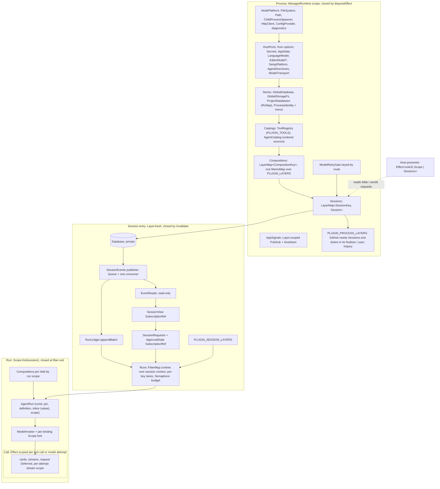

## Effect v4 design for TeXRA's core concepts (read-only; `origin/main` @ 4311c54176, `effect` 4.0.0-rc.117)

I read the PR #13350 note (`.agents/docs/proposed/architecture/2026-09-26-effect-native-session-core.md`), both of LionSR's review comments, AGENTS.md, the rulings ledger, the rc.117 sources and the code on main. Nothing was edited. Note that #13348 is still **open**, so the bug it fixes is live on main.

Two corrections to the brief come first:

- **The ledger's four lifetimes are process, session, run and composition.** The composition was added by the 2026-09-23 amendment. "Call" is not a ledger lifetime. It needs a scope anyway, for tool calls, model attempts, cards and streams. It should get its own ledger row, or be named a sub-scope of run.
- **The rc.117 fact that decides the context-leak question.** `FiberMap.run`, `Effect.forkDetach`, `forkIn` and `forkChild` all start the new fiber with the caller's context (`FiberMap.ts:1375-1389` runs `runForkWith(parent.context)`). `FiberMap.runtime(map)<R>()` captures the context at the point where it is built (`FiberMap.ts:1434-1470`). `Effect.provide(context)` and `provideContext` merge into the inherited context (`internal/effect.ts:2316`, `Context.merge`). `Effect.serviceOption` has `R = never` (`Effect.ts:12086`), so an inherited tag never shows up in a type. `Context.omit` exists (`Context.ts:1977`). Rule R2 below is built on these.

---

### (a) Concepts

| Concept          | Effect shape (rc.117)                                                                                                                                                                                                                                                                                                                                                                                                        | Lifetime and scope (what closes it)                                                                                                                                                                                                                                                                                                            | Owner module                                                                                             | Requires in `R`                                                                       | Deviations on main                                                                                                                                                                                                                                                                                                                                                                                                                                                                                                     |
| ---------------- | ---------------------------------------------------------------------------------------------------------------------------------------------------------------------------------------------------------------------------------------------------------------------------------------------------------------------------------------------------------------------------------------------------------------------------- | ---------------------------------------------------------------------------------------------------------------------------------------------------------------------------------------------------------------------------------------------------------------------------------------------------------------------------------------------- | -------------------------------------------------------------------------------------------------------- | ------------------------------------------------------------------------------------- | ---------------------------------------------------------------------------------------------------------------------------------------------------------------------------------------------------------------------------------------------------------------------------------------------------------------------------------------------------------------------------------------------------------------------------------------------------------------------------------------------------------------------- |
| **Process**      | One `Layer` graph (`ProcessLayer: Layer<ProcessServices \| Sessions, ProcessOpenFailed>`). Each host root makes one `ManagedRuntime.make(ProcessLayer)`. The SDK exports the layer and never a runtime.                                                                                                                                                                                                                      | Process. The scope is the `ManagedRuntime`'s, closed by `disposeEffect`.                                                                                                                                                                                                                                                                       | `installProcessRuntime` in `src/controllers/session/sessionLayer.ts:1154` (it belongs in its own module) | Nothing. Host facts come in as layer options or `Layer.succeed` ports.                | Returns a runtime, not a layer (`sessionLayer.ts:1219`). Owner slot `sessionGraph.ts:185`, plus `installedProcessRuntime()` at `:204`. `disposal` slot at `sessionLayer.ts:1290`. The SDK hand-rolls a refcount (`packages/agent/src/effect/runtime.ts:147,156,159`). `bootstrapHost` writes module slots outside the graph (`hostBootstrap.ts:83-105`) and uses `forkDetach` (`:112`). `AppSignals` hub slot, never shut down (`AppSignals.ts:176`).                                                                  |
| **Session**      | `LayerMap<SessionKey, Session>` with `idleTimeToLive: Duration.infinity`. Each entry is built under `Layer.fresh`. `Sessions` should be a public `Context.Service` in process `R`.                                                                                                                                                                                                                                           | Session. The scope is the entry's `RcMap` scope, closed by `sessions.invalidate(key)` (close) or by runtime disposal.                                                                                                                                                                                                                          | `Sessions` (`sessionLayer.ts:788-801`) and `SessionHandle`                                               | `ProcessServices` (`ProjectDatabases`, `ProcessIdentity`, `Compositions`…)            | A second registry, `HeldSessions`, sits beside the map (`:201,:1215`). `SessionHandle` is a 1,203-line class built with `new`, with synchronous teardown (`:589,:618`) and a constructor cycle (`SessionHandle.ts:312`). `defaultSessionRoot` slot (`sessionGraph.ts:281`). The GitHub drain is hard-coded in `closeAll` (`sessionLayer.ts:1258`).                                                                                                                                                                     |
| **Log**          | `SessionEvents` tag: a `Queue.unbounded<Job, Cause.Done>` inbox, one `Effect.forkScoped` consumer running each job with `Effect.uninterruptible`, and a `Deferred` per job. On close, `Queue.end` then `Fiber.join`. Beneath it, `Database` (`SqlClient` + `Reactivity`), which only the publisher may hold.                                                                                                                 | Session                                                                                                                                                                                                                                                                                                                                        | `src/agent/runtime/SessionEvents.ts:161-260`                                                             | `Database` (append side), which should be private                                     | `Database` with `appendAll` is `provideMerge`d into session context (`sessionLayer.ts:754`), so anything in the session can append. Second writers: `Database.removeRun` (`Database.ts:1013-1045`) and `appStateStore.ts:76`. `ProjectDatabases` hands the session's full `Database` to app state (`database.ts:376`).                                                                                                                                                                                                 |
| **Fold**         | Two folds. The **run fold** is a pure `foldRunState` value returned by `RunLedger.appendBatch`, with no Ref. The **session view** is a `SubscriptionRef<SessionView>` written by one fold fiber from the row `Stream`. The runtime-decision kernel, if one is ever built, is state inside the publisher's consumer.                                                                                                          | Run fold: run (a value). View: session.                                                                                                                                                                                                                                                                                                        | `runStateFold.ts`, `sessionFold.ts`, `SessionViewService`                                                | Log reads                                                                             | Shadow fold in mutable Maps (`SessionEvents.ts:167-224`). Runtime decisions read the display view (`runRegistry.ts:376-395` and others). 24 `SubscriptionRef.getUnsafe(...view)` sites.                                                                                                                                                                                                                                                                                                                                |
| **Run**          | A run `Layer` (`agentRunLayer` + `modelInvokerLayer` + `RunLedger` + rooted FS) under `Scope.fork(sessionScope)`. The run fiber lives in the session's `FiberMap<RunId>`, launched through a context-capturing `FiberMap.runtime`.                                                                                                                                                                                           | Run. The scope is `Scope.fork` (`AgentRun.ts:213`). A forked scope does not close by itself when an unrelated fiber exits, so the run program closes it explicitly: `Scope.close` in an `Effect.onExit` of the run fiber (or the program runs under its own `Effect.scoped`). Otherwise bindings and pins would live until the session closes. | `executeAgent.ts:105-131`, `run/AgentRun.ts`, `runRegistry.ts`                                           | Session tags (`RunLedger`, `Runs`) and process tags (`Compositions`, `LanguageModel`) | Runs are forked from the caller's fiber (`childRunLoop.ts:1348`, `resumeRun.ts:423`, `detachedChildRun.ts:181`, `sessionPrograms.ts:289`). `serviceOption(FollowUps)` at `toolUse.ts:149`, while the workflow path at `executeAgent.ts:209-215` never provides it. That is the #13348 bug. `RunRegistry` is a hand-rolled class: Maps, `Deferred.makeUnsafe`, a lazy `Semaphore.makeUnsafe` (`runRegistry.ts:192-205,491,558,601-605`) and 9 `Error` channels. `Runs` is provided per run (`executeAgent.ts:500,680`). |
| **Plugin**       | Not a runtime object: one manifest row, plus entries in fixed per-seam tables (`as const satisfies {[Id in Extract<ToolPluginEntry,{flag:true}>['id']]: T}`). A table's value type fixes its lifetime; see rule R4.                                                                                                                                                                                                          | Per table                                                                                                                                                                                                                                                                                                                                      | `src/tools/pluginManifest.ts`; each table in its seam owner                                              | By table                                                                              | Plugin resources sit in the `ProcessServices` union (`processRuntime.ts:73-83`). Goal-grant `WeakMap` (`goalAutoApproval.ts:25`). A continuation policy mutates approvals (`continuationPolicy.ts:71-73`). Composition services are erased as `Context<never>`, reached via `serviceOption` (`compositions.ts:78`) and merged into tool calls (`toolUseDispatch.ts:456`).                                                                                                                                              |
| **Composition**  | A `CompositionKey` value (`Equal`/`Hash` over sha256), plus the `Compositions` tag, a `LayerMap<CompositionKey, …>`. Entries are refcounted with no idle TTL, and all build through one shared `MemoMap` (`LayerMap.ts:176`, `CurrentMemoMap.forkOrCreate`). A preset is a stored switch set, recorded by id; a composition is resolved per run from preset × agent tools × host × probes.                                   | Map: process. Entry: composition, held by the scopes of the runs that pin it.                                                                                                                                                                                                                                                                  | `src/tools/compositions.ts`, `composition.ts`                                                            | `ToolRegistry`, `ChildProcessSpawner`                                                 | The key is non-deterministic: a module cache (`toolAvailability.ts:174`) with `?? []` before the first probe (`:347`). The snapshot records only `toolsetHash`.                                                                                                                                                                                                                                                                                                                                                        |
| **Pin**          | No primitive of its own. It is the run scope's hold on `Compositions.pin(key)` (`LayerMap.contextEffect` = `RcMap.get`), plus the values recorded on the opening `flow.snapshot`. A child is handed the key as an argument.                                                                                                                                                                                                  | Run                                                                                                                                                                                                                                                                                                                                            | `resolveAgentTools` (from `AgentRun`)                                                                    | —                                                                                     | The definition is re-read live on resume. The composition is not on the snapshot.                                                                                                                                                                                                                                                                                                                                                                                                                                      |
| **Continuation** | A plain value `ContinuationPolicy { atIdle(state, canContinue): Effect<Turn \| null, E, AgentRun> }`, chosen once at run open from `PLUGIN_CONTINUATIONS`. No tag.                                                                                                                                                                                                                                                           | Run                                                                                                                                                                                                                                                                                                                                            | `loop/continuationPolicy.ts:84-120`                                                                      | `AgentRun`                                                                            | The goal policy writes approval state as a side effect. `Error` channel. `@agent` imports `@tools/goal` (`:29`).                                                                                                                                                                                                                                                                                                                                                                                                       |
| **Request**      | Durable `request.opened`/`request.decided` rows. The authority is a pure `decide(ApprovalState, payload) → Decision \| 'present'`, run inside the publisher's `exclusive` job that appends `request.opened`. The waiter is a call-scoped `Deferred`, completed when the fold sees `request.decided`. Interruption appends a cancel through the publisher. `ApprovalState` is a `SubscriptionRef` value on the session entry. | Authority: session. Each wait: call.                                                                                                                                                                                                                                                                                                           | `SessionRequests.ts`, `runApprovalQueue.ts`                                                              | Log, fold                                                                             | The CLI evaluates policy itself (`packages/cli/src/runtime/approval/settleApprovals.ts:86-153`). A synchronous mutable approval island (`runApprovalQueue.ts:77,255-258`). The webview pending map is not scoped (`sessionTransport.ts:91`).                                                                                                                                                                                                                                                                           |
| **Host**         | (1) **Ports**: `Layer.succeed` values fed into `ProcessLayer`, fixed for the process. (2) **Presenter**: a scoped program `Effect<void, E, Scope \| Sessions>` that reads folds (`SubscriptionRef.changes`, row `Stream`) and sends `RuntimeRequest`s.                                                                                                                                                                       | Ports: process. Presenter: window or activation scope.                                                                                                                                                                                                                                                                                         | extension, desktop, CLI roots                                                                            | `Sessions`                                                                            | `SessionHostInteractions` lives inside the core handle (`SessionHandle.ts:279`). `forkDetach` in controllers (`hostRunActions.ts:511,617`, `ToolEditApprovalController.ts:242,630,654`, `MainViewRunLaunchController.ts:254`). The resume port is process-scoped.                                                                                                                                                                                                                                                      |

---

### (b) Layer graph (one direction: arrows point from provider to consumer)

**Cycles on main today:**

1. **`SessionHandle`, `SessionGraph` and `RunRegistry`.** The constructor takes `graph: (session) => SessionGraph` (`SessionHandle.ts:312`). `RunRegistry` type-imports `SessionHandle` and receives `holdRunClaim`/`commit`/`finalizeRun` callbacks from it (`runRegistry.ts:26,143-171`).
2. **Process and plugin.** `closeAll` drains `GitHubSubscriptions` before sessions (`sessionLayer.ts:1258`), while the plugin itself needs sessions. Fix: the plugin layer requires `Sessions`, so reverse-order finalization does the drain.
3. **`@agent` and `@tools`.** `continuationPolicy.ts:29` imports `@tools/goal`. `@tools` reaches `executeAgent` through the `AgentEngine` tag (`AgentEngine.ts`), a tag used only to break an import cycle. `PLUGIN_DRIVERS` calling `Runs.launch` deletes that tag.
4. **`@platform` names upper layers.** `src/platform/processRuntime.ts:22-36` builds the `ProcessServices` union from `@tools`, `@agent` and `@auth` types. The union belongs in the composition module.

---

### (c) Rules, worded for AGENTS.md

**R1. Tag or value.** The proposed rule of thumb holds, with one addition. A `Context.Service` is right only when all three hold:

- it is a **capability** (it does something), not an identity or state;
- its provider is **fixed for the whole lifetime** that provides it;
- **every fiber that can inherit it, a forked child run included, would be right to use the same provider.**

Anything that identifies or belongs to one instance goes on its owner's entry as a value, handed down as an argument. Examples: `runId`, the inbox, the pinned `CompositionKey`, `ApprovalState`, a request's `Deferred`, the parent id.

The test: _"if a child run forked from this fiber read this tag, would it be correct?"_ If not, it is a value.

- `FollowUps`/`RunInbox`: value.
- `AgentRun`/`ModelInvoker`/`RunLedger`: tags, allowed only because R2 seals the run boundary.
- `Sessions`/`Compositions`/`Secrets`: process tags.
- Run- and session-lifetime tags are read only with `yield* Tag`. `Effect.serviceOption` and `Context.Reference` defaults are banned on them, because `serviceOption` hides the requirement from `R` (`Effect.ts:12086`). `serviceOption` stays allowed only for optional **process** ports (`InlineComments`, `EditorModel`, `SupabaseAuth`, `ToolMissingReporter`). A lint allowlist can enforce this.

**R2. Run-scoped state must not leak into child runs.**

- Every run (fresh, resumed, child, or driver-launched) starts through one door: `Runs.launch(runId, program)`. The session layer builds it once with `FiberMap.makeRuntime<SessionServices, RunId>()`, which captures the **session's** context.
- `forkDetach`/`FiberMap.run` from a tool-call fiber is banned for launching a run.
- A child's link to its parent is data (`parentRunId`, the stop cascade in `Runs`), not fiber ancestry.
- Where a child must start in place, seal first: `Effect.updateContext(Context.omit(AgentRun, ModelInvoker, CompositionTable, …RUN_KEYS))`.
- Tool-call context is the sealed run context plus `pin.services`. Because `Effect.provide(ctx)` merges, a leak into that context is only safe to rule out once the base is sealed. This also closes the latent copy of the #13348 bug through `toolUseDispatch.ts:456`.

**R3. What goes in `R`.**

- In `R`: capabilities whose provider is fixed for the enclosing lifetime. That means host ports and stores (process); the publisher, ledger, `Runs` and requests (session); `AgentRun` and `ModelInvoker` (run).
- As arguments: anything that picks _which_ instance (`runId`, `requestId`, `CompositionKey`, the parent), per-call data, and per-instance state.
- Never add a tag to avoid threading a parameter. The ledger already forbids ambient carriers.
- Host facts (host identity, storage dir, plugin set, approval mode) are options of the process layer, read as data, never as a slot.

**R4. Plugin contributions through layers, without a god object.** There is one table per seam, living in that seam's owner module and checked with `satisfies` against its manifest flag. **A table's value type is its lifetime.**

- `PLUGIN_TOOLS`: plain values, composition lifetime.
- `PLUGIN_LAYERS`: `Layer<S, never, ProcessServices>`, one object per plugin for the life of the process, built only through the `Compositions` `MemoMap`. Composition lifetime, refcounted and shared across compositions, as ruled 2026-09-23.
- **`PLUGIN_PROCESS_LAYERS`**: merged into `ProcessLayer`, filtered by the process's plugin set (the SDK passes that set). GitHub requires `Sessions` and drains in its finalizer.
  - This table is new. The note puts GitHub, Lean, Inquiry and Setup under `PLUGIN_LAYERS`, which the ledger defines at composition lifetime. Those services have consumers outside runs, so they need a separate process-lifetime table rather than overloading one table with two lifetimes.
- `PLUGIN_SESSION_LAYERS`: merged into the session entry.
- `PLUGIN_CONTINUATIONS`, `PLUGIN_DRIVERS`: plain functions of `AgentRunShape`/launch input, chosen at run open from the pin. They are not layers.
- `PLUGIN_EVENT_ARMS`: data.

No table holds a callback fired at a lifecycle event (a hook). Ordering between lifetimes is expressed as a layer dependency. The manifest imports no implementation.

**R5. The one-writer rule.**

- Only `sessionEventsLayer` holds `append`. Build it as `sessionEventsLayer.pipe(Layer.provide(database))`, not `provideMerge`, so the session context gets only a read-only `EventReads`.
- Writes are jobs on the inbox:
  - `publish` appends;
  - `exclusive(job)` does read-modify-append, for example `removeRun`, a request plus its automatic decision, and deliveries;
  - `detach` is for producers with no fiber.
- Commit order is enqueue order.
- `RunLedger.appendBatch(run, state, rows)` stays a pure pre-fold, then `publish`, then a post-fold that returns `RunState`. The run's state is a value threaded through the loop, never a Ref.
- Claims, GC and SQL invariants stay in SQL.
- App state is not a session log. It goes to one `CurrentValues.modify` (a single `BEGIN IMMEDIATE`).
- Keep the Queue and `withPerKeyLane`. Do not swap in `Semaphore(1)`: it barges (see the `perKeyQueue.ts` docstring), and ordering is the contract.

**R6. Exposing folds.**

- `SubscriptionRef<Fold>` is for presenters, which need the current value and can skip intermediate states. Admission and other decisions never read it: a committed row may not have reached the projection fiber yet (the `runRegistry.ts:376-395` defect). `changes` replays the current value first (`PubSub.unbounded({replay:1})`, `SubscriptionRef.ts:102`), but each subscriber's queue is unbounded, so high-rate readers should `Stream.debounce`.
- `Stream<Row>` from `tailFrom` is for readers who need every row in order: NDJSON, export, the SDK's `run.events`, resume.
- A fold is written by exactly one fiber that consumes the row stream.
- `getUnsafe` only at a synchronous host boundary.
- Runtime decisions read the run fold or the publisher's kernel, never the display view.

**R7. Where `unstable/*` fits.** The five admitted families (ledger 2026-09-18, amended 09-24) all stay:

- `http`;
- `sql` with `reactivity`: the SQL client's own invalidation. Do not adopt `reactivity`'s `Atom`/`AtomRegistry` for folds, since `SubscriptionRef` already does that job and is stable.
- `encoding`: SSE;
- `process`: `ChildProcessSpawner` should become the single spawn path for plugin-owned processes (MCP, Lean), with `execa` as the exit.

Reject these:

- `rpc`: needs Effect Schema, +231 KB per webview.
- `eventlog`: its own journal and Schema duplicate the SQLite log and the publisher.
- `workflow`/`cluster`: a durable-execution engine that duplicates ledger-based resume; the memo index records it rejected three times.
- `ai`: `packages/llm` owns the `Model`.
- `persistence`.

A sixth family needs its own ledger row.

**Other rules:**

- Every service method is an `Effect.fn('Owner.method')`.
- Errors are `Data.TaggedError`, not Effect Schema (PRD §7.6).
- `Error` is allowed only at a host port. `ensureError` only at a foreign boundary.
- Use `Data.TaggedEnum` for in-memory lifecycle states instead of optional-field bags (`RunEntry`, `runRegistry.ts:173-185`).
- `ManagedRuntime` exists only at composition roots and admitted webview entries. Synchronous bridges inside the graph use `FiberSet.runtime`/`FiberMap.runtime`/`Effect.runForkWith(ctx)` from their owner's scope, never `forkDetach`.

---

### (d) The ten most important deviations, ranked

1. **Child runs inherit the parent's context, and the #13348 bug is live on main.** The child is launched with `Effect.forkDetach(runs.launchRun(...))` from a tool-call fiber (`src/agent/runtime/childRunLoop.ts:1348`; also `resumeRun.ts:423`, `tools/delegation/detachedChildRun.ts:181`). `toolUse.ts:149` reads `Effect.serviceOption(FollowUps)`, and the workflow path does not provide it (`executeAgent.ts:209-215`), so a workflow child takes its parent's lease. The same class is latent through `Effect.provide(run.composition.services)` (`toolUseDispatch.ts:456`, `compositions.ts:78`) once `PLUGIN_LAYERS` is non-empty. **Fix:** merge #13348, add `Runs.launch` over a session-captured `FiberMap.runtime`, and ban `serviceOption` on run- and session-lifetime tags.
2. **The session log has second writers.** `Database.removeRun` appends `run.removed` itself (`src/controllers/session/Database.ts:1013-1045`), and `appStateStore.ts:76` appends `state.value.set` to the session's own database. The enablers are `provideMerge(database)` into session context (`sessionLayer.ts:754`) and `ProjectDatabases` handing out the full `Database` (`src/shared/session/database.ts:376`). **Fix:** the publisher gets append privately, `removeRun` goes through `exclusive` and prunes every `runIds` entry, and app state moves to `CurrentValues`.
3. **The process is a module slot, not a Layer.** The owner slot is `src/agent/runtime/sessionGraph.ts:185`. `installedProcessRuntime()` at `:204` is a process-global runtime accessor, which the 2026-09-18 runtime-threading ruling forbids. `defaultSessionRoot` is at `:281`. The SDK's hand-rolled `holds`/`composedWith`/`Semaphore.makeUnsafe(1)` refcount is at `packages/agent/src/effect/runtime.ts:147-159,203`. **Fix:** a `ProcessLayer` / `TexraProcess.layer(opts)` with a public `Sessions` tag. Hosts call `ManagedRuntime.make` over it, and the SDK composes it, so layer memoization replaces `holds`.
4. **Process state lives outside the graph.** `bootstrapHost` (`src/controllers/hostBootstrap.ts:83-112`) writes slots: the dispatcher, `installedHost` (`platformSettings.ts:33`), account probes, `runtimeSkills.ts:48`, plugin agent directories, and a detached reprobe. The SDK never runs it. `AppSignals` keeps its `hub` slot without shutdown (`src/eventBus/AppSignals.ts:176`). Controllers use `forkDetach` (`hostRunActions.ts:511,617`; `ToolEditApprovalController.ts:242,630,654`). **Fix:** each becomes a layer in `ProcessLayer` (`Layer.effectDiscard` + `forkScoped`), `AppSignals` becomes a `Layer.scoped` PubSub, and host fibers go into a host-scope `FiberSet`.
5. **`RunRegistry` is a hand-rolled concurrency class.** Maps, `Deferred.makeUnsafe`, and a lazily made `Semaphore.makeUnsafe` (`runRegistry.ts:192-205,491,558,601-605`), with 9 `Effect<…, Error>` channels. `Runs` is re-provided on every run although it is session-scoped (`executeAgent.ts:500,680`). **Fix:** `FiberMap<RunId>` becomes the liveness authority, the budget `Semaphore` is made in the session layer, `withPerKeyLane` stays, errors become tagged, and the registry takes rows and `publish` as arguments instead of `SessionHandle` callbacks, which breaks cycle 1.
6. **`SessionHandle` is a class-built record with synchronous teardown, and a second session registry sits beside the map.** See `SessionHandle.ts:196-330` (the `graph: (session) => SessionGraph` cycle at `:312`), `sessionLayer.ts:589,618`, and `HeldSessions` at `sessionLayer.ts:201,1215`. **Fix:** the entry is a `Layer.effectContext` whose members are scoped values. Delete the held map: `RcMap.keys` and `contextEffectOption` already answer, and the synchronous `current()` goes with the slot.
7. **Plugin state and hook-like side effects sit outside their owners.** The `goalGrants` `WeakMap` (`src/tools/goal/goalAutoApproval.ts:25`). The goal continuation mutates approvals (`continuationPolicy.ts:71-73`). The GitHub drain is hard-wired (`sessionLayer.ts:1258`). Plugin resources sit in `ProcessServices` (`processRuntime.ts:73-83`). **Fix:** compute bypass from approval-policy and goal rows, add `PLUGIN_PROCESS_LAYERS` with GitHub requiring `Sessions`, and add `PLUGIN_SESSION_LAYERS` for the Codex and Claude registries.
8. **The composition key is non-deterministic.** It depends on a module-level availability cache (`src/tools/toolAvailability.ts:174`) and `?? []` before the first probe (`:347`). The CLI practically never probes. **Fix:** availability becomes a process-service value, the key is computed from explicit inputs only, and the composition (plugin set, digests, preset) is recorded on the opening `flow.snapshot`.
9. **Shadow folds, and runtime decisions reading the display view.** The publisher's `track` keeps a third copy of open work and follow-ups in mutable Maps (`SessionEvents.ts:167-224`). The 713-line follow-up manager lives on `SessionHandle.followUps`. Admission reads `SessionView` (`runRegistry.ts:376-395`). **Fix:** any kernel is state owned by the publisher's consumer (one writer). The run's inbox is a value on its `Runs` entry (move 10).
10. **Core error channels are generic `Error`.** `childRunLoop.ts` has 12, `runRegistry.ts` 9, `executeAgent.ts` 6, `AgentRunLifecycle.ts` 4, and `continuationPolicy.ts` 3. The unknown-channel ratchet allows `Error` only at host ports. **Fix:** tagged errors per owner (`RunLive` and `RunLedgerRefused` already exist as the pattern), converted file by file with the moves above.

---

### (e) What Effect suggests merging, splitting or renaming

- **Merge Pin into Run.** It has no primitive of its own. It is the run scope's `RcMap` hold on a composition entry, plus the facts on the opening snapshot. Keep "pinned" as an adjective.
- **Keep preset and composition apart.** A preset is a stored switch set, not a composition, because a composition also carries the agent's tools and probe results. Split the naming too: `CompositionKey`, the hashable value, versus the composition _entry_, the refcounted resource.
- **Split Fold into three names.** The run fold (strict, resume authority, a value), the session view (tolerant, a `SubscriptionRef`, presentation), and, if ever built, the kernel (inside the publisher). Sharing one name is how runtime decisions ended up reading the display fold.
- **Split Log from Store.** The Log is append-only rows with one publisher per session database. Claims, GC and current values are SQL-owned, not Log. The global database has no Log at all; `CurrentValues` owns it.
- **Split Plugin by lifetime.** The concept is a manifest row. Contributions are table entries with a lifetime (R4). Also separate static plugins (code tables) from loaded plugins (MCP, installed Claude Code or Codex plugins), which contribute only data and composition-scoped resources through `Compositions.load`.
- **Split Host into ports and presenter.** Ports are process-layer inputs. The presenter is a scoped program. `SessionHostInteractions` inside the core handle mixes the two.
- **Add three concepts the draft set lacks:**
  - **Call**: the scope of a tool call or model attempt, for cards, streams, request waits and per-attempt stream scopes. It needs a ledger row or an explicit "sub-scope of run".
  - **Claim**: cross-process write ownership of an aggregate, held via `acquireRelease` (`holdRunClaim`). It is distinct from in-process fiber liveness (`FiberMap.has`).
  - **Inbox**: a run's input, a value on its `Runs` entry, never a tag.
- **Continuation.** Use the code's name, "continuation policy", everywhere; bare "continuation" collides with the general CS term. It is a value chosen at run open, not a service.
- **Request.** State two parts explicitly: the _authority_ (a pure `decide` inside the publisher job) and the _wait_ (a call-scoped `Deferred`). That makes "decided by one authority and recorded" hold by construction.
