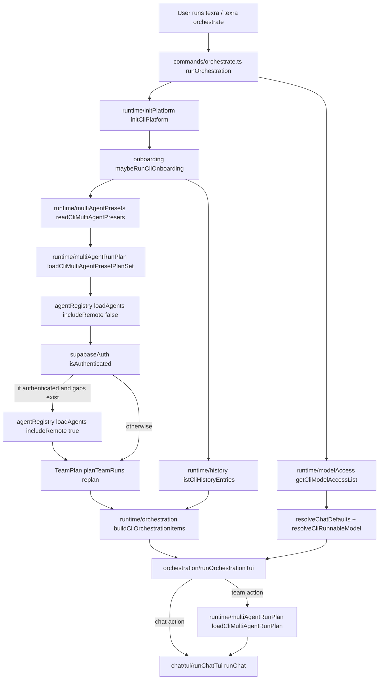
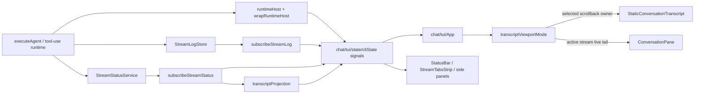
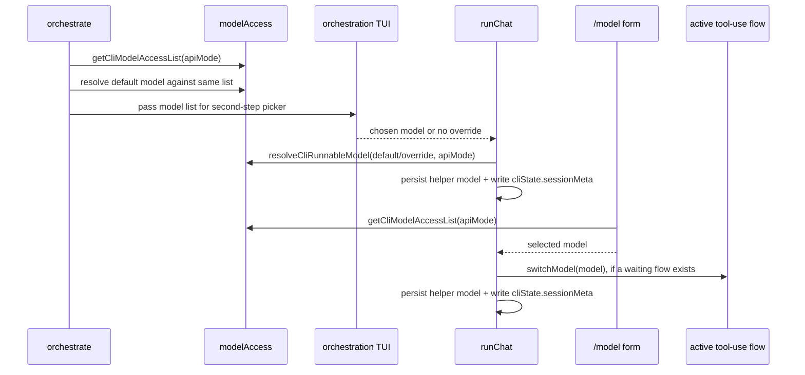
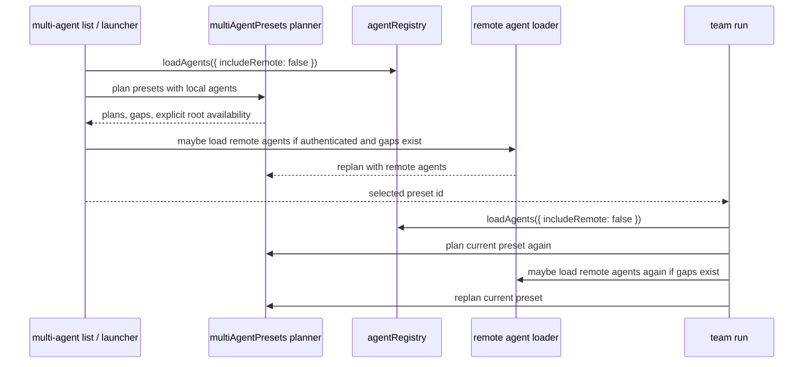
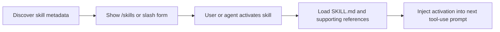

# CLI Runtime Round Trips

This note maps the current CLI startup, model/team selection, and chat TUI
rendering paths. The goal is to make ownership and repeated work visible before
refactoring the CLI further.

## Startup And Selection

Current ownership:

- Terminal interactivity:
  `commands/orchestrate.ts` and `chat/tui/runChatTui.tsx`.
  Both entry points enforce TTY before mounting Ink.
- First-run auth onboarding:
  `commands/orchestrate.ts` and `chat/tui/runChatTui.tsx`.
  The launcher can run onboarding, then a selected chat runs the same gate again.
- Team availability:
  `runtime/multiAgentRunPlan.ts` plus `runtime/multiAgentPresets.ts`.
  List, inspect, and run all use the same planner, but launch replans after selection.
- Agent registry load scope:
  `agentRegistry.loadAgents()` call sites.
  Local-only for list/display, remote reload only when authenticated and gaps exist.
- Model availability:
  `runtime/modelAccess.ts`.
  The launcher, `/model`, and chat startup share this module, but can each load the model list.
- Initial root agent/model defaults:
  `runtime/chatDefaults.ts`.
  Resolves workspace, user, history, then built-in defaults.

## Chat TUI Runtime

The transcript path intentionally has two render modes:

- Static scrollback owner:
  The active viewport selects exactly one stream to feed `<Static>`. Root focus
  owns root history; focused child streams temporarily own their own finalized
  history so native terminal scrollback contains that child transcript.
- Live tail:
  `ConversationPane` always renders only pending entries from the active stream.
  It does not render finalized history. Root focus bounds this pending tail so
  the input stays pinned; focused child streams allow pending output to overflow
  into native terminal scrollback so a running child transcript can be reviewed
  before it finalizes.

That means a focused-child tab should not read parent entries through either
renderer. If parent output remains visible after focus changes, the likely root
is scrollback-owner reset/repaint behavior, not direct child slice selection.

## Model Selection Round Trips

The model filter itself is shared, which is good. The repeated work is around
loading/reconciling the same `apiMode + selected model` pair at launcher,
chat-start, submit-time, and `/model` form time.

## Team Planning Round Trips

The local CLI shows built-in teams as unavailable without account-served
orchestrators. Local specialists such as `lean`, `research`, and `numerics`
remain visible as available members, but they are not promoted to team roots.
That keeps list, launcher, and run output aligned: a built-in team either has a
delegating orchestrator root or reports that no runnable team root is available.

## Skills Protocol Implication

Current public SKILL.md conventions treat a skill package as a `SKILL.md` file
plus optional supporting files, with full instructions loaded only when the
agent needs that workflow. TeXRA's CLI should keep the startup path metadata-only:

This argues against routing skill bodies through launcher, model selection, or
team planning. Startup should need only names, descriptions, and availability.

## Refactor Targets

- Launcher-to-chat preflight:
  `orchestrate` and `runChat` both run platform/onboarding/model checks.
  Introduce a small `CliInteractivePreflight` result that standalone chat can compute
  and launcher can pass through.
- Team plan reload:
  Listing builds a plan set, then selected team launch replans by preset id.
  Return a `CliMultiAgentPlanSnapshot` from the planner and let launch validate or
  reuse it unless registry/auth state changed.
- Model selection ownership:
  Root model paths now use `selectCliRootModel` for API-mode-aware runnable
  resolution plus helper-model persistence. Keep candidate precedence
  entrypoint-specific (`chat` defaults, headless `run`, resume history), but do
  not reintroduce direct resolve-and-persist pairs outside the runtime helper.
- Stream status lookup:
  `subscribeStreamStatus` mirrors `StreamStatusService` events into `StreamSlice`
  once, including retained parent child rows. TUI routing and rendering should
  read status from that normalized stream map, keeping the service as an input
  source rather than a UI/session fallback.
- Transcript viewport repaint:
  `App` detects root/scoped changes and `runChatTui` wires them to
  `render/tuiViewportController`. Keep repaint options and SIGCONT clear-repaint
  policy in that render controller, not in state or the session entrypoint.
- Slash command dispatch:
  `runChatTui` now delegates slash commands to the command layer, but
  `handleTuiSlashCommand` still owns a large switch with special cases. Move
  command handlers into the registry incrementally so the command layer becomes
  data-driven.
- Skills startup:
  Skills should be discoverable without injecting bodies into every tool-use prompt.
  Keep discovery metadata cached; load `SKILL.md` only on activation for the next message.

## Suggested Order

1. Normalize stream status ownership first. It is small and directly helps
   subagent display/debuggability.
2. Extract model selection ownership next. It addresses startup model selection
   and `/model`.
3. Consolidate team planning after that. It is higher blast radius because it
   touches local/remote agent loading and multi-agent launch semantics.
