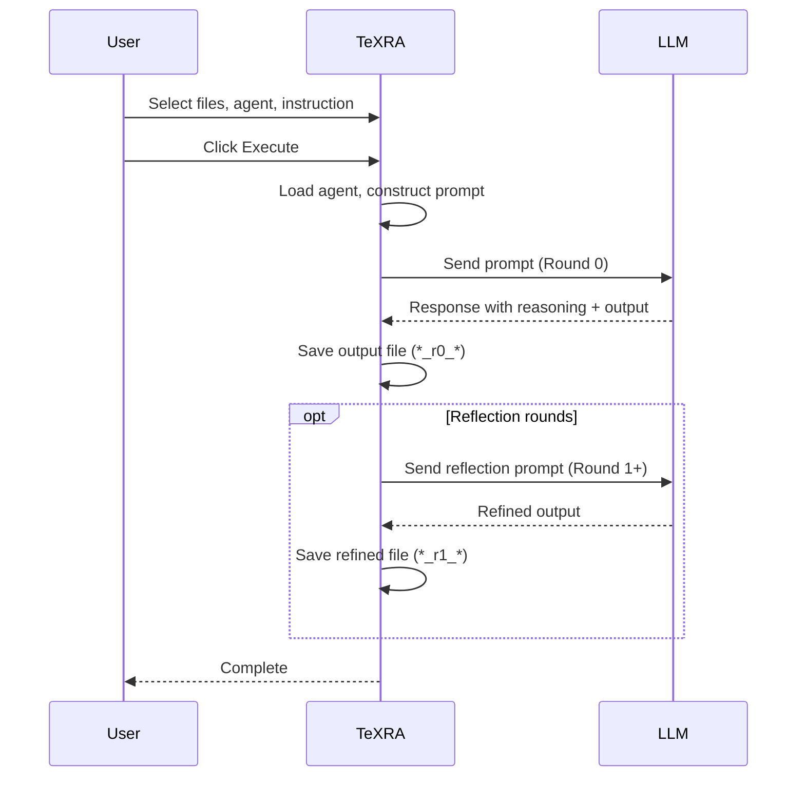
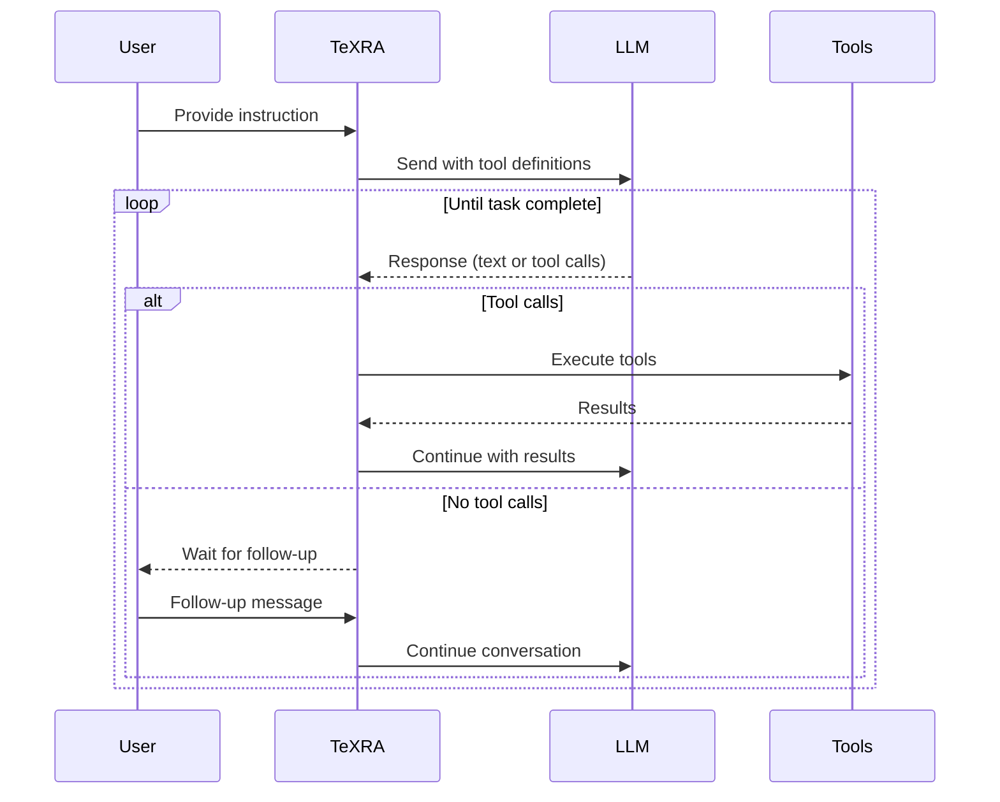

# Agent Architecture

TeXRA agents are recipes for instructing large language models to perform academic research tasks. Each agent is defined in a YAML file that specifies its behavior, prompts, and settings.

## Agent Categories

| Category | Agent Types | Best For |
|----------|-------------|----------|
| **Workflow** | `CoT`, `direct` | Structured document transformations with predictable outputs |
| **ToolUse** | `toolUse` | Interactive research tasks requiring external tools |

### Workflow Agents

Run for a predetermined number of rounds and produce structured output files.

- **CoT (Chain-of-Thought)**: Multi-round agents that reason step-by-step using `<scratchpad>`, then refine output through reflection. Default: 2+ rounds.
- **Direct**: Single-pass agents for quick transformations. Default: 1 round.

### Tool-Use Agents

Run interactive sessions where the model calls external tools (file operations, web search, code execution) and waits for follow-up messages. Sessions persist and can be resumed.

## Agent Definition Files

Each agent's behavior is defined in a YAML file with two main parts:

**Settings** define operational parameters:
- `agentType`: `CoT`, `direct`, or `toolUse`
- `prefills`: Text the agent starts its response with (workflow only)
- `tools`: Array of tool definitions (tool-use only)

**Prompts** contain templates filled with your context:
- `systemPrompt`: Role and high-level instructions
- `userPrefix`: Main context including input files (`{{ INPUT_CONTENT }}`) and your instruction (`{{ INSTRUCTION }}`)
- `userRequest`: The task request. For workflow agents, multiple entries enable reflection rounds.

See [Custom Agents](./custom-agents.md) for full details on creating agent definitions.

## How Execution Works

### Workflow Agents

If output gets cut off by token limits, TeXRA automatically sends a continuation prompt.

### Tool-Use Agents

Sessions persist and can be resumed after VS Code restarts.

## Summary

| Aspect | Workflow Agents | Tool-Use Agents |
|--------|-----------------|-----------------|
| **Rounds** | Fixed (1 for Direct, 2+ for CoT) | Dynamic |
| **Output** | Structured files (`_r0_`, `_r1_`) | Conversational |
| **Session** | Single execution | Persistent, resumable |
| **Use Case** | Document transformation | Interactive research |

See [Built-in Agents](./built-in-agents.md) for examples.
