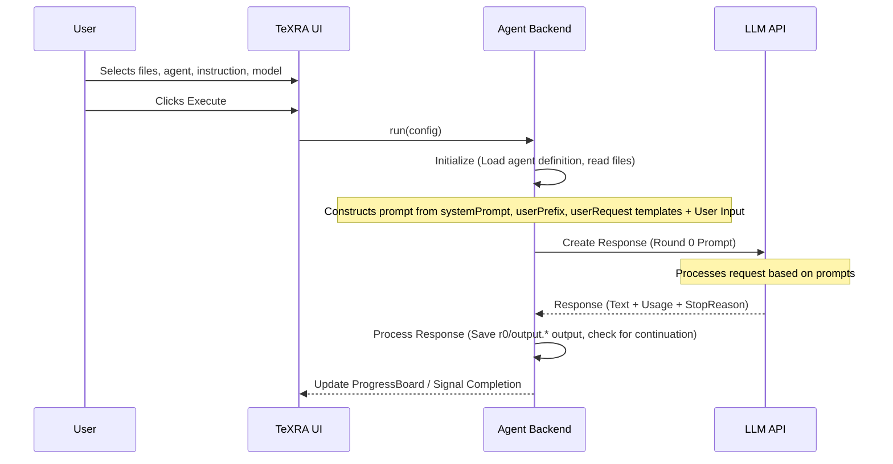

# Workflow Agents: How They Work

Every time you click "Execute" in TeXRA, an **agent** takes your files and instructions, asks an AI model to do the work, and delivers the result. This page explains what happens under the hood—enough to understand the system, customize it, and troubleshoot when things go sideways.

::: tip When to use workflow mode
Workflow agents are built for **deep, single-shot thinking**—things like rewriting a whole section, deriving or checking equations step-by-step, converting a paper to slides, or merging edits. They plan in a `<scratchpad>`, produce a full XML-wrapped output, and optionally reflect on it for another round, so runs with frontier reasoning models can take **10–30 minutes** to finish.

If you want a snappier turnaround (e.g. quick polishes, small corrections), pick a **smaller or faster model** in the model dropdown—output quality drops somewhat, but wall-clock time drops a lot. For short, conversational edits or read-only questions, use a **tool-use agent** (`assistant`, `research`, `review`) instead: those stream back in seconds and don't go through the full workflow pipeline.
:::

The `settings.agentCategory` key decides which of these two modes an agent runs in:

<AgentModesCompare />

Workflow agents reason once and write a versioned, diffable file; tool-use agents converse and call tools turn by turn—it is the first thing to pick for any task. The split maps one-to-one onto the CLI's two entry points: <code>texra run polish …</code> for workflow agents, <code>texra chat --agent research</code> for tool-use agents.

## Agent Definition Files (`.yaml`)

Each agent is defined in a simple `.yaml` file that tells TeXRA what to say to the AI model and how to handle the response. You can browse and manage these files from the **Agents** tab in the TeXRA Dashboard, or create your own (see [Custom Agents](./custom-agents.md)).

## Understanding the YAML Structure

These `.yaml` files have two main parts (and thankfully, YAML is usually less prickly than XML or JSON):

<AgentYamlHero />

A <code>settings</code> block defines how the agent runs; a <code>prompts</code> block holds the templates—a <code>userRequest</code> array drives Round 0 plus reflection rounds.

1.  **`settings`**: Define general operational parameters. For example:
    - `agentCategory`: Is it a `workflow` agent (structured Chain-of-Thought reasoning with XML-wrapped output) or a `toolUse` agent (interactive conversation that can call tools like file editing, web search, etc.)?
    - _(Other settings control output format, inheritance, etc. See [Configuration](./configuration.md) and [Custom Agents](./custom-agents.md) for full details)._
2.  **`prompts`**: Contain text templates that TeXRA fills with your specific context (input files, instructions) to guide the LLM at different stages:
    - `systemPrompt`: Sets the overall role and high-level instructions for the LLM.
    - `userPrefix`: Provides the main context, including your input file(s) (available via e.g., `{{ INPUT_CONTENT }}`) and the specific instruction you typed in the UI (available via `{{ INSTRUCTION }}`).
    - `userRequest`: Asks the LLM to perform the initial task (Round 0). Often instructs the LLM to think within `<scratchpad>` tags and then output the main content wrapped in the fixed `<documents>` container, with one `<document name="...">...</document>` entry per output file. You can also provide an **array** here: the first entry becomes the round 0 request, and any additional entries drive automatic reflection rounds (Round 1+). When a run consumes more rounds than entries you specify, the first reflection template is reused.

_(Prompts use Nunjucks templating (Jinja2-style syntax). For a detailed list of available variables like `{{ INPUT_CONTENT }}` and how to use them, see the [Custom Agents](./custom-agents.md) guide.)_

::: tip Transparency & Customization
The prompts described above (`systemPrompt`, `userPrefix`, etc.) represent TeXRA's structured approach to guiding the LLM. This structured, template-based system means the agent's behavior is transparent and highly customizable through the `.yaml` file, not a hidden black box.
:::

## Basic Execution Flow

When you click "Execute" in the TeXRA UI, TeXRA uses the selected agent's definition (`.yaml`) and your UI inputs to interact with the chosen LLM:

**Key Stages:**

1.  **Initialization:** TeXRA loads the agent definition and reads the files you selected.
2.  **Prompt Construction:** It combines the agent's `systemPrompt`, `userPrefix` (filled with your files and instruction), and `userRequest` templates into a full prompt for the LLM.
3.  **LLM Interaction (Round 0):** TeXRA sends the prompt to the selected LLM API. The LLM generates a response, typically including reasoning (`<scratchpad>`) and the final answer wrapped in the fixed `<documents><document name="...">...</document></documents>` container.
4.  **Processing:** TeXRA saves the raw LLM response (often as an `.xml` file internally, e.g., `r{round}/output.xml`). It then parses this file and extracts the content from each `<document name="...">` entry into its own file under the round directory in task storage, named after that entry's `name` (e.g., a single-document response lands at `r{round}/output.tex`, so Round 0 is `r0/output.tex` and the first reflection is `r1/output.tex`; additional `<document name="chapters/main.tex">` entries land alongside it as `r{round}/chapters/main.tex`, and so on). You can monitor this in the [ProgressBoard](./progress-board.md). For LaTeX files, TeXRA can also automatically generate a `latexdiff` file comparing each output to its input, enhancing observability. See the [LaTeX Diff guide](./latex-diff.md) for details.

Clicking **Execute** is not the only way in — the same
load-definition → prompt → rounds → save-to-run-storage pipeline runs
headlessly from the terminal:

<CliRunHero
  command="texra run polish --input paper.tex --output paper.polished.tex"
  :rounds="[
    { label: 'r0 — draft revision', state: 'done' },
    { label: 'r1 — reflection pass', state: 'done' },
  ]"
  :outputs="['paper.polished.tex']"
  note="Same agent definition, same rounds, same run storage — no UI attached."
/>

Each round lands in its own folder under task storage:

<RoundOutputTree />

Every round saves the raw <code>output.xml</code>, the extracted <code>output.tex</code>, and an optional <code>latexdiff</code> PDF—<code>r0/</code> is the draft; <code>r1/</code> and later are reflection passes.

**Continuation Handling:** If the LLM response gets cut off due to output token limits before generating the closing `</documents>` tag, TeXRA automatically sends a continuation prompt. This prompt asks the model to resume generating exactly where it left off, ensuring complete outputs even for very long tasks. This happens seamlessly within a processing round.

### What Goes Into the Prompt

TeXRA assembles a conversation from your agent's prompts and the content you selected in the UI. If you enabled **Attach TeX Count**, that information is included too. Figures and audio files are sent alongside the text for models that support them. The AI then reasons through the task and produces its output.

**Reflection Rounds (Round 1+):**

When an agent definition includes multiple `userRequest` entries (or increases `settings.rounds`), TeXRA automatically performs additional passes after Round 0 completes:

1.  **Reflection Prompt:** It renders the appropriate reflection template from subsequent `userRequest` entries to ask the LLM to critique and improve its own Round 0 output (which is included in the conversation history).
2.  **LLM Interaction (Round 1):** The LLM generates a revised response.
3.  **Processing:** TeXRA saves this refined output to a separate round path (`r{round}/output.ext`, e.g., `r1/output.ext` for the first reflection, `r2/output.ext` for the next).

You can control how many rounds execute by editing the agent YAML—either adjust `settings.rounds` for the maximum number of passes or add more entries to `userRequest`. The run stops early whenever the model signals it is finished or when no reflection prompt content is supplied.

This basic flow, potentially with the reflection rounds, allows TeXRA agents to perform targeted tasks based on their specific definitions and your instructions. For concrete examples of built-in agents, see the [Built-in Agent Reference](./built-in-agents.md).

::: warning Potential XML Issues
Occasionally, LLMs might generate slightly malformed XML (e.g., missing closing tags), especially with very long or complex outputs. If TeXRA fails to extract content from an agent's raw XML output (any round's `r{round}/output.xml`, e.g., `r0/output.xml`), you might need to manually inspect the `.xml` file and correct any structural errors (like adding a missing `</document>` tag) before TeXRA can process it correctly. See the [Troubleshooting guide](./troubleshooting.md#output-file-corruption) for more details.
:::

### Reflection

After generating an initial output (Round 0), TeXRA agents that define reflection prompts evaluate and refine their work (Round 1):

  

    <button type="button" class="pdf-tab active" data-pdf="/examples/draft_polish_r0_gemini25p_diff.pdf">Original vs. Round 0</button>
    <button type="button" class="pdf-tab" data-pdf="/examples/draft_polish_r1_gemini25p_diff.pdf">Original vs. Round 1</button>
    <button type="button" class="pdf-tab" data-pdf="/examples/draft_polish_r1_gemini25p_diffr1r0.pdf">Round 0 vs. Round 1</button>
  

  <iframe src="/examples/draft_polish_r1_gemini25p_diffr1r0.pdf" id="pdf-frame" class="reflection-pdf-frame"></iframe>
  <a href="/examples/draft_polish_r1_gemini25p_diffr1r0.pdf" target="_blank" id="pdf-link" class="reflection-pdf-link">View full example</a>

  
Red strikethrough: Round 0 content revised in Round 1

  
Blue underlined: New/improved content added in Round 1

