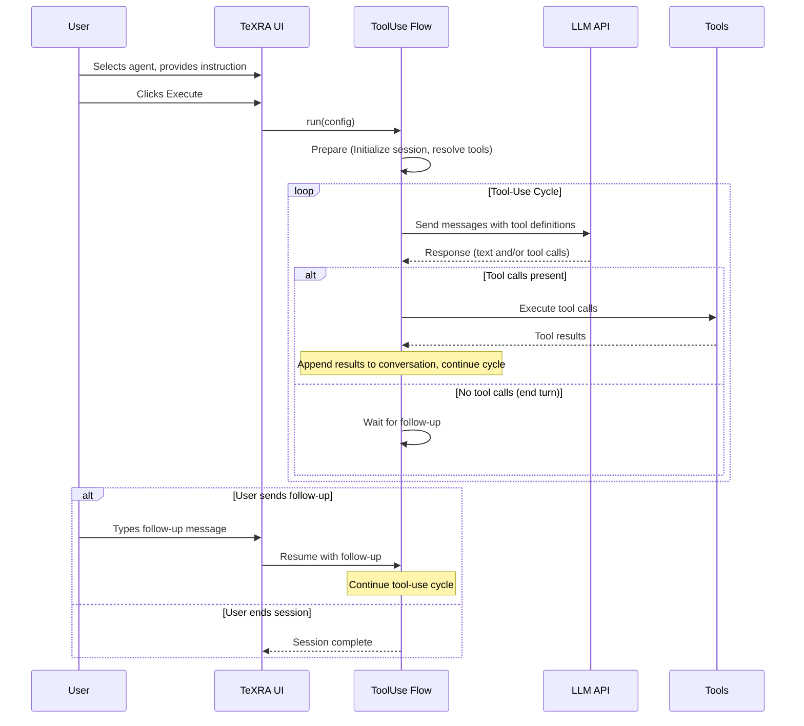

# How TeXRA Agents Work: An Overview

At its core, a TeXRA agent is a recipe for instructing a Large Language Model (LLM) to perform a specific academic research task. This guide provides a high-level overview of how these agents are defined and how they execute your requests.

## Agent Categories

TeXRA agents are organized into two categories, each designed for different use cases:

| Category | Agent Types | Best For |
|----------|-------------|----------|
| **Workflow** | `CoT` (Chain-of-Thought), `direct` | Structured document transformations with predictable outputs |
| **ToolUse** | `toolUse` | Interactive research tasks requiring external tools |

### Workflow Agents

Workflow agents run for a predetermined number of rounds and produce structured output files. They are ideal for document processing tasks like polishing, summarizing, or reviewing LaTeX papers.

- **CoT (Chain-of-Thought)**: Multi-round agents that "think" step-by-step using `<scratchpad>` reasoning, then refine their output through reflection rounds. Default: 2+ rounds with XML structure enforcement.
- **Direct**: Single-pass agents optimized for quick transformations with minimal overhead. Default: 1 round, XML structure only when scratchpad prefill is used.

### Tool-Use Agents

Tool-use agents run interactive sessions where the model can call external tools (file operations, web search, code execution, etc.) and wait for user follow-up messages. They continue looping until the task is complete or the user ends the session.

- **toolUse**: Interactive agents with tool-calling capabilities. Sessions persist across follow-up messages and can be resumed after interruption.

## Agent Definition Files (`.yaml`)

The core of TeXRA's agent definition lies in a combination of YAML for structure, Jinja2 for templating, and often XML within the prompts for guiding the LLM's output. Each agent's behavior is defined in a `.yaml` file located in the built-in or custom agent directories.

## Understanding the YAML Structure

These `.yaml` files have two main parts (and thankfully, YAML is usually less prickly than XML or JSON):

1.  **`settings`**: Define general operational parameters. For example:
    - `agentType`: Is it a complex `CoT` (Chain of Thought) agent that "thinks" step-by-step, a simpler `direct` agent, or a `toolUse` agent designed to call model-integrated tools?
    - `prefills`: Text the agent should automatically start its response with (e.g., `<scratchpad>`). _(Workflow agents only)_
    - `tools`: Array of tool definitions the agent can invoke. _(Tool-use agents only)_
    - _(Other settings control output format, inheritance, etc. See [Configuration](./configuration.md) and [Custom Agents](./custom-agents.md) for full details)._
2.  **`prompts`**: Contain text templates that TeXRA fills with your specific context (input files, instructions) to guide the LLM at different stages:
    - `systemPrompt`: Sets the overall role and high-level instructions for the LLM.
    - `userPrefix`: Provides the main context, including your input file(s) (available via e.g., `{{ INPUT_CONTENT }}`) and the specific instruction you typed in the UI (available via `{{ INSTRUCTION }}`).
    - `userRequest`: Asks the LLM to perform the initial task (Round 0). For workflow agents, you can provide an **array** here: the first entry becomes the round 0 request, and any additional entries drive automatic reflection rounds (Round 1+). When a run consumes more rounds than entries you specify, the first reflection template is reused.

_(Prompts use Jinja2 templating. For a detailed list of available variables like `{{ INPUT_CONTENT }}` and how to use them, see the [Custom Agents](./custom-agents.md) guide.)_

::: tip Transparency & Customization
The prompts described above (`systemPrompt`, `userPrefix`, etc.) represent TeXRA's structured approach to guiding the LLM. This structured, template-based system means the agent's behavior is transparent and highly customizable through the `.yaml` file, not a hidden black box.
:::

## Execution Flows

TeXRA uses different execution flows depending on the agent category. When you click "Execute" in the TeXRA UI, the system routes to the appropriate flow based on the `agentType` setting.

### Workflow Agent Execution (CoT and Direct)

Workflow agents use the **Reflection Flow**, which runs for a fixed number of rounds and produces structured output files:

**Key Stages:**

1.  **Initialization:** TeXRA loads the agent definition and reads the files you selected.
2.  **Prompt Construction:** It combines the agent's `systemPrompt`, `userPrefix` (filled with your files and instruction), and `userRequest` templates into a full prompt for the LLM.
3.  **LLM Interaction (Round 0):** TeXRA sends the prompt to the selected LLM API. The LLM generates a response, typically including reasoning (`<scratchpad>`) and the final answer wrapped in XML tags (e.g., `<document>...</document>`).
4.  **Processing:** TeXRA saves the raw LLM response (often as an `.xml` file internally). It then parses this file, extracts the content from the primary XML tag (defined by `settings.documentTag`), and saves _that extracted content_ to the final output file (e.g., `filename_agent_r0_model.tex`). You can monitor this in the [ProgressBoard](./progress-board.md). For LaTeX files, TeXRA can also automatically generate a `latexdiff` file comparing the output to the input, enhancing observability. See the [LaTeX Diff guide](./latex-diff.md) for details.

**Continuation Handling:** If the LLM response gets cut off due to output token limits before generating the required `endTag`, TeXRA automatically sends a continuation prompt. This prompt asks the model to resume generating exactly where it left off, ensuring complete outputs even for very long tasks. This happens seamlessly within a processing round.

### Tool-Use Agent Execution

Tool-use agents use the **ToolUse Run Flow**, which loops continuously until the task completes or the user ends the session:

**Key Stages:**

1.  **Prepare:** Initialize session state and resolve the available tools from the agent's `tools` configuration.
2.  **Cycle:** Send the conversation (including tool definitions) to the LLM. Process the response:
    - If the model requests tool calls, execute them and append results to the conversation, then continue the cycle.
    - If the model completes its turn without tool calls, move to the wait stage.
3.  **Wait:** Pause execution and wait for user follow-up. The session state is persisted, allowing the user to continue the conversation or end the session.
4.  **Resume/Complete:** If the user provides a follow-up message, append it to the conversation and return to the cycle stage. Otherwise, finalize the session.

**Session Persistence:** Tool-use agents automatically persist their state between cycles. If VS Code reloads or the session is interrupted, you can resume from the last checkpoint rather than starting over.

### Prompt Composition and Message Flow (Workflow Agents)

For workflow agents, TeXRA constructs the conversation by merging your agent's `systemPrompt`, the context-filled `userPrefix`, and the `userRequest`. Depending on settings, the extension may insert additional messages in between---for example the output of `texcount` when you enable **Attach TeX Count**, or encoded images and audio files selected in the file panel. The sequence is not a fixed "system-user-system" pattern: attachments can be inserted at any point before the LLM generates a single response containing `<scratchpad>` reasoning followed by the XML-wrapped output defined by `settings.documentTag`.

### PromptBuilder Utility (Workflow Agents)

Internally, TeXRA assembles these prompt segments through the `PromptBuilder` helper. The builder collects the agent's templates and rendered variables once and exposes focused methods:

- `buildInitialPrompts()` returns the trio of system, prefix, and request messages used for round 0.
- `buildUserRequest(round)` renders the appropriate request template for the supplied round, falling back to the first reflection template when later rounds are undefined.
- `getPrefill(round)` provides the prefill seed that is streamed to the assistant before each model turn.

### Reflection Rounds (Round 1+) - Workflow Agents Only

When a workflow agent definition includes multiple `userRequest` entries (or increases `settings.rounds`), TeXRA automatically performs additional passes after Round 0 completes:

1.  **Reflection Prompt:** It renders the appropriate reflection template from subsequent `userRequest` entries to ask the LLM to critique and improve its own Round 0 output (which is included in the conversation history).
2.  **LLM Interaction (Round 1):** The LLM generates a revised response.
3.  **Processing:** TeXRA saves this refined output to a separate file (e.g., `filename_agent_r1_model.ext`).

You can control how many rounds execute by editing the agent YAML---either adjust `settings.rounds` for the maximum number of passes or add more entries to `userRequest`. The run stops early whenever the model signals it is finished or when no reflection prompt content is supplied.

### Tool Execution (Tool-Use Agents Only)

Tool-use agents do not use the PromptBuilder or reflection rounds. Instead, they:

1. **Resolve tools** from the `settings.tools` array at session start
2. **Include tool definitions** in each API request, allowing the model to call them
3. **Execute tool calls** returned by the model and append results to the conversation
4. **Loop** until the model completes its turn without requesting more tools

The conversation grows organically through tool interactions rather than following a predetermined round structure. Each tool result is appended as a new message, and the model decides when the task is complete.

## Summary

Workflow agents (CoT, Direct) and tool-use agents serve different purposes:

| Aspect | Workflow Agents | Tool-Use Agents |
|--------|-----------------|-----------------|
| **Rounds** | Fixed (1 for Direct, 2+ for CoT) | Dynamic (loops until complete) |
| **Output** | Structured files (`_r0_`, `_r1_`, etc.) | Conversational with tool results |
| **Session** | Single execution | Persistent, resumable sessions |
| **Use Case** | Document transformation | Interactive research tasks |

For concrete examples of built-in agents, see the [Built-in Agent Reference](./built-in-agents.md).

::: warning Potential XML Issues (Workflow Agents)
Occasionally, LLMs might generate slightly malformed XML (e.g., missing closing tags), especially with very long or complex outputs. If TeXRA fails to extract content from a workflow agent's output (`_r0_*.xml` or `_r1_*.xml` file), you might need to manually inspect the `.xml` file and correct any structural errors (like adding a missing `</document>` tag) before TeXRA can process it correctly. See the [Troubleshooting guide](../reference/troubleshooting.md#output-file-corruption) for more details.
:::

### Reflection Example (Workflow Agents)

After generating an initial output (Round 0), workflow agents that define reflection prompts evaluate and refine their work (Round 1):

  

    <button type="button" class="pdf-tab active" data-pdf="/examples/draft_polish_r0_gemini25p_diff.pdf">Original vs. Round 0</button>
    <button type="button" class="pdf-tab" data-pdf="/examples/draft_polish_r1_gemini25p_diff.pdf">Original vs. Round 1</button>
    <button type="button" class="pdf-tab" data-pdf="/examples/draft_polish_r1_gemini25p_diffr1r0.pdf">Round 0 vs. Round 1</button>
  

  <iframe src="/examples/draft_polish_r1_gemini25p_diffr1r0.pdf" id="pdf-frame" class="reflection-pdf-frame"></iframe>
  <a href="/examples/draft_polish_r1_gemini25p_diffr1r0.pdf" target="_blank" id="pdf-link" class="reflection-pdf-link">View full example</a>

  
Red strikethrough: Round 0 content revised in Round 1

  
Blue underlined: New/improved content added in Round 1

