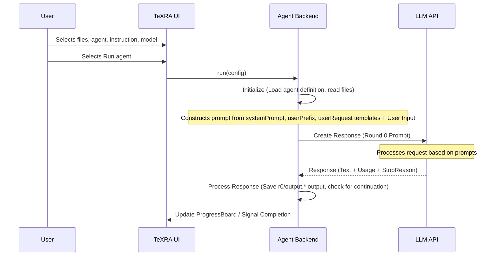

# Workflow agents: how they work

Every time you select **Run agent** in TeXRA, an **agent** takes your files and instructions, asks an AI model to do the work, and delivers the result. This page explains what happens underneath: enough to understand the system, customize it, and troubleshoot when a run goes wrong.

::: tip When to use workflow mode
Workflow agents are built for **deep, single-shot thinking**: deriving or checking equations step by step, rewriting a whole section, converting a paper to slides, or merging edits. They plan in a `<scratchpad>`, produce a full XML-wrapped output, and optionally reflect on it for another round, so runs with frontier reasoning models can take **10–30 minutes** to finish.

If you want a faster turnaround (quick polishes, small corrections), pick a **smaller or faster model** in the model dropdown: output quality drops somewhat, but wall-clock time drops a lot. For short, conversational edits or read-only questions, use a **tool-use agent** (`assistant`, `research`, `review`) instead: those stream back in seconds and skip the full workflow pipeline.
:::

The `settings.agentCategory` key decides which of these two modes an agent runs in:

<AgentModesCompare />

Workflow agents reason once and write a versioned, diffable file; tool-use agents converse and call tools turn by turn. This is the first thing to pick for any task. The split maps one-to-one onto the CLI's two entry points: <code>texra run polish …</code> for workflow agents, <code>texra chat --agent research</code> for tool-use agents.

## Agent definition files (`.yaml`)

Each agent is defined in a `.yaml` file that tells TeXRA what to say to the AI model and how to handle the response. Browse and manage these files from the **Agents** tab in the TeXRA Dashboard, or create your own (see [Custom agents](./custom-agents.md)).

## Understanding the YAML structure

These `.yaml` files have two main parts:

<AgentYamlHero />

A <code>settings</code> block defines how the agent runs; a <code>prompts</code> block holds the templates, and a <code>userRequest</code> array drives Round 0 plus reflection rounds.

1.  **`settings`**: Defines how the agent runs. For example:
    - `agentCategory`: `workflow` (structured chain-of-thought reasoning with XML-wrapped output) or `toolUse` (an interactive conversation that can call tools such as file editing and web search).
    - _(Other settings control output format, inheritance, and more. See [Configuration](./configuration.md) and [Custom agents](./custom-agents.md) for details.)_
2.  **`prompts`**: Text templates that TeXRA fills with your context (input files, instruction) to guide the LLM at each stage:
    - `systemPrompt`: Sets the overall role and high-level instructions for the LLM.
    - `userPrefix`: Provides the main context, including your input file(s) (available as `{{ INPUT_CONTENT }}`) and the instruction you typed in the UI (available as `{{ INSTRUCTION }}`).
    - `userRequest`: Asks the LLM to perform the initial task (Round 0). It often instructs the LLM to think within `<scratchpad>` tags and then output the main content wrapped in the fixed `<documents>` container, with one `<document name="...">...</document>` entry per output file. You can also provide an **array** here: the first entry becomes the Round 0 request, and any additional entries drive automatic reflection rounds (Round 1+). When a run uses more rounds than you have entries, the second entry (the first reflection template) is reused; an agent with a single entry reuses that Round 0 entry for every reflection round.

_(Prompts use Nunjucks templating (Jinja2-style syntax). For the list of available variables such as `{{ INPUT_CONTENT }}` and how to use them, read the [Custom agents](./custom-agents.md) guide.)_

::: tip Transparency & Customization
These prompts (`systemPrompt`, `userPrefix`, and the rest) are TeXRA's structured approach to guiding the LLM. Because the system is template-based, an agent's behavior is transparent and customizable through its `.yaml` file, not hidden in a black box.
:::

## Basic execution flow

When you select **Run agent** in the TeXRA UI, TeXRA uses the selected agent's definition (`.yaml`) and your UI inputs to call the chosen LLM:

**Key stages:**

1.  **Initialization:** TeXRA loads the agent definition and reads the files you selected.
2.  **Prompt construction:** TeXRA combines the agent's `systemPrompt`, `userPrefix` (filled with your files and instruction), and `userRequest` templates into a full prompt for the LLM.
3.  **LLM interaction (Round 0):** TeXRA sends the prompt to the selected LLM API. The LLM generates a response, typically including reasoning (`<scratchpad>`) and the final answer wrapped in the fixed `<documents><document name="...">...</document></documents>` container.
4.  **Processing:** TeXRA saves the raw LLM response (often as an `.xml` file, for example `r{round}/output.xml`). It then parses this file and extracts the content of each `<document name="...">` entry into its own file under the round directory in task storage, named after that entry's `name` (a polish run on `paper.tex` produces `r0/paper.tex` for Round 0 and `r1/paper.tex` for the first reflection; a `<document name="chapters/main.tex">` entry lands as `r{round}/chapters/main.tex`; only the raw response uses the fixed `output.xml` stem, and a document literally named `output.tex` is renamed `output_extracted.tex` so it cannot clobber it). You can follow this in the [ProgressBoard](./progress-board.md). For LaTeX files, TeXRA can also generate a `latexdiff` file comparing each output to its input. Read the [LaTeX Diff guide](./latex-diff.md) for details.

Selecting **Run agent** is not the only way in. The same
load-definition → prompt → rounds → save-to-run-storage pipeline runs
headlessly from the terminal:

<CliRunHero
  command="texra run polish --input paper.tex --output paper.polished.tex"
  :rounds="[
    { label: 'r0: draft revision', state: 'done' },
    { label: 'r1: reflection pass', state: 'done' },
  ]"
  :outputs="['paper.polished.tex']"
  note="Same agent definition, same rounds, same run storage: no UI attached."
/>

Each round lands in its own folder under task storage:

<RoundOutputTree />

Every round saves the raw <code>output.xml</code>, one extracted file per <code>&lt;document name&gt;</code> (named after the input file, for example <code>paper.tex</code>), and an optional <code>latexdiff</code> PDF. <code>r0/</code> is the draft; <code>r1/</code> and later are reflection passes.

**Continuation handling:** If the LLM response is cut off by output token limits before the closing `</documents>` tag, TeXRA sends a continuation prompt that asks the model to resume exactly where it left off, so even very long outputs arrive complete. This happens within the same processing round.

### What goes into the prompt

TeXRA assembles a conversation from your agent's prompts and the content you selected in the UI. If **Attach TeX Count** is on, that information is included too. Figures and audio files are sent alongside the text for models that support them. The model then reasons through the task and produces its output.

**Reflection rounds (Round 1+):**

Reflection runs by default: `settings.rounds` defaults to 2 (Round 0 plus one reflection round), and the total is max(`rounds`, number of `userRequest` entries). An agent with a single `userRequest` entry reuses it for the reflection round. To run only Round 0, set `settings.rounds: 1`, as `correct` and `merge` do. After Round 0 completes, each additional pass works like this:

1.  **Reflection prompt:** TeXRA renders the reflection template from the next `userRequest` entry to ask the LLM to critique and improve its own Round 0 output (which is included in the conversation history).
2.  **LLM interaction (Round 1):** The LLM generates a revised response.
3.  **Processing:** TeXRA saves the refined output to a separate round path (`r{round}/<name>`, e.g. `r1/paper.tex` for the first reflection, `r2/paper.tex` for the next).

Control how many rounds run by editing the agent YAML: adjust `settings.rounds` for the maximum number of passes, or add more entries to `userRequest`. The run stops early when the model signals it is finished or when no reflection prompt content is supplied.

This flow, with optional reflection rounds, lets TeXRA agents perform targeted tasks based on their definitions and your instructions. For examples of built-in agents, read the [Built-in agent reference](./built-in-agents.md).

::: warning Potential XML Issues
Occasionally an LLM generates slightly malformed XML (for example, a missing closing tag), especially for very long or complex outputs. If TeXRA fails to extract content from an agent's raw XML output (any round's `r{round}/output.xml`, for example `r0/output.xml`), open the `.xml` file and correct the structural error (such as adding a missing `</document>` tag); TeXRA can then process it. Read the [Troubleshooting guide](./troubleshooting.md#output-file-corruption) for details.
:::

### Reflection

After generating an initial output (Round 0), TeXRA agents that define reflection prompts evaluate and refine their work (Round 1):

  

    <button type="button" class="pdf-tab active" data-pdf="/examples/draft_polish_r0_gemini25p_diff.pdf">Original vs. Round 0</button>
    <button type="button" class="pdf-tab" data-pdf="/examples/draft_polish_r1_gemini25p_diff.pdf">Original vs. Round 1</button>
    <button type="button" class="pdf-tab" data-pdf="/examples/draft_polish_r1_gemini25p_diffr1r0.pdf">Round 0 vs. Round 1</button>
  

  <iframe src="/examples/draft_polish_r1_gemini25p_diffr1r0.pdf" id="pdf-frame" class="reflection-pdf-frame"></iframe>
  <a href="/examples/draft_polish_r1_gemini25p_diffr1r0.pdf" target="_blank" id="pdf-link" class="reflection-pdf-link">View full example</a>

  
Red strikethrough: Round 0 content revised in Round 1

  
Blue underlined: New/improved content added in Round 1

