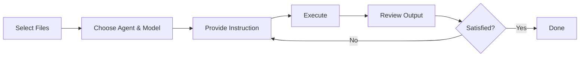

# Introduction to TeXRA

TeXRA is a VS Code extension that uses large language models to help academics with writing, research, and document processing. It is optimized for LaTeX documents, mathematical notation, and scholarly workflows.

<a href="https://marketplace.visualstudio.com/items?itemName=texra-ai.texra" target="_blank" style="display: inline-block; background-color: #007ACC; color: white; padding: 10px 15px; text-decoration: none; border-radius: 4px; font-weight: bold; margin: 10px 0;">Install from VS Code Marketplace</a>

## How It Works

## Key Features

### Workflow Agents

Structured document processing with optional self-reflection:

- **Correction and Polishing**: Fix errors, improve formatting, enhance clarity
- **Content Generation**: Create slides, posters, lecture notes from papers
- **Figure and Media**: Generate TikZ figures, OCR images, transcribe audio

### Tool-Use Agents

Interactive research collaboration:

- **Chat and Ask**: General-purpose assistants for research tasks
- **Search and Discuss**: Literature discovery, paper synthesis
- **Research**: Computational research with Wolfram Language
- **Lean**: Formal proof development with Lean 4

### LaTeX Integration

- TikZ figure extraction and creation
- LaTeX diff for version comparison
- Intelligent merging of document versions

### Research Tools

- Literature discovery via arXiv and Crossref
- Web search and content fetching
- Bibliography extraction and citation management

## Who Should Use TeXRA

- Researchers writing papers, grants, or reports
- Professors creating lecture notes or slides
- Students working on theses or dissertations
- Technical writers producing documentation with math

## Getting Started

- [Installation](/guide/installation): Set up TeXRA and dependencies
- [Quick Start](/guide/quick-start): Your first steps
- [Built-in Agents](/guide/built-in-agents): Reference for all agents
- [Configuration](/guide/configuration): Customize TeXRA

## Data Privacy

All API calls are made directly from your local VS Code to the provider's endpoint. Your documents and API keys are not sent to TeXRA servers. API keys are stored using VS Code's built-in Secret Storage.

Contact us at [contact@texra.ai](mailto:contact@texra.ai) if you find bugs.
