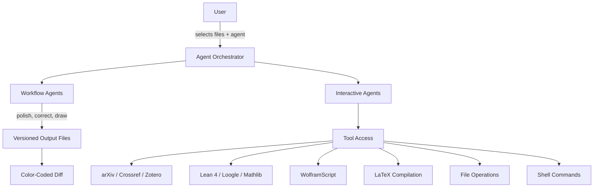

# Introduction

TeXRA is a multi-agent AI system for rigorous scientific work. Built as a VS Code extension, it orchestrates **specialized agents** — for literature search, manuscript drafting, figure generation, formal verification, symbolic computation, and result communication — and coordinates them through reproducible workflows where every output is auditable and every citation is grounded.

<a href="https://marketplace.visualstudio.com/items?itemName=texra-ai.texra" target="_blank" style="display: inline-block; background-color: #007ACC; color: white; padding: 10px 15px; text-decoration: none; border-radius: 4px; font-weight: bold; margin: 10px 0;">Install from VS Code Marketplace</a>

## Why multi-agent?

The gap between having a result and having a correct, publishable manuscript is where most research time goes. A 40-page paper where notation must be consistent from Definition 2.1 through Appendix C. A bibliography where every entry is real and every `\cite` key resolves. Commutative diagrams and Feynman diagrams that compile. A literature survey of a field where hundreds of papers appeared this year. A Lean formalization where the proof state needs careful tactic selection.

General-purpose AI tools make this worse, not better:

- **Hallucinated citations.** Without grounded search tools, models fabricate references — dangerous in peer-reviewed work, unacceptable in mathematics.
- **Lost structure.** Chatbots can't reason across theorem environments, `\label`/`\ref` graphs, BibTeX databases, and multi-file projects simultaneously.
- **No verification.** You get text output with no way to compile, diff, type-check, or audit what changed.
- **No tool access.** A single prompt can't search Mathlib by type signature, run a WolframScript computation, compile TikZ, and verify the result.

Scientific work needs a _system_ of agents — each specialized, each grounded in real tools, each producing verifiable output.

## The multi-agent approach

TeXRA solves this with a team of agents that share context and use tools:

### Two types of agents

**Workflow agents** (`polish`, `correct`, `draw`, `paper2slide`, `paper2poster`, `ocr`, `transcribe_audio`, `merge`) execute structured pipelines:

1. Analyze your input files and instructions
2. Plan and execute changes via LLM calls
3. Optionally reflect on their output and iterate
4. Produce task-scoped output files (`r0/output.*`, `r1/output.*`) with diffs

**Interactive agents** include `ask`, `research`, `review`, `lean`, and `presenter`, which operate conversationally with tool access:

- Read and edit files across your entire workspace
- Search arXiv, Crossref, and Zotero for references with verified BibTeX
- Search Mathlib by type signature (Loogle), inspect Lean proof states, check diagnostics
- Run WolframScript for symbolic and numerical computation
- Compile LaTeX and visually verify output
- Maintain persistent context across multi-turn conversations

### Design patterns

The agent system is built on three established AI design patterns:

1. **Reflection** — agents examine their own output to identify errors and inconsistencies, running multiple rounds when rigor demands it
2. **Tool use** — agents call external tools (compilers, Lean LSP, Loogle, WolframScript, search APIs, file systems) to ground their reasoning in verified data
3. **Planning** — agents break complex tasks into steps, execute them sequentially, and adapt based on intermediate results

## What you can do

| Task                 | Agent                         | How it works                                                                                                                                             |
| -------------------- | ----------------------------- | -------------------------------------------------------------------------------------------------------------------------------------------------------- |
| Polish a manuscript  | `polish`                      | Rewrites for clarity and precision, preserving all math environments and cross-references. Outputs a reviewable diff.                                    |
| Fix LaTeX errors     | `correct`                     | Finds and repairs compilation errors, notation inconsistencies, broken references, and formatting issues across multi-file projects.                     |
| Generate figures     | `draw`                        | Creates TikZ diagrams — commutative diagrams, Feynman diagrams, phase portraits, lattice structures. Compiles and visually verifies every figure.        |
| Search literature    | `research`                    | Queries arXiv, Crossref, Zotero. Returns verified citations with BibTeX — no hallucinated references.                                                    |
| Verify manuscript    | `review`                      | Systematically audits mathematical correctness, derivation soundness, notation consistency, and goal achievement.                                        |
| Work with Lean 4     | `lean`                        | Search Mathlib theorems via Loogle by type signature, inspect proof states, check diagnostics, manage builds and cache.                                  |
| Symbolic computation | `research`                    | Run WolframScript to evaluate integrals, check identities, simplify expressions, or verify numerical results.                                            |
| Build slide decks    | `presenter`                   | Reads your paper, drafts a Beamer deck that preserves logical structure — definitions before theorems, diagrams in TikZ. Compiles and checks every page. |
| General research     | `research`                    | Open-ended agent with full tool access for any research task.                                                                                            |
| Convert formats      | `paper2slide`, `paper2poster` | Transform papers into presentations or posters.                                                                                                          |

## Who uses TeXRA

- **Mathematicians** writing papers with complex theorem environments, maintaining notation consistency across long proofs, formalizing results in Lean 4
- **Theoretical physicists** managing multi-file manuscripts with extensive equation environments, Feynman diagrams, and large bibliographies
- **Computational scientists** producing papers that combine numerical methods, algorithm descriptions, convergence plots, and reproducible workflows
- **PhD students** maintaining consistency across thesis chapters, surveying literature in a new subfield, preparing seminar talks from written work
- **Research groups** collaborating on papers where every change needs to be traceable and auditable by co-authors and referees

## Privacy and data handling

All API calls go **directly from your machine** to the model provider you choose (Anthropic, OpenAI, Google, etc.). TeXRA does not operate intermediate servers. Your unpublished proofs, manuscripts, and API keys never leave your machine except to the provider endpoint.

API keys are stored in VS Code's built-in Secret Storage.

## Next steps

- [Installation](/guide/installation) — set up TeXRA and its dependencies
- [Desktop App](/guide/desktop) — install and configure the standalone desktop beta
- [Desktop Migration](/guide/desktop-migration) — move from the VS Code extension to the desktop app
- [Quick Start](/guide/quick-start) — your first agent run in under five minutes
- [Built-in Agents](/guide/built-in-agents) — the full catalog of available agents
- [Agent Architecture](/guide/agent-architecture) — how the multi-agent system works under the hood
- [Custom Agents](/guide/custom-agents) — build your own agents with YAML configuration

If you spot a bug, email [contact@texra.ai](mailto:contact@texra.ai) or open an issue on [GitHub](https://github.com/texra-ai/texra-issues).
