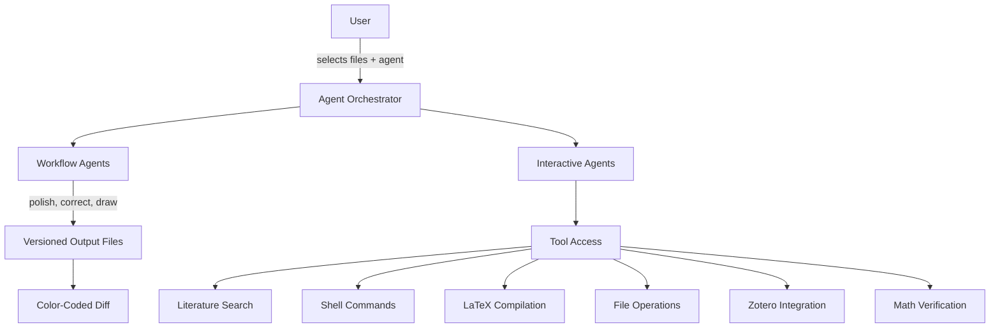

# Introduction

TeXRA is a multi-agent AI system for scientific discovery, built as a VS Code extension. Instead of a single chatbot, TeXRA orchestrates **specialized agents** — each designed for a distinct part of the research lifecycle — and coordinates them through reproducible workflows with full auditability.

<a href="https://marketplace.visualstudio.com/items?itemName=texra-ai.texra" target="_blank" style="display: inline-block; background-color: #007ACC; color: white; padding: 10px 15px; text-decoration: none; border-radius: 4px; font-weight: bold; margin: 10px 0;">Install from VS Code Marketplace</a>

## The problem

General-purpose AI tools fail researchers in specific ways:

- **Lost context.** Chatbots can't reason across multiple LaTeX files, figures, and bibliographies simultaneously.
- **Hallucinated citations.** Without grounded search tools, models fabricate references.
- **No verification.** You get text output with no way to diff, compile, or audit what changed.
- **One-shot responses.** A single prompt-response cycle can't handle multi-step scientific tasks like "polish my paper, then generate a diff, then compile."

## The multi-agent approach

TeXRA solves this with a team of agents that share context and use tools:

### Two types of agents

**Workflow agents** (`polish`, `correct`, `draw`, `paper2slide`, `paper2poster`) execute structured pipelines:
1. Analyze your input files and instructions
2. Plan and execute changes via LLM calls
3. Optionally reflect on their output and iterate
4. Produce versioned output files (`*_r0_*`, `*_r1_*`) with diffs

**Interactive agents** (`chat`, `search`, `research`, `presenter`) operate conversationally with tool access:
- Read and edit files in your workspace
- Search arXiv, Crossref, and Zotero for references
- Run shell commands and compile LaTeX
- Verify math with Wolfram Alpha
- Maintain persistent context across multi-turn conversations

### Design patterns

The agent system is built on three established AI design patterns:

1. **Reflection** — agents examine their own output to identify improvements, running multiple rounds when quality matters
2. **Tool use** — agents call external tools (compilers, search APIs, file systems) to ground their reasoning in real data
3. **Planning** — agents break complex tasks into steps, execute them sequentially, and adapt based on intermediate results

## What you can do

| Task | Agent | How it works |
|------|-------|-------------|
| Polish a paper | `polish` | Rewrites for clarity and flow, preserving all math. Outputs a reviewable diff. |
| Fix LaTeX errors | `correct` | Finds and repairs compilation errors, formatting issues, and inconsistencies. |
| Generate figures | `draw` | Creates TikZ diagrams from natural language. Compiles and visually verifies. |
| Search literature | `search` | Queries arXiv, Crossref, Zotero. Returns real citations with BibTeX. |
| Build slide decks | `presenter` | Reads your paper, drafts Beamer slides with TikZ, compiles and checks pages. |
| General research | `research` | Open-ended agent with full tool access for any research task. |
| Convert formats | `paper2slide`, `paper2poster` | Transform papers into presentations or posters. |

## Who uses TeXRA

- **AI researchers** writing NeurIPS/ICML papers with complex math and figures
- **Physicists** maintaining multi-file LaTeX projects with extensive bibliographies
- **Research engineers** producing technical documentation with reproducible workflows
- **PhD students** polishing theses and dissertations under deadline pressure
- **Research groups** collaborating on papers where every change needs to be auditable

## Privacy and data handling

All API calls go **directly from your machine** to the model provider you choose (Anthropic, OpenAI, Google, etc.). TeXRA does not operate intermediate servers. Your documents and API keys never leave your machine except to the provider endpoint.

API keys are stored in VS Code's built-in Secret Storage.

## Next steps

- [Installation](/guide/installation) — set up TeXRA and its dependencies
- [Quick Start](/guide/quick-start) — your first agent run in under five minutes
- [Built-in Agents](/guide/built-in-agents) — the full catalog of available agents
- [Agent Architecture](/guide/agent-architecture) — how the multi-agent system works under the hood
- [Custom Agents](/guide/custom-agents) — build your own agents with YAML configuration

If you spot a bug, email [contact@texra.ai](mailto:contact@texra.ai) or open an issue on [GitHub](https://github.com/texra-ai/texra-issues).
