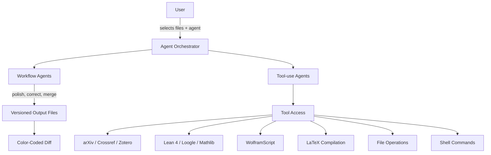

# TeXRA

An AI theorist for VS Code and the terminal. It attempts real theory
work — deriving results, checking derivations, formalizing proofs in
Lean 4 — and takes on open problems in long autonomous runs.

<GuideIntroHero />

A single task, split across three specialists in the Progress view — click a delegation to see what it produced.

## Get started

- [**Installation**](./installation.md) — VS Code extension or the `texra` CLI
- [**First run**](./first-run.md) — open a `.tex` file, watch one agent work
- [**Quick start**](./quick-start.md) — the longer walkthrough in VS Code

## Use it

| Task                                       | Workflow                                                      |
| ------------------------------------------ | ------------------------------------------------------------- |
| Tighten prose in a draft                   | [Polish a draft](./workflows/polish-a-draft.md)               |
| Fix LaTeX errors and notation              | `correct` agent — see [Built-in Agents](./built-in-agents.md) |
| Search literature, no fabricated citations | `assistant` — see [Research Tools](./research-tools.md)       |
| Verify proofs and derivations              | `review` — see [Built-in Agents](./built-in-agents.md)        |
| Formalize in Lean 4                        | [Lean 4 Proofs](./lean.md)                                    |
| Build slides from a paper                  | `paper2slide` — see [Built-in Agents](./built-in-agents.md)   |
| Generate TikZ figures                      | [TikZ Figures](./tikz-figures.md)                             |

## Understand the system

- [**Built-in Agents**](./built-in-agents.md) — the full catalog
- [**Agent Architecture**](./agent-architecture.md) — workflow vs. tool-use, reflection, planning
- [**Models**](./models.md) — picking a model for the job
- [**Custom Agents**](./custom-agents.md) — define your own in YAML

## Why multi-agent

The gap between a result and a publishable manuscript is where most
research time goes. A 40-page paper where notation must be consistent
from Definition 2.1 through Appendix C. A bibliography where every
`\cite` resolves to a real paper. Commutative diagrams that compile.
A Lean formalization where the proof state needs careful tactic
selection.

General-purpose chatbots make this worse, not better:

- **Hallucinated citations** — no grounded search means fabricated references.
- **Lost structure** — one prompt can't reason across theorem environments, `\label`/`\ref` graphs, BibTeX, and multi-file projects at once.
- **No verification** — text output with no way to compile, diff, or type-check what changed.
- **No tools** — no Mathlib search by type signature, no WolframScript, no TikZ compile.

TeXRA solves this by splitting the work across agents — each
specialized, each grounded in real tools, each producing verifiable
output.

## Two surfaces, one system

The VS Code extension and the `texra` CLI share the same agents, the
same sign-in, and the same run history. A run started in the CLI shows
up in the extension's Progress Board, and vice versa.

<RunParityHero />

One run, two surfaces: the same execution id lands in the terminal's output and the extension's Progress view.

TeXRA's agents come in two classes:

<AgentClasses />

Workflow agents run a structured pipeline and return a diff; tool-use agents work conversationally with grounded tools.

The system rests on three established AI design patterns: **reflection**
(agents critique their own output and iterate), **tool use** (agents
ground their reasoning in verified data from compilers, LSPs, and search
APIs), and **planning** (agents decompose tasks, execute steps, and
adapt to intermediate results).

## Who uses TeXRA

<FeatureCards
  min="220px"
  :cards="[
    {
      icon: 'book',
      title: 'Mathematicians',
      desc: 'Complex theorem environments, notation consistency across long proofs, Lean 4 formalization.',
    },
    {
      icon: 'bolt',
      title: 'Theoretical physicists',
      desc: 'Multi-file manuscripts with heavy equation environments, Feynman diagrams, large bibliographies.',
    },
    {
      icon: 'chart-line',
      title: 'Computational scientists',
      desc: 'Numerical methods, algorithm descriptions, convergence plots, reproducible workflows.',
    },
    {
      icon: 'graduation-cap',
      title: 'PhD students',
      desc: 'Thesis chapters with consistent notation, literature surveys in new subfields, talks from written work.',
    },
    {
      icon: 'users',
      title: 'Research groups',
      desc: 'Collaborations where every change is traceable and auditable by co-authors and referees.',
    },
  ]"
/>

## Privacy and data handling

**Bring-your-own-key mode.** API calls go directly from your machine
to the model provider you chose. TeXRA does not sit between you and
the provider. Your unpublished proofs, manuscripts, and API keys
never leave your machine except to the provider endpoint.

**Provider subscriptions** (ChatGPT, Grok, Kimi Code, GLM Coding Plan).
Requests still go straight from your machine to that provider — ChatGPT
and Grok via OAuth sign-in, Kimi Code and the GLM Coding Plan via a
plan-specific key. Connect one from the **Dashboard → Subscriptions** tab
(VS Code extension), or with `texra auth chatgpt login` / `/api` in the
CLI.

API keys, whichever mode you use, stay on your machine — VS Code's
built-in Secret Storage in the extension, an owner-only `secrets.json`
under `~/.texra` for the CLI. They can also be supplied via environment
variables or a `.env` file in your project (extension only).

## Support

Issues and feature requests: [GitHub](https://github.com/texra-ai/texra-issues).
Contact: [contact@texra.ai](mailto:contact@texra.ai).
