# PocketFlow Design Principles Analysis

This document analyzes how TeXRA follows PocketFlow design principles and identifies areas for improvement.

## Core PocketFlow Design Principles

### Principle 1: Separation of Concerns (prep → exec → post)

The fundamental pattern is a three-stage lifecycle:

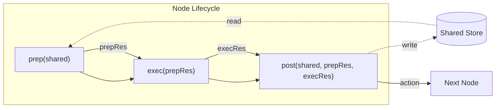

**Key Constraints:**
| Stage | Reads | Writes | Purpose |
|-------|-------|--------|---------|
| `prep` | shared | - | Extract data for computation |
| `exec` | prepRes only | - | Pure computation (LLM calls, APIs) |
| `post` | shared, prepRes, execRes | shared | Side effects, state updates |

### Principle 2: Graph + Shared Store Model

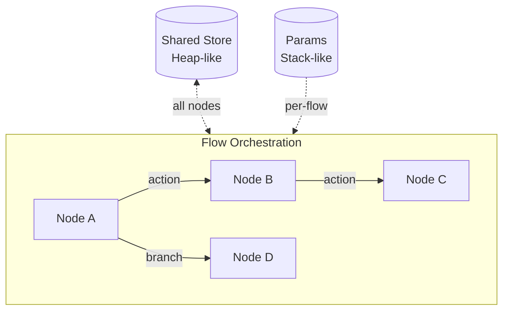

**Communication Patterns:**
- **Shared Store**: Global mutable state (heap), nodes read in `prep`, write in `post`
- **Params**: Immutable per-node config (stack), set by parent flow

### Principle 3: Retry as Built-in Concern

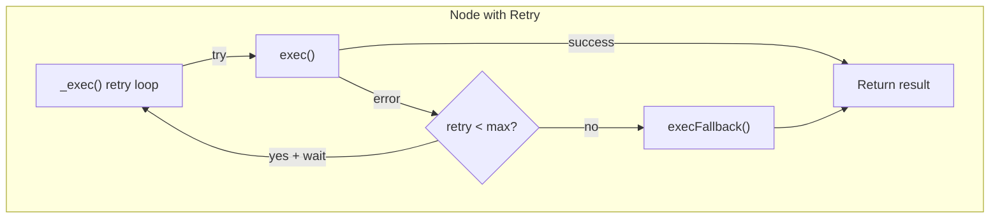

### Principle 4: Services Pattern

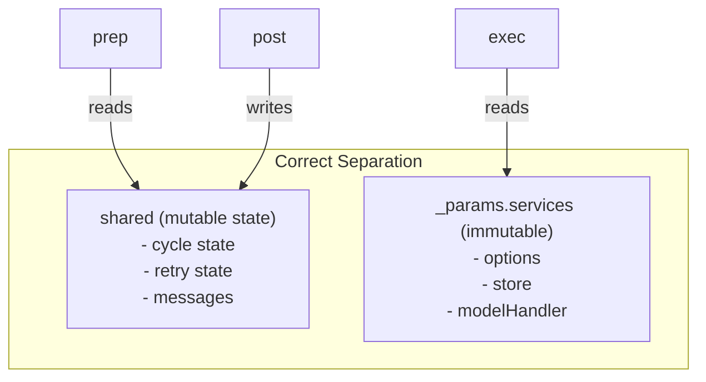

---

## TeXRA Compliance Analysis

### What TeXRA Does Well

#### 1. Services Pattern Implementation
TeXRA correctly separates mutable state (`shared`) from immutable services (`_params.services`):

```typescript
// Good: ResponseCycleShared separates concerns
interface ResponseCycleShared<C> {
  state: ResponseCycleState;      // Mutable runtime state
  retryState: RetryState;         // Mutable retry tracking
}

// Good: Services passed via params
interface ResponseCycleParams<C> {
  services: ResponseCycleServices<C>;  // Immutable
}
```

#### 2. Clear Flow Transitions
TeXRA uses an enum for transitions, making flow logic explicit:

```typescript
// Good: Explicit transition names
export enum FlowTransition {
  COMPLETE = 'complete',
  CONTINUE = 'continue',
  FINALIZE = 'finalize',
  AWAIT_RETRY = 'await_retry',
  MANUAL_RETRY = 'manual_retry',
}
```

#### 3. Built-in Retry with Fallback
`ResponseModelInvocationNode` correctly extends `Node` for automatic retry:

```typescript
// Good: Leverages PocketFlow retry
class ResponseModelInvocationNode<C> extends Node<...> {
  constructor() {
    const config = getNodeRetryConfig();
    super(config.maxRetries, config.wait);  // Built-in retry
  }

  async execFallback(...): Promise<...> {
    // Graceful degradation
  }
}
```

---

### Areas Violating PocketFlow Principles

#### Violation 1: `exec()` Accessing Shared State

**Principle**: `exec()` should ONLY use `prepRes`, never access `shared`.

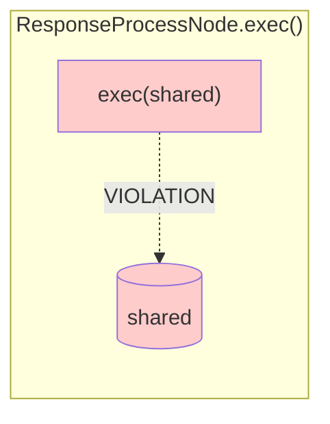

**Current Code (ResponseProcessNode, lines 444-563):**
```typescript
async exec(shared: ResponseCycleShared<C>): Promise<ProcessNodeResult> {
  const { options, store } = this._params.services;
  const { state } = shared;  // VIOLATION: accessing shared in exec
  if (state.shouldStop || !state.responseObject) { ... }
```

**Affected Nodes:**
| Node | File:Line | Issue |
|------|-----------|-------|
| `ResponseProcessNode` | ResponseCycleFlow.ts:444 | `exec()` receives and reads `shared` |
| `ResponseContinuationNode` | ResponseCycleFlow.ts:696 | `exec()` receives and reads `shared` |
| `ToolUseProcessNode` | ToolUseCycleFlow.ts:445 | `exec()` receives and reads `shared` |
| `ToolUseDispatchNode` | ToolUseCycleFlow.ts:644 | `exec()` receives and reads `shared` |

**Impact**:
- Breaks isolation - `exec()` should be a pure function
- Makes retries potentially non-idempotent
- Harder to test in isolation

#### Violation 2: `prep()` Returning Entire Shared Object

**Principle**: `prep()` should extract ONLY the data needed by `exec()`.

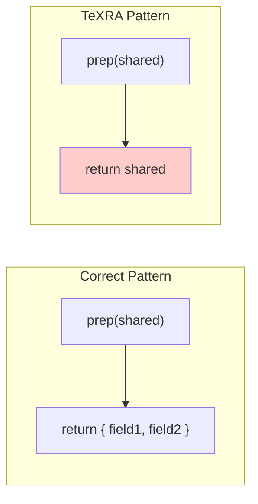

**Current Code:**
```typescript
// ResponseProcessNode.prep() - line 440
async prep(shared: ResponseCycleShared<C>): Promise<ResponseCycleShared<C>> {
  return shared;  // VIOLATION: returns entire shared object
}
```

**Correct Pattern Would Be:**
```typescript
async prep(shared: ResponseCycleShared<C>): Promise<{
  shouldStop: boolean;
  responseObject: unknown;
  responseTime?: number;
}> {
  const { state } = shared;
  return {
    shouldStop: state.shouldStop,
    responseObject: state.responseObject,
    responseTime: state.responseTime,
  };
}
```

#### Violation 3: Side Effects in `exec()`

**Principle**: `exec()` is for pure computation; side effects belong in `post()`.

**Current Code (ToolUseProcessNode.exec(), lines 445-572):**
```typescript
async exec(shared: ToolUseCycleShared<C>): Promise<...> {
  // ...
  store.round.addResponseTime(state.responseTime);  // SIDE EFFECT
  store.round.setNormalizedUsage(normalizedUsage);  // SIDE EFFECT
  store.workspace.assembly.updateLastResponse(text); // SIDE EFFECT
  // ...
}
```

**Side Effects Found in `exec()`:**
| Node | Side Effect | Should Be In |
|------|-------------|--------------|
| `ToolUseProcessNode` | `store.round.addResponseTime()` | `post()` |
| `ToolUseProcessNode` | `store.round.setNormalizedUsage()` | `post()` |
| `ToolUseProcessNode` | `store.workspace.assembly.updateLastResponse()` | `post()` |
| `ResponseProcessNode` | `store.round.setNormalizedUsage()` | `post()` |

---

## Compliance Summary Diagram

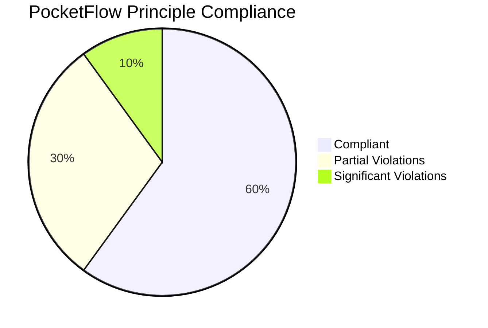

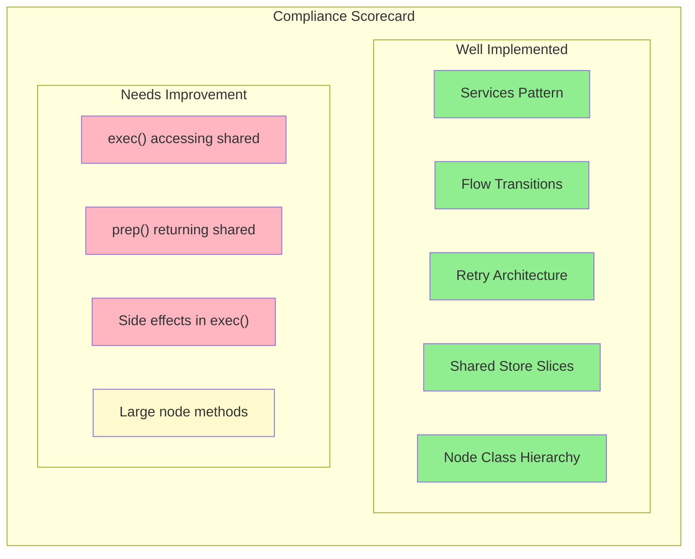

---

## Recommendations for Better Compliance

### 1. Strict prep/exec/post Separation

**Refactor `ResponseProcessNode`:**

```typescript
// BEFORE (violates principles)
async prep(shared) { return shared; }
async exec(shared) { /* reads shared, has side effects */ }

// AFTER (compliant)
interface ProcessPrepResult {
  shouldStop: boolean;
  responseObject: unknown;
  responseTime?: number;
  messages: ProviderMessage[];
  outputLocation: AgentFileLocation;
}

async prep(shared: ResponseCycleShared<C>): Promise<ProcessPrepResult> {
  const { state } = shared;
  return {
    shouldStop: state.shouldStop,
    responseObject: state.responseObject,
    responseTime: state.responseTime,
    messages: state.messages,
    outputLocation: state.outputLocation!,
  };
}

async exec(prepRes: ProcessPrepResult): Promise<ProcessNodeResult> {
  if (prepRes.shouldStop || !prepRes.responseObject) {
    return { skipped: true };
  }
  // Pure computation - no shared access, no store mutations
  // Return data; let post() handle side effects
}

async post(shared, prepRes, execRes): Promise<string | undefined> {
  // All side effects here
  const { store } = this._params.services;
  store.round.addResponseTime(execRes.responseTime);
  store.round.setNormalizedUsage(execRes.normalizedUsage);
  // ...
}
```

### 2. Create Typed PrepResult Interfaces

For each node, define explicit prep result types:

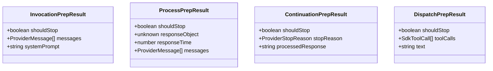

### 3. Move Side Effects to `post()`

**Principle**: All state mutations happen in `post()`. This makes retry safe.

```typescript
// Pattern: exec() returns data, post() applies it
async exec(prepRes): Promise<{
  normalizedUsage: NormalizedUsage;
  lastResponse: string;
  // ... other computed values
}> {
  // Pure computation only
  return { normalizedUsage, lastResponse };
}

async post(shared, prepRes, execRes): Promise<string> {
  const { store } = this._params.services;
  // Safe to apply side effects here (outside retry loop)
  store.round.setNormalizedUsage(execRes.normalizedUsage);
  store.workspace.assembly.updateLastResponse(execRes.lastResponse);
  return undefined;
}
```

### 4. Consider Smaller, Focused Nodes

The current `ResponseProcessNode` and `ToolUseDispatchNode` do many things. Consider splitting:

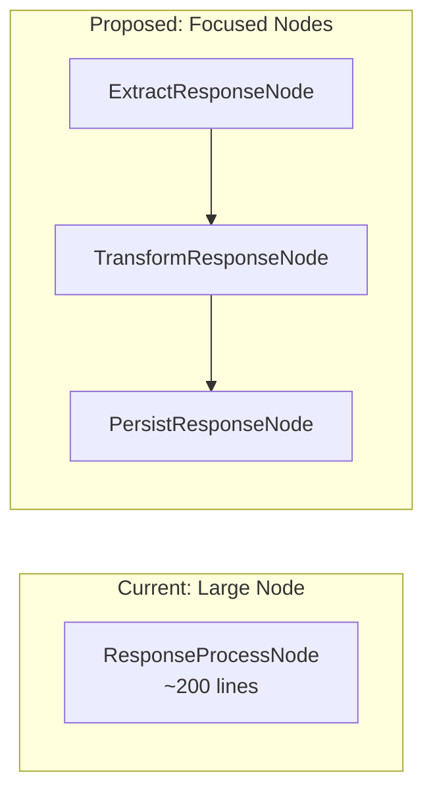

---

## Architecture Diagram: Current vs Ideal

### Current Architecture

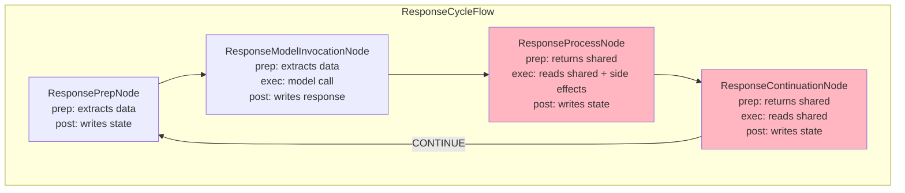

### Ideal Architecture

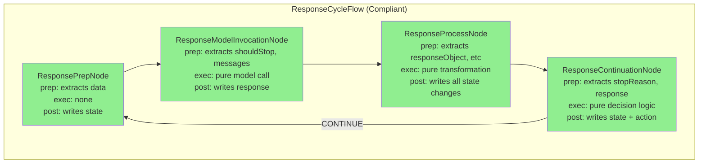

---

## Summary: Action Items

| Priority | Issue | Fix |
|----------|-------|-----|
| High | `exec()` accessing `shared` | Refactor to only use `prepRes` |
| High | Side effects in `exec()` | Move all mutations to `post()` |
| Medium | `prep()` returning `shared` | Extract specific fields needed |
| Low | Large node methods | Consider splitting into focused nodes |

By following these recommendations, TeXRA will achieve:
1. **Testability**: `exec()` becomes a pure function
2. **Retry Safety**: Side effects only in `post()`, after retry loop
3. **Clarity**: Clear data flow through node lifecycle
4. **Maintainability**: Smaller, focused nodes easier to modify
