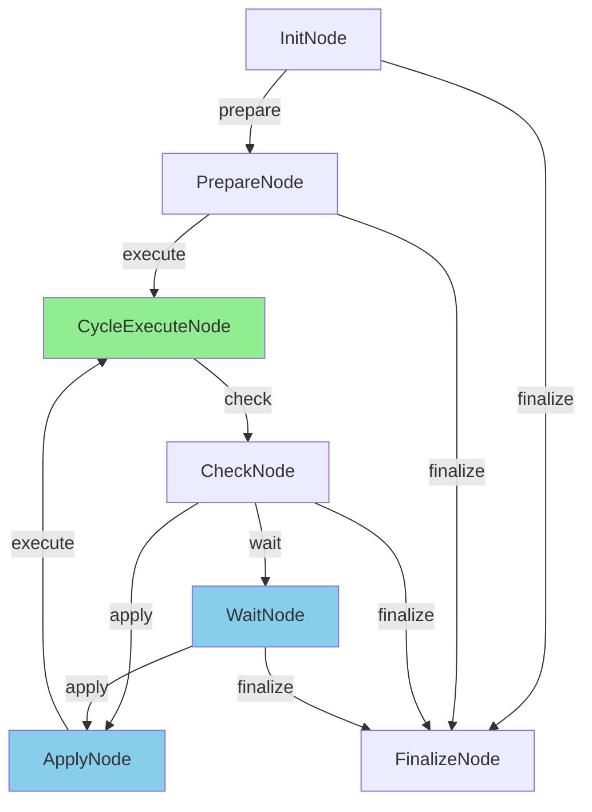

# PocketFlow Abstraction Refactoring Plan

## Current State Analysis

### Dependency Graph

```
                    ┌─────────────────────────────────────┐
                    │          Agent Consumers            │
                    │  DirectAgent, CoTAgent, MergeAgent  │
                    │         BaseToolUseAgent            │
                    └──────────────┬──────────────────────┘
                                   │
                    ┌──────────────▼──────────────────────┐
                    │       BaseReflectionAgent           │
                    │       BaseToolUseAgent              │
                    │   (executeAgentRunFlow method)      │
                    └──────────────┬──────────────────────┘
                                   │
                    ┌──────────────▼──────────────────────┐
                    │         BaseAgent                   │
                    │     runAgentFlow() entry point      │
                    └──────────────┬──────────────────────┘
                                   │
        ┌──────────────────────────┼──────────────────────────┐
        │                          │                          │
        ▼                          ▼                          ▼
┌───────────────────┐  ┌───────────────────┐  ┌───────────────────┐
│ ReflectionRunFlow │  │  ToolUseRunFlow   │  │   Common Infra    │
│  (225 lines)      │  │   (267 lines)     │  │   (~600 lines)    │
└────────┬──────────┘  └────────┬──────────┘  └───────────────────┘
         │                      │                      │
         │                      │      ┌───────────────┴───────────────┐
         │                      │      │ createAgentRunFlow            │
         │                      │      │ buildRunFlow                  │
         │                      │      │ AgentInitNode                 │
         │                      │      │ createFinalizeNode            │
         │                      │      │ lifecycle (5 funcs)           │
         │                      │      │ nodeExecution (2 funcs)       │
         │                      │      │ types, schemas                │
         │                      │      └───────────────────────────────┘
         │                      │
         │                      ▼
         │              ┌───────────────────┐
         │              │  ToolUseCycleFlow │  ◄── GOOD: Real PocketFlow
         │              │   (939 lines)     │
         │              └───────────────────┘
         │
         ▼
┌───────────────────┐
│ ResponseCycleFlow │  ◄── GOOD: Real PocketFlow
│   (878 lines)     │
└───────────────────┘
```

### Risk Assessment

| Factor | Status |
|--------|--------|
| Test Coverage | ❌ **None** - High risk |
| Consumers | 4 agent implementations |
| CycleFlows | ✅ Keep - properly designed |
| RunFlows | ❌ Refactor - hook orchestrators |
| Shared Infra | ⚠️ Simplify - over-engineered |

---

## Guiding Principles

### 1. Don't Break What Works
- **CycleFlows are good** - ResponseCycleFlow and ToolUseCycleFlow are proper PocketFlow
- Keep them, only fix prep/exec/post violations within them

### 2. Incremental Refactoring
- No big bang rewrite
- Each phase should leave the codebase working
- Can be merged independently

### 3. Accept Differences
- Reflection and ToolUse agents are fundamentally different
- Stop trying to make them share "generic" infrastructure
- Duplication is better than wrong abstraction

### 4. Logic in Nodes, Not Hooks
- Current: Nodes call hooks, hooks contain logic
- Target: Nodes contain logic, hooks are minimal callbacks

---

## Phase 1: Add Test Coverage (Prerequisite)

**Goal**: Create safety net before refactoring.

### 1.1 Integration Tests for Agent Execution

```typescript
// test/agent/flows/ReflectionFlow.test.ts
describe('ReflectionRunFlow', () => {
  it('executes single round and finalizes', async () => {
    const mockAgent = createMockReflectionAgent({ totalRounds: 1 });
    const flow = createReflectionRunFlow();
    await flow.run(createShared(mockAgent));
    expect(mockAgent.executeCurrentRound).toHaveBeenCalledTimes(1);
  });

  it('loops for multiple rounds when shouldContinue is true', async () => {
    const mockAgent = createMockReflectionAgent({
      totalRounds: 3,
      shouldContinue: true
    });
    // ...
  });

  it('handles interruption mid-round', async () => { /* ... */ });
  it('handles round execution error', async () => { /* ... */ });
});
```

### 1.2 Unit Tests for Lifecycle State

```typescript
// test/agent/flows/common/lifecycle.test.ts
describe('lifecycle state management', () => {
  it('transitions pending → running → completed', () => { /* ... */ });
  it('transitions to error state on failure', () => { /* ... */ });
});
```

### 1.3 Cycle Flow Tests

```typescript
// test/agent/flows/ResponseCycleFlow.test.ts
describe('ResponseCycleFlow', () => {
  it('prep extracts correct data from shared', async () => { /* ... */ });
  it('exec performs pure computation', async () => { /* ... */ });
  it('post writes results and returns correct action', async () => { /* ... */ });
});
```

**Deliverable**: Test suite covering critical paths before refactoring.

---

## Phase 2: Fix CycleFlow Violations (Low Risk)

**Goal**: Make CycleFlows properly follow PocketFlow principles.

### 2.1 Fix prep() Returning Shared

**Current** (`ResponseProcessNode`):
```typescript
async prep(shared: ResponseCycleShared<C>): Promise<ResponseCycleShared<C>> {
  return shared;  // VIOLATION
}
```

**Refactored**:
```typescript
interface ProcessPrepResult {
  shouldStop: boolean;
  responseObject: unknown;
  responseTime?: number;
  messages: ProviderMessage[];
  outputLocation: AgentFileLocation;
  outputExists: boolean;
}

async prep(shared: ResponseCycleShared<C>): Promise<ProcessPrepResult> {
  const { state } = shared;
  return {
    shouldStop: state.shouldStop,
    responseObject: state.responseObject,
    responseTime: state.responseTime,
    messages: state.messages,
    outputLocation: state.outputLocation!,
    outputExists: state.outputExists,
  };
}
```

### 2.2 Move Side Effects from exec() to post()

**Current** (`ToolUseProcessNode.exec()`):
```typescript
async exec(shared) {
  // ...
  store.round.addResponseTime(state.responseTime);  // SIDE EFFECT
  store.round.setNormalizedUsage(normalizedUsage);  // SIDE EFFECT
  // ...
}
```

**Refactored**:
```typescript
async exec(prepRes: ProcessPrepResult): Promise<ProcessExecResult> {
  // Pure computation only - return data
  return {
    normalizedUsage,
    responseTime: prepRes.responseTime,
    lastResponse: text,
    // ... other computed values
  };
}

async post(shared, prepRes, execRes): Promise<string | undefined> {
  const { store } = this._params.services;
  // Apply side effects here
  if (execRes.responseTime !== undefined) {
    store.round.addResponseTime(execRes.responseTime);
  }
  store.round.setNormalizedUsage(execRes.normalizedUsage);
  store.workspace.assembly.updateLastResponse(execRes.lastResponse);
  // ...
}
```

### 2.3 Affected Files

| File | Changes |
|------|---------|
| `ResponseCycleFlow.ts` | Fix `ResponseProcessNode`, `ResponseContinuationNode` |
| `ToolUseCycleFlow.ts` | Fix `ToolUseProcessNode`, `ToolUseDispatchNode` |

**Deliverable**: CycleFlows with proper prep/exec/post separation.

---

## Phase 3: Simplify Lifecycle Management (Medium Risk)

**Goal**: Replace 5 setter functions with a state machine.

### 3.1 Current State

```typescript
// 5 separate functions
createLifecycleState(phase)
beginLifecyclePhase(lifecycle, phase)
setLifecyclePhase(lifecycle, phase)
setLifecycleStatus(lifecycle, status)
failLifecycle(lifecycle, error)
completeLifecycle(lifecycle)
```

### 3.2 Replace with State Machine

```typescript
// New: Single Lifecycle class
class AgentLifecycle<Phase extends string> {
  private _phase: Phase;
  private _status: AgentLifecycleStatus = 'pending';
  private _error?: unknown;

  constructor(initialPhase: Phase) {
    this._phase = initialPhase;
  }

  get phase(): Phase { return this._phase; }
  get status(): AgentLifecycleStatus { return this._status; }
  get error(): unknown { return this._error; }

  begin(phase: Phase): void {
    this._phase = phase;
    this._status = 'running';
  }

  fail(error: unknown): void {
    this._status = 'error';
    this._error = error;
  }

  complete(): void {
    this._status = 'completed';
  }

  // Serialization
  toJSON(): LifecycleSnapshot<Phase> {
    return { phase: this._phase, status: this._status, error: this._error };
  }

  static fromJSON<P extends string>(data: LifecycleSnapshot<P>): AgentLifecycle<P> {
    const lifecycle = new AgentLifecycle(data.phase);
    lifecycle._status = data.status;
    lifecycle._error = data.error;
    return lifecycle;
  }
}
```

### 3.3 Migration

```typescript
// Before
beginLifecyclePhase(shared.lifecycle, 'rounds');
failLifecycle(shared.lifecycle, error);
completeLifecycle(shared.lifecycle);

// After
shared.lifecycle.begin('rounds');
shared.lifecycle.fail(error);
shared.lifecycle.complete();
```

**Deliverable**: `lifecycle.ts` replaced with `AgentLifecycle.ts` class.

---

## Phase 4: Remove nodeExecution Wrappers (Low Risk)

**Goal**: Eliminate unnecessary discriminated union wrappers.

### 4.1 Current State

```typescript
// nodeExecution.ts
type NodeExecResult<T> =
  | { result: T; error?: undefined }
  | { error: unknown; result?: undefined };

function runNodeExecution<T>(exec: () => Promise<T>): Promise<NodeExecResult<T>> {
  try {
    const result = await exec();
    return { result };
  } catch (error) {
    return { error };
  }
}

// Usage in nodes
async exec(shared): Promise<NodeExecResult<SomeType>> {
  return runNodeExecution(async () => {
    // ... computation
  });
}

async post(shared, prepRes, execRes: NodeExecResult<SomeType>) {
  if (execRes.error) {
    failLifecycle(shared.lifecycle, execRes.error);
    return FlowTransition.FINALIZE;
  }
  // use execRes.result
}
```

### 4.2 Replace with Native Try/Catch

```typescript
// Direct in node
async exec(prepRes): Promise<SomeType> {
  // computation - let errors propagate
  return result;
}

async post(shared, prepRes, execRes: SomeType) {
  // execRes is always the success value
  // errors are caught at flow level or in exec itself if needed
}
```

For cases where we need error handling:

```typescript
async exec(prepRes): Promise<{ success: true; value: T } | { success: false; error: Error }> {
  try {
    const value = await compute();
    return { success: true, value };
  } catch (e) {
    return { success: false, error: e as Error };
  }
}
```

**Deliverable**: Delete `nodeExecution.ts`, inline error handling where needed.

---

## Phase 5: Flatten ReflectionRunFlow (High Impact)

**Goal**: Replace 7 layers with 1 file containing 3 nodes.

### 5.1 Current Structure (7 Layers)

```
createReflectionRunFlow()
├── createAgentRunFlow()
│   ├── AgentInitNode
│   ├── links() callback
│   └── buildRunFlow()
├── createAgentFinalizeNode()
└── ReflectionRoundNode
```

### 5.2 Target Structure (1 File, 3 Nodes)

```typescript
// ReflectionFlow.ts (~150 lines total)

class ReflectionInitNode<C> extends BaseNode<ReflectionShared<C>> {
  async prep(shared: ReflectionShared<C>) {
    return { agent: shared.agent };
  }

  async exec(prepRes: { agent: BaseReflectionAgent<C> }) {
    await prepRes.agent.initialize();
    return { initialized: true };
  }

  async post(shared, prepRes, execRes) {
    if (!execRes.initialized) {
      shared.lifecycle.fail(new Error('Initialization failed'));
      return 'finalize';
    }
    shared.lifecycle.begin('rounds');
    return 'round';
  }
}

class ReflectionRoundNode<C> extends BaseNode<ReflectionShared<C>> {
  async prep(shared: ReflectionShared<C>) {
    const { agent, state } = shared;
    return {
      agent,
      currentRound: state.currentRound,
      totalRounds: state.totalRounds,
      shouldFinalize: state.currentRound >= state.totalRounds ||
                      agent.isInterruptionRequested(),
    };
  }

  async exec(prepRes) {
    if (prepRes.shouldFinalize) {
      return { done: true };
    }

    prepRes.agent.beginRound(prepRes.currentRound);
    const result = await prepRes.agent.executeCurrentRound();
    return { done: false, result };
  }

  async post(shared, prepRes, execRes) {
    if (execRes.done) {
      return 'finalize';
    }

    // Update state
    shared.state.currentRound++;
    shared.state.runState = execRes.result.runState;
    shared.state.conversation = execRes.result.messages;
    shared.state.continueRounds = execRes.result.shouldContinue;

    if (!shared.state.continueRounds ||
        shared.state.currentRound >= shared.state.totalRounds) {
      return 'finalize';
    }

    return 'continue';
  }
}

class ReflectionFinalizeNode<C> extends BaseNode<ReflectionShared<C>> {
  async prep(shared: ReflectionShared<C>) {
    return {
      hasError: shared.lifecycle.status === 'error',
      agent: shared.agent,
    };
  }

  async exec(prepRes) {
    await prepRes.agent.cleanup();
    return { cleaned: true };
  }

  async post(shared, prepRes, execRes) {
    shared.lifecycle.complete();
    return undefined;  // End flow
  }
}

export function createReflectionFlow<C>(): Flow<ReflectionShared<C>> {
  const initNode = new ReflectionInitNode<C>();
  const roundNode = new ReflectionRoundNode<C>();
  const finalizeNode = new ReflectionFinalizeNode<C>();

  // Wire transitions
  initNode.on('round', roundNode);
  initNode.on('finalize', finalizeNode);

  roundNode.on('continue', roundNode);  // Loop
  roundNode.on('finalize', finalizeNode);

  return new Flow(initNode);
}
```

### 5.3 Migration Steps

1. Create new `ReflectionFlow.ts` alongside old one
2. Update `BaseReflectionAgent` to use new flow
3. Verify all agent implementations work
4. Delete old `ReflectionRunFlow.ts`
5. Remove unused common/ infrastructure

**Deliverable**: Single-file ReflectionFlow with 3 inline nodes.

---

## Phase 6: Refactor ToolUseRunFlow (High Impact)

**Goal**: Move hook logic into proper nodes.

### 6.1 Current Problem

`ToolUseCycleNode.exec()` is just a hook orchestrator:
```typescript
while (true) {
  await hooks.runCycle();          // HOOK
  await hooks.persistCheckpoint(); // HOOK
  if (hooks.checkInterruption()) return;
  await hooks.enterWaitingState(); // HOOK
  const followUp = await hooks.waitForFollowUp(); // HOOK
  await hooks.applyFollowUp();     // HOOK
}
```

### 6.2 Target Structure: Nodes with Logic

```typescript
// ToolUseFlow.ts

class ToolUseInitNode<C> extends BaseNode<ToolUseShared<C>> { /* ... */ }

class ToolUsePrepareNode<C> extends BaseNode<ToolUseShared<C>> {
  async prep(shared) {
    return { agent: shared.agent };
  }

  async exec(prepRes) {
    // Actual preparation logic HERE, not in hooks
    const messages = await prepRes.agent.buildInitialMessages();
    const store = prepRes.agent.createStore();
    return { messages, store };
  }

  async post(shared, prepRes, execRes) {
    shared.state.messages = execRes.messages;
    shared.state.store = execRes.store;
    return 'execute';
  }
}

class ToolUseCycleExecuteNode<C> extends BaseNode<ToolUseShared<C>> {
  async prep(shared) {
    return {
      messages: shared.state.messages,
      store: shared.state.store!,
      cycleOptions: this.buildCycleOptions(shared),
    };
  }

  async exec(prepRes) {
    // Run the actual ToolUseCycleFlow (which is proper PocketFlow)
    const cycleFlow = createToolUseCycleFlow<C>();
    cycleFlow.setParams({ services: prepRes.cycleOptions });
    await cycleFlow.run({ state: prepRes.cycleState, retryState: {} });
    return { completed: true };
  }

  async post(shared, prepRes, execRes) {
    // Persist checkpoint
    await this.persistCheckpoint(shared.state.messages, shared.state.store!);
    return 'check';
  }
}

class ToolUseCheckNode<C> extends BaseNode<ToolUseShared<C>> {
  async prep(shared) {
    return {
      interrupted: shared.agent.isInterruptionRequested(),
      hasQueuedFollowUp: shared.agent.hasQueuedFollowUp(),
    };
  }

  async exec(prepRes) {
    return prepRes; // Pure pass-through for decision
  }

  async post(shared, prepRes, execRes) {
    if (execRes.interrupted) {
      return 'finalize';
    }
    if (execRes.hasQueuedFollowUp) {
      return 'apply';  // Skip waiting, apply queued follow-up
    }
    return 'wait';
  }
}

class ToolUseWaitNode<C> extends BaseNode<ToolUseShared<C>> {
  async prep(shared) {
    return { streamId: shared.agent.streamId };
  }

  async exec(prepRes) {
    // Actual waiting logic HERE
    await this.enterWaitingState(prepRes.streamId);
    const followUp = await this.waitForFollowUp(prepRes.streamId);
    return { followUp };
  }

  async post(shared, prepRes, execRes) {
    if (!execRes.followUp) {
      return 'finalize';
    }
    shared.state.pendingFollowUp = execRes.followUp;
    return 'apply';
  }
}

class ToolUseApplyNode<C> extends BaseNode<ToolUseShared<C>> {
  async prep(shared) {
    return {
      followUp: shared.state.pendingFollowUp!,
      messages: shared.state.messages,
    };
  }

  async exec(prepRes) {
    // Actual apply logic HERE
    const updatedMessages = await this.applyFollowUp(
      prepRes.followUp,
      prepRes.messages
    );
    return { messages: updatedMessages };
  }

  async post(shared, prepRes, execRes) {
    shared.state.messages = execRes.messages;
    shared.state.pendingFollowUp = null;
    return 'execute';  // Loop back to cycle
  }
}

class ToolUseFinalizeNode<C> extends BaseNode<ToolUseShared<C>> { /* ... */ }

export function createToolUseFlow<C>(): Flow<ToolUseShared<C>> {
  const initNode = new ToolUseInitNode<C>();
  const prepareNode = new ToolUsePrepareNode<C>();
  const executeNode = new ToolUseCycleExecuteNode<C>();
  const checkNode = new ToolUseCheckNode<C>();
  const waitNode = new ToolUseWaitNode<C>();
  const applyNode = new ToolUseApplyNode<C>();
  const finalizeNode = new ToolUseFinalizeNode<C>();

  // Wire flow
  initNode.on('prepare', prepareNode);
  initNode.on('finalize', finalizeNode);

  prepareNode.on('execute', executeNode);
  prepareNode.on('finalize', finalizeNode);

  executeNode.on('check', checkNode);

  checkNode.on('wait', waitNode);
  checkNode.on('apply', applyNode);
  checkNode.on('finalize', finalizeNode);

  waitNode.on('apply', applyNode);
  waitNode.on('finalize', finalizeNode);

  applyNode.on('execute', executeNode);  // Loop back

  return new Flow(initNode);
}
```

### 6.3 Flow Diagram



### 6.4 Minimal Callback Interface

```typescript
// From 12+ hooks to 3-4 essential callbacks
interface ToolUseCallbacks {
  // UI integration only
  onEnterWaiting(): void;
  onExitWaiting(): void;

  // External persistence (optional)
  persistCheckpoint?(messages: Message[], store: Store): Promise<void>;
}
```

**Deliverable**: ToolUseFlow with 7 proper nodes, minimal callbacks.

---

## Phase 7: Cleanup (Low Risk)

### 7.1 Delete Unused Files

After Phases 5-6:

```
DELETE: src/agent/implementations/flows/common/
├── createAgentRunFlow.ts      (merged into specific flows)
├── buildRunFlow.ts            (no longer needed)
├── AgentInitNode.ts           (inlined into flows)
├── createFinalizeNode.ts      (inlined into flows)
├── lifecycle.ts               (replaced by AgentLifecycle class)
├── nodeExecution.ts           (deleted in Phase 4)
├── finalizeLifecycle.ts       (inlined)
└── AgentRunFlowRunner.ts      (simplified or removed)

KEEP:
├── types.ts                   (core types still needed)
└── runStateSchemas.ts         (serialization)
```

### 7.2 Simplify BaseAgent

```typescript
// Before: Complex executeAgentRunFlow with hooks
abstract class BaseAgent {
  protected async executeAgentRunFlow(options: ComplexOptions) {
    return runAgentFlow({ /* lots of config */ });
  }
}

// After: Simple flow execution
abstract class BaseAgent {
  protected async runFlow<S>(flow: Flow<S>, shared: S): Promise<void> {
    await flow.run(shared);
    if (shared.lifecycle.status === 'error') {
      throw shared.lifecycle.error;
    }
  }
}
```

---

## Implementation Order

```
Phase 1: Tests          ─────────────────────────────────►
                              (Prerequisite for all)

Phase 2: Fix CycleFlows ════════════════►
                         (Can merge immediately)

Phase 3: Lifecycle      ════════════════►
                         (Independent)

Phase 4: nodeExecution  ════════►
                         (Quick win)

Phase 5: ReflectionFlow         ════════════════════════►
                                 (After Phase 3)

Phase 6: ToolUseFlow                    ════════════════════════►
                                         (After Phase 5)

Phase 7: Cleanup                                ════════════════►
                                                 (After Phase 6)

─────────────────────────────────────────────────────────────────►
  Week 1        Week 2        Week 3        Week 4        Week 5
```

---

## Success Metrics

| Metric | Before | After |
|--------|--------|-------|
| Abstraction layers | 10 | 4 |
| common/ infra files | 10 | 2 |
| common/ infra lines | ~600 | ~100 |
| Hook methods (ToolUse) | 12 | 3-4 |
| Nodes doing real work | 8 | 16 |
| Nodes that are shells | 5 | 0 |
| Test coverage | 0% | >80% |

---

## Risks and Mitigations

| Risk | Mitigation |
|------|------------|
| No tests | Phase 1 creates test coverage first |
| 4 agent implementations | Incremental migration, keep old code until verified |
| CycleFlows are complex | Only fix violations, don't restructure |
| ToolUse async waiting | WaitNode handles it properly with async exec |
| Serialization breaks | Keep schemas, update types carefully |

---

## Decision Points

### Q: Should we keep any shared infrastructure?

**A**: Yes, but minimal:
- `AgentLifecycle` class (Phase 3)
- `types.ts` for core interfaces
- `runStateSchemas.ts` for serialization

### Q: Should ReflectionFlow and ToolUseFlow share code?

**A**: No. They're fundamentally different:
- Reflection: Simple loop (init → rounds → finalize)
- ToolUse: Interactive state machine (with waiting, follow-ups)

Accept the duplication. Wrong abstraction is worse than repetition.

### Q: What about the agent implementations (DirectAgent, CoTAgent, etc.)?

**A**: They don't need to change much:
- They override `executeRound()` or similar methods
- The flow orchestration is internal to Base*Agent
- Only BaseReflectionAgent and BaseToolUseAgent need updates
