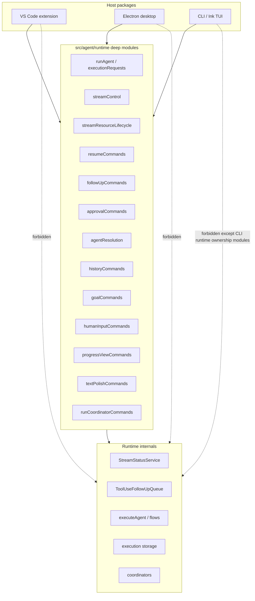

# PRD: Runtime/Host Decoupling by Deep Modules

> **Historical status (2026-07-18): retired proposal.** This document is
> preserved from the unmerged `codex/decouple-ui-agent-core` branch and does not
> describe the architecture on `main`. Main instead folded the coordinator layer
> into `session.interactions` in [#7504], deleted the progress/process bus in
> [#7457] and [#7474], reduced the runtime boundary to the small
> `AgentRuntimeHost` event sink and its no-op headless implementation through
> [#7600], [#7602], [#7623], and [#7624], and enforced host-to-agent imports with
> ratchet tests and centralized baselines in [#7914] and [#8322]. The proposed
> frozen `RunDescriptor` injection model, `ModelCell`, `PendingRequests`,
> `RetryPolicy`, `RetryGate`, and `HostUiBus` are retired and must not be
> implemented from this record. The later
> [narrow ModelCell ownership ruling][modelcell-ownership-ruling]
> governs only the current primitive on `main`; it does not revive this proposal
> or make its other retired designs authoritative. The `RunDescriptor` name on
> `main` denotes the
> unrelated persisted stream schema introduced in [#7164].

[#7164]: https://github.com/LionSR/TeXRA/pull/7164
[#7457]: https://github.com/LionSR/TeXRA/pull/7457
[#7474]: https://github.com/LionSR/TeXRA/pull/7474
[#7504]: https://github.com/LionSR/TeXRA/pull/7504
[#7600]: https://github.com/LionSR/TeXRA/pull/7600
[#7602]: https://github.com/LionSR/TeXRA/pull/7602
[#7623]: https://github.com/LionSR/TeXRA/pull/7623
[#7624]: https://github.com/LionSR/TeXRA/pull/7624
[#7914]: https://github.com/LionSR/TeXRA/pull/7914
[#8322]: https://github.com/LionSR/TeXRA/pull/8322
[modelcell-ownership-ruling]: ../proposals/2026-08-01-architecture-rulings-ledger.md#modelcell

## Overview

TeXRA now has three first-class hosts for agent execution:

- the VS Code extension,
- the Electron desktop shell,
- the CLI and Ink TUI.

All three hosts launch the same agent runtime, observe the same stream lifecycle,
answer the same approval and human-input requests, and resume the same persisted
tool-use sessions. Yet much of the code still exposes runtime internals directly
to host packages. The result is not merely duplicated code. It is duplicated
knowledge: each host must know which queue to acquire, which status transition is
legal, when a pending approval must be unregistered, how a failed launch should
be written to history, and which session owns a follow-up.

This PRD defines a long refactoring program whose aim is to make those facts
live in one place. The target is not a large framework. It is a small number of
deep modules: modules with narrow public APIs that hide substantial state
evolution behind a clear contract.

The guiding rule is:

> If a host caller must remember a sequence of runtime state changes, the
> boundary is still too shallow.

The desired end state is that hosts provide boundary conditions and effects:
workspace paths, UI choices, rendered prompts, file openers, IPC senders, and
the `AgentRuntimeHost` event channel. Runtime modules evolve agent state.

## Problem Statement

The host/runtime boundary currently has three failure modes.

First, some host code imports runtime state owners directly. Examples in the
current architecture include direct use, or recently removed direct use, of
`StreamStatusService`, `ToolUseFollowUpQueue`, `sendFollowUp`, and
`resumeToolUseFromSnapshot` from host packages. These imports make the host
participate in runtime invariants. A desktop caller, for instance, should not
need to know that snapshot resume consists of:

1. acquiring a follow-up queue,
2. setting the stream to `RESUMING`,
3. draining queued follow-ups,
4. appending those follow-ups into the restored tool-use session,
5. restoring them on failure,
6. returning the stream to `WAITING` only if this caller acquired ownership.

That sequence is one mathematical operation. It belongs behind one function.

Second, some runtime command modules are shallow. They rename an import but do
not yet hide an invariant. A wrapper such as `requestRuntimeFollowUp()` is useful
only if callers no longer need to remember the rest of the operation, such as
when to emit queued follow-up projections, when to auto-resume, and how to handle
session scope.

Third, several concerns are split across the runtime, progress view backend,
extension commands, desktop bridge, and CLI controller. This split means that a
new host or a new mode of execution can compile while missing one part of the
protocol. Such omissions are especially dangerous because the failure is often
not local. An incorrect stream status can later misroute a follow-up; an omitted
history write can later show a failed launch as `unknown`; a global singleton can
work in the extension while failing in desktop multi-window execution.

## Goals

This PRD has seven goals.

1. **Make runtime modules deep.** Public functions in `src/agent/runtime/` should
   hide state transitions, concurrency guards, cleanup, and persistence side
   effects. Their APIs should be small, typed, and intention-revealing.

2. **Keep hosts thin but honest.** Hosts may own UI surfaces, IPC, terminal
   rendering, VS Code APIs, Electron window state, and CLI process policy. Hosts
   should not own the semantics of agent execution, approval queues, stream
   status, or persisted resume.

3. **Preserve host-specific affordances.** The extension, desktop shell, and CLI
   have genuinely different interfaces. The target is not a universal host UI
   layer. It is shared runtime semantics with host-specific presentation.

4. **Reduce change amplification.** Adding a new runtime state transition should
   not require parallel edits in extension, desktop, and CLI host code unless the
   user-facing surface genuinely changes in each host.

5. **Make multi-session ownership explicit.** Desktop and future embedded SDK
   use cases require multiple sessions in one process. Runtime state must be
   owned by `SessionHandle` or by a consciously process-global service, not by
   accidental module state.

6. **Use tests to protect invariants.** The most important tests are not
   pass-through wrapper tests. They are invariant tests: duplicate resume must
   not clear another owner; category-neutral lookup must remain neutral; failed
   launches must persist terminal status; cleanup must be session-scoped.

7. **Maintain behavior while moving ownership.** Most phases should be
   behavior-neutral. When a phase intentionally changes behavior, the PR must say
   so and include an acceptance test.

## Non-Goals

This PRD does not propose the following:

- a single host framework spanning VS Code, Electron, and CLI;
- a generic message bus replacing typed progress-view commands;
- a rewrite of the PocketFlow flow structure;
- a universal UI component model shared between webviews and Ink;
- a new dependency-injection framework;
- a large "god runtime service" that accumulates unrelated operations;
- removing all process-level singletons immediately.

Some global services are acceptable when their lifetime is truly process-wide.
The work here is to distinguish deliberate process state from accidental shared
state.

## Design Principles

### 1. A Deep Module Hides an Invariant

A shallow module has a small interface and a small implementation. It may make a
call graph longer without making the system simpler.

A deep module has a small interface and a substantial implementation. It hides
decisions the caller should not need to remember. In this refactor, a runtime
module earns its existence only when it hides at least one of these:

- an ordering invariant,
- an ownership invariant,
- a retry or cleanup invariant,
- a session-scope invariant,
- a persistence invariant,
- a compatibility rule between hosts.

Examples:

- Shallow: `requestRuntimeFollowUp()` only calls `sendFollowUp()`.
  Deep: it sends, projects queue state, handles waiting reasons, and returns a
  typed host action.
- Shallow: `setRuntimeStreamStatus()` only calls `StreamStatusService.set()`.
  Deep: it enforces allowed transitions or documents why this caller is a
  trusted owner.
- Shallow: `resolveRuntimeAgentPath()` only forwards to `getAgentPath()`.
  Deep: it exposes category-neutral, workflow, and tool-use lookup as separate,
  tested intentions.
- Shallow: host code calls `prepareToolUseResume()` and
  `finishToolUseResume()`. Deep: one runtime command performs the whole
  snapshot-resume transaction.

### 2. Runtime Owns State Evolution; Hosts Own Presentation

The boundary is not "all code under `src/` is pure" and "all code under
`packages/` is impure." That would be too crude. Instead:

- `src/agent/runtime/` owns agent execution state and host-neutral operations.
- `src/hosts/` owns typed host capability ports.
- `packages/extension/` owns VS Code UI and command registration.
- `packages/desktop/` owns Electron IPC, windows, and renderer messaging.
- `packages/cli/` owns terminal policy, command parsing, and TUI rendering.

When a host receives a user action, it should translate that action into one
runtime request. It should not manually perform the internal runtime sequence.

### 3. The API Should Express the Caller’s Intention

Ambiguous runtime functions create hidden coupling. For agent lookup, a caller
must choose one of three intentions:

- category-neutral lookup,
- workflow lookup,
- tool-use lookup.

For stream status, a caller must choose one of:

- query status,
- request stop,
- set status as a trusted lifecycle owner,
- repair status after restart,
- release stream resources after deletion.

The type names and function names should make those intentions visible.

### 4. Session Scope Is a First-Class Coordinate

`SessionHandle` is the long-term owner of run coordination state. Runtime
commands that interact with live runs should accept `session?: SessionHandle`
and default to the current run session when called inside a run. Host call sites
that run outside the run's async context must pass their session explicitly.

This is especially important for desktop. A desktop window is not merely a UI
view over a process-global runtime. It has its own runtime host, proposal maps,
approval surfaces, and execution state. Runtime commands must make that
ownership explicit.

### 5. No New Abstraction Without a Deletion or an Invariant

Every abstraction PR in this program must identify at least one of:

- duplicated host code deleted,
- direct host import of a runtime internal removed,
- state transition moved into a tested runtime module,
- session ownership made explicit,
- behavior bug prevented by a new invariant test.

If a PR only renames imports, it should not be merged as architecture work.
For existing shallow wrappers, however, this is a phased rule: inventory first,
then enforcement when a later PR touches the classified boundary.

## Abstraction Reduction Plan

The refactor should not merely move complexity from host packages into a larger
number of runtime files. A boundary is useful only when it reduces the facts a
caller must remember. Therefore this program includes an explicit audit of
pass-through abstractions and excessive intermediate layers.

A pass-through abstraction is a public module, class, or function whose body
only renames, forwards, lightly reshapes, or re-exports another API without
hiding a runtime invariant. Such an abstraction may be temporarily useful during
stacked refactors, but it should not become a permanent public boundary merely
because it has the right name.

The audit is phased. The first audit is not an immediate hard gate requiring
deletion of every shallow wrapper. It requires inventory, classification, and a
migration plan. After that classification, future architecture work should
deepen, merge, delete/inline, or preserve as a documented temporary adapter any
pass-through it touches.

### Amendment Assumptions

This amendment adopts a phased audit policy. The first step is inventory and
classification; enforcement follows when later architecture PRs touch a
classified boundary. It does not require immediate deletion of every shallow
wrapper.

The aim is not to eliminate useful structure. An abstraction should be removed
only when it fails to hide an invariant, clarify an operation, or provide a
temporary compatibility boundary with a named removal milestone.

### Classification Outcomes

Every suspect boundary should be assigned exactly one outcome. An audit note may
record uncertainty, but the classification column itself must contain one of the
four outcomes below, not a disjunction.

- **Deepen** when the public name is the right concept, but the invariant still
  lives in callers. The implementation should absorb the state transition,
  cleanup, projection, or failure rule that callers currently sequence by hand.
- **Merge** when two adjacent modules split one mathematical operation. The
  operation should have one owner, even if that owner delegates to private
  helpers.
- **Delete/inline** when the wrapper adds neither vocabulary nor invariant. The
  caller should use the underlying intention-level function directly.
- **Temporary adapter** when compatibility or stacked PR sequencing requires a
  pass-through. The adapter must name the milestone that removes it.

The preferred outcome is not always deletion. A thin boundary with the correct
name may be a good seed for a deep module. The test is whether the boundary can
hide a real invariant after the next step.

### Audit Table

The Phase 0.5 audit should produce a table with this shape for every touched
runtime module or host-facing boundary. The `Classification` column is a
decision, not a list of possibilities.

| Touched module or boundary                        | Classification    | Intended outcome                                                                                  | Milestone |
| ------------------------------------------------- | ----------------- | ------------------------------------------------------------------------------------------------- | --------- |
| `followUpCommands`                                | Deepen            | Own queue projection, waiting reasons, and host-facing delivery result.                           | M1        |
| queued follow-up projection                       | Deepen            | Expose host-safe queued messages through `followUpCommands`; keep publication runtime-internal.   | M1        |
| `streamResourceLifecycle`                         | Deepen            | Own the complete stream deletion cleanup transaction.                                             | M1        |
| stream-control queue helper                       | Delete/inline     | Fold queue release into follow-up/deletion commands.                                              | M1        |
| `streamControl.requestStopStream`                 | Delete/inline     | Replace the old boolean stop alias with typed `requestRuntimeStreamStop` outcomes.                | M1        |
| split restart stream-recovery exports             | Delete/inline     | Merge waiting-stream detection and RUNNING-status repair into one recovery command.               | M1        |
| config-based tool-use resume lookup               | Deepen            | Own config-to-task-state projection, stream-id derivation, and persisted resume classification.   | M1        |
| `toolUseResume` helper module                     | Delete/inline     | Keep snapshot-resume preparation, restoration, and finish laws private inside `resumeCommands`.   | M1        |
| CLI active-resume data helper                     | Delete/inline     | Expose only the listing-safe CLI projection; keep failure propagation inside runtime commands.    | M1        |
| `executionRequests` config/task-state surface     | Deepen            | Own runtime config parsing, task-state parsing, and workflow/tool-use task-state projection.      | M2        |
| `agentResolution.getRuntimeToolUseAgentCategory`  | Delete/inline     | Use explicit tool-use lookup or predicate.                                                        | M1        |
| `agentLoad.ensureAgentCategoryForSource`          | Delete/inline     | Keep source-based category normalization inside agent loading.                                    | M1        |
| `agentLoad.loadYaml`                              | Delete/inline     | Replace raw YAML loading with one inspection-data helper for agent-definition inspection.         | M1        |
| `agentDirectories`                                | Deepen            | Own source-to-directory resolution, bundled directory vocabulary, and bootstrap composition.      | M2        |
| `agentDirectories.isRuntimeLocalAgentSource`      | Delete/inline     | Keep remote-vs-local branching inside directory resolution commands.                              | M1        |
| bundled agent-directory constructor aliases       | Delete/inline     | Host composition passes `resourcesPath` to runtime sync/bootstrap requests.                       | M1        |
| agent-directory service/storage aliases           | Delete/inline     | Hosts request a runtime directory provider instead of constructing service/storage internals.     | M1        |
| merge execution request construction              | Deepen            | Own the merge-agent/helper-model/default-validation law.                                          | M2        |
| `historyCommands`                                 | Deepen            | Normalize records and own delete-related goal cleanup.                                            | M1        |
| `goalCommands.getRuntimeGoalForStream`            | Delete/inline     | Replace raw goal-record reads with host-safe goal status projections.                             | M1        |
| `goalCommands.listRuntimeGoals`                   | Delete/inline     | Replace raw goal-record lists with settings-safe row projection.                                  | M1        |
| goal cleanup forwarding commands                  | Delete/inline     | Keep goal cleanup inside stream-resource and history deletion transactions.                       | M1        |
| `executionQueries.getRuntimeActiveExecutionIds`   | Delete/inline     | Fold active-execution deletion guards into `historyCommands`.                                     | M1        |
| `executionQueries.getRuntimeActiveAgentNames`     | Delete/inline     | Replace array projection with `hasRuntimeActiveAgentName`.                                        | M1        |
| split model-switch query exports                  | Delete/inline     | Replace target and disabled-reason queries with model-switch state/result commands.               | M1        |
| `modelSwitch`                                     | Deepen            | Own live-flow target classification and disabled-candidate refusal before switching.              | M1        |
| `manualCompaction`                                | Deepen            | Own live-flow lookup, capability checks, follow-up notification, and host-facing messages.        | M1        |
| `agentCreatorCommands`                            | Deepen            | Own tool-group option projection and selected-option resolution without host label-key logic.     | M1        |
| `approvalCommands`                                | Deepen            | Own bypass laws and pending-prompt lifecycle cleanup.                                             | M1        |
| approval session bypass setter aliases            | Delete/inline     | Replace per-kind setter aliases with one decision-level bypass command.                           | M1        |
| tool-edit approval pure helpers                   | Delete/inline     | Move diff math and temp-file staging to shared approval modules; keep tool paths as adapters.     | M5        |
| `runCoordinatorCommands`                          | Deepen            | Own session-scoped approval/proposal/retry decisions.                                             | M1        |
| `runCoordinatorCommands.clearRuntimeRetryRequest` | Delete/inline     | Keep retry cleanup inside intention-level stream stop/delete commands.                            | M1        |
| `externalInquiryQueries`                          | Merge             | Fold durable inquiry listing and hydration into `humanInputCommands`.                             | M5        |
| `humanInputCommands`                              | Deepen            | Own human-input resolution plus durable inquiry overview and permission projection.               | M5        |
| `ProgressViewBridge`                              | Delete/inline     | Replace raw getter/setter bridge state.                                                           | M5        |
| `progressViewCommands`                            | Deepen            | Own multi-host visibility provider registration and query.                                        | M5        |
| progress runtime-status capability                | Deepen            | Inject runtime status operations into shared progress backend instead of importing owners.        | M1        |
| progress runtime-session capability               | Deepen            | Inject interrupt-pruning and trace-flush operations instead of importing `SessionHandle`.         | M1        |
| progress stream-tab metadata builder              | Deepen            | Build tabs from resolved display facts; do not query agent registry from shared UI code.          | M1        |
| extension progress stream-info facade             | Deepen            | Keep label and visible-stream queries on `ProgressViewProvider`, not extension helper modules.    | M1        |
| extension progress goal-state projection          | Deepen            | Keep goal active/status projection on `ProgressViewProvider`, not the message dispatcher.         | M1        |
| extension progress agent-category projection      | Deepen            | Keep tool-use-agent classification on `ProgressViewProvider`, not the message dispatcher.         | M1        |
| progress proposal options projection              | Deepen            | Build model fallback and proposal-local plain-name agent options in a controller.                 | M1        |
| schema-driven view dispatcher                     | Deepen            | Await asynchronous handlers so typed command dispatch preserves completion semantics.             | M1        |
| extension settings goal-list projection           | Deepen            | Let the Goal tab controller own the runtime projection; keep the message handler runtime-free.    | M1        |
| extension/desktop settings agent-catalogue wiring | Deepen            | Let shared settings controllers own catalogue freshness and agent-file lookup inputs.             | M1        |
| extension/desktop settings history actions        | Deepen            | Let a shared history controller own config lookup, restore projection, and delete/clear calls.    | M1        |
| main-view agent selection projection              | Deepen            | Project runtime agent identity into selector id/session type for selection and restore paths.     | M1        |
| desktop main-view startup option loading          | Deepen            | Keep desktop IPC startup adapters out of model/agent option-loader pairing.                       | M1        |
| main-view options refresh projection              | Deepen            | Build model/agent option refresh messages for extension and desktop through one controller.       | M1        |
| desktop settings main-view refresh wiring         | Deepen            | Route settings-triggered main-view option refresh through the desktop startup-controller factory. | M1        |
| desktop progress-event bridge runtime ports       | Deepen            | Let the bridge own ghost hydration and snapshot persistence through injected runtime ports.       | M1        |
| desktop stream snapshot projection                | Deepen            | Project live/restored stream metadata into durable restored-stream snapshots in the backend.      | M1        |
| terminal-result presentation mapper               | Deepen            | Format structural terminal-result data without importing agent trace event types.                 | M1        |
| `textEnhancement`                                 | Delete/inline     | Replace generic helper exports with commands.                                                     | M5        |
| `textPolishCommands`                              | Deepen            | Own prompt/model/error semantics for polishing.                                                   | M5        |
| `textConnection`                                  | Delete/inline     | Keep provider-specific connection helpers private to a diagnostic command.                        | M5        |
| `textConnectionCommands`                          | Deepen            | Own provider fan-out and host-loggable connection diagnostic rows.                                | M5        |
| `runtime/AgentRuntimeHost`                        | Delete/inline     | Move the host event port to `src/hosts`.                                                          | M5        |
| `hosts/AgentRuntimeHost`                          | Deepen            | Own the progress-event host contract.                                                             | M5        |
| flow-result category schemas                      | Delete/inline     | Keep category schemas private; expose only the union schema and structural result types.          | M5        |
| core package workflow result re-export            | Temporary adapter | Keep deprecated `WorkflowFlowResult` type compatibility; keep category schemas private.           | M6        |
| host imports of `AgentFlowResult`                 | Delete/inline     | Replace runtime result-type coupling with host-local structural projections.                      | M5        |

The table must cover every public `src/agent/runtime/` command module touched by
the refactor. Untouched modules may be classified later, but a PR should not
edit a boundary and leave its status unknown.

### Concrete Audit Examples

The first audit should begin with the following working classifications.

- `followUpCommands` is a useful boundary name. Classify it as **Deepen**. It
  should send the follow-up, project queued state, explain waiting reasons,
  detect persisted waiting streams when the host supplies the execution id,
  wake queued streams through the host-neutral resume port when requested,
  preserve explicit session ownership, and return a typed host-facing result.
- Queued follow-up projection is classified as **Deepen**. Host-facing callers
  receive queued message strings through `followUpCommands`, not the queue
  manager or queue item representation. Generic helper names such as
  `emitQueuedFollowUps` should be deleted in favor of runtime-named internal
  publication commands, and shared UI backends should receive queued-message
  access through injected capabilities rather than importing the queue module
  directly.
- `streamResourceLifecycle` is the main merge-or-deepen candidate. The current
  audit classifies it as **Deepen** because it is becoming the complete stream
  deletion cleanup transaction: approvals, coordinator requests, queued
  follow-ups, unscoped approval cleanup for delete-all, and runtime goal
  removal. If later work shows that deletion cleanup has no independent
  invariant beyond stream control, reclassify the boundary as **Merge** and
  fold it into `streamControl`. Host code may still own view state, backups,
  and persisted UI sidecars.
- `streamControl.releaseQueuedFollowUpsForStreams` is classified as
  **Delete/inline**. It was a public queue-release convenience wrapper after
  queue projection moved into `followUpCommands` and stream deletion moved into
  `streamResourceLifecycle`.
- `streamControl.requestStopStream` is classified as **Delete/inline** as a
  public name. The runtime operation should be named
  `requestRuntimeStreamStop` and should return a typed stop outcome, not a raw
  registry boolean. The invariant remains in `streamControl`: clearing retry
  state, applying the shared child-stop policy, and repairing host-visible
  stopped status are one runtime operation.
- `streamControl.detectRuntimeWaitingStreams` and
  `streamControl.recoverRuntimeRunningStreamsAfterRestart` are classified as
  **Delete/inline** as public host-facing operations. The deeper command is
  `recoverRuntimeRunningStreamsFromPersistedState`, which owns persisted
  waiting-stream detection and the transition of stale RUNNING streams to
  WAITING or ERROR. Progress views receive the typed recovery partition and
  handle only logging and presentation cleanup.
- Config-based tool-use resume lookup in `resumeCommands` is classified as
  **Deepen**. A host that starts from an execution id and persisted
  `AgentConfig` should not separately project `TaskState`, derive a stream id,
  read the flow record, and interpret "workflow", "missing", and "failed"
  states. The runtime command should return one classified host-facing result.
- `toolUseResume` is classified as **Delete/inline**. Its former public helper
  steps are not separate host-facing operations. `resumeCommands` owns snapshot
  preparation, drained follow-up restoration after failure, and final WAITING
  repair as private steps of `requestRuntimeToolUseSnapshotResume`.
- The CLI active-resume data helper is classified as **Delete/inline**. CLI
  history needs a listing-safe projection that degrades unreadable persisted
  flow data to `null`; the failure-propagating config-based classification
  remains the responsibility of `resumeCommands`, not a second public CLI
  helper.
- Config and task-state parsing in `executionRequests` is classified as
  **Deepen**. Host restore, proposal setup, follow-up planning, and desktop
  resume metadata paths should not know the raw `AgentConfigSchema`,
  `TaskStateSchema`, or core workflow/tool-use predicates. The representation
  difference between workflow task state with active-file flags and tool-use
  task state with session state is runtime execution semantics.
- `agentLoad.ensureAgentCategoryForSource` is classified as
  **Delete/inline**. Source-based category normalization is a private step of
  `loadAgentSettingAndPrompts`; callers should receive loaded settings or
  definition-inspection results rather than call the normalization step.
- `agentLoad.loadYaml` is classified as **Delete/inline**. Raw YAML file
  loading is not a stable runtime operation. Agent-definition inspection should
  use one helper that returns processed settings/prompts plus optional raw
  local-definition facts.
- `agentResolution` needs a function-level classification. Functions that
  express distinct lookup intentions should remain. Synonyms that only add a
  runtime prefix should be deleted or made private. Host and controller code
  should use this boundary for catalogue loading, options, listing, and lookup
  instead of importing the raw `agentRegistry`.
- `agentResolution.getRuntimeToolUseAgentCategory` is classified as
  **Delete/inline**. The progress follow-up controller needs the proposition
  "is this a tool-use agent?", not a category projection wrapper.
- `agentDirectories` is classified as **Deepen**. Hosts may register directory
  providers and ask for an agent directory by source, but the raw
  `agentDirectoriesRegistry` should not leak into host or controller code. The
  runtime boundary owns the invariant that remote agents have no local
  directory and that the three local sources map to custom, built-in workflow,
  and built-in tool-use directories. It also owns bundled-agent bootstrap
  vocabulary, so host composition code uses runtime `agentDirectories` rather
  than importing `AgentDirectorySync`, `BundledAgentDirectories`, or
  `platformAgentDirectories` directly.
- `agentDirectories.isRuntimeLocalAgentSource` is classified as
  **Delete/inline**. It exposes a predicate rather than an operation. The
  remote-vs-local decision should remain private to
  `resolveRuntimeAgentDirectory` and `requireRuntimeAgentDirectory`.
- Bundled agent-directory constructor aliases such as
  `RuntimeBundledAgentDirectorySync` and
  `RuntimePathAgentDirectoryBundleSource` are classified as
  **Delete/inline**. A host composition root should supply the resources path,
  version store, and custom-directory store. The runtime boundary should own
  construction of the bundle source, global storage, and sync transaction.
- Agent-directory service and storage aliases such as
  `RuntimeAgentDirectoryService` and
  `RuntimeGlobalStorageAgentDirectoryStorage` are classified as
  **Delete/inline**. Extension UI code may own watchers, folder pickers, and
  issue display, but it should ask runtime for a directory provider rather than
  constructing the service and storage internals.
- Merge execution request construction is classified as **Deepen**. Extension
  and desktop hosts should not know that a merge run means agent `merge`, the
  helper-model default, base file as the single input, edited file as the edit
  target, and runtime execution validation. They should ask the runtime request
  boundary to build the validated merge execution request, then decide only how
  to launch or report it.
- `approvalCommands` is classified as **Deepen**. Keep the operations that hide
  pending-request, bypass, and prompt-emission rules. The module should own
  coupled bypass transitions, delegated-task implied bypass transitions, and
  pending tool-edit prompt completion, including the pairing between pending
  registry cleanup and progress prompt resolution. This module contains both
  real host-neutral approval operations and thin computational aliases. Split,
  justify, or delete any alias that only renames a pure helper and hides no
  approval invariant.
- Tool-edit approval pure helpers are classified as **Delete/inline** from host
  code. Diff math and temp-file staging are not approval state operations; they
  should live in `@shared/approval/*`, with old `@tools/approval/*` paths kept
  only as temporary compatibility adapters.
- Per-kind approval bypass setter aliases such as
  `setRuntimeBashApprovalSessionBypass` and
  `setRuntimeToolEditApprovalSessionBypass` are classified as
  **Delete/inline**. Hosts should pass accepted-decision facts to
  `applyRuntimeApprovalDecisionBypass`, which owns the mapping from decision
  bypass kind to bash, tool-edit, or delegated-task runtime state.
- `runCoordinatorCommands` is classified as **Deepen**. It should preserve the
  host-facing vocabulary for plan approvals, agent proposals, and retry
  decisions while routing each decision through the supplied session. Tests
  should prove supplied-session ownership, not only that calls are forwarded.
- `runCoordinatorCommands.clearRuntimeRetryRequest` is classified as
  **Delete/inline**. It exposed a cleanup step rather than a user intention.
  Retry cleanup belongs inside `requestRuntimeStreamStop` and stream deletion
  cleanup, while run-coordinator commands remain focused on resolving plan,
  proposal, and retry decisions.
- `externalInquiryQueries` is classified as **Merge**. Durable inquiry listing
  and open-turn hydration are part of the same host-neutral human-input
  operation as resolving or drafting those turns. The separate public module
  should disappear; progress hosts should ask `humanInputCommands` for a
  bounded overview and open inquiry permissions instead of shaping raw storage
  queries.
- `humanInputCommands` is classified as **Deepen**. It should own
  user-question resolution, durable inquiry resolution, draft persistence, the
  bounded global inquiry overview used by progress surfaces, and the projection
  from an open durable manifest into a live host permission.
- `historyCommands` is classified as **Deepen**. It may remain because it
  normalizes storage records into host-safe runtime records. It should also own
  delete-related runtime goal cleanup by execution id, refusal to delete a
  still-running execution, and active-execution exclusion for clear-history.
  Thin storage aliases should be merged, deleted, or marked as temporary
  adapters. Full execution record reads should return parsed runtime configs so
  settings controllers do not import raw `AgentConfigSchema` for history
  export.
- `goalCommands.getRuntimeGoalForStream` is classified as **Delete/inline** for
  host code. CLI and UI surfaces should receive host-safe goal status
  projections, not the full persisted `Goal` record. Use
  `getRuntimeGoalSessionStatus` for CLI status text and
  `getRuntimeGoalControlState` for stream controls.
- `goalCommands.listRuntimeGoals` is classified as **Delete/inline** for host
  code. Settings surfaces should receive `listRuntimeGoalSettingsItems`, whose
  rows include only navigation, objective, status, and elapsed-time inputs,
  rather than the full persisted `Goal` record.
- `goalCommands.forgetRuntimeGoal`,
  `goalCommands.forgetRuntimeGoals`, and
  `goalCommands.forgetRuntimeGoalsByExecutionIds` are classified as
  **Delete/inline**. Stream deletion owns per-stream goal cleanup through
  `streamResourceLifecycle`; history deletion owns execution-id goal cleanup
  through `historyCommands`.
- `executionQueries.getRuntimeActiveExecutionIds` is classified as
  **Delete/inline** for host history deletion. A caller that wants to delete or
  clear history should not first ask for active ids and then reconstruct the
  deletion law. The runtime history command should return a typed outcome:
  deleted, missing, or running.
- `executionQueries.getRuntimeActiveAgentNames` is classified as
  **Delete/inline**. Hosts should not receive arrays of active agent names just
  to answer a membership question. Keep an intention-level predicate such as
  `hasRuntimeActiveAgentName` when a host only needs to guard duplicate setup
  assistant launches.
- Split model-switch query exports are classified as **Delete/inline**. A host
  should not separately ask whether a stream has a live tool-use flow and why a
  candidate model is disabled. `modelSwitch` should return a state projection
  and a typed switch result.
- `modelSwitch` is classified as **Deepen**. It should own live-flow target
  classification and should refuse disabled model candidates before invoking
  the flow switch operation.
- `manualCompaction` is classified as **Deepen**. Hosts should not duplicate
  status-to-message interpretation for no live session, unsupported model, and
  accepted compaction. The runtime command owns flow lookup, capability checks,
  follow-up notification, and a host-facing message.
- `agentCreatorCommands` is classified as **Deepen**. The runtime should own
  tool-group option projection and selected-option resolution. Hosts may render
  and return selected options, but should not reconstruct runtime tool groups
  from labels as semantic keys.
- `ProgressViewBridge` should be **Delete/inline**. Raw bridge getter/setter
  exports leak module-level state without a clear operation. Replace them with
  `progressViewCommands`.
- `progressViewCommands` should be **Deepen** by owning the invariant that
  runtime consumers ask only whether a host-registered progress view is visible,
  not which host object answers that question. It should also own registration
  lifetime, so disposing an old host registration cannot clear a newer provider.
- The progress runtime-status capability should be **Deepen**. The shared
  progress backend may mirror visible status events, clear deleted stream
  state, and request status snapshots for rendering, but it should receive
  those operations as a host-supplied runtime capability rather than importing
  `streamControl` or `StreamStatusService` directly.
- The progress runtime-session capability should be **Deepen**. The shared
  progress backend may prune interrupt handles and flush pending traces, but it
  should receive those as session-scoped operations from the host composition
  root rather than importing `SessionHandle`.
- The progress stream-tab metadata builder should be **Deepen**. It should
  format already-resolved stream display facts. Remote-agent classification is
  a runtime/catalogue fact and should arrive as an `isRemote` hint, not be
  queried from the shared UI builder.
- The terminal-result presentation mapper should be **Deepen**. It should
  express the host-visible terminal-result facts it needs structurally, so
  shared presentation code does not import agent trace event types.
- `textEnhancement` should be **Delete/inline**. The old helper name exposed
  prompt/model implementation details as a generic utility. Replace it with
  `textPolishCommands`.
- `textPolishCommands` should be **Deepen** by owning text-polish prompt
  initialization, prompt rendering, helper-model invocation, response-tag
  interpretation, and SDK error normalization behind one request-shaped
  operation.
- `textConnection` should be **Delete/inline** from host code. Its
  provider-specific helpers remain runtime implementation details for the
  diagnostic command.
- `textConnectionCommands` should be **Deepen** by owning the diagnostic test
  cases, provider fan-out, result projection, and connected-text rendering for
  host logging.
- `runtime/AgentRuntimeHost` should be **Delete/inline**. The event channel is
  a host capability port, not runtime state. Move it to `src/hosts` rather than
  leaving a runtime-path re-export.
- `hosts/AgentRuntimeHost` should be **Deepen** by owning the typed
  progress-event host contract and the no-op host used by tests and headless
  paths.
- Flow-result category schemas are classified as **Delete/inline**. Workflow
  and tool-use category schemas are construction details of the public
  `AgentFlowResultSchema`; third-party code should depend on the union schema
  and structural result types, not category-schema exports.
- The core package workflow result re-export is classified as a
  **Temporary adapter**. Existing SDK consumers may still import the deprecated
  `WorkflowFlowResult` type, but category-specific schemas remain private and
  new code should use `AgentFlowResult` plus `category === 'workflow'`
  narrowing. The removal milestone is M6, after a compatibility note or
  migration window.
- Host imports of `AgentFlowResult` are classified as **Delete/inline**. Host
  UI helpers should name the small projection they consume, such as a completed
  workflow output preview request, instead of importing runtime flow-result
  internals.

The initial `agentResolution` function-level audit should use this stricter
vocabulary. If a row marked **Deepen** still contains only a direct call after
M2, it should be reclassified as **Delete/inline** or made private.

| Boundary                            | Classification | Reason                                                                                       |
| ----------------------------------- | -------------- | -------------------------------------------------------------------------------------------- |
| `resolveRuntimeAgentPath`           | Delete/inline  | Deleted; inspection owns launch-context path lookup and category/source choice.              |
| `getRuntimeAgent`                   | Deepen         | Preserve category-neutral lookup as a named intention.                                       |
| `getRuntimeWorkflowAgent`           | Deepen         | Preserve workflow lookup as a named intention.                                               |
| `getRuntimeToolUseAgent`            | Deepen         | Preserve tool-use lookup as a named intention.                                               |
| `resolveRuntimeAgentKey`            | Delete/inline  | Deleted; main-view selection derives selector keys from category-specific runtime lookups.   |
| `runtimeToolUseAgentHasAnyTool`     | Deepen         | Hide tool-use lookup plus capability membership behind one predicate.                        |
| `resolveRuntimeAgentIdentifiers`    | Deepen         | Own batch resolution and missing-identifier projection.                                      |
| `getRuntimeAgentBySourceIdentifier` | Delete/inline  | Deleted; callers use category-neutral `getRuntimeAgent`.                                     |
| `findRuntimeAgentByIdentifier`      | Delete/inline  | Replaced by the batch resolver above.                                                        |
| `listRuntimeAgents`                 | Deepen         | Own category listing and the visible/all catalogue switch behind one option-bearing request. |
| `listRuntimeAgentsByCategory`       | Delete/inline  | Merged into `listRuntimeAgents({ category })`.                                               |
| `listRuntimeVisibleAgents`          | Delete/inline  | Merged into `listRuntimeAgents({ category, visibleOnly: true })`.                            |

### Rules After the Audit

After Phase 0.5, an architecture PR touching a runtime boundary must do one of
the following:

1. deepen the boundary by moving an invariant into it;
2. merge adjacent boundaries that split one operation;
3. delete or inline a wrapper that adds no stable concept;
4. preserve it as a temporary adapter with a removal milestone.

Tests should follow the same rule. A forwarding test only proves that a wrapper
exists. A useful runtime-boundary test proves a law: one owner resumes, queued
input is restored on failure, a deleted stream releases all owned resources, or
a host-neutral lookup remains category-neutral.

## Current Architecture

The current code has already moved in the right direction. The most important
runtime-facing modules include:

- `src/agent/runtime/runAgent.ts`
- `src/agent/runtime/executeAgent.ts`
- `src/agent/runtime/SessionHandle.ts`
- `src/agent/runtime/streamControl.ts`
- `src/agent/runtime/streamResourceLifecycle.ts`
- `src/agent/runtime/resumeCommands.ts`
- `src/agent/runtime/followUpCommands.ts`
- `src/agent/runtime/approvalCommands.ts`
- `src/agent/runtime/runCoordinatorCommands.ts`
- `src/agent/runtime/agentResolution.ts`
- `src/agent/runtime/historyCommands.ts`
- `src/agent/runtime/goalCommands.ts`
- `src/agent/runtime/humanInputCommands.ts`
- `src/agent/runtime/progressViewCommands.ts`
- `src/agent/runtime/textPolishCommands.ts`
- `src/hosts/AgentRuntimeHost.ts`

The remaining problem is not absence of a boundary. It is uneven depth. Some
modules already hide real transitions. Others are only partial façades. A few
host files still know more than they should.

The desired dependency direction is:



The CLI has one special status: `packages/cli/src/runtime/` is partly a host
policy layer and partly a headless execution adapter. It may remain closer to
runtime details than Ink components or command parsers, but it should still use
the same host-neutral runtime requests where possible.

## Target Architecture

### Runtime Boundary Modules

The boundary should be organized around stateful domains, not around hosts.

#### `executionRequests`

Owns validation and parsing of execution requests.

Responsibilities:

- parse host-provided configuration into runtime-safe request objects;
- preserve discriminated union semantics for workflow/tool-use runs;
- expose host-safe task-state aliases and workflow/tool-use predicates;
- project validated agent configs into runtime task state for restore and
  resume paths;
- keep host command code away from raw `AgentConfigSchema` details when a
  runtime-specific request is required.

Not responsible for:

- launching the run,
- displaying validation failures,
- choosing a model or agent in a UI.

Depth criterion:

- a caller should not need to know which Zod schema or config prefault rule is
  used for runtime execution.
- a host restore path should not need to know the internal workflow/tool-use
  task-state shapes.

#### `runAgent`

Owns root execution launch.

Responsibilities:

- allocate or accept execution ids;
- build launch context;
- register execution lifecycle;
- attach result presentation hooks;
- thread `SessionHandle`;
- open workflow output through a host callback when appropriate.

Not responsible for:

- command parsing,
- UI selection,
- host-specific notifications,
- retry prompt presentation.

Depth criterion:

- a host should be able to launch a valid runtime request without knowing how
  lifecycle registration, stream id resolution, and run context creation are
  ordered.

#### `streamControl`

Owns stream status, stop/kill requests, and restart recovery.

Responsibilities:

- expose status queries and snapshots;
- request stop/kill through the correct session;
- provide trusted status setters for lifecycle owners;
- repair running streams after restart from persisted execution state;
- mark running streams stopped during shutdown repair;
- leave queue release to `followUpCommands` and `streamResourceLifecycle`.

Not responsible for:

- visual stream sorting,
- progress-view rendering,
- renderer IPC.

Depth criterion:

- host code should not import `StreamStatusService`.

#### `streamResourceLifecycle`

Owns runtime cleanup for deleted streams.

Responsibilities:

- release approval state for deleted streams;
- clear session-owned coordinator requests;
- release queued follow-ups and publish queue projections when requested;
- reject unscoped pending approvals during session-scoped delete-all;
- forget runtime goals for deleted streams.

Not responsible for:

- deleting rendered stream cards,
- clearing host backup files,
- deleting persisted progress-view sidecars,
- choosing the next active stream.

Depth criterion:

- host and controller code should call one runtime deletion cleanup command,
  not sequence approval cleanup, follow-up release, coordinator cleanup, and
  goal deletion by hand.

#### `resumeCommands`

Owns user-visible snapshot resume operations.

Responsibilities:

- expose `RuntimeToolUseSessionSnapshot`;
- perform the whole tool-use resume transaction;
- resolve tool-use resume data from `{ executionId, config }` by owning
  config-to-task-state projection, stream-id derivation, and resume-data
  classification;
- preserve queued follow-ups on failure;
- avoid clearing another caller's in-flight resume state;
- pass session ownership into resumed execution.

Not responsible for:

- selecting a history entry,
- showing "no resumable state" messages,
- listing executions.

Depth criterion:

- host code should not call `prepareToolUseResume`,
  `restoreToolUseResumeFollowUps`, `finishToolUseResume`, or
  `resumeToolUseFromSnapshot` directly.
- host code that starts from persisted execution config should not import
  stream-id derivation or task-state projection helpers merely to discover
  resumable tool-use state.

#### `followUpCommands`

Owns follow-up dispatch into live or waiting tool-use sessions.

Responsibilities:

- send a follow-up to the correct session;
- classify the result into host-actionable outcomes;
- project queue state when a message is sent or queued;
- detect a persisted waiting stream when the host supplies the execution id;
- optionally wake queued input through the host-neutral resume port;
- preserve media and display text semantics.

Not responsible for:

- reading text input from a terminal or webview,
- rendering "queued" messages.

Depth criterion:

- host code should not call `sendFollowUp` directly, nor remember that
  successful or queued sends require an `updateQueuedFollowUps` projection.
- host code should consume the runtime command's `accepted`, `outcome`, and
  optional notice fields rather than branching on the lower-level queue result.

#### `approvalCommands`

Owns host-neutral approval state and prompt semantics.

Responsibilities:

- resolve bash approvals;
- manage tool-edit approval handlers;
- register and unregister pending tool-edit approvals;
- emit approval prompts to the runtime host;
- manage approval bypass state.
- own the coupled tool-edit/bash shield transition and delegated-task
  auto-approval transition.

Not responsible for:

- opening VS Code diff editors,
- rendering an Ink modal,
- writing desktop temp files,
- previewing LaTeX in a host-specific viewer.
- exposing pure edit-diff computations or temp-file staging as runtime
  approval operations. Those belong in small host-neutral shared helpers under
  `@shared/approval/*`, not in the runtime command boundary.

Depth criterion:

- host approval modules may own UI, but runtime approval bookkeeping must live
  here.

#### `runCoordinatorCommands`

Owns plan approval, proposal, and retry coordinator resolution.

Responsibilities:

- resolve plan approval by id;
- resolve agent proposal by id;
- trigger/cancel/clear retry requests;
- route all operations through the owning session.
- expose host-safe result vocabulary for proposal and plan decisions without
  requiring host/controller code to import coordinator implementation classes.

Not responsible for:

- rendering approval panels,
- storing host-local proposal display metadata.

Depth criterion:

- host code should not call `session.coordinators.*` directly except inside a
  composition root or a deliberately low-level host bridge. Most UI actions
  should go through this module.
- host/controller code should not import `AgentProposalCoordinator`,
  `PlanApprovalCoordinator`, or `RetryRequestCoordinator` just to name result
  types. It should use `runCoordinatorCommands`.

#### `agentResolution`

Owns runtime-safe agent lookup.

Responsibilities:

- load and refresh agent catalogues;
- expose display-ready options;
- distinguish category-neutral, workflow, and tool-use lookup;
- preserve source-qualified identity matching;
- provide the host/controller catalogue surface so UI adapters do not import
  the lower-level `agentRegistry`.
- inspect raw local agent definitions together with processed settings/prompts
  so host commands do not manually sequence agent resolution and `agentLoad`;
- expose tool-use capability predicates.

Not responsible for:

- rendering selection forms,
- deciding which host should show which default agent.

Depth criterion:

- host/controller code should use `agentResolution` for agent catalogue loading,
  options, listing, and lookup rather than importing `@agent/index/agentRegistry`;
- host/controller code should use `agentResolution` for agent definition
  inspection rather than importing `@agent/runtime/agentLoad`;
- default lookup must remain category-neutral. Tool-use priority must be
  explicit at the call site.

#### `historyCommands`

Owns runtime history access and terminal-status writes.

Responsibilities:

- list history entries;
- read execution records;
- read/write terminal status;
- expose workspace-file and result metadata queries;
- parse stored configs before they cross into settings/export controllers;
- own request-level deletion and clear-history outcomes, including active-run
  refusal, active-run exclusion, and goal cleanup for deleted execution ids;
- hide storage path and KV-store details from hosts.

Not responsible for:

- formatting CLI history tables,
- rendering settings/history views,
- deciding whether deletion should be allowed in a host UI.

Depth criterion:

- host code should not import `@agent/storage` for ordinary history operations.
- `deleteRuntimeHistoryExecution` and `deleteAllRuntimeHistoryExecutions`
  remain private implementation helpers. Public callers use
  `requestDeleteRuntimeHistoryExecution` or
  `requestClearRuntimeHistoryExecutions`, whose results encode the deletion
  law.

#### `goalCommands`

Owns host-safe goal state projection.

Responsibilities:

- expose CLI session goal status without leaking the full persisted record;
- expose progress-view control state as `{ active, status, objective }`;
- expose settings-list goal rows without leaking storage-only fields;
- hide `GoalStore` persistence details from host/controller code.

Not responsible for:

- rendering goal controls,
- deciding whether a host should show the Goal tab,
- cleaning up goals as a side effect of stream or history deletion,
- implementing plan-tool state transitions.

Depth criterion:

- host and controller code should not import `GoalStore` directly. They should
  use `goalCommands` for UI projection and deletion cleanup.

#### `humanInputCommands`

Owns host-neutral user-question resolution, external-inquiry resolution, and
durable inquiry projection.

Responsibilities:

- resolve pending user-question requests from host/user decisions;
- resolve or drop durable external inquiry threads;
- persist drafts for an open external inquiry turn;
- list a bounded global inquiry-thread overview for progress surfaces;
- rehydrate unresolved durable inquiries into live host prompt permissions;
- thread the owning runtime session into inquiry resolution where needed.

Not responsible for:

- rendering prompts,
- deciding how a host validates empty answer text,
- formatting inquiry result summaries; shared pure text projections such as
  external-inquiry continuation text should live under `src/shared`, not in
  host code or tool modules,
- exposing raw inquiry-storage query shapes to host code.

Depth criterion:

- host and controller code should not import `@tools/inquiry` or
  `@tools/userQuestion` directly for prompt resolution. They should use
  `humanInputCommands`.
- host progress surfaces should not import a separate inquiry-query runtime
  module or choose raw storage request parameters. They should use the bounded
  overview and hydration commands from `humanInputCommands`.
- CLI scripts should not import inquiry tool modules to render fixture text;
  they should use shared inquiry projections or `humanInputCommands` depending
  on whether they need pure text or durable runtime behavior. **Implemented in
  this branch for the TUI harness continuation fixture.**

#### `progressViewCommands`

Owns the host-neutral progress-view visibility query.

Responsibilities:

- register host-owned visibility providers at composition roots;
- return an owner token that unregisters only that provider;
- expose a query for whether the progress view is already visible;
- keep execution and event-listener code away from raw bridge getter/setter
  state.

Not responsible for:

- opening the progress view,
- rendering the progress view,
- deciding the host-specific fallback notification text.

Depth criterion:

- host/controller code should not import a raw `ProgressViewBridge` getter or
  setter. It should register visibility through `progressViewCommands`, and
  runtime consumers should query the intention `isRuntimeProgressViewVisible`.
  Tests should prove registration ownership, including that visibility is true
  when any registered host progress surface is visible and that disposing one
  registration does not unregister another provider.

#### `textPolishCommands`

Owns host-neutral text polishing.

Responsibilities:

- initialize the host-provided polish prompt template path;
- normalize task state into prompt context when polishing follow-up text;
- accept host-provided prompt context for main-view instruction polishing;
- render the polish prompt;
- invoke the helper model;
- interpret `<corrected_text>` responses;
- normalize SDK/model failures into a host-safe result.

Not responsible for:

- deciding which UI message to post after polishing,
- deciding whether a host has an open webview,
- saving pasted images or other webview media.

Depth criterion:

- host/controller code should not import generic `textEnhancement` helpers.
  It should not import lower-level `polishModel` initialization/rendering
  helpers either.
  It should call `requestRuntimeTextPolish` or
  `initializeRuntimeTextPolish` /
  `buildRuntimeTextPolishContextFromTaskState` from `textPolishCommands`.

#### `textConnectionCommands`

Owns host-neutral text-connection selection and diagnostics.

Responsibilities:

- choose the connector between two adjacent LaTeX fragments through a
  request-shaped runtime command;
- own helper-model fallback, provider client construction, prompt rendering,
  majority-choice interpretation, and SDK error fallback;
- keep Anthropic/OpenAI-specific diagnostic fan-out private to the command
  module;
- return host-loggable diagnostic rows with connected text, provider name, and
  structural connector result.

Not responsible for:

- rendering diagnostic rows in a host output channel,
- choosing when a workflow needs text-connection repair,
- storing API keys.

Depth criterion:

- host/controller/flow code should not import provider-specific text connection
  helpers. The reflection response cycle should call
  `chooseRuntimeTextConnection`, and test commands should call
  `runRuntimeTextConnectionDiagnostics`.

### Host Adapters

Each host should contain an adapter layer that translates host events into
runtime requests.

For the extension:

- VS Code commands live in `packages/extension/src/commands/`.
- Webview message handlers translate UI messages into runtime requests.
- VS Code-specific approval UI stays in `packages/extension/src/frontend/approval`.

For desktop:

- Electron IPC handlers translate renderer messages into runtime requests.
- `DesktopProgressBridge` owns window-local maps and renderer messaging.
- Runtime state should be addressed through `SessionHandle` and runtime command
  modules.

For CLI:

- command parsers build validated runtime requests;
- `packages/cli/src/runtime/` owns CLI policy such as output format, TTY
  behavior, and credential mode;
- Ink components should never import runtime internals directly.

## Architectural Rules

These rules should be enforced by review first and, where practical, by tests or
architecture checks later.

### Rule 1: Host Packages Do Not Import Runtime Internals

Forbidden imports from `packages/extension/src` and `packages/desktop/src`:

- `@agent/runtime/StreamStatusService`
- `@agent/runtime/executeAgent`
- exact `@agent/index` barrel imports for host/controller runtime catalogue
  work; use `@agent/runtime/agentResolution`
- `@agent/index/agentRegistry` for host/controller catalogue loading, options,
  listing, or lookup
- `@agent/core/execution/executionRequests` from host/controller code; use
  `@agent/runtime/executionRequests`
- `@agent/followUp/ToolUseFollowUp`
- `@agent/followUp/ToolUseFollowUpQueueManager`
- `@agent/storage` for ordinary history queries
- `@tools/approval` state modules from host/controller code
- `@tools/goal` from host/controller code
- `@tools/inquiry` and `@tools/userQuestion` prompt-resolution modules from
  host/controller code

Allowed imports:

- `@agent/runtime/*Commands`
- `@agent/runtime/streamControl`
- `@agent/runtime/runAgent`
- `@agent/runtime/executionRequests`
- `@agent/runtime/agentResolution`
- `@agent/runtime/SessionHandle` at composition roots
- typed host ports from `@hosts/*`

The CLI may have a narrower exception in `packages/cli/src/runtime/`, but Ink
components and command handlers should use runtime request modules.
The TUI harness is a test script rather than production host code, but it
should still avoid direct `ToolUseFollowUpQueue` access; queued follow-up
fixtures should enter through `followUpCommands` and clear through stream
resource lifecycle commands.

### Rule 2: No Host Re-implements a Runtime Transaction

If a host needs more than one runtime call in a row to implement one user action,
that sequence should be examined. It may be a missing deep module.

Examples that should be one runtime request:

- resume a tool-use snapshot;
- send a follow-up and update queued follow-up state;
- stop a stream and clear retry state;
- delete a stream and release runtime resources;
- resolve an approval and clear its pending prompt;
- mark a failed execution terminal status.

### Rule 3: Runtime Modules May Depend Downward, Not Sideways into Hosts

`src/agent/runtime/` may depend on runtime internals and host-neutral ports. It
must not import VS Code, Electron, Ink, or CLI renderer modules.

If a runtime operation needs a host effect, it should take:

- an `AgentRuntimeHost`,
- a `SessionHandle`,
- a typed host port,
- or a callback whose name states the effect.

### Rule 4: Tests Name the Invariant

Tests should read like propositions.

Good:

- "does not finish a resume state owned by another runtime consumer"
- "preserves category-neutral agent lookup"
- "marks an allocated chat execution ERROR when launch fails"
- "releases queued follow-ups when stream resources are deleted"

Weak:

- "calls helper"
- "returns result"
- "wraps function"

### Rule 5: Public Runtime APIs Should Be Few and Stable

Runtime modules are not dumping grounds. Each public export should be classified:

- command/request function,
- query/projection function,
- type alias for host-safe data,
- lifecycle hook used by a composition root,
- test-only helper.

Anything else should be private unless a real host needs it.

## Phased Plan

### Phase 0: Baseline and Guardrails

Status: partially complete.

Work:

1. Rebase active decoupling work onto the current runtime/session ownership
   branch.
2. Add a host-boundary scan to CI or a local architecture check. The local
   check is `npm run check:runtime-boundaries`.
3. Document the forbidden import list.
4. Ensure `npm run typecheck`, focused runtime tests, and `compile:fast` are
   part of the acceptance gate for runtime-boundary PRs.

Acceptance criteria:

- `packages/extension/src` and `packages/desktop/src` do not import the
  forbidden runtime internals listed above.
- Any exception is documented in this PRD or in a follow-up architecture note.
- Active PRs describe whether they are stacked on another architecture PR.

Suggested check:

```sh
npm run check:runtime-boundaries
```

### Phase 0.5: Pass-Through Audit

Status: in progress.

Work:

1. Inventory public host-facing modules under `src/agent/runtime/`.
2. Mark each touched command module as **Deepen**, **Merge**,
   **Delete/inline**, or **Temporary adapter**.
3. For each **Deepen** item, name the invariant still living outside the
   boundary.
4. For each **Merge** or **Delete/inline** item, name the caller simplification
   or export reduction expected after removal.
5. For each **Temporary adapter**, record the compatibility reason and removal
   milestone.
6. Convert the inventory into a table in this PRD or a linked architecture note
   before the first broad cleanup PR lands.

Acceptance criteria:

- Phase 0.5 is treated as an audit and planning phase, not as a demand to
  delete every shallow wrapper immediately.
- Every public `src/agent/runtime/` command module touched by the refactor has a
  classification.
- The audit table records the touched runtime module, classification, intended
  outcome, and milestone.
- No new wrapper is added without an invariant, deletion, or temporary-adapter
  note.
- Tests assert runtime behavior and invariants, not merely forwarding.
- The audit names at least one public export expected to disappear or become
  private by M2.
- PR descriptions say whether touched pass-throughs were deepened, merged,
  deleted/inlined, or intentionally preserved as temporary adapters with removal
  milestones.

### Phase 1: Make Runtime Commands Deep Enough

Status: in progress.

Work:

1. Deepen `followUpCommands`.
   - Move queued-follow-up projection into the runtime command. **Implemented
     in this branch.**
   - Return a host-facing result that says whether the host should display an
     informational message, a warning, or no message. **Implemented in this
     branch.**
   - Preserve explicit session ownership for desktop. **Implemented in this
     branch.**
   - Keep resume/wake behavior behind host-neutral ports. `requestRuntimeFollowUp`
     detects persisted waiting state when supplied with an execution id and can
     wake queued streams through the resume port; extension and desktop manual
     follow-up paths now pass those facts into the runtime command.
     **Implemented in this branch.**
   - Route detached GitHub subscription callbacks through
     `requestRuntimeFollowUp` so subscription tools no longer sequence
     `sendFollowUp` and queued-follow-up projection by hand. **Implemented in
     this branch.**
   - Route execution-status subscription notifications through
     `requestRuntimeFollowUp` so runtime subscription plumbing also uses the
     same session-aware queue-projection command. **Implemented in this
     branch.**
   - Route background bash result delivery through `requestRuntimeFollowUp` so
     tool delivery preserves `subagent_result` provenance while the runtime
     owns queue projection. **Implemented in this branch.**
   - Route `delegate_agent` resume instructions through
     `requestRuntimeFollowUp` so subagent instruction delivery consumes the
     host-facing runtime outcome instead of branching on the lower-level
     follow-up queue result. **Implemented in this branch.**
   - Route subagent terminal delivery, agent-CLI turn delivery, and inquiry
     continuation through `requestRuntimeFollowUp` so the runtime command owns
     wake/release interpretation for queued parent streams. **Implemented in
     this branch.**
   - Replace the generic `emitQueuedFollowUps` helper with runtime-named
     queued-message projection and publication commands, and inject the
     queued-message provider into the shared progress backend through
     `followUpCommands` so hydration does not import the runtime queue module
     directly. **Implemented in this branch.**
   - Route the CLI TUI harness queued-follow-up fixture through
     `requestRuntimeFollowUp`, read queued messages through
     `listRuntimeQueuedFollowUpMessages`, and clear fixture queues through
     stream resource lifecycle cleanup. The architecture check now prevents
     CLI scripts from importing `ToolUseFollowUpQueueManager` again.
     **Implemented in this branch.**

2. Deepen stream stop/delete operations.
   - Use a single `requestRuntimeStreamStop` that clears retry state, stops
     through the owning session, and returns a typed stop outcome instead of a
     raw execution-registry boolean. **Implemented in this branch.**
   - Use a single `recoverRuntimeRunningStreamsFromPersistedState` command for
     restart recovery, so the progress view does not separately ask for waiting
     streams and then apply runtime status repair. **Implemented in this
     branch.**
   - Inject runtime stream-status operations into the shared progress backend,
     so `ProgressViewState` and `ProgressEventHandler` no longer import
     `streamControl` directly for status snapshots, silent mirroring, shutdown
     repair, deletion cleanup, or in-flight eviction checks. **Implemented in
     this branch.**
   - Inject runtime session operations into the shared progress backend, so
     `ProgressViewState` no longer imports `SessionHandle` for interrupt
     pruning or trace flushing. **Implemented in this branch.**
   - Remove agent registry and core agent-config imports from the shared
     progress stream-tab metadata builder; stream tabs now use structural config
     fields plus resolved remote hints. **Implemented in this branch.**
   - Remove the agent trace type import from the shared terminal-result
     presentation mapper; it now consumes a structural terminal-result event
     shape and remains a pure host-neutral formatter. **Implemented in this
     branch.**
   - Use a single `releaseRuntimeDeletedStream` /
     `releaseRuntimeDeletedStreams` transaction for runtime deletion cleanup.
     **Implemented in this branch for approvals, coordinator requests, queued
     follow-ups, unscoped approvals, and goal removal.** Host adapters still own
     view state, backup files, and persisted progress-view sidecars.
   - Delete the lower-level `releaseStreamResources` approval/queue wrapper so
     `streamResourceLifecycle` directly owns the approval cleanup plus
     follow-up queue release transaction. **Implemented in this branch.**
   - Remove stream-control queue-release convenience wrappers once deletion and
     follow-up commands own those transactions. **Implemented in this branch:
     `releaseQueuedFollowUpsForStreams` is no longer public.**

3. Deepen resume detection.
   - Delete `toolUseResume.ts` as a public helper boundary. Snapshot-resume
     preparation, drained follow-up restoration, and final WAITING repair are
     now private steps inside `resumeCommands`. **Implemented in this branch.**
   - Make `resumeCommands` own config-to-task-state projection, stream-id
     derivation, and missing/failed/resumable classification for CLI-style
     tool-use resume lookup. **Implemented in this branch.**
   - Make the CLI active-resume data helper private, leaving only the
     listing-safe history projection public from `toolUseResumeData`.
     **Implemented in this branch.**
   - Make `requestRuntimeWorkflowResume` own the workflow resume status
     transition: mark `RESUMING`, run the host launch callback, and restore
     `WAITING` only if the callback fails before another runtime owner claims
     the stream. Extension and desktop workflow resume paths now use this
     command. **Implemented in this branch.**
   - Expose only host-safe requests: snapshot resume and config-based resume
     data classification. Persisted waiting detection during follow-up
     admission lives in `followUpCommands`.

4. Deepen history deletion.
   - Make history deletion own runtime goal cleanup by execution id.
     **Implemented in this branch.**
   - Remove host/CLI sequencing that deletes history first and then separately
     forgets goals. **Implemented in this branch.**
   - Make history deletion own the active-execution guard, so extension,
     desktop, and CLI callers receive `deleted`, `missing`, or `running`
     outcomes instead of querying active execution ids themselves.
     **Implemented in this branch.**
   - Make clear-history compute the active-execution exclusion inside
     `historyCommands`, so hosts no longer build exclusion sets from
     `executionQueries`. **Implemented in this branch.**
   - Delete the public storage-delete aliases
     `deleteRuntimeHistoryExecution` and `deleteAllRuntimeHistoryExecutions`;
     request-level history commands now own goal cleanup and active-execution
     rules as the only public deletion surface. **Implemented in this branch.**
   - Parse configs on full history-record reads so settings export controllers
     receive host-safe runtime configs rather than importing raw config schemas.
     **Implemented in this branch.**
   - Replace CLI status reads of the full goal record with
     `getRuntimeGoalSessionStatus`, so host code sees only the status/objective
     projection it renders. **Implemented in this branch.**
   - Route CLI TUI harness goal fixtures through `startRuntimeGoal` and
     `getRuntimeGoalSessionStatus`, so even test host code no longer imports
     the persistent `GoalStore` for rendered goal status. The architecture
     check now prevents CLI scripts from importing `@tools/goal` again.
     **Implemented in this branch.**

   - Add `repairRuntimeHistoryTerminalStatus` and call it from `runAgent` when
     an execution fails after history registration but before ordinary lifecycle
     finalization. The command fills a missing terminal status without
     overwriting a status already written by the lifecycle. **Implemented in
     this branch.**
     - Delete raw public history-write aliases for terminal status and workflow
       result metadata. Headless CLI paths now record terminal events through
       `markRuntimeHistoryExecutionErrored` /
       `markRuntimeHistoryExecutionInterrupted`, and workflow output persistence
       uses `recordRuntimeWorkflowResultArtifacts` so `historyCommands` owns the
       persisted result-metadata shape. **Implemented in this branch.**
     - Delete the raw public terminal-status read alias. CLI status resolution
       now calls `resolveRuntimeHistoryTerminalStatus`, so `historyCommands` owns
       persisted-status validation and fallback from run outcome to terminal
       status. **Implemented in this branch.**

5. Deepen approval prompt lifecycle.
   - Replace public register/unregister/prompt-emission wrappers with a runtime
     tool-edit prompt session that registers pending approvals, emits the
     host-neutral prompt, and completes by unregistering the pending request and
     resolving the progress prompt exactly once. **Implemented in this
     branch.**
   - Replace public per-kind approval bypass setter aliases with
     `applyRuntimeApprovalDecisionBypass`, so hosts do not branch over bash,
     tool-edit, and delegated-task bypass stores. **Implemented in this
     branch.**
   - Move host-visible tool-edit diff math and temp-file staging from
     `@tools/approval/*` into `@shared/approval/*`; host approval UIs and the
     tool-edit approval core now import the shared helpers, while the old tool
     paths remain temporary compatibility adapters. **Implemented in this
     branch.**

6. Strengthen run-coordinator command invariants.
   - Replace forwarding-style tests with behavior tests that prove plan,
     proposal, and retry decisions resolve waits through the supplied session.
     **Implemented in this branch.**
   - Cover a same-id two-session plan approval case so a resolver for one
     session cannot resolve another session's pending request. **Implemented in
     this branch.**
   - Cover same-id two-session proposal and retry cases so command-level
     proposal/retry decisions cannot resolve another session's pending request.
     **Implemented in this branch.**
   - Delete the public `clearRuntimeRetryRequest` cleanup alias; retry cleanup
     remains behind stream stop/delete commands. **Implemented in this
     branch.**

7. Reduce agent-resolution synonym exports.
   - Merge adjacent all-agent and visible-agent catalogue list wrappers into
     `listRuntimeAgents({ category, visibleOnly })` so callers state the
     listing condition as data instead of choosing between two public exports.
     **Implemented in this branch.**
   - Route desktop startup/settings, profile/main-view controllers, shared
     settings-agent controllers, and onboarding roster seeding through
     `agentResolution` for catalogue loading, option building, listing, profile
     projection, key resolution, and lookup instead of importing the raw
     `agentRegistry` or `@agent/index` barrel. **Implemented in this branch.**
   - Route CLI TUI harness catalogue fixtures through `loadRuntimeAgents` and
     `listRuntimeAgents`, and teach the architecture check to reject
     `@agent/index` imports from CLI scripts. **Implemented in this branch.**
   - Route extension agent-loading test commands through
     `inspectRuntimeAgentDefinition` so host code no longer sequences raw YAML
     loading, processed settings/prompt loading, and inheritance reporting by
     hand. **Implemented in this branch.**
   - Delete the public `resolveRuntimeAgentPath` forwarding alias; the
     inspection command owns its path lookup directly. **Implemented in this
     branch.**
   - Make source-based agent-category normalization private inside
     `agentLoad`, so callers use loaded settings/prompts or
     `inspectRuntimeAgentDefinition` rather than a normalization helper.
     **Implemented in this branch.**
   - Replace the public raw-YAML helper with
     `loadAgentDefinitionInspectionData`, so `inspectRuntimeAgentDefinition`
     performs one semantic load rather than sequencing raw YAML and processed
     settings calls. **Implemented in this branch.**
   - Make `getRuntimeAgent` category-neutral only, and route launch paths that
     require a workflow or tool-use agent through `getRuntimeWorkflowAgent` or
     `getRuntimeToolUseAgent`. **Implemented in this branch.**

8. Deepen agent-directory host lookup.
   - Route desktop host code through `agentDirectories` for source-to-directory
     resolution instead of importing the raw agent-directory registry.
     **Implemented in this branch.**
   - Make the runtime boundary own the invariant that `remote` has no local
     directory while local sources resolve to custom, built-in workflow, or
     built-in tool-use directories. **Implemented in this branch.**
   - Make the local-source predicate private so callers ask for source-to-
     directory resolution instead of branching on the predicate themselves.
     **Implemented in this branch.**
   - Route desktop bundled-agent bootstrap and resource-directory checks through
     runtime `agentDirectories`, matching the extension and CLI composition
     roots. **Implemented in this branch.**
   - Route extension, desktop, and CLI bundled-agent sync/bootstrap through
     runtime requests that accept `resourcesPath`, so hosts no longer construct
     runtime bundle-source or sync classes. **Implemented in this branch.**
   - Route extension agent-directory service construction through
     `createRuntimeAgentDirectoryProvider`, so host code supplies only
     custom-directory, absolute-filesystem, and issue-reporting ports.
     **Implemented in this branch.**

9. Deepen merge execution request construction.
   - Route extension merge commands, desktop progress merge actions, and main
     view merge-default model loading through runtime execution request helpers
     instead of importing helper-model or core validation helpers directly.
     **Implemented in this branch.**
   - Route host/controller execution request types and validation through
     runtime `executionRequests` instead of importing the core execution request
     module directly. **Implemented in this branch.**

10. Deepen model-switch commands.
    - Replace split target and disabled-reason queries with a single
      `getRuntimeModelSwitchState` projection. **Implemented in this branch.**
    - Return typed switch outcomes from `requestRuntimeModelSwitch` and refuse
      disabled candidates before invoking the live flow switch. **Implemented
      in this branch.**

11. Deepen manual-compaction commands.
    - Return host-facing messages with manual-compaction outcomes, so extension
      and CLI callers do not duplicate status interpretation. **Implemented in
      this branch.**

12. Deepen agent-creator tool-group selection.
    - Make runtime-projected tool-group options carry their selected runtime
      tool/group payload, so host code does not map selected labels back into
      runtime semantics. **Implemented in this branch.**

Acceptance criteria:

- A follow-up send in extension, desktop, and CLI does not manually publish
  queued-follow-up projections; queued-message publication goes through
  runtime-named commands and progress hydration receives a host-supplied
  provider.
- No production or test source imports `@agent/runtime/toolUseResume` or
  `./toolUseResume`.
- History deletion callers do not import `goalCommands` merely to clean up
  goals for deleted execution ids.
- History deletion and clear-history callers do not import `executionQueries`
  merely to compute active-execution guards or exclusion sets.
- Settings goal-list callers do not receive the full persisted `Goal` record.
- Stream-resource and history deletion transactions do not call pass-through
  `goalCommands` cleanup aliases.
- Tool-edit approval hosts do not manually pair pending approval unregistering
  with `resolveToolEditPermission` emission.
- Stream stop paths do not call `session.coordinators.clearRetryRequest`
  directly from host files.
- Host/controller code does not import the raw agent-directory registry.
- Host/controller code does not import lower-level bundled-agent directory sync
  or resource-name modules directly.
- Host/controller code does not import the raw agent catalogue registry for
  loading, options, listing, or lookup.
- Host/controller code does not import `agentLoad` to inspect agent
  definitions directly.
- Host/controller code does not import the helper-model-name implementation to
  assemble merge requests.
- Host/controller code does not import core execution request validation/types
  directly.
- CLI model-switch code does not recombine split runtime facts for live-flow
  target and disabled-reason state.
- Tests cover sent, queued-waiting, queued-children-running, and no-session
  follow-up outcomes.

### Phase 2: Session-Scoped Runtime Ownership

Status: in progress.

Work:

1. Review every command module for `session?: SessionHandle` support.
   - Use `currentSession()` rather than `defaultSession()` for runtime command
     defaults that may be called inside a run context. **Implemented in this
     branch for `streamResourceLifecycle`.**
2. Ensure host call sites outside run context pass the owning session.
   - Desktop stream stop, follow-up, resume, deletion, approval, and proposal
     paths pass the window session. **Implemented in this branch.**
   - Desktop progress stop and follow-up handlers have a two-window test proving
     each call carries that window's `SessionHandle`. **Implemented in this
     branch.**
   - Desktop persisted tool-use resume tests prove the window session reaches
     the runtime snapshot-resume transaction, including a two-window case.
     **Implemented in this branch.**
3. Identify remaining process-global runtime registries.
4. Classify each as:
   - truly process-global,
   - session-scoped,
   - run-scoped,
   - host UI state.
   - The initial classification table below is now part of this PRD.
     **Implemented in this branch.**
5. Move session-scoped state into `SessionHandle` or a constructor-injected
   member of it.
6. Add command-level tests for session-owned behavior.
   - `requestRuntimeFollowUp` resolves child-run admission through the supplied
     session. **Implemented in this branch.**
   - `requestRuntimeToolUseSnapshotResume` passes the supplied session into the
     execution resume path. **Implemented in this branch.**
   - `releaseRuntimeDeletedStream` uses the active run session when no explicit
     session is supplied. **Implemented in this branch.**
   - Global follow-up queue release tears down only subscriptions for the
     matching stream, so one session's release cannot remove another session's
     subscription while stream ids remain globally unique. **Implemented in this
     branch.**

#### Runtime State Ownership Audit

The following table classifies the remaining long-lived runtime or runtime-adjacent
state. The `Classification` column is the desired mathematical ownership; the
`Current storage` column records compatibility singletons that still exist.

| State owner                                       | Current storage                                      | Classification       | Target rule                                                                                  |
| ------------------------------------------------- | ---------------------------------------------------- | -------------------- | -------------------------------------------------------------------------------------------- |
| `SessionHandle.interrupts`                        | Fresh per session; default aliases singleton         | Session-scoped       | Keep owned by `SessionHandle`; host paths outside run context pass their session explicitly. |
| `SessionHandle.executions`                        | Fresh per session; default aliases singleton         | Session-scoped       | Keep live execution handles on the session; use aggregate queries only for process guards.   |
| `SessionHandle.coordinators`                      | Fresh per session; default aliases singleton         | Session-scoped       | Keep plan, proposal, and retry resolution on the owning session.                             |
| `SessionHandle.subscriptions`                     | Fresh per session; default aliases singleton         | Session-scoped       | Keep execution-status subscription cleanup tied to session disposal.                         |
| `SessionHandle.flushers` and `onResult` listeners | Fresh per session; default aliases process drain set | Session-scoped       | Keep terminal result and trace flush lifetimes on the session.                               |
| `liveSessions` aggregate                          | Process-level `Set<SessionHandle>`                   | Truly process-global | Keep only as an aggregate for cross-session history/deletion guards.                         |
| `StreamStatusService`                             | Process-level `StreamStatusRegistry`                 | Truly process-global | Keep process-wide while `StreamTabId` is globally unique; never clear all from one window.   |
| `ToolUseFollowUpQueue`                            | Process-level static map keyed by stream id          | Session-scoped       | Treat as session-owned by invariant; move if stream ids ever become session-local.           |
| Follow-up wake attempts and sent observers        | Process-level maps/sets keyed by stream id           | Session-scoped       | Keep behind `followUpCommands`; move with the follow-up queue if queue ownership changes.    |
| `RunContext` async-local state                    | AsyncLocalStorage                                    | Run-scoped           | Keep run-local; runtime defaults use `currentSession()` to read the run's session.           |
| Tool-edit/bash/proposal approval controllers      | Process-level stream/runtimeHost-keyed controllers   | Host UI state        | Keep cleanup behind `approvalCommands` and `streamResourceLifecycle`; avoid unscoped clears. |
| User-question pending prompt map                  | Process-level map with stream/runtimeHost metadata   | Host UI state        | Keep cleanup behind `humanInputCommands`/approval cleanup; reject by stream or runtime host. |
| External inquiry durable thread mutexes           | Process-level map keyed by thread id                 | Truly process-global | Keep as durable storage serialization, independent of host windows.                          |
| Tool injection registry                           | Process-level registry                               | Truly process-global | Keep as composition-root feature registry initialized once per process.                      |
| GitHub polling sources and annotation budget      | Process-level polling/source singletons              | Truly process-global | Keep network polling shared; stream subscriptions remain bound to execution/session cleanup. |
| GitHub stream subscription registries             | Process-level stream-keyed registries                | Run-scoped           | Keep callbacks routed through `requestRuntimeFollowUp`; release on stream/session cleanup.   |

Acceptance criteria:

- Desktop can create two windows whose stream stop/follow-up/resume operations
  cannot affect each other's execution registries.
- Session cleanup cannot clear another session's pending plan approval, retry,
  or proposal.
- Tests cover at least one two-session scenario for each migrated state owner.

### Phase 3: Host Controller Extraction

Status: in progress.

Work:

1. Identify host code that is not presentation but orchestration.
   - Progress command dispatch, follow-up planning, stream lifecycle, workflow
     file actions, and workflow run actions now have host-neutral controllers
     under `src/controllers/progressView/`. **Implemented in this branch.**
   - The desktop progress-event bridge now receives runtime status and goal
     control ports from the desktop composition root. Ghost-stream hydration and
     stream-snapshot persistence remain one bridge transaction, while concrete
     runtime command imports stay at the host boundary. **Implemented in this
     branch.**
   - Desktop stream snapshot projection now lives in the shared progress
     backend. The desktop bridge decides when to persist a stream, but the
     fallback order between live stream metadata, restored metadata, supplied
     runtime status, and default stopped status is tested as one projection law.
     **Implemented in this branch.**
   - Extension progress navigation and stream lifecycle helpers now ask
     `ProgressViewProvider` for stream labels and visible stream ids instead of
     importing the backend stream-info builder directly. **Implemented in this
     branch.**
   - Extension progress message dispatch now delegates goal-state projection to
     `ProgressViewProvider`; the dispatcher only observes the event and no
     longer imports `goalCommands` to interpret runtime goal state.
     **Implemented in this branch.**
   - Extension follow-up controller wiring now asks `ProgressViewProvider` to
     classify tool-use agents; the message dispatcher no longer imports
     `agentResolution` just to build a boolean controller dependency.
     **Implemented in this branch.**
   - Schema-driven view dispatch now awaits asynchronous handlers when the
     caller awaits message handling. Progress delete-all and similar typed
     commands therefore complete as one operation instead of racing host cleanup
     against tests or callers. **Implemented in this branch.**
   - Extension settings Goal-tab wiring now constructs the controller directly;
     the controller owns the default runtime goal-list projection, and
     `SettingsViewMessageHandler` no longer imports `goalCommands` solely to
     construct it. **Implemented in this branch.**
   - Extension and desktop settings agent wiring now delegates catalogue
     freshness and agent-file lookup inputs to the shared settings controllers;
     the VS Code agent handler no longer imports runtime agent resolution just
     to build selection, customize, or delete requests. **Implemented in this
     branch.**
   - Extension and desktop settings history actions now route rerun, restore,
     delete, and clear-history through a shared history action controller. The
     controller owns history-config lookup, missing-config refusal, and
     config-to-task-state projection; host code performs only commands,
     refreshes, and user messages. **Implemented in this branch.**
   - Main-view agent selection now uses a shared selection controller for
     source-qualified remote selection, setup-agent onboarding selection, and
     restored task-state selection. The controller owns the projection from
     runtime agent identity to webview selector id and session type, so UI code
     no longer interprets runtime agent category for selection messages.
     **Implemented in this branch.**
   - `resolveRuntimeAgentKey` was deleted as a synonym-like public runtime
     wrapper. Restored main-view state now asks the selection controller for a
     category-specific selection; the controller canonicalizes the selector key
     from the resolved workflow/tool-use runtime entry and preserves the input
     identifier when catalogue lookup misses. **Implemented in this branch.**
   - Desktop main-view startup now supplies split model-option and agent-option
     ports through a desktop startup-controller factory. The shared
     `MainViewStartupController` owns construction of a complete startup option
     snapshot, so `desktopMainViewStartup` only handles IPC broadcast filtering
     and message delivery. **Implemented in this branch.**
   - Desktop settings IPC now uses the same desktop startup-controller factory
     for settings-triggered main-view model and agent option refresh. The IPC
     adapter no longer imports the low-level model/agent option builders, and
     the factory owns waiting for desktop model-list refresh before producing
     model option messages. **Implemented in this branch.**
   - Progress proposal option loading now routes through
     `ProgressProposalOptionsController`. The controller owns visible-model
     fallback and source-qualified-to-plain-name agent option projection, so
     `ProgressViewProvider` handles only pending-race gating and webview
     delivery. **Implemented in this branch.**
   - Main-view option refresh now routes through `MainViewStartupController`.
     The controller owns construction of model-option, agent-option, and
     all-option refresh messages, including the catalogue refresh required
     before agent options are loaded when the host supplies that port. Extension
     provider, extension command handlers, and desktop settings IPC only deliver
     the returned messages or display host errors. **Implemented in this
     branch.**
2. Move host-neutral orchestration into controllers under `src/controllers/` or
   runtime modules when it is truly agent-runtime state.
   - Extension and desktop both route workflow file actions through
     `ProgressWorkflowFileActionsController`; hosts supply typed file, diff,
     compile, confirmation, and execution ports. **Implemented in this branch.**
3. Keep host adapters as thin translators.
4. Avoid extracting typed dispatch itself; per-view discriminated unions remain
   per view.
5. Enforce controller host-neutrality mechanically.
   - `check:runtime-boundaries` rejects `vscode` and `electron` imports under
     `src/controllers`. **Implemented in this branch.**

Candidate areas:

- desktop progress bridge stream lifecycle,
- extension progress message handling,
- shared approval request display model,
- workflow output file actions where host differences are only file openers and
  workspace paths.

Acceptance criteria:

- Extracted controllers have no VS Code or Electron imports.
- Controllers take typed ports for host effects.
- At least one host loses meaningful orchestration code, not merely import
  aliases.

### Phase 4: Platform Ports and Capability Boundaries

Status: in progress.

Work:

1. Audit module-level setters and silent no-op defaults.
   - Remove the approval LaTeX preview `setOpenBuildDisplay` mutable global.
     Extension and desktop approval hosts now pass the build-display port
     explicitly. **Implemented in this branch.**
2. Move process-lifetime host capabilities to `src/platform/` or `src/hosts/`.
3. Move run/session-lifetime capabilities to `SessionHandle` or runtime request
   parameters.
   - CLI headless execution, chat root runs, and chat snapshot resume now
     project approval availability and unavailable tools through
     `resolveCliRuntimeCapabilities`, then pass that data to the runtime
     request. **Implemented in this branch.**
4. Remove defaults that silently make a feature disappear in one host.
   - LaTeXdiff approval preview without a build-display port now reports an
     unavailable preview through the approval error channel instead of silently
     doing nothing. **Implemented in this branch.**

Acceptance criteria:

- Missing required host capability fails at composition time or returns a typed
  unavailable result.
- Tool availability, file openers, terminal affordances, and diff views are
  host ports, not hidden mutable globals.
- CLI unavailable tools are expressed as runtime capability data, not scattered
  host checks.

### Phase 5: Architecture Checks and Regression Gates

Status: in progress.

Work:

1. Add a script such as `scripts/check-runtime-boundaries.mjs`. Initial
   version: `npm run check:runtime-boundaries`. **Implemented in this
   branch.**
2. Encode forbidden imports and allowed exceptions.
   - The current checker rejects forbidden host/controller imports, direct
     `session.coordinators` access, raw progress-view bridge access, and
     any runtime import of the deleted `toolUseResume` helper module.
     **Implemented in this branch.**
   - It also rejects host/controller imports of raw stream-tab derivation so
     stream identity remains owned by launch and resume commands. **Implemented
     in this branch.**
   - It rejects host/controller imports of low-level config-to-task-state
     projection so restore and resume paths use `executionRequests`.
     **Implemented in this branch.**
   - It rejects host/controller imports of raw `AgentConfigSchema` so proposal,
     restore, and follow-up setup paths use `executionRequests` for runtime
     config parsing. **Implemented in this branch.**
   - It rejects host/controller imports of raw `TaskStateSchema` and core
     workflow/tool-use predicates so state restore, workflow actions, and
     desktop resume metadata use runtime task-state aliases and parsers.
     **Implemented in this branch.**
   - It rejects host/controller calls to `getRuntimeActiveExecutionIds`, so
     active-execution branching remains inside intention-level runtime commands.
     **Implemented in this branch.**
   - It rejects host/controller calls to `getRuntimeActiveAgentNames`, so hosts
     ask an intention-level runtime predicate rather than projecting active
     handles into arrays. **Implemented in this branch.**
   - It rejects host/controller imports of `AgentFlowResult`, so UI helpers use
     host-local structural projections instead of runtime result internals.
     **Implemented in this branch.**
   - It keeps workflow/tool-use flow-result category schemas private, so the
     public validation surface is the union-level `AgentFlowResultSchema`.
     **Implemented in this branch.**
   - It keeps the core package's named `WorkflowFlowResult` type as a
     deprecated compatibility adapter, but it keeps category-specific result
     schemas private so validation stays at `AgentFlowResultSchema`.
     **Implemented in this branch.**
   - It scans the `@texra/core` public surface for deleted runtime adapter
     imports and category-specific result schemas, while still allowing the
     package to expose its intended host-neutral core contracts. **Implemented
     in this branch.**
   - It rejects re-exporting deleted runtime helper names from
     `src/agent/runtime`, so completed pass-through reductions cannot return
     as public APIs without an explicit PRD change. **Implemented in this
     branch.**
   - It rejects old split model-switch query calls, so host code uses
     `getRuntimeModelSwitchState` and typed switch results. **Implemented in
     this branch.**
   - It rejects host/controller imports of provider-specific text connection
     helpers. The old `textConnection` helper module has been deleted; the
     reflection response cycle now uses `chooseRuntimeTextConnection`, and
     test commands use `runRuntimeTextConnectionDiagnostics`. **Implemented in
     this branch.**
   - It rejects label-key reconstruction of agent-creator tool groups, so
     host code returns runtime-projected selected options. **Implemented in
     this branch.**
   - It rejects the deleted `requestStopStream` convenience name, so stop paths
     use typed `requestRuntimeStreamStop` outcomes. **Implemented in this
     branch.**
   - It rejects split restart stream-recovery commands, so host code uses one
     persisted-state recovery request. **Implemented in this branch.**
   - It rejects deleted per-kind approval bypass setter aliases, so hosts route
     accepted decision bypasses through `applyRuntimeApprovalDecisionBypass`.
     **Implemented in this branch.**
   - It rejects host/controller imports of tool-edit approval diff math and
     temp-file staging through `@tools/approval/*`; host-visible pure helpers
     must come from `@shared/approval/*`. **Implemented in this branch.**
   - It rejects the deleted raw goal-record getter, so host status surfaces use
     goal projections rather than the full persisted `Goal` record.
     **Implemented in this branch.**
   - It rejects the deleted raw goal-record list, so host settings surfaces use
     settings-row projection rather than the full persisted `Goal` record.
     **Implemented in this branch.**
   - It rejects deleted runtime goal cleanup forwarding commands, so stream and
     history deletion own their cleanup transactions directly.
     **Implemented in this branch.**
   - It rejects the deleted retry cleanup alias, so hosts use
     intention-level stream stop/delete commands rather than clearing retry
     state directly. **Implemented in this branch.**
   - It rejects host/controller imports of core `AgentDataclass` so host-visible
     category constants come from shared schemas. **Implemented in this branch.**
   - It rejects deleted runtime agent-directory constructor aliases, so host
     composition roots use `resourcesPath` sync/bootstrap requests.
     **Implemented in this branch.**
   - It rejects deleted runtime agent-directory service/storage aliases, so
     extension UI code uses the provider factory instead of assembling runtime
     storage internals. **Implemented in this branch.**
   - It also rejects VS Code and Electron imports from `src/controllers` so
     extracted controllers remain host-neutral. **Implemented in this branch.**
3. Add tests for runtime command invariants.
   - Follow-up, resume, stream lifecycle, approval, history, and coordinator
     command tests now prove behavior laws rather than only forwarding.
     **Implemented in this branch.**
   - Progress-view visibility tests prove owner-checked provider disposal
     rather than only getter/setter forwarding. **Implemented in this branch.**
4. Add a PR checklist for boundary changes.
   - The review checklist in this PRD requires each architecture PR to state
     which touched pass-throughs were deepened, merged, deleted, or preserved.
     **Implemented in this branch.**
5. Run the runtime-boundary checker in CI.
   - `.github/workflows/ci.yml` runs `pnpm run check:runtime-boundaries` in the
     Linux validation job. **Implemented in this branch.**
6. Deepen progress-view visibility registration.
   - Runtime registration now maintains a provider registry and returns a
     disposable owner token. Host lifetimes dispose that token, and progress is
     visible when any live host provider reports a visible progress surface.
     **Implemented in this branch.**
7. Deepen text-polish initialization.
   - Extension activation now initializes polish prompt templates through
     `textPolishCommands` instead of importing lower-level `polishModel`.
     **Implemented in this branch.**

Acceptance criteria:

- CI fails if extension or desktop imports a forbidden runtime internal, or if
  the `@texra/core` public surface reintroduces deleted adapter paths.
- CI suggests the runtime command module that should be used instead.
- `npm run check:runtime-boundaries` passes locally before merge.
- The check allows documented exceptions with a local comment and a PRD link.
- Host/controller code does not import lower-level polish model initialization
  helpers directly.
- Host CLI resume code does not import stream-id derivation or task-state
  projection helpers merely to discover tool-use resume data.
- Host/controller restore code does not import the low-level
  `agentConfigToTaskState` helper directly.
- Host/controller proposal and follow-up setup code does not import raw
  `AgentConfigSchema`; runtime config parsing goes through `executionRequests`.
- Host/controller code does not import core `TaskStateSchema`,
  workflow/tool-use predicates, or `AgentDataclass` for runtime execution
  semantics.

## Detailed Migration Targets

### Follow-Up Dispatch

Current desired direction:

```ts
const result = await requestRuntimeFollowUp({
  streamId,
  text,
  mediaFiles,
  session,
});
```

Target:

```ts
const outcome = await requestRuntimeFollowUp({
  streamId,
  text,
  mediaFiles,
  runtimeHost,
  session,
  autoResume: { executionId, snapshotReader },
});
```

The returned value should be one of:

- `delivered`,
- `queued`,
- `queuedAndResumeStarted`,
- `queuedButResumeUnavailable`,
- `droppedNoSession`,
- `rejected`.

The module should own queue projection. The host should render the message
corresponding to the outcome.

### Tool-Use Resume

Current good direction:

```ts
await requestRuntimeToolUseSnapshotResume({
  snapshot,
  runtimeHost,
  session,
});
```

Contract:

- returns `false` when another runtime consumer owns the stream;
- restores drained follow-ups on failure;
- calls finish only if it acquired ownership;
- keeps queued follow-up projection synchronized;
- never allows duplicate resume to clear an in-flight `RESUMING` guard.

This should remain one of the model examples for a deep runtime command.

Workflow resume follows the same rule. Hosts provide the launch callback, but
`requestRuntimeWorkflowResume` owns the stream-status algebra:

- set `RESUMING` before the launch callback starts;
- return `true` when the launch callback resolves;
- restore `WAITING` when the launch callback throws while the stream is still
  `RESUMING`;
- preserve any status already written by the workflow lifecycle or another
  runtime owner.

### Agent Resolution

The API should make three cases explicit.

```ts
getRuntimeAgent(identifier); // category-neutral
getRuntimeWorkflowAgent(identifier);
getRuntimeToolUseAgent(identifier);
```

The important invariant is that no category-neutral host command accidentally
uses tool-use priority. Dynamic launch boundaries should branch on the launch
category and call the corresponding named function; the public
`getRuntimeAgent` signature should not accept an optional category parameter.

### Approval Surfaces

Host approval modules may own UI:

- VS Code diff editor,
- desktop modal,
- Ink modal,
- LaTeX preview opener.

Runtime approval modules must own:

- pending approval registration,
- prompt emission,
- bypass state,
- resolution,
- line-change and patch calculation when host-neutral.

No host should have to remember that a pending approval must be unregistered in
a `finally` block. If host resources require cleanup, the host module may still
own that cleanup, but runtime bookkeeping should be paired in one command or
well-named helper.

### History and Terminal Status

Failed execution state must be observable in history. If a run allocates an
execution id and then fails before lifecycle finalization writes terminal
status, the owner of the launch operation must write `ERROR`.

Current implemented direction:

- `runAgent` repairs missing terminal history through
  `repairRuntimeHistoryTerminalStatus`, so extension, desktop, CLI chat, and
  headless CLI callers inherit the same launch-boundary compensation.
- The repair command is idempotent: it preserves a terminal status already
  written by the lifecycle and writes `error` only when the status is absent.

Long-term target:

- headless CLI execution,
- CLI chat execution,
- extension command execution,
- desktop execution and resume,

should all use one runtime history command for terminal status repair. Host code
may decide which user message to show, but it should not know storage details.

## Review Checklist for Future PRs

Each architecture PR should answer these questions in its description.

1. What invariant moved into a deeper module?
2. What host code became simpler?
3. What direct runtime-internal imports were removed?
4. Which behavior is intended to remain identical?
5. Which behavior, if any, intentionally changed?
6. Which tests prove the invariant?
7. Does this PR make a later deletion possible?
8. Which touched pass-throughs were deepened, merged, deleted/inlined, or
   intentionally preserved as temporary adapters, and what milestone removes the
   adapters?
9. Does this PR depend on another open PR?

If a PR cannot answer at least questions 1, 2, 6, and 8, it is probably not an
architecture refactor. It may still be useful, but it should not be justified as
deep-module work.

## Risks

### Risk: A Runtime God Module

Moving host code into `src/agent/runtime/` can create a new large module that
knows everything. The antidote is domain separation: stream control, resume,
follow-up, approval, history, and agent resolution are separate state domains.
They may call one another, but their public APIs should remain small.

### Risk: Host Semantics Are Flattened

The CLI, extension, and desktop are not equivalent machines. The CLI has TTY and
structured-output concerns. The extension has VS Code commands and webviews. The
desktop has IPC and windows. A shared runtime command must not erase these
differences. It should return typed outcomes so each host can present them
appropriately.

### Risk: Compatibility Bugs Hidden by Defaults

Defaulting to a process-global session can hide missing session threading in
desktop. Any host path outside run context should be audited for explicit
session passing.

### Risk: Abstraction Without Deletion

If a phase adds modules but does not reduce host knowledge, the codebase becomes
harder. Each phase must include either deletion or a new invariant test.

### Risk: Pass-Through Audit Without Refactoring

An audit can become a catalogue of shallow modules rather than a force for
simplification. The audit therefore records an intended outcome and milestone
for every touched boundary. A pass-through may be preserved only as a temporary
adapter with a removal milestone. If the boundary names a distinct caller
intention, it must be deepened until it is no longer a pure pass-through.

## Success Metrics

This project is successful when the following are true.

- Extension and desktop host packages have zero forbidden runtime-internal
  imports.
- Follow-up, resume, approval, stream stop, and history repair are each one
  runtime request from host code.
- Desktop window-local session behavior has tests.
- Runtime command modules contain most of the branching and cleanup logic for
  their domains.
- Host files mostly translate UI/IPC/CLI events into typed runtime requests.
- New runtime bugs are fixed once, not once per host.
- Public runtime exports decrease where wrappers add no invariant, so the
  migration has fewer public runtime exports than its baseline.
- Host-facing runtime command modules have zero undocumented pure forwarding
  functions.
- Host code calls intention-level runtime commands, not convenience aliases.
- Tests for runtime boundary modules prove behavior laws rather than argument
  forwarding.
- A new host can launch, stop, resume, and answer approvals by implementing
  ports and calling runtime commands rather than copying host code.

## Proposed Milestones

| Milestone | Name                             | Main Result                                                          |
| --------- | -------------------------------- | -------------------------------------------------------------------- |
| M0        | Boundary baseline                | Forbidden imports identified and mostly removed.                     |
| M0.5      | Pass-through audit               | Touched command modules classified before cleanup.                   |
| M1        | Deep follow-up command           | Queue projection and common result interpretation move into runtime. |
| M2        | Runtime stream lifecycle command | Stop/delete/cleanup sequences become one request each.               |
| M3        | Session-scope audit              | All host paths pass session explicitly where needed.                 |
| M4        | Host-neutral controllers         | Desktop/extension orchestration duplication reduced.                 |
| M5        | Platform-port cleanup            | Silent module-level setters classified or removed.                   |
| M6        | CI architecture check            | Boundary regressions fail automatically.                             |

## Open Questions

The previous question about `emitQueuedFollowUps` is resolved. The generic
helper is removed from the public vocabulary; hosts read queued messages through
`followUpCommands.listRuntimeQueuedFollowUpMessages`, runtime internals publish
queue projections through `publishRuntimeQueuedFollowUps`, and shared progress
hydration receives the queued-message reader as an injected capability.

1. Should CLI headless runtime modules be held to the same forbidden-import rule
   as host UI packages, or should they have a narrower exception list?
2. Which process-global registries are truly global once desktop multi-window
   is treated as a first-class mode?
3. Should `runAgent` expose a stronger run-control handle so hosts stop using
   execution ids as their only live handle?
4. Which host-neutral controllers belong in `src/controllers/` rather than
   `src/agent/runtime/`?
5. Which runtime command exports are compatibility adapters, and what milestone
   removes each one?

## Appendix A: Boundary Smells

The following patterns should trigger review.

- A host file calls two or more runtime functions in a fixed order.
- A host file imports a singleton with `Service`, `Queue`, `Registry`, or
  `Manager` in the name from `src/agent/runtime` or `src/agent/followUp`.
- A host file has a `finally` block that unregisters runtime state.
- A host file writes execution history directly.
- A host file checks stream status before deciding whether to mutate a runtime
  queue.
- A runtime command exports a function whose body is one line and whose tests
  only assert that it forwards arguments.
- A public function differs from the underlying function only by adding
  `Runtime` to the name.
- A module has many exports with no private helpers, no state transition, and no
  normalizing type.
- A wrapper is kept because changing imports is inconvenient, rather than
  because it clarifies an intention.

## Appendix B: Example PR Shape

A good PR in this program has this shape:

1. Add or deepen one runtime command module.
2. Move one complete host sequence into it.
3. Classify touched pass-throughs as deepened, merged, deleted, or temporary.
4. Update all hosts that implement the same sequence.
5. Add invariant tests at the runtime boundary.
6. Add one host-level smoke test if presentation behavior changed.
7. Run typecheck, lint, focused tests, `npm run check:runtime-boundaries`, and
   compile.
8. State what direct imports and public exports were removed.

The preferred unit of work is one state domain, not one host. A PR that fixes
only the extension while leaving desktop and CLI with the old sequence usually
has not found the correct boundary yet.

## Appendix C: Relation to Existing Architecture Documents

This PRD complements, rather than replaces:

- `docs/proposals/2026-06-10-session-handle-7d-design.md`
- `docs/proposals/2026-06-07-dependency-injection-cleanup.md`
- `docs/prds/2026-06-14-dual-systems-consolidation.md`
- `docs/prds/2026-05-06-prd-runcontext-refactor.md`
- `docs/prds/2026-05-04-prd-cli-app.md`
- `docs/prds/2026-05-02-prd-electron-app.md`

Those documents explain why session ownership, dependency visibility, and
host-specific surfaces matter. This PRD narrows the next program of work: make
the runtime/host boundary deep enough that host code no longer participates in
agent-runtime mathematics.
