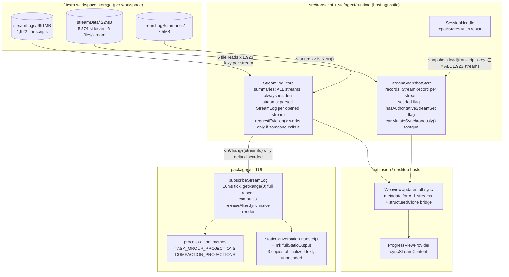
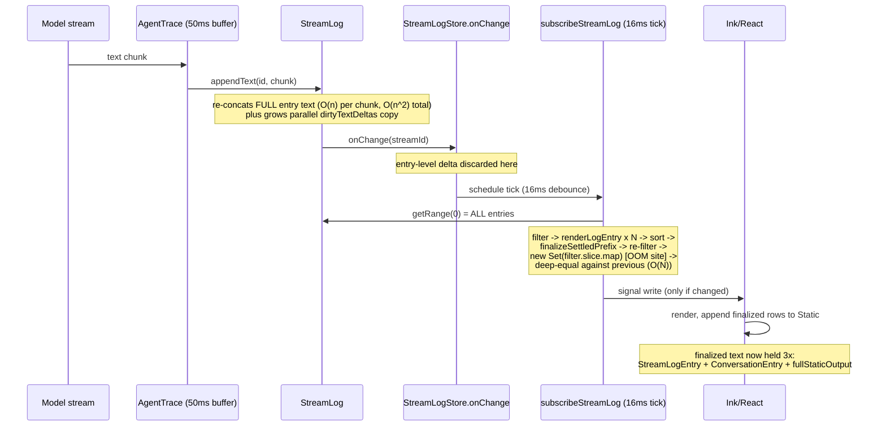
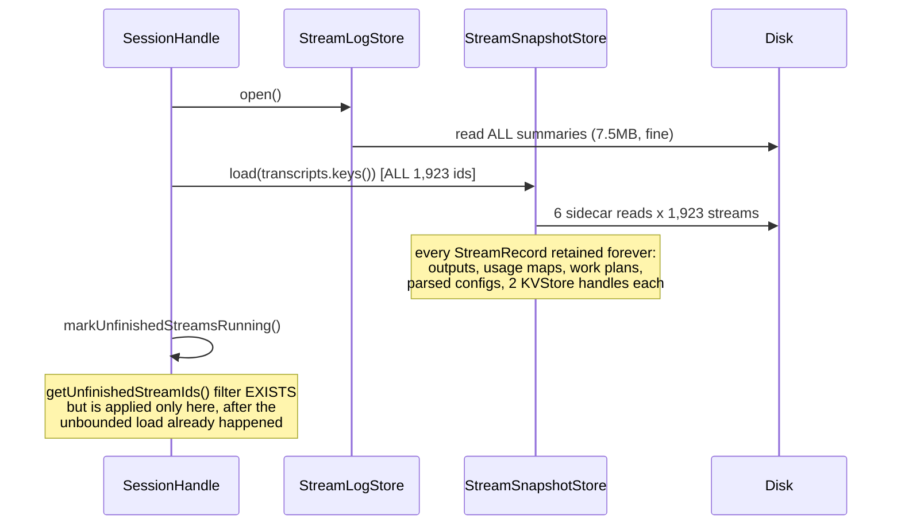
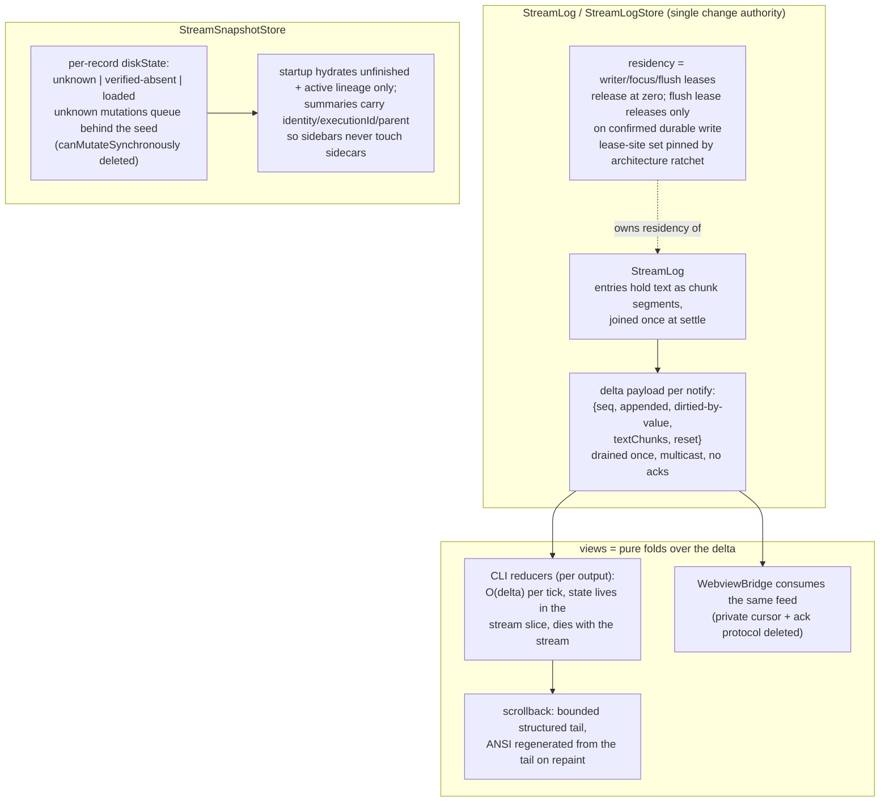

# PRD: Transcript, persistence, and projection architecture for long-lived sessions

**Status:** draft. Companion to the investigation in
`docs/dev/audits/2026-08-10-long-lived-session-memory-investigation.md`.
Tracks issues #9945, #9946, #9947.

**Problem in one line:** long-lived `texra` CLI processes die at Node's ~4 GB
heap limit after 30-47 hours, and the VS Code extension gets sluggish in long
sessions, because resident memory and per-update work both scale with total
workspace history instead of with the active delta.

## Evidence

Three OOM crashes (local `errorLogs/`, gitignored) all end with
`Ineffective mark-compacts near heap limit` at ~4 GB after 32-47 h of process
life. The fatal allocation frames map directly onto the hot paths below:

- `error8`: `SetConstructor` inside `ArrayMap` = the
  `new Set(next.filter().slice().map())` built at
  `packages/cli/src/chat/tui/state/subscribeStreamLog.ts:1021` on every 16 ms
  sync tick, for every stream.
- `error5`: `ArrayPrototypeReverse` + `ArrayMap` in the same projection family.
- `error4`: OOM at an `fs` read completion, consistent with sidecar/summary
  seeding.

The affected workspace (`TNLean`) has 1,923 persisted streams: 991 MB of
transcripts, 5,274 sidecar files (22 MB), 7.5 MB of summaries. The active run
at each crash was small (hundreds of KB). The heap is history, not the run.

## Current architecture

### Component and ownership map

Ownership as it stands: the stores own hydration but nobody clearly owns
release. `StreamLogStore.requestEviction` exists but its only production
caller is a flag computed inside the CLI render closure. The snapshot store
retains every seeded record until a `load()` with a smaller set happens, which
never does. The CLI memos are process-global and outlive stream eviction.

### Round trip 1: one streamed text chunk (CLI hot path)

Cost per chunk is O(total transcript), not O(chunk). The deep-equal that
suppresses the signal write runs after all the work is done.

### Round trip 2: startup

The extension/desktop analog: full progress-view sync rebuilds metadata for
every historical stream and ships it over a structured-clone bridge
(`WebviewUpdater.ts:325-370`, `desktopAgentExecution.ts:437-448`).

### Cross-cutting and ownership problems

1. **Release decided by rendering.** `releaseAfterSync` is computed inside the
   projection closure (`subscribeStreamLog.ts:1013-1016`); a terminal stream
   is only released if a sync happens to run for it. Lifecycle facts are
   available in `subscribeStreamStatus`, which does nothing with them.
2. **The change feed discards the change.** `StreamLogStore.onChange` reports
   only `streamId`. Every consumer that needs the delta must either rescan
   (CLI does) or maintain its own shadow state (the process-global memos do).
   One lossy feed has spawned two compensating systems.
3. **Flag conflation with a data-loss edge.** `hasAuthoritativeStreamSet`
   ("I know the full stream set") is used by `canMutateSynchronously`
   (`StreamSnapshotStore.ts:430-440`) to assert the per-record fact "this
   record is hydrated": it flips `seeded = true` without a disk read, so a
   mutation merges onto an empty base and persists empty+delta over the real
   sidecar.
4. **Silent degradation at 9 accessors.** Nine synchronous snapshot accessors
   return empty defaults for unseeded records with no error and no fallback,
   which is exactly the failure mode the repo's design guardrails call a
   defect.
5. **Duplicate representations.** Streaming text is held twice during a
   response (`entries[].text` + `dirtyTextDeltas`); finalized text is held
   three times (source entry, React row, Ink ANSI string); flow persistence
   `structuredClone`s + `JSON.stringify`s full state per transition.
6. **History-scaled work in every host.** CLI tick, extension full sync, and
   desktop presentation seed all do work proportional to total workspace
   history on paths that fire per event.

## Extension-host stickiness (investigated 2026-08-11)

A dedicated pass over the extension host found that the CLI's central defect
does not exist there: `WebviewBridge`
(`src/controllers/progressView/backend/WebviewBridge.ts:118-160`) is already
cursor-based. Per 16 ms frame it ships `getRange(cursor, head)` plus dirty
deltas, only for the active stream, and advances the cursor on ack. The
extension also already evicts finished transcripts on terminal transition and
tab switch (`SessionFactApplier.ts:510-512`, `SessionState.ts:185-189`).

This is the sharpest cross-cutting fact in the whole investigation: **the
repo contains both the correct pattern (extension: cursor + delta + ack) and
the broken one (CLI: full rescan per tick) for the same problem.** The CLI
projection is a second, worse system, exactly the dual-system smell the design
guardrails ban.

The extension's sluggishness has three separate causes, all event-shaped
rather than tick-shaped:

1. **One VS Code `OutputChannel` per run, never disposed.**
   `src/transcript/runTrace.ts:76` names the channel after the streamId
   (unique per run); `src/logger/logUtils.ts:49` holds channels in a
   module-level map that is only ever `.set()` or `.clear()`, never
   `.delete()`. Every agent run and every delegated child mints a live
   `OutputChannel` (extension-host object, renderer registration, spool file,
   Output-view dropdown entry) that survives for the life of the host. A
   multi-day session accumulates hundreds to thousands. This degrades VS Code
   itself, not just the extension.
2. **`executions/**` watcher drives a full history rescan per write burst.**
   `SettingsViewMessageHandler.ts:287-322` watches the entire executions tree
   (2,270 dirs in TNLean); each event debounces 300 ms into
   `listExecutions()`, which re-reads meta + run record for every execution
   directory (thousands of reads and Zod parses per refresh). `PersistedFlow`
   persists after every node execution, so during an active run this executes
   back-to-back continuously. The gate is "Dashboard webview exists", and the
   Dashboard is a `retainContextWhenHidden` panel, so a background tab keeps
   it running invisibly for days.
3. **`syncFullView` rebuilds all ~1,923 stream tabs on every visibility
   toggle.** `ProgressViewProvider.ts:287-317` →
   `WebviewUpdater.sendStreamMetadata` (`:327-375`) rebuilds
   `StreamTabInfo` + metadata for every persisted stream and posts a ~1-2 MB
   structured-clone payload; it fires on webview ready, theme change, sidebar
   show, pop-out, and every `onDidChangeViewState` when the user switches back
   to the panel. This is the direct match for "sticky when I come back to the
   view". A per-stream worktree-info LRU capped at 32 entries thrashes and
   spawns `git rev-parse`/`git status` subprocesses beyond 32 distinct
   working directories.

Secondary, lower magnitude: `StreamStatusService.getAllStreamStates()`
allocates a fresh Map of every stream ever touched per status event (the
status-bar tracker triggers four such allocations per event); `SessionState`
retains a `StreamSessionState` (including the full run instruction string)
for all 1,923 streams after load; `MainViewProvider`'s workspace file watcher
runs an undebounced full `findFiles('**/*')` per created/deleted file, which a
LaTeX compile burst triggers once per artifact.

## Target architecture

The target design was selected by a four-way design tournament (independent
proposals under a delete-first, a delta-feed, a residency-manager, and a
storage-split thesis) scored by a three-judge panel. The delta-feed thesis
("Source-Fed Views") won 2 of 3 judges; the panel then grafted the winners'
gaps from the losers. All four designs independently converged on the same
verified core: the store already computes the delta it discards at `notify()`;
`canMutateSynchronously` fabricates per-record state from a global flag;
eviction must move from render closures to lifecycle; and no LRU is needed
anywhere. The decisive argument for the delta feed: once the full rescan is
deleted, the worst regression class is an in-place mutation site that forgets
to mark dirty, producing silently stale rows in every host; only the delta
design makes that mechanically checkable, via a fold-vs-oracle equivalence
harness whose from-scratch path doubles as the production resync path.

Component summary of the grafted architecture:

- **Delta contract:** `notify` carries an immutable
  `{seq, appended entries, dirtied entries by value, textChunks, reset}`
  payload. A dirtied entry supersedes buffered text chunks for its id.
  Emission seq is monotonic; a detected gap triggers a `getRange(0)` resync
  that shares the oracle code path.
- **Streaming text:** entries hold chunk segments, joined at settle. Both
  quadratic re-concats and `dirtyTextDeltas` die.
- **Save path:** a max-wait throttle replaces perfect-debounce; mutators call
  a void `scheduleSave()`, and only `flush()` is awaitable.
- **Residency:** writer/focus/flush leases with release at zero, a
  zero-residency one-shot read API for ExecutionsTool-style readers, a debug
  dump of resident streams with lease reasons and byte gauges, and a kernel
  architecture ratchet pinning the closed set of lease-acquisition sites.
- **Snapshot store:** per-record `diskState` tri-state; `verified-absent`
  only from stream minting or a one-stat probe. Overlay/replay machinery is
  retained and shrunk later behind a per-mutator caller audit.
- **Startup:** hydration bounded to unfinished plus active lineage. The
  persisted summary widens (derived tier per #9434: rebuild loudly, never
  migrate, never `.catch`) with identity, executionId, and parentStreamId,
  with lazy backfill for the ~4,610 legacy rows. The 9 silent-empty accessors
  go loud one full release before the bounding lands.
- **CLI:** five per-output reducers folding the delta; background streams
  render zero transcript entries; projection state moves into the stream
  slice and the module-global memos are deleted as globals (memo semantics
  kept, relocated, lifetime tied to the stream).
- **Extension/desktop:** WebviewBridge consumes the same feed; bounded
  metadata wire list from a single sorted source; theme changes send
  `THEME_SET` alone; git worktree probes gated to active/running streams;
  the executions history watcher registered only while a settings webview is
  actually active.
- **Flow persistence:** point fixes only (compact JSON, skip the self-cache
  Zod re-parse, `run()` returns shared state, workflow snapshot cloned at
  drain into its own `workflow.json` key).

## The top 5 changes

Ranked by operations cut times memory cut over risk. Shippable in this order;
each step is independently landable.

### 1. Store-emitted delta feed + O(delta) CLI reducers (#9946 rescoped)

Pattern: one authoritative change channel; every view is a pure fold.
Deletes: the CLI per-tick full rescan (`getRange(0)`, id-map rebuild, the
`subscribeStreamLog.ts:1021` filter/slice/map/Set chain that is `error8`'s
fatal allocation, the reverse+second-sort pass, `forceFull`,
`dedupeEntry`/`entriesEqual`/`toolUseSourceCache`), StreamLog's destructive
ack protocol (~150 LoC), and WebviewBridge's private cursor (~120 LoC).
Adds: the delta type + `mergeDelta` (~110 LoC) and a test-only harness. Net
strongly negative. Scope: `src/transcript/StreamLog.ts`, `StreamLogStore.ts`,
`packages/cli/.../subscribeStreamLog.ts`, extension `WebviewBridge`. Risk:
medium. Required test: the fold-vs-oracle equivalence property test (fold
over deltas deep-equals from-scratch projection) with a fuzz corpus covering
appendText/update/settle interleavings and GROUP upserts.

### 2. Tri-state disk provenance, then bounded startup + summary metadata view (#9947 rescoped)

The provenance fix ships first as its own small PR: delete
`hasAuthoritativeStreamSet` and `canMutateSynchronously`, replace with the
per-record `diskState` tri-state; unknown mutations queue behind the seed.
Then bound startup to unfinished + active lineage and widen summaries so the
sidebar never touches sidecars; delete the load/preload fork, the ~15k-read
startup sweep, SessionState's all-streams loop, desktop's second pass, and
the cached Keyv handles. Risk: highest of the five (the 9-accessor caller
audit), mitigated by shipping loud unhydrated-access warnings one full
release before the bound. Required test: the clobber regression (mutate a
stream whose sidecar exists on disk but is absent from `transcripts.keys()`;
assert merge, not overwrite).

### 3. Chunked streaming text + max-wait save throttle

Deletes both quadratic per-chunk re-concats, the `dirtyTextDeltas` duplicate
string, `pendingSaveAwaiters`, and perfect-debounce on the save path. Adds
`textChunks` with a memoized join and the flushable-throttle idiom already in
`@utils/core`. Scope: `StreamLog.ts` + `StreamLogStore.ts` only. Risk: low.
Required test: cadence test that sustained sub-300 ms appends still produce
periodic durable writes; text-materialization equivalence in the harness.

### 4. Lease residency + lifecycle-owned eviction (#9945 rescoped)

Deletes the five-flag eviction interlock (~150 LoC), `releaseAfterSync` in
the render closure, and the module-global TASK_GROUP/COMPACTION maps as
globals (memo relocated into per-stream slice state that dies with the
stream). Adds writer/focus/flush leases (~60 LoC), a zero-residency
`readEntries`, the residency debug dump, and the lease-site architecture
ratchet. Risk: medium (an unpaired lease is a new leak class, countered by
the dump plus the closed-site ratchet). Required test: soak test that after N
child completions plus forced GC, retained heap returns to a bounded
envelope.

### 5. Bounded static scrollback tail + regenerate-ANSI repaint

Deletes the per-tick seen-Set diff, the char-by-char stripAnsi re-walk of all
finalized entries, the double `buildFreshItems` run, and the unbounded
`items`/`fullStaticOutput` growth. Adds a row/byte ring at
emulator-scrollback scale with trim hysteresis, settled-cursor append
(depends on item 1), and ink-patch regeneration from the structured tail on
clear-and-reprint. Scope: `StaticConversationTranscript.tsx`,
`transcriptEntries.ts`, `patches/ink@7.1.1.patch`. Risk: medium (vendored
ink patch). Required test: tmux TUI drive of overflow/resume/resize against a
clean-main baseline, plus a budget invariant test.

## Issue mapping

- **New blocker issue to file:** "Per-record disk provenance in
  StreamSnapshotStore (delete canMutateSynchronously /
  hasAuthoritativeStreamSet)", extracted from #9947. Ships before everything,
  with the clobber regression test.
- **#9946:** rescope to store-emitted entry-level deltas (appended range +
  dirtied entries by value + text chunks + emission seq); renderer-side
  cursors are out. Includes the CLI reducer split and the WebviewBridge port
  that deletes the ack protocol. Every PR gated on the equivalence harness.
- **#9945:** rescope. Eviction moves to lifecycle via leases. Drop the
  "delete TASK_GROUP_PROJECTIONS" wording: the memo survives, relocated into
  per-stream slice state.
- **#9947:** close the LRU half (the resident set is small by construction
  once residency is lease-owned). The remainder becomes top-5 item 2.
- **New issues to file:** (a) chunked text + save throttle (item 3);
  (b) bounded static tail + ink repaint (item 5); (c) extension-edge bounding
  (bounded `sendStreamMetadata` wire list from a single sorted source,
  `THEME_SET`-only theme handling, gated git probes, executions watcher
  registered only while the settings webview is active); (d) flow-persistence
  point fixes; (e) overlay-arm shrink, gated on the per-mutator caller audit;
  (f) dispose per-run `OutputChannel`s: `runTrace.ts:76` +
  `logUtils.ts:49` currently mint one live VS Code output channel per run and
  never delete it, a host-level resource leak independent of the heap work.

## Explicitly rejected

Tournament losers, recorded so effort is not wasted re-proposing them:

- **6-file to single-file sidecar collapse:** silent cross-host data loss
  under version-skewed hosts sharing `~/.texra`; bounded load already
  neutralizes the read cost.
- **A ResidencyLedger subsystem:** a refcount plus a 20-line debug dump
  yields identical deletions without a new subsystem.
- **Any LRU** (logs or snapshot records): resident set is small by
  construction once residency is lease-owned.
- **Event-log rewrite of PersistedFlow:** per-turn full-record checkpointing
  is defensible; delta capture/replay/compaction is three new elements for a
  3-node graph.
- **Replacing the meta.json FK with derived index rows:** a stale derived row
  silently mis-wires restart repair; executionId goes into the summary as a
  bounded convenience, meta.json stays authoritative.
- **Deleting the overlay/replay machinery up front:** unearned until the
  per-mutator caller audit; it becomes hot-path load-bearing under lazy
  loading.
- **Deleting the task-group memo:** refuted in review; relocate, keep.
- **Trim-via-renderKey with no ink patch change:** mechanically unsound;
  Static re-renders from index 0 and duplicates the entire tail to stdout on
  every trim.
- **Extending the ack/cursor protocol to the CLI:** single-consumer by
  construction; the protocol is deleted, not adopted.
- **An mtime cache for the shared-storage history listing:** accepted
  recompute; the real fix is registering the watcher only while a settings
  webview is active.

## Test strategy

- Property test for any incremental projection: incremental result equals
  from-scratch result for the same log, on every tick, under randomized
  in-place mutation. This is the only reliable guard for the settled-prefix
  and synthetic-merge ordering semantics.
- Soak test: hundreds of short child executions; after terminal transitions
  and forced GC, retained heap must return to a bounded envelope.
- Heap-snapshot confirmation before the multi-host hydration change
  (`--heapsnapshot-near-heap-limit=3`), per the audit's measurement plan.
