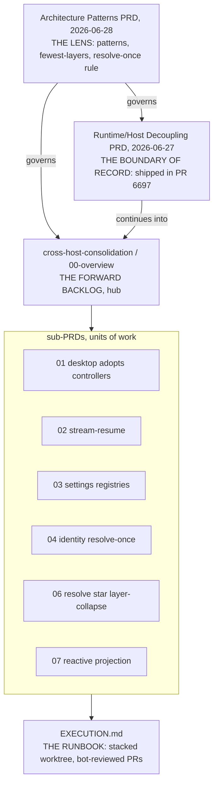
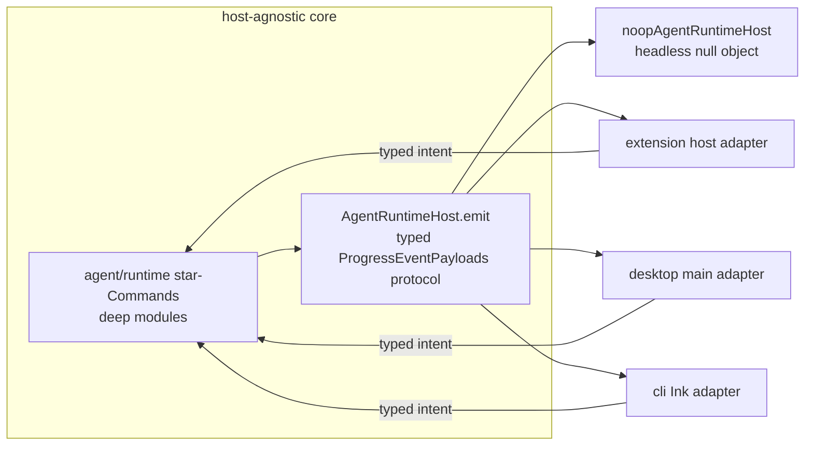
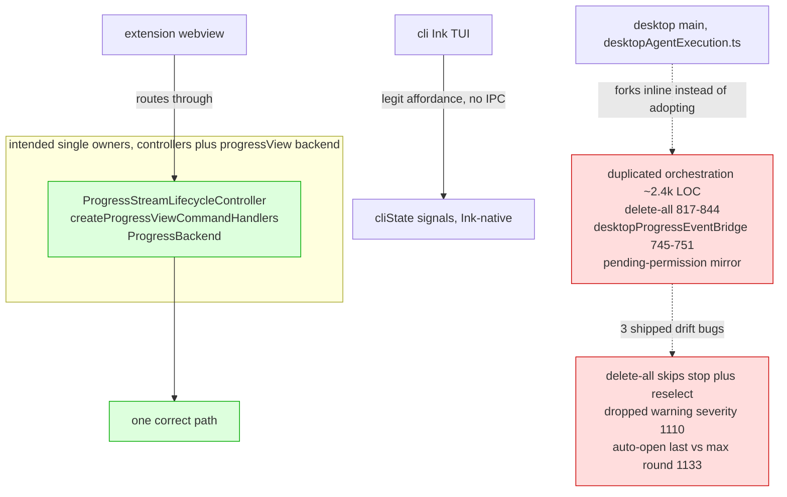
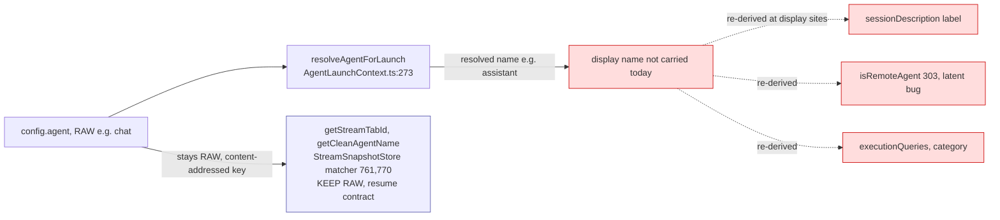
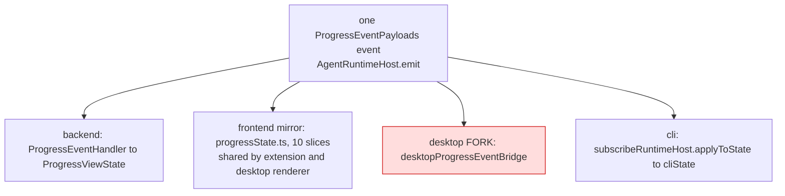
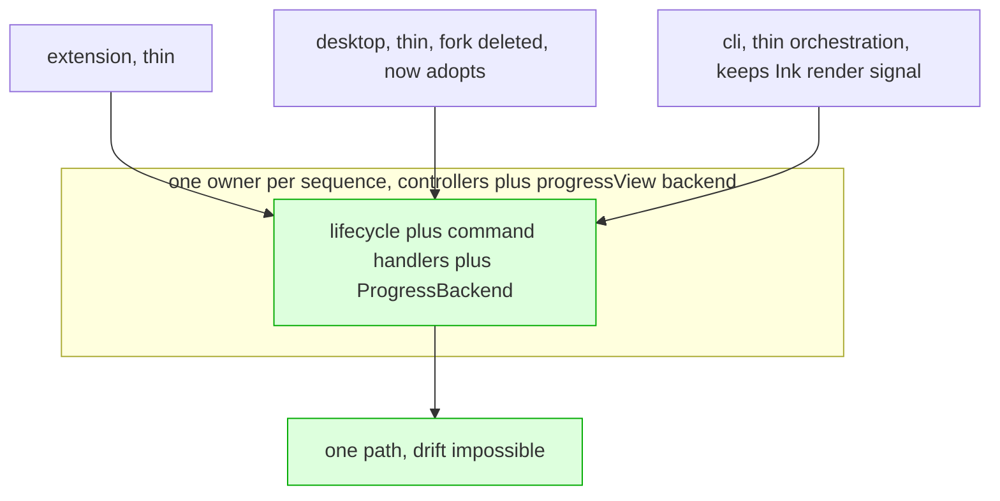
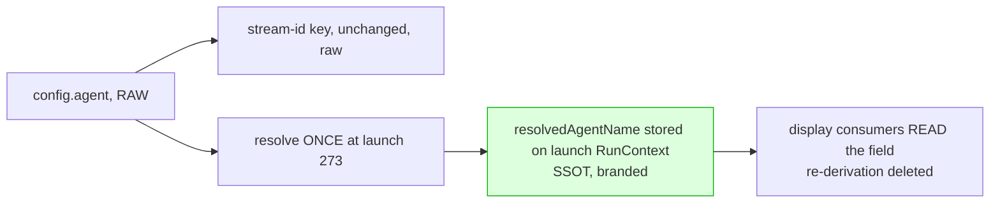
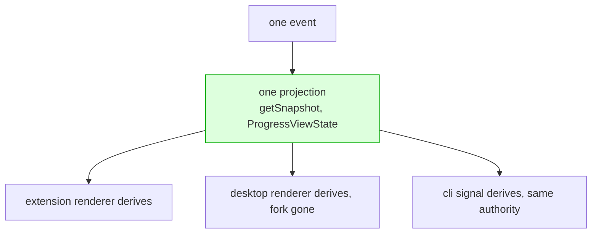
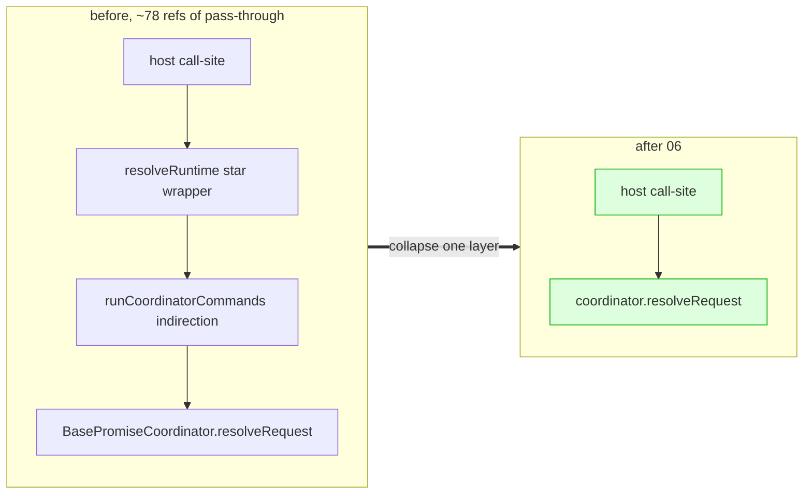
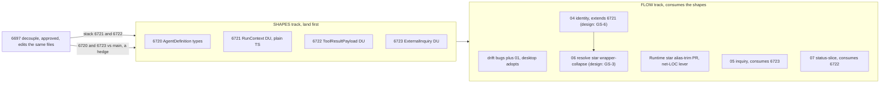

# Architecture Map: The Couplings Now (and the Program Order)

Visual companion to the consolidation program. The diagrams show the **current**
state - where the three hosts couple to the core and to each other, and where the
duplication the sub-PRDs remove actually lives. Mermaid renders on GitHub.

## How the documents fit (reading order vs execution order)

The three PRD layers are read top-down, even though the filename dates run the
other way (the patterns PRD is dated later but reads first).

Reading order: **patterns, then decoupling, then 00-overview, then sub-PRDs, then
EXECUTION.** Execution order is a different axis (see the last diagram).

## 1. The runtime to host boundary (the part that is already sound)

One host-agnostic core speaks to every host through a single typed protocol. This
is correct and stays verbatim; the consolidation does not touch it.

Three-hop spine (see the patterns PRD's Overriding Objective).

## 2. The cross-host coupling map (the drift = the problem)

The residual change-amplification is one layer up, in host orchestration, and it
is concentrated in the extension/desktop pair. The extension routes board and
settings actions through the host-neutral owners; the **desktop re-implements the
same sequences inline and has drifted**; the CLI legitimately differs (Ink TUI,
not a webview rail).

Sub-PRD 01 makes desktop _adopt_ `CTRL` and deletes `FORK`; the drift bugs land
first as tiny fixes (P0). The CLI fork is kept on purpose.

## 3. Agent identity: resolved once, carried at one site, re-derived at display sites (04)

(resume-id contract — see sub-PRD 04)

## 4. ProgressView: one event, four reducers (07)

The same `ProgressEventPayloads` event is reduced up to four times into three
stores plus a desktop fork. A board-state change must be authored in four places
and the copies lag.

Sub-PRD 07 (status-slice now, delta-patch deferred) folds status + display
identity + pending approvals into one projection, deletes the desktop fork (R3),
and unifies the backend/frontend shapes so the mirror reducer (R2) can be
collapsed later. The CLI reducer (R4) stays on the same status authority.

## 5. Target couplings (the new design) - the same views, cleaner

The boundary (diagram 1) is unchanged: it is already sound. The problem diagrams
above collapse to these. Fewer nodes, no red forks, no dashed drift edges - that
compression **is** the win. The one preserved nuance is the live-fact exception
(`RunContext.model` stays a getter; the CLI keeps its Ink-native render signal);
the target is "one owner," not "one host."

**5a. Cross-host: every host a thin adapter on one owner (after 01).**

**5b. Identity: resolve once, store, read (after 04).**

**5c. ProgressView: one reducer, hosts derive (after 07).**

**5d. resolve star: collapse indirection layers (after 06).** The field audit
found no store-at-source wins (see sub-PRD 06 for the audit result); the real
subtractive move is deleting the `resolveRuntime star` wrapper layer over the
coordinator, not storing data.

The visual test for "cleaner" is literal: count the edges and the red nodes in
sections 2-4 versus section 5. The program is done when the left side cannot be
drawn anymore.

## 6. The two tracks and the execution order

The discriminated-union PRs and the sub-PRDs are one program on two facets:
**SHAPES** (parse-once-at-the-edge DTOs) land first; **FLOW** (one owner per
sequence) consumes the canonical shapes.

Merge/execution order lives in `EXECUTION.md`. Add `npm run typecheck` to the merge gate (esbuild strips
types; no branch protection).

> **Resolve star audit:** see sub-PRD 06 for the audit result. The data model is
> already SSOT-clean; the subtractive budget is the `resolveRuntime star`
> wrapper-collapse plus two CLI inline culls, not any new store.
