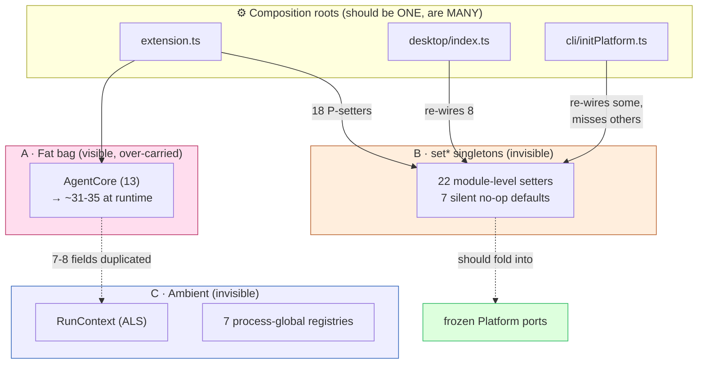
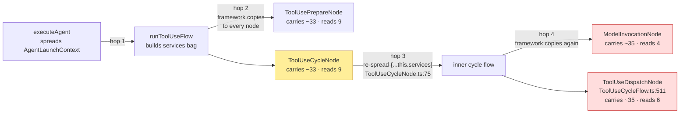
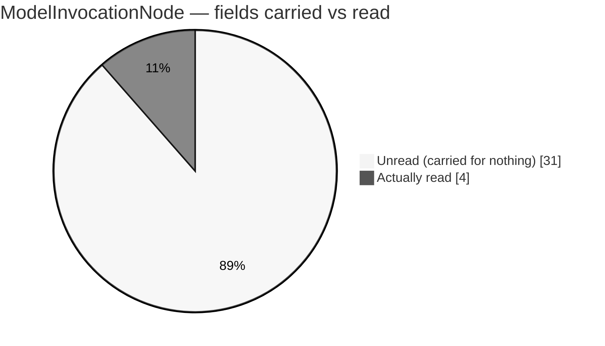
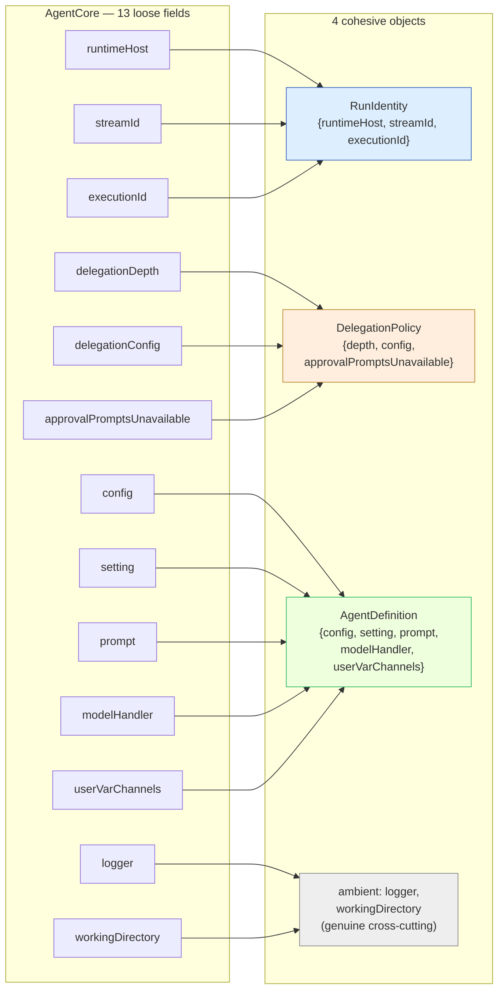
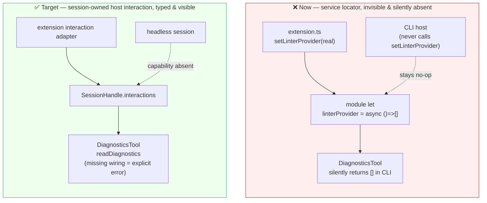
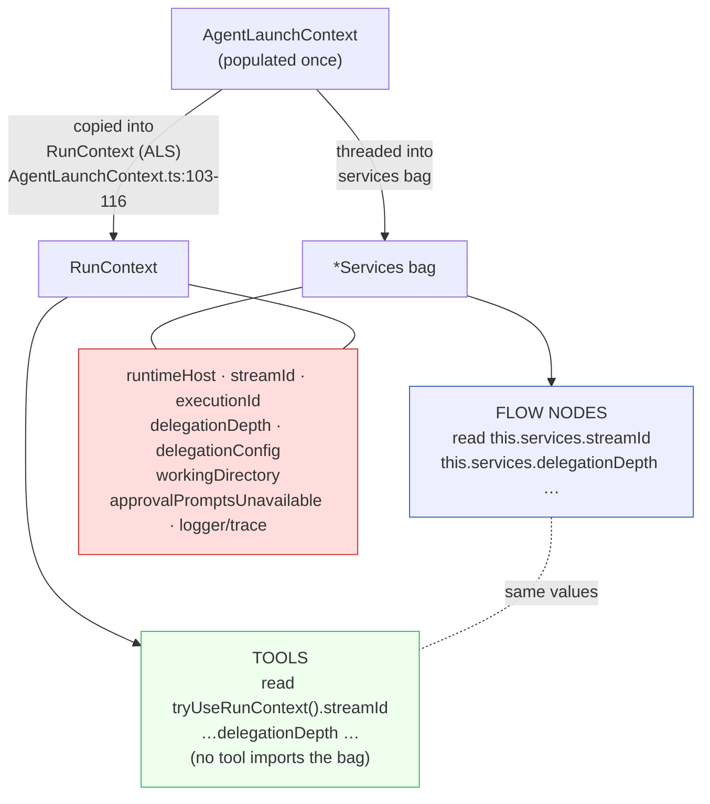
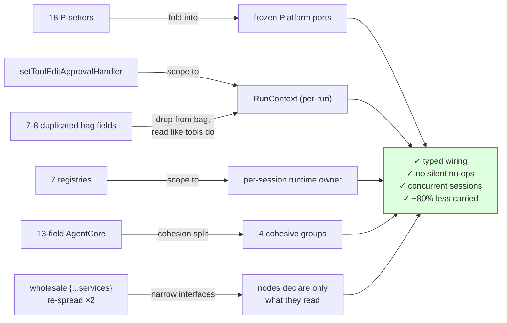

# Dependency Injection Cleanup — "Deep Injection" Audit & Plan

**Status:** Partially landed audit (2026-06-07; status addenda 2026-06-10 and
2026-07-04 — see below). Findings verified against current source; plan steps
1–5 not yet implemented.
**Scope:** How dependencies flow through the agent core — `src/agent/` (runtime, flows, toolUse), `src/tools/`, `src/platform/`, and the host composition roots (`packages/extension/src/extension.ts`, `packages/desktop`, `packages/cli`).
**Target:** Make every dependency **visible at the point it is used**, **wired once** at a single composition root, **scoped** to the right lifetime (process vs. run vs. tool-call), and **carried only where read**.
**Related:** [`2026-05-30-agent-sdk-readiness.md`](./2026-05-30-agent-sdk-readiness.md) (process-global registries as the concurrency blocker), [`2026-05-17-logger-simplification-feasibility.md`](./2026-05-17-logger-simplification-feasibility.md). See also `CLAUDE.md` → "Discouraged Factory Patterns", "Flattening Abstraction Layers", "Separation of Concerns: VS Code Coupling".

> **Status addendum (2026-06-10, from the [`2026-06-10-error-pipeline-and-ownership.md`](./2026-06-10-error-pipeline-and-ownership.md) audit):**
>
> - **Plan step 6 is now PARTIAL:** SDK-readiness Steps 7a–c landed — `interruptRegistry`, `executionRegistry`, and `runCoordinatorBridge` are classes with module-default instances + delegators (`InterruptRegistry` / `ExecutionRegistry` / `RunCoordinatorBridge`). Residue (audit §15): the `clearAll*` path and one remaining module-level subscription. 7d (`SessionHandle`) is the remaining piece.
> - **Registry inventory grows by one:** `executionSubscriptionBinder` (`ExecutionSubscriptionBinder.ts`) belongs in the Finding-C list and in the 7d composition.
> - **`AgentCore` is still 13 fields but with different membership** (`streamStatus` added 06-08; `delegationConfig` deleted 06-09, `092358d86`); the cohesion split in Finding A should place `streamStatus` with `RunIdentity`-adjacent runtime wiring and drop `delegationConfig` from the `DelegationPolicy` group when step 3 lands.
> - **Re-spread cites drifted:** `ToolUseCycleNode.ts:76` / `ResponseCycleNode.ts:95` (was :75/:94). Anchor on the `{...this.services}` clause text, not line numbers.
>
> **Status addendum (2026-07-04, from the 2026-07 tech-debt D2 sweep):**
>
> - **The old idle-continuation registry entry is no longer live:** that module
>   has been deleted. It is removed from the live process-global registry
>   inventory below; earlier references to the "7 registry" framing are
>   historical.

## How this was produced

A multi-agent read-only audit: three parallel deep agents each owned a non-overlapping slice — (A) the `AgentCore` context-bag threading, (B) the module-level `set*` singletons, (C) AsyncLocalStorage and process-global registries — plus a broad initial sweep. Each agent reported `file:line` for every claim and re-opened the cited code. Two early suspicions were **rejected on inspection** (`outputState` and `modelSwitchState` are properly threaded, not ambient; `TraceEmitter.stageScope` is deliberately per-instance and correct) — those rejections are recorded below because they mark traps.

## TL;DR — verdict

TeXRA already has **one genuinely clean DI seam**: `platform()` (`src/platform/platform.ts`) — a frozen, single-call composition root over small vscode-free ports. The problem is that **three other dependency-flow mechanisms grew up around it** instead of through it, and they now overlap:

1. **A fat context bag** (`AgentCore` → `*Services`): 13 declared fields that balloon to **~31–35 at runtime** because the bag is spread wholesale into nested flows. Nodes read **3–9** fields while carrying 31–35 — **~70–90% is dead weight** at each node.
2. **22 module-level `set*` singletons** (service-locator style): host capabilities injected via mutable module globals. **7 have silent no-op defaults**; several are unavailable in at least one non-extension host, so they silently no-op outside the happy path. **8 are written from multiple composition roots.**
3. **Ambient state** (AsyncLocalStorage + 7 process-global registries): `RunContext` and `ToolCallContext` plus the runtime registries that — per [`2026-05-30-agent-sdk-readiness.md`](./2026-05-30-agent-sdk-readiness.md) — block concurrent in-process sessions.

**The headline finding:** mechanisms A and C carry **the same 7–8 fields at once**, and the two halves of the codebase disagree on which is canonical — **flow nodes read them from the bag, tools read them from `RunContext`**. That split-brain is the strongest evidence that bag-threading those fields is redundant, and it tells us the migration target is already chosen by the code.

**The fundamentals** (Mark Seemann, _Dependency Injection_; ISP; functional-core/imperative-shell) all point the same way: depend on narrow interfaces, wire once at one root, scope to the right lifetime, carry only what you read.

---

## The three mechanisms at a glance



| Mechanism                                        | Count                      | Visibility at call site            | Lifetime scope   | Verdict                                                                |
| ------------------------------------------------ | -------------------------- | ---------------------------------- | ---------------- | ---------------------------------------------------------------------- |
| **A. Fat context bag** (`AgentCore`→`*Services`) | 13 fields → ~31–35 runtime | Visible in types (but understated) | Per run          | Over-carried; split into cohesive objects + narrow interfaces          |
| **B. `set*` module singletons**                  | 22 injectors               | Invisible                          | Process (mostly) | Fold 18 into `Platform`; scope 1 to `RunContext`; 3 are test-only      |
| **C. ALS + process registries**                  | 3 ALS + 7 registries       | Invisible                          | Run / process    | Keep `RunContext` (good), de-dup vs. bag; registries block concurrency |

---

## Finding A — the fat context bag

### The inheritance chain

The root is `AgentCore<C>` (`src/agent/implementations/flows/common/BaseFlowServices.ts:18`). Every flow-service interface extends it through `BaseFlowContextInit`, but the cycle-service interfaces are siblings of the flow-specific interfaces, not children of them:

```
AgentCore (13)                         BaseFlowServices.ts:18
  └─ BaseFlowContextInit (+4 = 17)     BaseFlowServices.ts:53
       ├─ ReflectionServices (+~9)     ReflectionServices.ts:18      → ~26 declared
       ├─ ToolUseServices (+~16)       ToolUseServices.ts:15         → ~33 declared
       ├─ ResponseCycleServices (+5)   CycleServices.ts:19           → 22 declared / ~31 runtime
       └─ ToolUseCycleServices (+6)    CycleServices.ts:30           → 23 declared / ~35 runtime
```

The declared inheritance is only **2 levels deep** after `AgentCore`, but the _runtime_ object is larger than the declared cycle interface because the outer bag is **spread wholesale** into the inner cycle (`{...this.services, ...}`) rather than narrowed. TypeScript understates what is actually carried.

### The bag travels 4 hops and is re-spread twice



The two re-spread sites are `ResponseCycleNode.ts:94` and `ToolUseCycleNode.ts:75`. The other `setServices` calls are the initial injection or framework plumbing (`persistedFlow.ts:185`, `node/index.ts:292`) that hands the _same_ bag to every node in a flow.

### Read-vs-carried per node

| Node                  | File                                   | Carries | Reads (distinct) |
| --------------------- | -------------------------------------- | ------- | ---------------- |
| `MediaExtractionNode` | reflection/nodes                       | ~26     | 4                |
| `OutputNode`          | reflection/nodes                       | ~26     | 6                |
| `PrepareContextNode`  | reflection/nodes                       | ~26     | 3                |
| `TeXCountNode`        | reflection/nodes                       | ~26     | 3                |
| `ResponseCycleNode`   | reflection/nodes                       | ~26     | 6 (+re-spreads)  |
| `ToolUsePrepareNode`  | tooluse/nodes                          | ~33     | 9                |
| `ToolUseCycleNode`    | tooluse/nodes                          | ~33     | 9 (+re-spreads)  |
| `ToolUseWaitNode`     | tooluse/nodes                          | ~33     | 5                |
| `ModelInvocationNode` | core/flows                             | ~35     | 4                |
| `ToolUseDispatchNode` | core/flows (`ToolUseCycleFlow.ts:511`) | ~35     | 6                |



### Cohesion: 13 loose fields → 4 objects

Grouping verified by which fields are read **together at the same call sites** (not guessed):



| Group              | Fields                                                                                                        | Evidence of co-usage                                                                         |
| ------------------ | ------------------------------------------------------------------------------------------------------------- | -------------------------------------------------------------------------------------------- |
| `RunIdentity`      | `runtimeHost, streamId, executionId`                                                                          | `ToolUseCycleNode.ts:45-62`, `OutputNode.ts:263`, `contextHelpers.ts:36-48`                  |
| `DelegationPolicy` | `delegationDepth, delegationConfig` (+ `approvalPromptsUnavailable`; `stopAfterCycle` is launch-context only) | `DelegationTools.ts:354-359, 1070-1073`; `AgentLaunchContext.ts:112-115`                     |
| `AgentDefinition`  | `config, setting, prompt` (+ `modelHandler, userVarChannels`)                                                 | `ResponseCycleNode.ts:69-71`, `AgentLaunchContext.ts:281-298`, `ToolUsePrepareNode.ts:24-78` |
| ambient            | `logger` (read by nearly every node), `workingDirectory` (tools only)                                         | n/a — genuine cross-cutting                                                                  |

---

## Finding B — the 22 `set*` module singletons

### Pattern: service locator with a silent default



### Classification

- **18 → `Platform` ports (P):** process-lifetime host capabilities that belong on the frozen `Platform` object.
- **1 → `RunContext` (R):** `setToolEditApprovalHandler` — conceptually the _active session's_ approval channel, currently a single module global mutated by whichever host UI is active.
- **3 → test-only / justified lazy singleton (T):** `setDefaultStreamLogStore`, `setTierService`, `setServerSideKeyService`.

### Full inventory

| Setter (file:line)                                                   | Default                   | Class       | Multi-root?           | Silent no-op?            |
| -------------------------------------------------------------------- | ------------------------- | ----------- | --------------------- | ------------------------ |
| `setLinterProvider` `DiagnosticsTool.ts:12`                          | `async () => []`          | P           | —                     | **yes**                  |
| `setAddCriticismSink` `AddCriticismTool.ts:48`                       | `{accepted:false}`        | P           | —                     | **yes**                  |
| `setOpenPdfOpener` `OpenPdfTool.ts:42`                               | undefined                 | P           | —                     | no (guarded error)       |
| `setOpenBuildDisplay` `approval/latexPreview.ts:34`                  | `async () => {}`          | P           | **ext+desktop**       | **yes** (no-ops in CLI)  |
| `setToolMissingHandler` `utils/system/toolUtils.ts:58`               | `() => {}`                | P           | —                     | **yes**                  |
| `setToolNotificationHandler` `toolUnavailableNotification.ts:28`     | `() => {}`                | P           | —                     | **yes**                  |
| `setGitHubTokenProvider` `github/githubAuth.ts:15`                   | `() => undefined`         | P           | —                     | **yes**                  |
| `setLeanLanguageServices` `lean/leanLanguageServices.ts:53`          | undefined (getter throws) | P           | **ext+desktop+cli**   | no                       |
| `setSetupPlatform` `setup/platform.ts:104`                           | undefined (getter throws) | P           | —                     | no                       |
| `setRunStorageService` `runtime/RunStorageService.ts:17`             | `isViewVisible:()=>false` | P           | **ext+desktop**       | **yes**                  |
| `setGitAuthorEnv` `utils/system/gitAuthorEnv.ts:16`                  | `{}`                      | P           | **3 funnels**         | benign                   |
| `setWorktreeSupportEnabled` `worktreeConfig.ts:14`                   | `false`                   | P           | **3 funnels**         | intended off             |
| `setOutputChannelFactory` `logger/logUtils.ts:140`                   | `null`                    | P           | **ext+cli**           | null sink (desktop)      |
| `setAgentDirectories` `index/agentDirectoriesRegistry.ts:11`         | `null` (getter throws)    | P           | **ext + core module** | no                       |
| `setRuntimeSkillSources` `skills/runtimeSkills.ts:13`                | `[]`                      | P           | cli only              | silent (cli-only)        |
| `setRuntimeExtensionId` `auth/config.ts:102`                         | `null` (const fallback)   | P           | —                     | benign                   |
| `setExternalAuthCallbackResolver` `auth/config.ts:151`               | `null`                    | P           | —                     | benign                   |
| `setToolEditApprovalHandler` `approval/toolEditApproval.ts:118`      | undefined                 | **R**       | **4 sites / 3 hosts** | falls back to controller |
| `setDesktopAgentResumeHandler` `desktop/.../desktopAgentResume.ts:7` | undefined (`?? false`)    | P (desktop) | —                     | benign                   |
| `setDefaultStreamLogStore` `transcript/StreamLogStore.ts:789`        | lazy `new`                | T           | —                     | no                       |
| `setTierService` `auth/tier/index.ts:46`                             | lazy `new`                | T           | —                     | no                       |
| `setServerSideKeyService` `auth/serverKeys/index.ts:52`              | `null` (getter throws)    | T           | —                     | no                       |

**Correctly-scoped already (not the anti-pattern, listed for completeness):** `setBashApprovalSessionBypass` / `setToolEditApprovalSessionBypass` are stream-keyed controllers (`createStreamApprovalController` map keyed by `streamId`), not singletons.

### The two worst offenders

1. **`setToolEditApprovalHandler`** — written from 4 call sites across 3 hosts into one module global; should be per-run state.
2. **`setAgentDirectories`** — written from a host (`extension.ts:161`) **and** a core module (`platformAgentDirectories.ts:75`): two composition roots writing one global.

### The silent-no-op trap

7 setters default to a no-op. Depending on host, examples such as the linter, manual criticism, build display, tool-missing toasts, tool-unavailable notifications, and the GitHub token are **silently absent with no error**. Folding into typed `Platform` ports turns each missing wiring into a compile error instead of a silent runtime gap.

---

## Finding C — ambient state (ALS + registries)

### Split-brain: the same fields sourced two ways



**7–8 of `AgentCore`'s 13 fields are also in `RunContext`** (`RunContext.ts:18-49`, populated from the same `ctx` at `AgentLaunchContext.ts:103-116`): `runtimeHost`, `streamId`, `executionId`, `delegationDepth`, `delegationConfig`, `workingDirectory`, `approvalPromptsUnavailable`, plus `logger`/`trace` if counted as the same underlying trace object. Flow nodes read them from the bag; tools read them from `RunContext` (`contextHelpers.ts:23,41,48`, `DelegationTools.ts:353-359`). Same data, two paths.

### The three AsyncLocalStorage instances

| ALS                 | File:line                          | Shape                 | Assessment                                                                                                                                           |
| ------------------- | ---------------------------------- | --------------------- | ---------------------------------------------------------------------------------------------------------------------------------------------------- |
| `runContextScope`   | `RunContext.ts:70`                 | single value, per run | Good seam; but duplicates 7–8 bag fields. `tryUseRunContext()` silently returns `undefined` outside scope.                                           |
| `contextStackScope` | `ToolFileInteractionContext.ts:34` | **stack**             | `getCurrentToolCallContext()` reads `.at(-1)` (`:49`) — a tool that spawns a sub-cycle then reads context gets the **child's** tracker, not its own. |
| `stageScope`        | `TraceEmitter.ts:49`               | per-instance          | **Correct by design** — per-instance prevents cross-trace stage leakage. Do not make module-global.                                                  |

### Process-global registries (the concurrency blocker)

`runCoordinatorBridge` (`runCoordinators.ts`), `executionRegistry`
(`executionRegistry.ts`), `interruptRegistry` (`InterruptRegistry.ts`),
`toolInjectionRegistry` (`toolInjection.ts`), `StreamStatusService`
(`StreamStatusService.ts`), and `subagentDeliveryRegistry`
(`subagentDeliveryState.ts`). These make the runtime a per-process singleton —
documented as the blocker for concurrent in-process sessions in
[`2026-05-30-agent-sdk-readiness.md`](./2026-05-30-agent-sdk-readiness.md) (§ "Host↔core coordination
is process-global"). Tracked there; cross-referenced here for completeness.

### Rejected suspicions (traps)

- `outputState.ts` `setActiveRun`/`setCompileFailures` (`:109,134`) — **not** ambient: they mutate an `OutputState` passed in as the first arg; created per run via `createOutputState()`. Properly threaded.
- `modelSwitchState.ts` `setToolUseSharedModel` (`:16`) — **not** a module singleton: pure update of the caller-owned `shared` object.

---

## The plan



Sequenced so nothing breaks, lowest-risk first:

1. **Fold the 18 P-class setters into `Platform` ports.** _(Highest leverage, mostly mechanical.)_ Most consumers sit 1–2 hops from the setter (often the same file). Precedent already exists (`fs`, `workspace`, `secrets`). Eliminates the entire silent-no-op class at once — a missing wiring becomes a type error. Do the 5 ext-only no-op setters first (clearest user-facing bug surface in CLI/desktop).
2. **De-duplicate the split-brain fields.** Stop threading the 7–8 fields already in `RunContext`; let flow nodes read them the way tools already do. This shrinks every flow-service interface for free.
3. **Cohesion-split `AgentCore`** into `RunIdentity` / `DelegationPolicy` / `AgentDefinition` + ambient `logger`. The wholesale re-spread at the 2 nesting sites becomes `setServices({ identity, delegation, agent })`.
4. **Narrow node interfaces (ISP).** A node reading 3 fields should declare those 3, not `ReflectionServices`. This removes the pressure to forward the whole bag.
5. **Scope `setToolEditApprovalHandler` to `RunContext`** (the one R-class setter).
6. **Process registries → per-session** — larger, tracked in [`2026-05-30-agent-sdk-readiness.md`](./2026-05-30-agent-sdk-readiness.md); unblocks concurrent in-process sessions.

### Fundamentals these steps apply

| Step | Principle                                                                     |
| ---- | ----------------------------------------------------------------------------- |
| 1, 5 | Single composition root; dependency injection over service location (Seemann) |
| 1    | Immutable, set-once wiring (frozen `Platform`) over mutable module globals    |
| 2    | One canonical source of truth per datum                                       |
| 3    | Introduce Parameter Object **by cohesion**, not by aggregation                |
| 4    | Interface Segregation — depend on the narrowest contract you use              |
| 6    | Scope state to its real lifetime (per-run/per-session, not per-process)       |

## What NOT to change

- **`platform()` itself** — it is the model to copy, not flatten.
- **`TraceEmitter.stageScope`** — per-instance ALS is correct.
- **`outputState` / `modelSwitchState`** — already properly threaded.
- **Stream-keyed approval bypass controllers** — already correctly per-stream scoped.
- **`logger`** — a genuine cross-cutting concern; leave it ambient/threaded as-is.
