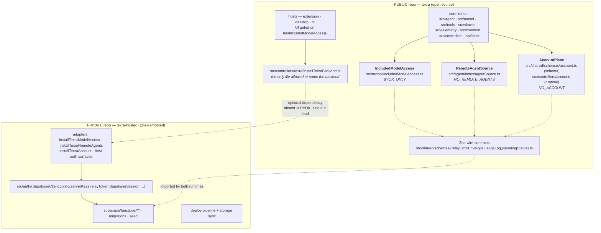

# Backend decoupling plan: finishing the seam that already exists

**Status:** proposal. Supersedes nothing; complements
`docs/proposals/2026-07-29-open-source-readiness.md`, which covers licensing,
repo identity, and publication decisions this plan assumes are settled.

**Goal.** Decouple the Supabase backend and the LLM relay from the UI and core
so that (a) the hosted implementation can live in a private repo, (b) the
open-source client works standalone on the user's own API keys with no dead
UI, and (c) a different backend can be installed.

**Method.** The repo already has the idiom and one finished instance of it.
`src/model/includedModelAccess.ts:28-63` is a typed capability port with a loud
null object (`BYOK_ONLY`, `:71-91`, which _throws_ at `getRelayBaseUrl` rather
than fabricating a URL) installed once per process from
`src/controllers/modelAccess/installTexraModelAccess.ts` next to
`initPlatform()`. `packages/agent/src/index.ts:225,244` already ships as an
embedder that never installs it and passes `loadAgents({ includeRemote: false })`.
This plan adds **two more ports of the same shape**, **one lint block copied
from an existing recipe**, and **no new machinery**. Every proposed layer that
turned out to be a pass-through was cut; those cuts are named in §9.

---

## 1. The cut



|                    | Public (`texra`)                                                                                                                                                                            | Private (`texra-hosted`)                                                                                                  | Interface between                                                                |
| ------------------ | ------------------------------------------------------------------------------------------------------------------------------------------------------------------------------------------- | ------------------------------------------------------------------------------------------------------------------------- | -------------------------------------------------------------------------------- |
| **Model routing**  | `IncludedModelAccess` port + `BYOK_ONLY`; `ModelHandler.resolveClientCredential` (`src/agent/modelHandlers/ModelHandler.ts:494-565`); `ProxyConfig` union (`ProxyConfigResolver.ts:89-173`) | `installTexraModelAccess.ts` incl. `capIncludedReasoningEffort` (tier pricing policy, `:30-48`); `src/auth/serverKeys/**` | 12-member interface + `hasIncludedModelAccess()` + `setUseIncludedModelAccess()` |
| **Agent catalog**  | `RemoteAgentSource` port; registry fan-out (`src/agent/index/agentRegistry.ts:206`); the 21 prompt YAMLs in `prompts/agents/remote/`                                                        | PostgREST query, `remote_agents` table + column list, `PGRST204`/`42703` sniffing, `get-agent-config` client              | 3-member interface + `RemoteAgentCatalogEntrySchema`                             |
| **Account / plan** | `AccountPlane` port; `ProfileMessageBuilder` assembly; settings + CLI render models                                                                                                         | `SupabaseClient`, GoTrue session, tier/quota policy, `log-usage` POST, host OAuth flows                                   | 5-member interface + `AccountSnapshotSchema`                                     |
| **Errors**         | `relayDetection.ts` parses a published Zod envelope; `isRelayError` on the trace wire                                                                                                       | relay `jsonError` builds its body from the same schema                                                                    | `RelayErrorEnvelopeSchema` (versioned)                                           |
| **Abuse controls** | —                                                                                                                                                                                           | `_shared/emailPolicy.ts`, `relay/requestGate.ts`, `relay/enforcement.ts`, RLS migrations                                  | none — never client-visible                                                      |
| **Enforcement**    | one `no-restricted-imports` + one `no-restricted-syntax` block in `eslint.config.mjs`                                                                                                       | private CI runs the public suite                                                                                          | lint fails on any new backend import in core                                     |

**Read the boundary as one sentence:** core zones may _ask_ whether included
access, a hosted catalog, or an account exists; only `src/controllers/texra/`
may _answer_, and that directory is the unit that moves private.

### Today's violations — the entire size of the problem

`grep "from '@auth/" src/` minus `src/test-kernel/` and `src/auth/` yields
**11 production files** (`@auth/codex` and `@auth/constants` excluded — see §2):

| File                                                                    | Imports                                    | Fixed by                                               |
| ----------------------------------------------------------------------- | ------------------------------------------ | ------------------------------------------------------ |
| `src/agent/remote/remoteAgentConfigClient.ts:4`                         | `SUPABASE_CONFIG`                          | Port B (file moves)                                    |
| `src/agent/remote/remoteAgentList.ts:17,18`                             | `SUPABASE_CONFIG`, `SupabaseClient`        | Port B (file moves)                                    |
| `src/agent/remote/RemoteAgentLoader.ts:16`                              | `SupabaseClient`                           | Port B (file deleted)                                  |
| `src/telemetry/UsageLogService.ts:6,7`                                  | `SupabaseClient`, `SUPABASE_CUSTOM_DOMAIN` | Port C                                                 |
| `src/tools/setup/platform.ts:15,17`                                     | `relayToken`, `SupabaseClient`             | Port C                                                 |
| `src/controllers/settingsView/ProfileMessageBuilder.ts:21,22,23`        | all three                                  | Port C                                                 |
| `src/controllers/mainView/teamCatalogPorts.ts:3`                        | `SupabaseClient`                           | Port B                                                 |
| `src/controllers/onboarding/setupLaunch.ts:1`                           | `serverKeys`                               | **Step 0 — deletion, no port**                         |
| `src/controllers/settingsView/SettingsModelSelectionController.ts:8`    | `FREE_TIER`, `MAX_TIER`                    | **Step 0 — deletion, no port**                         |
| `src/controllers/settingsView/SettingsRemoteAgentPromptController.ts:2` | `ULTRA_TIER`                               | Port B (controller deleted)                            |
| `src/controllers/modelAccess/installTexraModelAccess.ts:13-16`          | all                                        | sanctioned adapter — moves to `src/controllers/texra/` |

Plus **14 non-test importers** of `getServerSideKeyService()` across all three
hosts and `src/controllers/`, which route around the one port that already
exists. Member tally across those call sites:
`setUseIncludedModelAccess` ×7, `getUseIncludedModelAccess` ×6,
`clearAllCaches` ×6, `getUserTier` ×3, `canUseServerSideKeys` ×2, and one each
of `getSpendingStatus`, `getRelayBaseUrl`, `isRelayQuotaExceeded`,
`wasQuotaAutoSwitched`, `isProviderOnServer`, `shouldUseServerSideKeysSync`,
`canUseModelSync`.

---

## 2. Why here and not elsewhere — the seams NOT cut

Some coupling stays. Naming it is part of the design.

| Left coupled                                                                                                                                            | Why                                                                                                                                                                                                                                                                                                   | Evidence                                                                         |
| ------------------------------------------------------------------------------------------------------------------------------------------------------- | ----------------------------------------------------------------------------------------------------------------------------------------------------------------------------------------------------------------------------------------------------------------------------------------------------- | -------------------------------------------------------------------------------- |
| **`@auth/codex/**` and `@auth/constants`** stay importable everywhere                                                                                   | Codex/ChatGPT is a _third-party_ subscription, not TeXRA's backend; it already reaches storage only through `platform().secrets`. `AUTH_COMMANDS` are VS Code command IDs, not endpoints.                                                                                                             | `src/tools/setup/InvokeCommandTool.ts:5`, `src/agent/runtime/ModelFactory.ts:15` |
| **`isRelayError` stays on the durable trace format**                                                                                                    | It is a field of `ProviderErrorObjectSchema` (`src/shared/schemas/errors.ts:123`) republished on the trace bus (`src/agent/trace/events.ts:281`). Renaming it to `viaProxy` is a persisted-data migration, not a refactor. Under BYOK it is never `true`, so the branches are unreachable, not wrong. |                                                                                  |
| **`AGENT_SOURCE.REMOTE = 'remote'`** keeps its value                                                                                                    | It is a wire-contract enum member (`src/shared/schemas/agent.ts:22`) consumed by settings IPC, proposals, and the roster, and is persisted in registry keys. Its _meaning_ changes from "Supabase" to "the installed catalog source"; the string does not.                                            |                                                                                  |
| **`AgentModePreset.texraHostedAgents`** keeps its field name                                                                                            | Persisted in user team presets (`src/shared/schemas/agentPresets.ts:56`). Renaming needs a `z.union()` legacy transform at the entry point — worth doing, but not in the boundary PR series.                                                                                                          |                                                                                  |
| **The four hosted-vocabulary `ModelAvailabilityKind`s** (`'included-access'`, `'not-included'`, `'included-login-required'`, `'relay-quota-exhausted'`) | `computeModelOptions.ts:102-165` already normalizes them once into a client-owned view model that renderers consume verbatim, and `BYOK_ONLY` collapses all four. This is the seam working.                                                                                                           |                                                                                  |
| **`RetryState`'s relay-401-refresh control flow** (`src/agent/core/flows/RetryState.ts:196-215`)                                                        | It goes _through_ the port (`getAccessToken(true)`), so it is backend-agnostic already. Generalizing it to `onAuthFailure()` is defensible but is retry-engine surgery unrelated to the cut.                                                                                                          |                                                                                  |
| **`UsageMonitor`'s awaited flush** (`src/agent/utils/UsageMonitor.ts:296-310`)                                                                          | The `await` on relay rounds exists because the relay enforces its monthly cap from the DB aggregate; the comment says so. `usedRelay = usage.usageRoute === 'relay'` is permanently `false` with no relay installed, so leaving it untouched is both correct and free. **Do not "simplify" this.**    |                                                                                  |
| **`packages/cli/src/runtime/relayUsage.ts`** (hand-built PostgREST keyset queries over `usage_logs`)                                                    | It is one CLI command in a host zone. It moves wholesale with the private package rather than getting a port nothing else would use.                                                                                                                                                                  | `:195-215`                                                                       |
| **`supabase/functions/_shared/emailPolicy.ts`** never gets a public contract                                                                            | A 36-domain disposable-mailbox blocklist annotated "observed farming the Researcher Access Program", a privacy-relay blocklist, and `MIN_GITHUB_ACCOUNT_AGE_DAYS = 30`. This is enforcement logic whose value depends on non-publication. It is never client-visible and must not be.                 | `emailPolicy.ts:3-46`                                                            |

### The placement constraint no proposal noticed

`src/test-kernel/architecture/subsystemEdgeRatchet.vitest.ts` fails on any **new
directed subsystem pair** against `config/ratchets/architecture-edges-baseline.json`.
The baseline has **no `tools → controllers` and no `telemetry → controllers`
edge**. It does have `tools → shared`, `telemetry → shared`, `agent → shared`,
`model → shared`, and `controllers → shared`.

Since `AccountPlane` is consumed by `src/tools/setup/platform.ts`,
`src/telemetry/UsageLogService.ts`, and `src/controllers/settingsView/`, it
**must** live in `src/shared/`. Placing it under `src/controllers/account/`
would create two new edges and fail the ratchet — and would invert layering
besides. This settles a question the source designs disagreed on.

Conversely, the cut **removes** `agent → auth`, `tools → auth`, and
`telemetry → auth` (all currently `value` edges in the baseline). Removing edges
never fails the ratchet; regenerate the baseline in the same PR so the win is
recorded.

---

## 3. The contract

### Port A — `IncludedModelAccess` (existing, `src/model/includedModelAccess.ts`)

Twelve members unchanged (`:30-63`). Two additions, both paid for by deletion:

```ts
export interface IncludedModelAccess {
  /* …existing 12 members… */

  /**
   * Persist the user's included-vs-personal preference. The provider owns the
   * write because flipping it must also invalidate entitlement caches and
   * notify subscribers; a caller touching globalState cannot do that.
   */
  setUseIncludedModelAccess(enabled: boolean): Promise<void>;
}

/**
 * Whether an included-access provider is installed at all — distinct from every
 * interface member, which answer "may this user route through it *now*". UI asks
 * this to decide whether an account surface should exist.
 */
export function hasIncludedModelAccess(): boolean; // `installed !== null`
```

`BYOK_ONLY.setUseIncludedModelAccess` **throws** with
`INCLUDED_MODEL_ACCESS_REMEDY` (`:97`), matching `getRelayBaseUrl`'s posture
(`:80-87`) — unreachable behind `hasIncludedModelAccess()`, and a silent no-op
write is exactly the silent degradation CLAUDE.md bans.

_Justification for `setUseIncludedModelAccess`:_ seven host call sites bind it
to the singleton (`packages/cli/src/runtime/initPlatform.ts:405,407`,
`packages/cli/src/runtime/apiAccessMode.ts:57`,
`packages/desktop/src/main/index.ts:757-758`,
`packages/desktop/src/main/desktopAgentExecution.ts:478-479`,
`packages/extension/src/progressView/ProgressViewMessageHandler.ts:603-604`,
`packages/extension/src/settingsView/SettingsViewMessageHandler.ts:182-183`),
and `src/controllers/` _already declares it as an injected dependency_
(`ProgressApiKeyRetryController.ts:44`, `SettingsProfileController.ts:69`).
The controllers treat it as a port member today; only the hosts don't.

**Deliberately NOT added** (each was in a source design; each is cut):

- `canUseServerSideKeysForModel` — `src/auth/serverKeys/ServerSideKeyService.ts:376-380`
  defines it as `(await canUseServerSideKeys()) && canUseModelSync(m)`, both
  already on the port. The bypass at `setupLaunch.ts:49-50` is fixed by
  composing, not widening.
- `getSpendingStatus` — spend is an account fact. It lives on Port C, which the
  CLI status bar can read instead of reaching `getServerSideKeyService()` from
  inside an Ink render component (`packages/cli/src/chat/tui/panes/StatusBar.tsx:168-176`).
- `clearAllCaches` — a session-lifecycle event. Port C's `onChange` owns it.

### Port B — `RemoteAgentSource` (new, `src/agent/index/agentSource.ts`)

Sibling of `agentRegistry.ts` and `remoteAgentMeta.ts`, the only modules that
reach the catalog today. Zone: `src/agent/` (VS Code-free, backend-free).

```ts
import { z } from 'zod';

/** One catalog row in client vocabulary. No DB column names, no row id. */
export const RemoteAgentCatalogEntrySchema = z.object({
  name: AgentNameSchema,
  description: z.string().nullish(),
  visibility: z.array(z.string()).nullish(),
  tools: z.array(z.string()).nullish(),
  category: z.enum(AgentCategory).nullish(),
});
export type RemoteAgentCatalogEntry = z.infer<
  typeof RemoteAgentCatalogEntrySchema
>;

export interface RemoteAgentSource {
  /** Can this source serve definitions right now? Drives team preflight and UI. */
  isAvailable(): Promise<boolean>;
  /** Catalog rows. `[]` is a valid answer; failure is the source's to log at warn. */
  list(): Promise<readonly RemoteAgentCatalogEntry[]>;
  /** Raw agent YAML for one name. Throws `RemoteAgentUnavailableError`; the host phrases it. */
  loadDefinitionYaml(agentName: string): Promise<string>;
  /** Drop cached rows — called on sign-out. */
  invalidate(): void;
}

const NO_REMOTE_AGENTS: RemoteAgentSource = {/* false, [], throws, no-op */};

export function setRemoteAgentSource(source: RemoteAgentSource | null): void;
export function remoteAgentSource(): RemoteAgentSource; // → NO_REMOTE_AGENTS
export function resetRemoteAgentSourceForTests(): void;
```

The schema is today's `RemoteAgentListItemSchema` (`src/agent/remote/types.ts:17-29`)
minus two DB-isms: `id` (a PostgREST primary key that
`src/agent/index/remoteAgentMeta.ts:52-66` never reads) and the `agentCategory`
column name. `.nullish()` per CLAUDE.md.

_Why `isAvailable()` is not `list().length > 0`:_
`SupabaseClient.canAccessRemoteAgentCatalog()` deliberately excludes the CI
relay token while `isAuthenticated()` includes it
(`src/auth/SupabaseClient.ts:358-365`), and
`src/common/teams/TeamAvailabilityPreflight.ts:44-107` needs "could this source
serve, if asked" _before_ it has a list. Three members is the floor.

**Five verified consumers:** `agentRegistry.ts:206` (`list`), `agentRegistry.ts:552-563`
(`invalidate`), `agentLoad.ts:133-138` (`loadDefinitionYaml`),
`teamCatalogPorts.ts:27` (`isAvailable`), and the setup adapter's
`remoteAgentCatalogAvailable` (`src/tools/setup/platform.ts:134`).

### Port C — `AccountPlane` (split across two files)

**Corrected placement.** An earlier draft put the schema, the port interface and
the mutable module-level accessor in one file at `src/shared/account.ts`,
justified by the edge ratchet. That was the wrong reason for the wrong shape:
the ratchet records the edges the tree has today, not the architecture it should
have, and letting it site a service locator inside the browser-reachable
contract zone is exactly the tail wagging the dog. `signIn`, `signOut`,
`submitUsage`, `onChange` and a module-level setter are runtime orchestration,
not a wire contract.

| File                                      | Zone               | Contents                                                                                                                          |
| ----------------------------------------- | ------------------ | --------------------------------------------------------------------------------------------------------------------------------- |
| `src/shared/schemas/account.ts`           | `src/shared/`      | `AccountSnapshotSchema`, `AccountSnapshot`, `SIGNED_OUT_ACCOUNT`, `UsageSubmitResult` — data only, browser-safe, no mutable state |
| `src/controllers/account/accountPlane.ts` | `src/controllers/` | The `AccountPlane` interface, `installAccountPlane()`, `getAccountPlane()`, `hasAccountPlane()`                                   |

The schema half follows `src/shared/schemas/spendingStatus.ts:8-52`. The runtime
half sits in `src/controllers/`, which is the documented home for host-neutral
orchestration and already carries a `controllers → auth` edge.

**This creates two new subsystem edges** — `tools → controllers` and
`telemetry → controllers` — which `subsystemEdgeRatchet.vitest.ts` fails on as
new directed pairs. Regenerate `architecture-edges-baseline.json` in the same
commit and state the intent in the PR body. Adding a deliberate edge to a
baseline is the normal use of that ratchet; contorting the design to avoid one
is not. Note the same commit _removes_ `agent → auth`, `tools → auth` and
`telemetry → auth`, so the net direction is still toward fewer backend edges.

```ts
export const AccountSnapshotSchema = z.object({
  authenticated: z.boolean(),
  email: z.string().nullable(),
  /** Operator's plan name, opaque to core. Rendered, never branched on. */
  planName: z.string().nullable(),
  sessionProblem: z.enum(['expired', 'unavailable']).nullable(),
  // NOTE: apiAccessMode and quotaAutoSwitched deliberately absent. They are
  // routing facts owned by Port A (getUseIncludedModelAccess() /
  // wasQuotaAutoSwitched()). Restating them here created two owners with no
  // declared derivation direction — model routing read A while the profile UI
  // read C, so the two could disagree and nothing said which won. The
  // presentation boundary composes A and C once, where the view model is built.
  spendingStatus: SpendingStatusSchema.nullable(),
  spendingStatusError: SpendingStatusErrorSchema.nullable(),
});
export type AccountSnapshot = z.infer<typeof AccountSnapshotSchema>;
export const SIGNED_OUT_ACCOUNT: AccountSnapshot; // frozen

export type UsageSubmitResult =
  | { readonly kind: 'accepted' }
  | { readonly kind: 'retryable'; readonly reason: string }
  | { readonly kind: 'rejected'; readonly reason: string }
  /** No sink installed: the caller must stop queueing, loudly and once. */
  | { readonly kind: 'no-sink' };

export interface AccountPlane {
  /** `refresh: true` primes entitlement caches before reading. */
  snapshot(options?: { readonly refresh?: boolean }): Promise<AccountSnapshot>;
  /** Plan accounting, not telemetry — see below. */
  submitUsage(batch: UsageLogBatch): Promise<UsageSubmitResult>;
  /** Run the operator's sign-in. The host supplies UI; the protocol is the impl's. */
  signIn(options?: { readonly providerHint?: string }): Promise<boolean>;
  signOut(): Promise<void>;
  /** Fires after a session change, once the impl has finished its own invalidation. */
  onChange(listener: () => void): () => void;
}

const NO_ACCOUNT: AccountPlane; // SIGNED_OUT_ACCOUNT, {kind:'no-sink'},
// signIn → false, signOut → no-op, onChange → noop disposer
export function setAccountPlane(plane: AccountPlane | null): void;
export function accountPlane(): AccountPlane; // → NO_ACCOUNT
export function resetAccountPlaneForTests(): void;
```

**The port pays for itself by _shrinking_ the wire contract, not mirroring it.**
`UpdateProfileMessageSchema` (`src/shared/schemas/profileViewMessages.ts:104-123`)
gains nothing and **drops three fields that have producer sites and zero
consumers** — verified by grep across `packages/*/src` and `src/`:

| Dropped field     | Producer                           | Consumers |
| ----------------- | ---------------------------------- | --------- |
| `tierConstants`   | `ProfileMessageBuilder.ts:53,56`   | **none**  |
| `accessExpiresAt` | `ProfileMessageBuilder.ts:120,147` | **none**  |
| `remoteAgents`    | `ProfileMessageBuilder.ts:132,145` | **none**  |

The remaining fields (`authenticated`, `user`, `tier`, `sessionProblem`,
`spendingStatus`, `spendingStatusError`) are re-derived from one
`AccountSnapshot` rather than eight separate `SupabaseClient` /
`getServerSideKeyService()` reads. `apiAccessMode` and `quotaAutoSwitched` come
from Port A at the same assembly point — one owner each, composed once. `ProfileMessageBuilder`
keeps real work on top: provider-key statuses, streaming defaults, and host
assembly.

_Why `signIn`/`signOut`/`onChange` are on the same port and not a fourth:_
they are the same plane — who you are, what your plan allows, what your plan is
billed for. Splitting them yields two ports with two and three members
installed from the same file at the same moment.

_Why `submitUsage` is here and not on a telemetry port:_
`src/telemetry/UsageLogService.ts:70-86` states that relay/subscription records
are **plan accounting**, sent regardless of the `texra.telemetry.enabled`
opt-out, because the relay reads the aggregate to enforce the spend cap. It is
an account operation that happens to live in a telemetry module.
`UsageLogService` keeps every piece of client-owned policy it has today —
batching, queue cap, opt-out, `PLAN_ACCOUNTING_ROUTES` (`:82-86`), the
re-read-after-await discipline. Only the URL and the bearer token leave.

### Wire contract — `RelayErrorEnvelopeSchema` (new, `src/shared/schemas/relayErrorEnvelope.ts`)

This is the one contract an alternative backend must satisfy byte-for-byte, and
today it exists only as five hand-rolled string literals in
`src/common/errors/sdkError/relayDetection.ts:55-99`.

**Critical correction.** `_relay` is **a version string, not a boolean**:
`supabase/functions/relay/index.ts:127` declares
`const RELAY_VERSION = '1.10.0'`, stamped into every error body at `:234` and
into `/providers` at `:305`. The client discards it —
`relayDetection.ts:55-59` only checks `'_relay' in candidate`. A schema
declaring `_relay: z.literal(true)` would silently fail to parse **every** relay
error, losing quota, concurrency, and `retryAfterSeconds` handling.

```ts
/**
 * The error body an included-access relay returns instead of the provider's.
 * Any implementation of IncludedModelAccess that fronts provider APIs MUST emit
 * this shape, or the client silently loses quota and rate-limit handling.
 */
export const RelayErrorBodySchema = z.looseObject({
  /** Relay contract version, e.g. '1.10.0'. See RELAY_CONTRACT_VERSION. */
  _relay: z.string().min(1),
  type: z.literal('relay_error'),
  message: z.string(),
  limitReached: z.boolean().nullish(),
  requestLimitReached: z.boolean().nullish(),
  reason: z.enum(['concurrency', 'rate']).nullish(),
  retryAfterSeconds: z.number().nonnegative().nullish(),
});

export const RELAY_CONTRACT_MAJOR = 1;

/** null when the body is not a relay body. Throws a named "client too old for
 *  this relay" error on a major-version mismatch, rather than misclassifying. */
export function parseRelayErrorBody(raw: unknown): RelayErrorBody | null;
```

`relayDetection.ts:55-99`'s five sniffers collapse to one `safeParse` over
`errorBodyCandidates`. `isRelayMonthlyLimitMessage` (`:112-118`, a literal match
on `'monthly spending limit reached'`) and its CLI string fallback
(`packages/cli/src/runtime/approval/approvalPolicy.ts:86-95`) are deleted.
On the private side, `jsonError` (`relay/index.ts:225-245`) builds its body
through the same schema so a client-visible field cannot be emitted without
existing in the contract.

### Zone ownership

| File                                                                  | Zone              | Owner after the cut                                                                                           |
| --------------------------------------------------------------------- | ----------------- | ------------------------------------------------------------------------------------------------------------- |
| `src/model/includedModelAccess.ts`                                    | `src/model`       | public                                                                                                        |
| `src/agent/index/agentSource.ts`                                      | `src/agent`       | public (new)                                                                                                  |
| `src/shared/schemas/account.ts`                                       | `src/shared`      | public (new) — schema only                                                                                    |
| `src/controllers/account/accountPlane.ts`                             | `src/controllers` | public (new) — port + accessor; adds `tools → controllers` and `telemetry → controllers` to the edge baseline |
| `src/shared/schemas/relayErrorEnvelope.ts`                            | `src/shared`      | public (new)                                                                                                  |
| `src/shared/schemas/usageLog.ts`                                      | `src/shared`      | public (moved from `src/telemetry/UsageLogTypes.ts`)                                                          |
| `src/shared/schemas/spendingStatus.ts`                                | `src/shared`      | public (unchanged)                                                                                            |
| `src/controllers/texra/installTexraModelAccess.ts`                    | adapter           | **private**                                                                                                   |
| `src/controllers/texra/installTexraRemoteAgents.ts` + `remoteAgents/` | adapter           | **private** (moved from `src/agent/remote/`)                                                                  |
| `src/controllers/texra/installTexraAccount.ts`                        | adapter           | **private**                                                                                                   |
| `src/controllers/texra/installTexraBackend.ts`                        | adapter           | **public** — the guarded import site                                                                          |

---

## 4. Two implementations

| Port member                              | Hosted (`@texra/hosted`)                                                                                  | BYOK (nothing installed)                                  | UI under BYOK                                                                                                                                                 |
| ---------------------------------------- | --------------------------------------------------------------------------------------------------------- | --------------------------------------------------------- | ------------------------------------------------------------------------------------------------------------------------------------------------------------- |
| `hasIncludedModelAccess()`               | `true`                                                                                                    | `false`                                                   | Gates **model-routing** surfaces only — the included/personal radio, `included-*` model states. Account and catalog surfaces gate on their own port; see §6.2 |
| `getUseIncludedModelAccess()`            | user preference in globalState                                                                            | `false`                                                   | model picker shows `missing-key` / `provider-key`, never `included-*`                                                                                         |
| `canUseServerSideKeys()`                 | `ServerSideKeyService.canUseServerSideKeys()` (`:238-375`): tier + tier-config + expiry + quota auto-flip | `false`                                                   | —                                                                                                                                                             |
| `getRelayBaseUrl(p)`                     | `${base}/functions/v1/relay/${p}${suffix}` from `RELAY_PATH_SUFFIXES` (`ServerSideKeyService.ts:46-54`)   | **throws** (unreachable behind the gates)                 | —                                                                                                                                                             |
| `getAccessToken()`                       | CI relay token, else GoTrue session (`SupabaseClient.ts:200-221`)                                         | `null`                                                    | —                                                                                                                                                             |
| `setUseIncludedModelAccess(b)`           | persists + clears caches + emits `includedModelAccessChanged`                                             | **throws** (unreachable)                                  | included/personal radio not rendered                                                                                                                          |
| `capReasoningEffort()`                   | `capIncludedReasoningEffort` (`installTexraModelAccess.ts:30-48`), Max⇒HIGH / free⇒MEDIUM                 | identity                                                  | full effort available on the user's own key                                                                                                                   |
| `RemoteAgentSource.isAvailable()`        | `SupabaseClient.canAccessRemoteAgentCatalog()`                                                            | `false`                                                   | team preflight takes its existing `'unavailable'` branch                                                                                                      |
| `RemoteAgentSource.list()`               | PostgREST `remote_agents` query                                                                           | `[]`                                                      | agent list = local YAML only; no empty "remote" category (gated, §6)                                                                                          |
| `RemoteAgentSource.loadDefinitionYaml()` | `get-agent-config` POST                                                                                   | **throws** (unreachable — no entry has `source:'remote'`) | —                                                                                                                                                             |
| `AccountPlane.snapshot()`                | `ProfileMessageBuilder.ts:45-127` logic, moved                                                            | `SIGNED_OUT_ACCOUNT`                                      | profile message carries `authenticated: false`, null spend                                                                                                    |
| `AccountPlane.submitUsage()`             | bearer + ky POST to `functions/v1/log-usage`                                                              | `{ kind: 'no-sink' }`                                     | `UsageLogService` logs once at `info` and stops its queue and timer                                                                                           |
| `AccountPlane.signIn()`                  | VS Code `AuthenticationProvider` / Electron loopback / CLI device code                                    | `false`                                                   | no sign-in affordance exists to call it                                                                                                                       |

**BYOK model-call path, already proven.** `resolveClientCredential`
(`ModelHandler.ts:494-565`) computes `canRouteThroughRelay` from
`getUseIncludedModelAccess()`, gets `false`, and falls through to
`fetchApiKeyOrThrow` → `platform().secrets`. `resolveBaseUrl` never reaches
`case 'serverSideKeys'` (`ProxyConfigResolver.ts:162-168`), so the deliberate
throw stays unreachable. `src/model/apiProviders.ts` imports nothing but
`PlatformSecrets`. `packages/agent/src/index.ts` ships this way today.

**BYOK usage path.** `UsageMonitor.logToBackend` computes
`usedRelay = usage.usageRoute === 'relay'` (`:277`), permanently `false`, so the
awaited forced flush at `:301` never executes. `UsageMonitor` is not touched.

**BYOK setup-agent path.** `getSetupAuthStatus` returns
`{ authenticated: false, remoteAgentCatalogAvailable: false }` — the shape its
callers already handle. Side benefit: the user's account email and plan stop
being fed to the setup LLM as tool output (`src/tools/setup/platform.ts:122-150`
→ `ProbeEnvironmentTool.ts:58`, `VerifySetupTool.ts:76`).

---

## 5. Enforcement

Written against `eslint.config.mjs` as it exists. `AUTH_RESTRICTED_IMPORT_PATTERNS`
(`:117-125`) applied at `:567-580` is the exact recipe; this copies it.

**Add next to `AUTH_RESTRICTED_IMPORT_PATTERNS` (~line 117):**

```js
// Modules that speak to a specific hosted backend. Core zones ask the installed
// ports (includedModelAccess / remoteAgentSource / accountPlane) instead; the
// bindings live in src/controllers/texra/. `@auth/codex` and `@auth/constants`
// are deliberately absent: Codex is a third-party subscription, and
// AUTH_COMMANDS are VS Code command IDs, not endpoints.
// ONE list. Both the static rule and the dynamic-import selector are derived
// from it, so the two cannot drift — an earlier draft of this plan added
// `@texra/hosted` to the static group only, leaving
// `await import('@texra/hosted')` legal in every backend-free zone. That is
// precisely the failure this boundary exists to prevent, so the list is the
// single source of truth and neither consumer restates it.
const BACKEND_MODULES = [
  '@supabase/supabase-js',
  '@auth/SupabaseClient',
  '@auth/SupabaseSession',
  '@auth/SupabaseAuthCoordinator',
  '@auth/supabaseSessionTypes',
  '@auth/TokenProvider',
  '@auth/config',
  '@auth/relayToken',
  '@auth/serverKeys',
  // The extracted hosted package. Without it the whole boundary is defeated
  // the moment step 10 lands.
  '@texra/hosted',
];

const BACKEND_BOUNDARY_MESSAGE =
  'Backend-free zones must not import a hosted backend. Ask the installed ' +
  'port instead (includedModelAccess / remoteAgentSource / accountPlane); ' +
  'bindings belong in src/controllers/texra/.';

const BACKEND_RESTRICTED_IMPORT_GROUP = {
  // Each entry plus its subpaths.
  group: BACKEND_MODULES.flatMap((m) => [m, `${m}/**`]),
  message: BACKEND_BOUNDARY_MESSAGE,
};

const BACKEND_RESTRICTED_IMPORT_PATTERNS = [
  BACKEND_RESTRICTED_IMPORT_GROUP,
  ...HOST_LAYER_RESTRICTED_IMPORT_PATTERNS,
];

// `no-restricted-imports` cannot see `await import(...)`. One builtin selector
// closes that hole without a custom rule, built from the SAME array. (The
// single dynamic backend import in core, src/agent/index/remoteAgentMeta.ts:47,
// is deleted in step 2; this stops it coming back.)
const escapeForRegex = (s) => s.replace(/[.*+?^${}()|[\]\\]/g, '\\$&');

const NO_DYNAMIC_BACKEND_IMPORT = {
  selector: `ImportExpression[source.value=/^(${BACKEND_MODULES.map(
    escapeForRegex,
  ).join('|')})(\\/|$)/]`,
  message: BACKEND_BOUNDARY_MESSAGE,
};
```

**Add this block _before_ the `src/agent/core/**` block at `:552`** (flat config:
a later block replaces the same rule wholesale, so ordering matters):

```js
// Backend-free zones. Core may ask whether included access, a hosted catalog,
// or an account exists; only src/controllers/texra/ may answer.
{
  files: [
    'src/agent/**/*.{ts,tsx,mts,cts}',
    'src/model/**/*.{ts,tsx,mts,cts}',
    'src/tools/**/*.{ts,tsx,mts,cts}',
    'src/shared/**/*.{ts,tsx,mts,cts}',
    'src/telemetry/**/*.{ts,tsx,mts,cts}',
    'src/common/**/*.{ts,tsx,mts,cts}',
    'src/controllers/**/*.{ts,tsx,mts,cts}',
    'src/latex/**/*.{ts,tsx,mts,cts}',
    'src/replacement/**/*.{ts,tsx,mts,cts}',
    'src/eventBus/**/*.{ts,tsx,mts,cts}',
    'src/hosts/**/*.{ts,tsx,mts,cts}',
    'packages/agent/src/**/*.{ts,tsx,mts,cts}',
  ],
  ignores: ['src/controllers/texra/**', 'src/test-kernel/**'],
  rules: {
    'no-restricted-imports': [
      'error',
      {
        paths: HOST_LAYER_RESTRICTED_IMPORT_PATHS,
        patterns: BACKEND_RESTRICTED_IMPORT_PATTERNS,
      },
    ],
    'no-restricted-syntax': ['error', NO_DYNAMIC_BACKEND_IMPORT],
  },
},
```

**And spread the group into the agent-core patterns** (`:110-116`), because that
later block would otherwise override the backend ban for `src/agent/core/**`:

```js
const AGENT_CORE_RESTRICTED_IMPORT_PATTERNS = [
  { group: ['@agent/modelHandlers', '@agent/modelHandlers/**'], message: '…' },
  BACKEND_RESTRICTED_IMPORT_GROUP, // ← add
  ...HOST_LAYER_RESTRICTED_IMPORT_PATTERNS,
];
```

**Do not delete the `@supabase/supabase-js` dependency in this step.** An
earlier draft of this plan said to drop it from `package.json:117` and
`packages/agent/package.json:59` here. That is wrong and would break the build.
The dependency is declared in exactly three manifests — root `package.json:117`,
`packages/agent/package.json:59`, `packages/extension/package.json:1724` — and
**neither `packages/desktop` nor `packages/cli` declares it at all**. The hosted
implementation under root `src/auth/` (`SupabaseClient.ts`, `SupabaseSession.ts`)
still imports it until step 10, and an import originating in root `src/` does not
resolve through the extension's sibling `node_modules`. Deleting the root
declaration in a separately-landed step-4 commit therefore fails the desktop and
CLI builds.

The dependency moves with the implementation, in step 10, or not at all. Until
then the lint block is what enforces the boundary: a _declared_ dependency that
no backend-free zone is permitted to import is the correct intermediate state,
not a cosmetic one.

**Second gate, free:** regenerate
`config/ratchets/architecture-edges-baseline.json` after step 4 so
`agent → auth`, `tools → auth`, and `telemetry → auth` are gone. Any
reintroduction then fails `subsystemEdgeRatchet.vitest.ts` as a new edge.

**Third gate, free:** every new export lands with a consumer in the same PR;
`npm run check:dead-code-ratchet` enforces it against
`config/ratchets/knip-baseline.json`.

---

## 6. UI decoupling

Two rules: **no UI surface consumes a backend response shape**, and **no UI
surface exists that a BYOK build cannot act on**.

### 6.1 Response shapes → view models

| Surface                                                              | Today                                                                                     | After                                                                                                                                                                    |
| -------------------------------------------------------------------- | ----------------------------------------------------------------------------------------- | ------------------------------------------------------------------------------------------------------------------------------------------------------------------------ |
| `settingsView/frontend/components/profile/RelayQuotaMeter.ts:99-135` | `@property status` **is** the `/tier-config` `SpendingStatus` object                      | binds to `AccountSnapshot.spendingStatus`, a client-owned field of a client-owned snapshot; `spendingQuotaState()` (`spendingStatus.ts:32-52`) still supplies the policy |
| `settingsView/frontend/tabs/AccountTab.ts:59-69`                     | 8 props, 7 of them hosted concepts                                                        | one `account: AccountSnapshot \| null` prop                                                                                                                              |
| `packages/cli/src/chat/tui/panes/StatusBar.tsx:168-176`              | Ink render component calls `getServerSideKeyService().getSpendingStatus()` on an interval | reads `accountPlane().snapshot()`; the component stops importing auth                                                                                                    |
| `progressView/.../messageFormatters.ts:80-92,105-153`                | renders `rawErrorBody` verbatim as `<pre>` JSON and a `banner-details--relay-error` class | `rawErrorBody` stays in the opt-in details block only; `isRelayError` becomes a neutral "routed through included access" label                                           |
| `packages/cli/src/runtime/apiStatus.ts:200`                          | interpolates the raw thrown error into a status line                                      | maps `UsageSubmitResult`/snapshot state to fixed copy, matching the good branch already at `:190-193`                                                                    |
| `packages/extension/src/commands/auth/authCommands.ts:75-81`         | shows `SupabaseClient.getInitError()` raw in a toast                                      | mapped message, matching the good branch at `:53-61`                                                                                                                     |

Desktop needs no separate work: `packages/desktop/src/renderer/main.ts:53-54`
imports `@settingsView/frontend` and `@webview/frontend` wholesale, so one fix
covers both hosts.

### 6.2 Dead affordances → gated per facet, not on one proxy

**Correction.** An earlier draft of this section gated every account surface on
`hasIncludedModelAccess()`. That makes one facet the source of truth for a
different facet. The three ports install independently, so a backend that offers
accounts but not included model access — or a partially installed one — would
have its entire account UI hidden while being perfectly functional. Model
routing is not evidence about account capability.

Each port therefore answers for its own surfaces:

| Surface                                                                                | Gate                                |
| -------------------------------------------------------------------------------------- | ----------------------------------- |
| Included/personal radio, `included-*` model states, quota copy                         | `hasIncludedModelAccess()` (Port A) |
| Account tab, LoginBanner, `/login` `/auth` `/api`, onboarding sign-in choice, sign-out | `hasAccountPlane()` (Port C)        |
| Remote-agent category, hosted prompt list                                              | `hasRemoteAgentSource()` (Port B)   |

Each is `installed !== null` for its own port — the same one-line shape Port A
already uses, so this costs three predicates rather than one, not new machinery.

The alternative the maintainer raised — one atomic capability bundle installed
as a unit, with all three gates derived from it — is simpler to reason about and
worth taking **if** the three ports will always be installed together. Decide
this before step 1, because it determines whether `installTexraBackend.ts`
installs three things or one. Recommendation: keep them separate. A self-hosted
or third-party backend implementing accounts without a relay is the exact case
this whole exercise is meant to make possible, and an atomic bundle forecloses
it.

Whichever is chosen, the gate must be a canonical fact about the facet being
gated. Do not gate on `authenticated`. `ModelsTab.ts:120-128,163-167` is the only surface that
gates correctly today, and even it keys on the wrong predicate — under BYOK
`authenticated` is permanently `false`, which reads as "signed out" rather than
"no such thing here".

| Surface                                                                                                                                                                                                           | Mechanism needed                                                                                                                                                                                                                                                              |
| ----------------------------------------------------------------------------------------------------------------------------------------------------------------------------------------------------------------- | ----------------------------------------------------------------------------------------------------------------------------------------------------------------------------------------------------------------------------------------------------------------------------- |
| Account tab — a literal member of `SETTINGS_TAB_ORDER` (`src/shared/schemas/settingsView/data.ts:75-88`) and of `SETTINGS_TAB_GROUPS` (`:128-137`)                                                                | **new**: a capability predicate on tab entries, filtered once where the nav is built. The array is `as const` and doubles as the `SettingsTabName` union, so filter at build time, don't edit the tuple                                                                       |
| `webview/frontend/components/LoginBanner.ts:87-111` "Researcher Access Program" — shown whenever `!authStatus.authenticated` (`MainViewStartupController.ts:82-88`), i.e. to every BYOK user forever              | existing visibility flag; add **`hasAccountPlane()`** (Port C, not Port A — sign-in is an account fact, not a relay fact) and sequence after step 3                                                                                                                           |
| `ONBOARDING_CHOICE_SIGN_IN` (`src/shared/copy/onboarding.ts:22-26`) rendered by `OnboardingWelcomeCard.ts:309-323`, `setupAssistantCommand.ts:95-99`, and `packages/cli/src/onboarding/runOnboarding.tsx:596,663` | make the choice list capability-derived; `onboardingFunnel.ts:30-38` is already credential-agnostic                                                                                                                                                                           |
| CLI `/login` `/logout` `/auth` `/api` (`registerBuiltins.tsx:551-601`) and `LOGIN_FORM_ITEMS` (`LoginForm.tsx:15-35`)                                                                                             | predicate at registration; `LOGIN_FORM_ITEMS` becomes derived, not a frozen literal                                                                                                                                                                                           |
| `texra auth` subcommand tree (`packages/cli/src/commands/auth.ts`) and `texra setup-token` (`commands/relayTokens.ts`)                                                                                            | omit from the command tree. The NDJSON kinds `'auth-status'`, `'relay-usage'`, `'relay-token'`, `'relay-token-info'`, `'relay-token-revoked'` (`src/schemas/cliOutput.ts:44-51`) stay in the union — removing them breaks a published contract; they are simply never emitted |
| VS Code walkthrough step (`packages/extension/package.json:1141-1149,1167`)                                                                                                                                       | **manifest JSON — cannot be runtime-gated.** Rewrite the copy so it does not promise Researcher Access or claim the orchestrator requires it                                                                                                                                  |
| `texra.telemetry.enabled` (`packages/extension/package.json:745-750`, default `true`, description entirely about sending data to TeXRA)                                                                           | default `false` in the public build, description rewritten; the hosted build contributes the plan-accounting note                                                                                                                                                             |
| `src/shared/copy/promoNotice.ts:15-49` — sponsor promo plus `github.com/sponsors/texra-ai` (`:41`) and `buymeacoffee.com/texra.ai` (`:44`)                                                                        | **delete from `src/shared/`.** Not a port problem: a fork must not ship upstream's funding links. Consumers: `LoginBanner.ts:7`, `ApiAccessSection.ts:19,73-94`                                                                                                               |
| `packages/desktop/src/main/desktopNavigationPolicy.ts:17-21` — allowlists `texra.ai` for OAuth                                                                                                                    | the allowlist entry becomes a value the installed `AccountPlane` contributes, or a self-hosted backend's redirect is silently blocked                                                                                                                                         |

---

## 7. Migration

Ten steps in three phases. "Parallel" means it can land concurrently with other
steps in the same phase.

### Phase 1 — the core cut (no user-visible change)

| #     | Change                                                                                                                                                                                                                                                                                                                                                                                                                                                                                                                                                                                                                                                                                                                                                                                                                                                                                                                                                                                                                                                                                                                                                                | Files                                     | Proof                                                                                                                                                          | Parallel                 |
| ----- | --------------------------------------------------------------------------------------------------------------------------------------------------------------------------------------------------------------------------------------------------------------------------------------------------------------------------------------------------------------------------------------------------------------------------------------------------------------------------------------------------------------------------------------------------------------------------------------------------------------------------------------------------------------------------------------------------------------------------------------------------------------------------------------------------------------------------------------------------------------------------------------------------------------------------------------------------------------------------------------------------------------------------------------------------------------------------------------------------------------------------------------------------------------------- | ----------------------------------------- | -------------------------------------------------------------------------------------------------------------------------------------------------------------- | ------------------------ |
| **0** | **Two deletions, no port.** (a) `setupLaunch.ts:49-58`: replace `getServerSideKeyService()` with `includedModelAccess()`; `canUseServerSideKeysForModel(m)` → `(await canUseServerSideKeys()) && canUseModelSync(m)`, verbatim what `ServerSideKeyService.ts:376-380` does. (b) `SettingsModelSelectionController.ts:239-254`: delete the `MAX_TIER→'high' / FREE_TIER→'medium'` switch, call `capReasoningEffort` — removing the second of two independent encodings of one pricing policy (the other is `installTexraModelAccess.ts:30-48`)                                                                                                                                                                                                                                                                                                                                                                                                                                                                                                                                                                                                                         | 2 edits, both smaller                     | `npm run lint && npm test`; two `@auth/*` imports gone                                                                                                         | ✅ ships alone, first    |
| **1** | **Widen Port A.** Add `setUseIncludedModelAccess` + `hasIncludedModelAccess()`; implement in `installTexraModelAccess.ts`. Rewrite the 7 host `setUseIncludedModelAccess` bindings and the `getUseIncludedModelAccess` / `getSpendingStatus` reads at `StatusBar.tsx:168-176`, `apiAccessMode.ts`, `secretManager.ts:55-62` (which also gains a missing `await` — today `keyChecks.some(Boolean) \|\| getServerSideKeyService().canUseServerSideKeys()` makes `anyApiKeyExists()` unconditionally true). **Land `hasIncludedModelAccess()`'s consumers in this PR** or the dead-export ratchet correctly fails it — use the LoginBanner and CLI `/login` gates from step 7                                                                                                                                                                                                                                                                                                                                                                                                                                                                                            | ~14 edits                                 | `getServerSideKeyService` importers drop from 14 to ≤4; ratchet green                                                                                          | after 0                  |
| **2** | **Port B.** New `src/agent/index/agentSource.ts`. `git mv src/agent/remote/ src/controllers/texra/remoteAgents/`; add `installTexraRemoteAgents.ts` and fold the `tier !== ULTRA_TIER` prompt gate (`SettingsRemoteAgentPromptController.ts:24`) into its `loadDefinitionYaml`. Rewire `remoteAgentMeta.ts:46-74` (**deleting the `await import('@agent/remote/remoteAgentList')` at `:47`** — the one dynamic backend import in core), `agentLoad.ts:133-138`, `teamCatalogPorts.ts:27`, `agentRegistry.ts:206,552-563`, and both hosts' view-remote-prompt handlers (`settingsView/handlers/agentHandlers.ts:17`, `desktop/desktopAgentSettingsController.ts:5`). **Delete `SettingsRemoteAgentPromptController`** rather than shrink it to a pass-through. **Do not merge the remote branch with the adjacent inline branch at `agentLoad.ts:110-130`** — inline applies `toToolUseSettings` and an `agentCategory` default the remote path does not; merging is a silent behavior change and belongs in its own PR with its own test                                                                                                                              | 1 new, 5 moved, 1 deleted, 6 edits        | `RemoteAgentLoaderSchemaFallback.vitest.ts` extended first; `toolRegistryCycle.vitest.ts` now asserts `agentRegistry` reaches no backend module                | after 1                  |
| **3** | **Port C.** Move `src/telemetry/UsageLogTypes.ts` → `src/shared/schemas/usageLog.ts` (pure move; it is a wire contract). New `src/shared/schemas/account.ts` (schema only) **and** `src/controllers/account/accountPlane.ts` (port + installer + accessor) — see §3; do **not** create a single `src/shared/account.ts`, which is the placement §3 rejects. Regenerate `architecture-edges-baseline.json` in this step for the two new `→ controllers` edges. New `installTexraAccount.ts` carrying `ProfileMessageBuilder.ts:45-127` **including its conditional-priming comment at `:107-113`** — priming only when included access is on, because `canUseServerSideKeys()` otherwise blanks the spend snapshot. Replace the three bare `catch {}` (`:94-98`, `:124-127`, `:132-135`) with `logger.warn` + a surfaced `sessionProblem: 'unavailable'`; today a backend outage renders as "free plan, no usage". Drop `tierConstants` / `accessExpiresAt` / `remoteAgents` from `UpdateProfileMessageSchema`. Rewire `ProfileMessageBuilder`, `src/tools/setup/platform.ts:122-150`, `UsageLogService` (`{kind:'no-sink'}` ⇒ log once at `info`, stop queue + timer) | 2 new, 1 moved, 1 adapter, ~6 edits       | webview + CLI render from `AccountSnapshot`; `UsageMonitor` untouched                                                                                          | after 1; parallel with 2 |
| **4** | **Pin the boundary.** `src/controllers/texra/installTexraBackend.ts` calls the three installers; replace the one `installTexraModelAccess()` line at `extension.ts:252`, `desktop/platform/index.ts:300`, `cli/initPlatform.ts:295`. Add the lint blocks from §5. **Do not touch the `@supabase/supabase-js` declarations** — root `src/auth/` still imports the package until step 10, and neither `packages/desktop` nor `packages/cli` declares it, so removing the root entry here fails both host builds (see the note under §5). Regenerate `architecture-edges-baseline.json`                                                                                                                                                                                                                                                                                                                                                                                                                                                                                                                                                                                  | 1 new, 3 one-liners, 1 config, 1 baseline | `npm run lint` fails on a planted `import { SupabaseClient } from '@auth/SupabaseClient'` in `src/agent/` **and** on a planted `await import(...)` of the same | after 2 and 3            |
| **5** | **Relay error envelope.** New `src/shared/schemas/relayErrorEnvelope.ts` with `_relay: z.string()`. Rewrite `relayDetection.ts:55-99` as one `safeParse`; delete `isRelayMonthlyLimitMessage` (`:112-118`) and the CLI string fallback (`approvalPolicy.ts:86-95`). Add the major-mismatch error. Point `relay/index.ts:225-245`'s `jsonError` at the same schema                                                                                                                                                                                                                                                                                                                                                                                                                                                                                                                                                                                                                                                                                                                                                                                                     | ~5 edits + 1 edge function                | a golden fixture captured from `remote.texra.ai` parses; a `_relay: '2.0.0'` fixture raises the named mismatch error                                           | ✅ independent of 1-4    |

### Phase 2 — the product cut (this is what makes BYOK a product)

| #     | Change                                                                                                                                                                                                                                                                                                                                                                                                                                                                                                                                                                                                                                                               | Files                              | Proof                                                                                                                                                                      | Parallel                                 |
| ----- | -------------------------------------------------------------------------------------------------------------------------------------------------------------------------------------------------------------------------------------------------------------------------------------------------------------------------------------------------------------------------------------------------------------------------------------------------------------------------------------------------------------------------------------------------------------------------------------------------------------------------------------------------------------------- | ---------------------------------- | -------------------------------------------------------------------------------------------------------------------------------------------------------------------------- | ---------------------------------------- |
| **6** | **Package the hosted prompts.** The 21 YAMLs in `prompts/agents/remote/` (16 top-level + 5 under `Lean4/`) are in HEAD and `prompts/README.md:7-9,27-28` declares them the public source of truth that production storage may not own. They are _not_ in the VSIX. Copy or build-step them into `packages/extension/resources/tool_use_agents/` and `resources/agents/` so `orchestrator`, `generic`, `devise`, `apply`, `criticize`, `simplifier`, `progressCheck`, `search` and the Lean line resolve locally; keep `scripts/sync-remote-agents.mjs` pointed at `prompts/` as the SSOT. Hosted catalog entries then _override by name_, never _supply exclusively_ | packaging config + resource wiring | the default `STARTER` team (`agentPresets.ts:108`, needs `orchestrator`) applies cleanly with nothing installed — no "Sign in to TeXRA" modal (`agentHandlers.ts:430-445`) | ✅ independent of all code steps         |
| **7** | **Gate the affordances** per §6.2: settings-tab predicate, LoginBanner, onboarding choice list, CLI command registration, walkthrough copy, telemetry default, delete `promoNotice.ts`                                                                                                                                                                                                                                                                                                                                                                                                                                                                               | ~15 UI files + manifest            | boot all three hosts without `installTexraBackend()`: zero sign-in CTAs, zero upgrade prompts, zero dead commands                                                          | after 1 (needs `hasIncludedModelAccess`) |
| **8** | **Make the guarded install real.** `installTexraBackend.ts` becomes one `await import('@texra/hosted')` guarded on `ERR_MODULE_NOT_FOUND`, logging at `info` ("no hosted services package in this build — running bring-your-own-key") and rethrowing anything else. **Resolve the bundler question first** (§9, R2): all three hosts are esbuild/Vite-bundled, so an absent optional package must be marked external or the guarded import is a build-time failure, not a runtime one                                                                                                                                                                               | 1 file + 3 build configs           | public CI installs with `--no-optional`, builds all three hosts, boots each                                                                                                | after 4 and 7                            |

### Phase 3 — the repo cut

| #      | Change                                                                                                                                                                                                                                                                                                                                                                                                                                                                                                                                                                                                                                                      | Files                                | Proof                                                                | Parallel |
| ------ | ----------------------------------------------------------------------------------------------------------------------------------------------------------------------------------------------------------------------------------------------------------------------------------------------------------------------------------------------------------------------------------------------------------------------------------------------------------------------------------------------------------------------------------------------------------------------------------------------------------------------------------------------------------- | ------------------------------------ | -------------------------------------------------------------------- | -------- |
| **9**  | **Thin the host auth surfaces.** `packages/extension/src/frontend/auth/SupabaseAuthProvider.ts` keeps the VS Code `AuthenticationProvider` shell and delegates to `accountPlane().signIn/signOut/onChange`; `desktopSupabaseAuth.ts` keeps its loopback window; `packages/cli/src/runtime/supabaseAuth.ts` keeps its terminal prompts. The protocol (GoTrue, PKCE, device code, token refresh) and the five `clearAllCaches({resetQuotaFlip:true})` sequences move behind `onChange`. **Re-read `src/auth/authFlowEffects.ts` first** — it documents why the three were deliberately not unified. Highest regression risk in the plan; lowest test coverage | 3 host modules + 3 CLI runtime files | manual sign-in/sign-out on each host, twice each                     | after 8  |
| **10** | **Extract `texra-hosted`.** `git filter-repo` `supabase/**`, `src/auth/{SupabaseClient,config,SupabaseSession,SupabaseAuthCoordinator,supabaseSessionTypes,TokenProvider,relayToken}.ts`, `src/auth/serverKeys/**`, `src/controllers/texra/**` (except `installTexraBackend.ts`), `packages/cli/src/runtime/{relayUsage,relayTokensClient,supabaseAuthDeviceCode}.ts`, and the 6 cross-importing test files (§8)                                                                                                                                                                                                                                            | repo surgery                         | public `npm test` green; public build boots BYOK; private CI deploys | after 9  |

---

## 8. Repo split

### Decision: `supabase/` moves private. Recommended.

`supabase/README.md:1-17` already states the intent and the completion criteria
("the canonical TeXRA Cloud source **until** a maintainer selects and creates a
private infrastructure repository", with a five-point move protocol). The
argument for keeping it public rests on "no secrets", which is true —
every credential is `Deno.env.get(...)` — but tests the wrong thing.
`supabase/functions/_shared/emailPolicy.ts:3-46` is a live anti-abuse gate: a
36-domain disposable-mailbox blocklist annotated "observed farming the
Researcher Access Program", a separate privacy-relay blocklist, and
`MIN_GITHUB_ACCOUNT_AGE_DAYS = 30`. Publishing it hands an attacker the exact
list to route around and the exact threshold to wait out.
`relay/requestGate.ts` and `relay/enforcement.ts` compound it. Nothing about
the tier ladder or the publishable key being already-compiled-into-the-bundle
applies to enforcement heuristics.

**The honest cost, measured:** 36 of 81 commits touching `supabase/` also touch
`src/` or `packages/` (~44%). Backend work becomes cross-repo PR pairs for that
fraction. That is a real, recurring tax, accepted for the abuse-control reason
above.

### What moves

| To `texra-hosted` (private)                                                                                                                                                     | Why                                                                                                                                               |
| ------------------------------------------------------------------------------------------------------------------------------------------------------------------------------- | ------------------------------------------------------------------------------------------------------------------------------------------------- |
| `supabase/functions/**`, migrations, `config.toml`                                                                                                                              | enforcement logic + deploy plane                                                                                                                  |
| `src/auth/{SupabaseClient,config,SupabaseSession,SupabaseAuthCoordinator,supabaseSessionTypes,TokenProvider,relayToken}.ts`, `src/auth/serverKeys/**`                           | `config.ts:119-147` carries `UserTierSchema`, tier constants, `RELAY_TIER_SPENDING_LIMITS` — plan pricing with no public consumer after steps 0-3 |
| `src/controllers/texra/**` except `installTexraBackend.ts`                                                                                                                      | the adapters                                                                                                                                      |
| `packages/cli/src/runtime/{relayUsage,relayTokensClient,supabaseAuthDeviceCode}.ts`                                                                                             | PostgREST `usage_logs` queries, relay-token minting, device-code client                                                                           |
| `src/test-kernel/supabase/**` (4 files), `src/test-kernel/auth/EmailPolicy.vitest.ts`, and the `relayCiToken` path assertion in `src/test-kernel/cli/RelayTokens.vitest.mts:81` | they cross-import Deno source (`../../../supabase/functions/…`)                                                                                   |

**The test list above is the Deno-cross-importing suites only, and it is not
sufficient.** Measured against HEAD, **36 suites** reference the modules this
step deletes (`@auth/SupabaseClient`, `@auth/SupabaseSession`,
`@auth/SupabaseAuthCoordinator`, `@auth/TokenProvider`, `@auth/relayToken`,
`@auth/serverKeys`). Extracting the implementations without addressing them
leaves 36 suites importing files that no longer exist, so the promised green
`npm test` on the public repo is not achievable as step 10 is currently written.

They split into two groups, and the distinction decides the work:

- **Direct implementation suites** — `auth/SupabaseClient.vitest.ts`,
  `auth/SupabaseSessionLifecycle.vitest.ts`, `auth/ServerSideKeyService.vitest.ts`,
  `auth/ServerSideKeyServiceSingleton.vitest.ts`, `auth/SupabaseAuthProvider.vitest.ts`,
  `auth/TierService.vitest.ts`, `agent/remote/RemoteAgentLoaderSchemaFallback.vitest.ts`.
  These test the hosted implementation itself and **move private with it**.
- **Consumer suites that reach for the Supabase module only to mock it** — the
  bulk of the remaining ~29, across `agent/modelHandlers/`, `cli/`, `desktop/`,
  `controllers/`, `telemetry/`, `settings/`. These are the real signal: a
  consumer test that must mock `@auth/SupabaseClient` is proof its subject is
  still coupled to the backend rather than to a port.

That reframes the sequencing. **Steps 1-3 are not complete until these suites
mock the installed port instead of the Supabase module.** Treat the count of
consumer suites still naming an `@auth/Supabase*` specifier as the readiness
metric for step 10: when it reaches zero, extraction is mechanical; while it is
29, step 10 is blocked regardless of how the implementation files move. Add the
check to CI as a ratchet so the number cannot climb back.

| Stays public                                                                                | Why                                                                                                                                       |
| ------------------------------------------------------------------------------------------- | ----------------------------------------------------------------------------------------------------------------------------------------- |
| `prompts/agents/remote/` (21 YAMLs)                                                         | `prompts/README.md:7-9` declares them the public home; production storage may copy but not own them. Step 6 packages them into the client |
| `src/auth/codex/**`, `src/auth/core/**`                                                     | third-party subscription plane                                                                                                            |
| The three port files + `src/shared/schemas/{relayErrorEnvelope,usageLog,spendingStatus}.ts` | the contract                                                                                                                              |
| `docs/supabase/remote-agents.config.json`, `scripts/sync-remote-agents.mjs`                 | catalog placement metadata; the sync target moves, the source does not                                                                    |

### Mechanics

**History extraction.** `git filter-repo --path supabase --path src/auth/... `
onto a fresh `texra-hosted`, then a _second_ `filter-repo --invert-paths` pass
on the public repo. Both must precede the first public push — after
publication, a rewrite invalidates every clone and cannot recall what was
served. Also rotate the legacy Supabase anon JWT visible in history before the
publishable-key rename.

**Contract ownership — and the module-identity problem underneath it.**

The **public** repo owns `src/shared/schemas/relayErrorEnvelope.ts`,
`usageLog.ts`, `spendingStatus.ts`, and the three port files. `@texra/hosted`
depends on the public repo, never the reverse.

That is necessary but not sufficient, and an earlier draft glossed the gap: a
private package cannot _register itself_ against a public singleton unless both
sides resolve to the **same module instance** at runtime. Pinning a repo SHA in
private CI gives you the same source text, not the same instance. If the host
bundles `@agent/*` from source via path aliases while `@texra/hosted` imports a
built copy, `installAccountPlane()` writes into one module object and
`getAccountPlane()` reads another — the port reads as "not installed" and the
whole product silently degrades to BYOK.

**`packages/agent` is most of the answer and is further along than the plan
assumed.** `@texra-ai/agent` already: declares a three-entry `exports` map
(`.`, `./schemas`, `./node`), ships `files: ["dist", "LICENSE.txt"]` with
`publishConfig.access: "public"`, re-exports selected `@agent/*`, `@tools/*` and
`@shared/schemas` symbols through `src/index.ts` and `src/schemas.ts`, and
carries a real build pipeline including
`scripts/rewrite-declaration-aliases.mjs` — the precise machinery an importable
contract package needs to emit alias-free `.d.ts`. It has zero in-repo consumers
and its publish job is disabled behind `if: ${{ false && ... }}`
(`release.yml:158`), so reviving it is a decision about intent, not a build from
scratch. Adding the port modules and contract schemas to its `exports` map is
the natural step.

**But do not solve identity with a shared singleton at all.** The cheaper answer
is already the plan's own idiom: the private package exports **factories**, and
the public composition root installs them.

```ts
// @texra/hosted exports functions, registers nothing.
export function createTexraAccountPlane(deps): AccountPlane;

// The public host wires it — the only place that names the backend.
installAccountPlane(createTexraAccountPlane(deps)); // src/controllers/texra/
```

The registry lives in exactly one place (the public repo), is written by exactly
one caller (the host's composition root), and the private package never reaches
into public module state. Duplicate instances then cannot cause a silent
mis-registration, because there is only ever one writer. `@texra/hosted` needs
the public package only as a **`peerDependency`** for its types.

**Open for the maintainer:** whether `@texra-ai/agent` becomes that public
package, or a second narrower one is minted for the contract alone. Reviving it
contradicts nothing in `CLAUDE.md:37` — "there is no `@texra/core` package"
stays literally true — but it does mean the SDK surface and the backend contract
share a release cadence. Resolve this before step 10; it does not block steps
0-9, all of which are single-repo. This inverts today's situation, where `src/auth/config.ts:110-113`
admits in a comment that "the relay edge function cannot import this
client-side module" and parity is enforced by a Vitest file.

**Versioning.** `RELAY_CONTRACT_MAJOR` in the public schema; the relay already
stamps `_relay: '1.10.0'` on every error body and `/providers` response
(`relay/index.ts:127,234,305`), so the transport for a version handshake is
deployed and free. Additive fields (`.nullish()`) are a minor bump old clients
ignore. A breaking change is a major bump served at a version-prefixed relay
path — `ProxyConfigResolver.resolveBaseUrl`'s `case 'serverSideKeys'`
(`:162-168`) is the one client-side place that path is chosen.
`parseRelayErrorBody` raises a named "this client is too old for this relay"
error on major mismatch instead of misclassifying.

**Drift prevention.** `@texra/hosted` pins a public-repo SHA; its CI runs the
public test suite plus the relay suites. A `contract` label on public PRs
touching `src/shared/schemas/relay*` or the three port files triggers a
private-repo CI run. Being honest: until an SDK surface exists (CLAUDE.md:
"There is no `@texra/core` package"), drift is caught **one repo away from
where it is introduced**. That is the single largest recurring cost of the
split and it does not go away by wishing.

**Public CI against a contract it cannot deploy.** Three jobs, none needing
deploy credentials:

1. `npm run test:contract` — Vitest replaying golden fixtures in
   `config/fixtures/relay/*.json` through `RelayErrorBodySchema` and
   `TierModelConfigSchema`. Committed, so a credential-less fork gets full
   coverage.
2. A **scheduled** (not per-PR) job regenerating those fixtures against
   `remote.texra.ai` with a CI relay token. Drift between the deployed relay and
   the checked-in contract fails nightly, never a contributor's PR.
3. `npm run build && npm test` with `--no-optional`, booting all three hosts —
   otherwise "the open-source client works standalone" becomes an untested
   claim, which is the same failure mode the anti-silent-degradation rule
   exists to prevent.

**What the private repo does _not_ need:** a copy of the parity tests'
`llm-zoo` version handshake. `RelaySharedConfigParity.vitest.ts:97-161` reads
`pnpm-lock.yaml`, installed `node_modules/llm-zoo/package.json`, and
`supabase/functions/relay/deno.json` **in one process**; it is not portable
across repos in any direction. After the split both sides of that comparison
live in `texra-hosted`, so the test becomes intra-repo — strictly better than
today's cross-tree import. The two tier-constant parity assertions
(`:51-67`) become structurally unnecessary once `config.ts` and `models.ts`
are in the same repo.

---

## 9. Risks and open questions

### Decisions needed before step 1

| #      | Decision                                                                      | Options                                                                                                                                                                                                                                                                                 | Recommendation                                                                                                                                                                                                                                        |
| ------ | ----------------------------------------------------------------------------- | --------------------------------------------------------------------------------------------------------------------------------------------------------------------------------------------------------------------------------------------------------------------------------------- | ----------------------------------------------------------------------------------------------------------------------------------------------------------------------------------------------------------------------------------------------------- |
| **D1** | Does `supabase/` move private?                                                | (a) private — protects `emailPolicy.ts` / `requestGate.ts` / `enforcement.ts`, costs ~44% of backend commits becoming PR pairs; (b) public — zero split cost, publishes the abuse-control design                                                                                        | **(a)**, per `supabase/README.md:1-17` and the enforcement-logic argument in §8                                                                                                                                                                       |
| **D2** | Do the 21 hosted prompts ship in the client?                                  | (a) ship — `prompts/README.md:7-9` already declares them public SSOT, and 5 of 6 built-in teams need them (`agentPresets.ts:108,134,168,205,236`); (b) keep hosted-only and rewrite the presets so hosted agents are purely additive                                                    | **(a)**. They are already public; (b) means the default `STARTER` team is broken in the OSS build for the sake of gating prompts anyone can read                                                                                                      |
| **D3** | Where does `AccountPlane` live?                                               | one file in `src/shared/` vs split schema/runtime                                                                                                                                                                                                                                       | **Split**: `AccountSnapshotSchema` → `src/shared/schemas/account.ts`, runtime port + accessor → `src/controllers/account/`. Accept the two new ratchet edges and regenerate the baseline; the ratchet records current edges, not architectural intent |
| **D4** | Does `installTexraBackend.ts` survive review?                                 | (a) keep — 3 callers, real logic (guarded import, typed fallback), and it _replaces_ an existing call rather than adding a layer; (b) delete — each composition root does its own guarded import, ~15 duplicated lines across 3 packages, and the lint `ignores:` glob loses its anchor | **(a)**, but it is the one file in this plan that adds rather than removes. If rejected, nothing else changes                                                                                                                                         |
| **D5** | Is `src/controllers/modelAccess/` → `src/controllers/texra/` worth the churn? | 3 host imports + the lint glob                                                                                                                                                                                                                                                          | **Optional.** Only justification: a lint exemption should name what it exempts. If declined, keep `modelAccess/` and substitute the glob                                                                                                              |
| **D6** | Public telemetry default                                                      | `texra.telemetry.enabled` currently defaults `true` with a description about sending data to TeXRA (`packages/extension/package.json:745-750`)                                                                                                                                          | **Default `false`** in the public build. In a repo people will read carefully this is a privacy problem regardless of the port                                                                                                                        |

### Risks

| Risk                                                                                                                                                                                                                                                                                                  | Where    | Mitigation                                                                                                                                                                                                                                                                                                              |
| ----------------------------------------------------------------------------------------------------------------------------------------------------------------------------------------------------------------------------------------------------------------------------------------------------- | -------- | ----------------------------------------------------------------------------------------------------------------------------------------------------------------------------------------------------------------------------------------------------------------------------------------------------------------------- |
| **R1 — `agentLoad`'s remote branch changes behavior.** `agentLoad.ts:133-138` today trusts `RemoteAgentLoader` to have already resolved tools, and skips the `inherits` pipeline entirely                                                                                                             | step 2   | Reproduce `RemoteAgentLoader.ts:47-76` line for line at the new call site. Extend `RemoteAgentLoaderSchemaFallback.vitest.ts` **before** the move. Explicitly do not merge with the inline branch                                                                                                                       |
| **R2 — the guarded optional import may not survive bundling.** All three hosts are esbuild/Vite-bundled; a bare `await import('@texra/hosted')` of an absent package is a _build-time_ resolution failure unless marked external, and marking it external means it is not bundled when present either | step 8   | Resolve before step 8, not during. Prototype both host builds with and without the package. Fallback: ship two build configs rather than one conditional import                                                                                                                                                         |
| **R3 — the BYOK build rots silently.** Nobody at TeXRA runs it daily                                                                                                                                                                                                                                  | ongoing  | CI job 3 in §8 is not optional. If it is skipped, goal (b) is an untested claim                                                                                                                                                                                                                                         |
| **R4 — `Port C` reads as a pass-through.** `AccountSnapshot` overlaps `UpdateProfileMessage`                                                                                                                                                                                                          | step 3   | It shrinks the message by three verified-dead fields and serves three consumers in three zones (`src/controllers/`, `src/tools/`, `packages/cli/`). If `ProfileMessageBuilder` is later folded into the adapter, the port collapses to one consumer — accept that outcome and inline it rather than defending the layer |
| **R5 — step 9 has the worst coverage in the repo.** Three host auth modules, deliberately not unified (`src/auth/authFlowEffects.ts:1-9`)                                                                                                                                                             | step 9   | Manual sign-in/sign-out on each host, twice. Do not bundle with step 10                                                                                                                                                                                                                                                 |
| **R6 — plan-accounting semantics.** `log-usage` is on the model-call critical path; a replacement backend must accept an awaited flush per relay round or its cap semantics change                                                                                                                    | contract | Documented in `UsageMonitor.ts:296-300` and now in the port docstring. Not solvable, only disclosable                                                                                                                                                                                                                   |
| **R7 — `_relay` mis-parse.** A schema declaring `_relay: z.literal(true)` silently fails to parse every relay error, losing quota and rate handling                                                                                                                                                   | step 5   | The schema in §3 declares `z.string()`, matching `relay/index.ts:127,234`. A golden fixture captured from production is the test                                                                                                                                                                                        |

### Open questions

- **Who is the `AccountPlane` for in a third-party build?** A self-hosted
  backend must still speak GoTrue for sessions (`SupabaseSession.ts` semantics
  leak through `signIn`'s contract) and must reproduce the per-provider path
  suffixes in `ServerSideKeyService.ts:46-54`. This plan makes that
  _documented and type-checked_ rather than reverse-engineerable — full
  transport pluggability (swappable auth protocol, swappable cap mechanism) is
  a second project.
- **`AGENT_SOURCE.REMOTE` in the OSS build.** Step 2 leaves the enum member
  with zero entries. Step 7's settings gating must hide the empty category or
  the agent list shows a phantom "remote" group.
- **Trademark and branding.** `installTexraBackend` and `src/controllers/texra/`
  name the vendor in the public tree. Fine as an install site; check it against
  whatever the licensing decision in
  `docs/proposals/2026-07-29-open-source-readiness.md` §1.4 lands on.

### Layers cut from this plan

Named because "no hollow abstraction" is a rule, not a preference:

- **A fourth "usage" port** — folded into `AccountPlane.submitUsage`.
  `UsageLogService.flush()` is its only caller; a standalone port would be a
  single-caller extraction.
- **`AccountSession` as a separate port** — `signIn`/`signOut`/`onChange` fold
  into `AccountPlane`. Two ports installed from the same file at the same moment
  with two and three members is a split for symmetry's sake.
- **`canUseServerSideKeysForModel` on Port A** — deleted, not added.
  `ServerSideKeyService.ts:376-380` proves it composes from two existing
  members.
- **`SettingsRemoteAgentPromptController`** — after step 2 it would be ~15 lines
  of call-the-port-and-map-an-error. Deleted, its two host callers
  (`agentHandlers.ts:58`, `desktopAgentSettingsController.ts:116`) call the port
  directly.
- **A `src/ports/` or `src/backend/` directory** — ports live next to their
  consumers, as `includedModelAccess.ts` lives in `src/model/`. A ports folder
  would be the hollow layer.
- **A generalized custom ESLint rule** — the existing
  `no-vscode-import-in-free-zones` (`eslint.config.mjs:255-318`) could be
  parameterized, but `no-restricted-imports` + one `no-restricted-syntax`
  selector covers the same five syntactic forms with zero new machinery.
- **A `Platform` port for the backend** — `src/platform/platform.ts:29-35`
  documents that logging deliberately did _not_ become a port; the backend is
  orthogonal to host identity (all three hosts install the same one), and
  adding it would force every fake in `FakePlatform.ts` to carry it.
