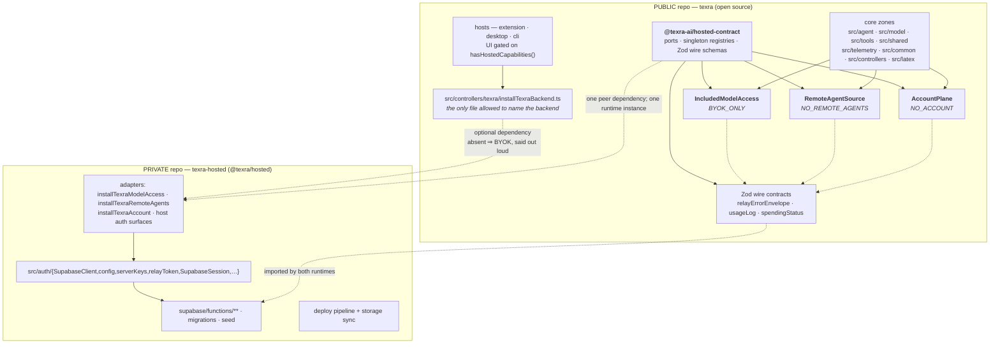

# Backend decoupling plan: finishing the seam that already exists

**Status:** proposal. Supersedes nothing; complements
`docs/proposals/2026-07-29-open-source-readiness.md`, which covers licensing,
repo identity, and publication decisions this plan assumes are settled.

**Goal.** Decouple the Supabase backend and the LLM relay from the UI and core
so that (a) the hosted implementation can live in a private repo, (b) the
open-source client works standalone on the user's own API keys with no dead
UI, and (c) a different backend can be installed.

**Method.** The repo already has the idiom and one finished instance of it.
`src/model/includedModelAccess.ts:28-63` is a typed capability port with a loud
null object (`BYOK_ONLY`, `:71-91`, which _throws_ at `getRelayBaseUrl` rather
than fabricating a URL) installed once per process from
`src/controllers/modelAccess/installTexraModelAccess.ts` next to
`initPlatform()`. `packages/agent/src/index.ts:225,244` already ships as an
embedder that never installs it and passes `loadAgents({ includeRemote: false })`.
This plan adds **two more ports of the same shape**, an importable public
`@texra-ai/hosted-contract` package that owns all three singleton registries and wire schemas,
**one canonical backend-module list consumed by static, dynamic, and resolved-relative import checks**, and no backend framework. The contract package
must land before `@texra/hosted`: a pinned repository SHA is source provenance, not a runtime
module-identity guarantee. Every proposed layer that turned out to be a pass-through was cut;
those cuts are named in §9.

---

## 1. The cut



|                                  | Public (`texra`)                                                                                                                                                                            | Private (`texra-hosted`)                                                                                                  | Interface between                                                                |
| -------------------------------- | ------------------------------------------------------------------------------------------------------------------------------------------------------------------------------------------- | ------------------------------------------------------------------------------------------------------------------------- | -------------------------------------------------------------------------------- |
| **Shared installation contract** | `@texra-ai/hosted-contract`, installed once by each host and imported as a peer by the hosted adapter                                                                                       | `@texra/hosted` declares the contract package as a peer dependency and never bundles a copy                               | one package instance owns all setters/accessors; CI rejects duplicate resolution |
| **Model routing**                | `IncludedModelAccess` port + `BYOK_ONLY`; `ModelHandler.resolveClientCredential` (`src/agent/modelHandlers/ModelHandler.ts:494-565`); `ProxyConfig` union (`ProxyConfigResolver.ts:89-173`) | `installTexraModelAccess.ts` incl. `capIncludedReasoningEffort` (tier pricing policy, `:30-48`); `src/auth/serverKeys/**` | 12-member interface + `setUseIncludedModelAccess()`                              |
| **Agent catalog**                | `RemoteAgentSource` port; registry fan-out (`src/agent/index/agentRegistry.ts:206`); the 21 prompt YAMLs in `prompts/agents/remote/`                                                        | PostgREST query, `remote_agents` table + column list, `PGRST204`/`42703` sniffing, `get-agent-config` client              | 4-member interface + `RemoteAgentCatalogEntrySchema`                             |
| **Account / plan**               | `AccountPlane` port; `ProfileMessageBuilder` assembly; settings + CLI render models                                                                                                         | `SupabaseClient`, GoTrue session, tier/quota policy, `log-usage` POST, host OAuth flows                                   | 6-member interface + `AccountSnapshotSchema`                                     |
| **Errors**                       | `relayDetection.ts` parses a published Zod envelope; `isRelayError` on the trace wire                                                                                                       | relay `jsonError` builds its body from the same schema                                                                    | `RelayErrorEnvelopeSchema` (versioned)                                           |
| **Abuse controls**               | —                                                                                                                                                                                           | `_shared/emailPolicy.ts`, `relay/requestGate.ts`, `relay/enforcement.ts`, RLS migrations                                  | none — never client-visible                                                      |
| **Enforcement**                  | one `BACKEND_MODULES` source consumed by alias, dynamic, and resolved-relative import checks in `eslint.config.mjs`                                                                         | private CI runs the public suite                                                                                          | lint fails on any new backend import in core                                     |

**Read the boundary as one sentence:** core zones may _ask_ whether included
access, a hosted catalog, or an account exists; only the composition root may _answer_. All callers and `@texra/hosted` import the registries
from the same resolved `@texra-ai/hosted-contract` package instance; the private adapter directory
is the unit that moves.

### Today's violations — the entire size of the problem

`grep "from '@auth/" src/` minus `src/test-kernel/` and `src/auth/` yields
**11 production files** (the documented third-party OAuth exceptions `@auth/codex`, `@auth/xai`, and non-credential `@auth/constants` are excluded — see §2):

| File                                                                    | Imports                                    | Fixed by                                               |
| ----------------------------------------------------------------------- | ------------------------------------------ | ------------------------------------------------------ |
| `src/agent/remote/remoteAgentConfigClient.ts:4`                         | `SUPABASE_CONFIG`                          | Port B (file moves)                                    |
| `src/agent/remote/remoteAgentList.ts:17,18`                             | `SUPABASE_CONFIG`, `SupabaseClient`        | Port B (file moves)                                    |
| `src/agent/remote/RemoteAgentLoader.ts:16`                              | `SupabaseClient`                           | Port B (file deleted)                                  |
| `src/telemetry/UsageLogService.ts:6,7`                                  | `SupabaseClient`, `SUPABASE_CUSTOM_DOMAIN` | Port C                                                 |
| `src/tools/setup/platform.ts:15,17`                                     | `relayToken`, `SupabaseClient`             | Port C                                                 |
| `src/controllers/settingsView/ProfileMessageBuilder.ts:21,22,23`        | all three                                  | Port C                                                 |
| `src/controllers/mainView/teamCatalogPorts.ts:3`                        | `SupabaseClient`                           | Port B                                                 |
| `src/controllers/onboarding/setupLaunch.ts:1`                           | `serverKeys`                               | **Step 0 — deletion, no port**                         |
| `src/controllers/settingsView/SettingsModelSelectionController.ts:8`    | `FREE_TIER`, `MAX_TIER`                    | **Step 0 — deletion, no port**                         |
| `src/controllers/settingsView/SettingsRemoteAgentPromptController.ts:2` | `ULTRA_TIER`                               | Port B (controller deleted)                            |
| `src/controllers/modelAccess/installTexraModelAccess.ts:13-16`          | all                                        | sanctioned adapter — moves to `src/controllers/texra/` |

Plus **14 non-test importers** of `getServerSideKeyService()` across all three
hosts and `src/controllers/`, which route around the one port that already
exists. Member tally across those call sites:
`setUseIncludedModelAccess` ×7, `getUseIncludedModelAccess` ×6,
`clearAllCaches` ×6, `getUserTier` ×3, `canUseServerSideKeys` ×2, and one each
of `getSpendingStatus`, `getRelayBaseUrl`, `isRelayQuotaExceeded`,
`wasQuotaAutoSwitched`, `isProviderOnServer`, `shouldUseServerSideKeysSync`,
`canUseModelSync`.

---

## 2. Why here and not elsewhere — the seams NOT cut

Some coupling stays. Naming it is part of the design.

| Left coupled                                                                                                                                            | Why                                                                                                                                                                                                                                                                                                                                                                                                                              | Evidence                                                                                                                                        |
| ------------------------------------------------------------------------------------------------------------------------------------------------------- | -------------------------------------------------------------------------------------------------------------------------------------------------------------------------------------------------------------------------------------------------------------------------------------------------------------------------------------------------------------------------------------------------------------------------------- | ----------------------------------------------------------------------------------------------------------------------------------------------- |
| **`@auth/codex/**` and `@auth/xai/**`** are permitted third-party OAuth exceptions                                                                      | Their current allowed classification is user-owned provider OAuth backed by `platform().secrets`, with no TeXRA-hosted relay or Supabase dependency. The root-aware model/runtime guard enforces only their consumers' import roots; retain this provider-tree property by review. A new provider requires an explicit policy and architecture-test allowlist update. `AUTH_COMMANDS` remain VS Code command IDs, not endpoints. | `src/agent/modelHandlers/openai/modelHandlerCodex.ts`, `src/agent/modelHandlers/openai/modelHandlerXAI.ts`, `src/agent/runtime/ModelFactory.ts` |
| **`isRelayError` stays on the durable trace format**                                                                                                    | It is a field of `ProviderErrorObjectSchema` (`src/shared/schemas/errors.ts:123`) republished on the trace bus (`src/agent/trace/events.ts:281`). Renaming it to `viaProxy` is a persisted-data migration, not a refactor. Under BYOK it is never `true`, so the branches are unreachable, not wrong.                                                                                                                            |                                                                                                                                                 |
| **`AGENT_SOURCE.REMOTE = 'remote'`** keeps its value                                                                                                    | It is a wire-contract enum member (`src/shared/schemas/agent.ts:22`) consumed by settings IPC, proposals, and the roster, and is persisted in registry keys. Its _meaning_ changes from "Supabase" to "the installed catalog source"; the string does not.                                                                                                                                                                       |                                                                                                                                                 |
| **`AgentModePreset.texraHostedAgents`** keeps its field name                                                                                            | Persisted in user team presets (`src/shared/schemas/agentPresets.ts:56`). Renaming needs a `z.union()` legacy transform at the entry point — worth doing, but not in the boundary PR series.                                                                                                                                                                                                                                     |                                                                                                                                                 |
| **The four hosted-vocabulary `ModelAvailabilityKind`s** (`'included-access'`, `'not-included'`, `'included-login-required'`, `'relay-quota-exhausted'`) | `computeModelOptions.ts:102-165` already normalizes them once into a client-owned view model that renderers consume verbatim, and `BYOK_ONLY` collapses all four. This is the seam working.                                                                                                                                                                                                                                      |                                                                                                                                                 |
| **`RetryState`'s relay-401-refresh control flow** (`src/agent/core/flows/RetryState.ts:196-215`)                                                        | It goes _through_ the port (`getAccessToken(true)`), so it is backend-agnostic already. Generalizing it to `onAuthFailure()` is defensible but is retry-engine surgery unrelated to the cut.                                                                                                                                                                                                                                     |                                                                                                                                                 |
| **`UsageMonitor`'s awaited flush** (`src/agent/utils/UsageMonitor.ts:296-310`)                                                                          | The `await` on relay rounds exists because the relay enforces its monthly cap from the DB aggregate; the comment says so. `usedRelay = usage.usageRoute === 'relay'` is permanently `false` with no relay installed, so leaving it untouched is both correct and free. **Do not "simplify" this.**                                                                                                                               |                                                                                                                                                 |
| **`packages/cli/src/runtime/relayUsage.ts`** (hand-built PostgREST keyset queries over `usage_logs`)                                                    | It is one CLI command in a host zone. It moves wholesale with the private package rather than getting a port nothing else would use.                                                                                                                                                                                                                                                                                             | `:195-215`                                                                                                                                      |
| **`supabase/functions/_shared/emailPolicy.ts`** never gets a public contract                                                                            | This is live anti-abuse policy whose value depends on non-publication. Do not reproduce its lists, thresholds, or bypass analysis in a public proposal.                                                                                                                                                                                                                                                                          | object path only; details stay in the private remediation tracker                                                                               |

### The placement constraint no proposal noticed

`src/test-kernel/architecture/subsystemEdgeRatchet.vitest.ts` fails on any **new
directed subsystem pair** against `config/ratchets/architecture-edges-baseline.json`.
The baseline has **no `tools → controllers` and no `telemetry → controllers`
edge**. It does have `tools → shared`, `telemetry → shared`, `agent → shared`,
`model → shared`, and `controllers → shared`.

Since `AccountPlane` is consumed by `src/tools/setup/platform.ts`,
`src/telemetry/UsageLogService.ts`, and `src/controllers/settingsView/`, it cannot live under
`src/controllers/account/`: that would create two new edges and invert layering. The canonical
implementation now lives in the importable `@texra-ai/hosted-contract` package; while migrations
still use source aliases, `src/shared/account.ts` is the only allowed compatibility re-export.
Regenerate/extend the architecture ratchet so direct imports from those zones resolve only to the
contract package or that shared re-export, never to controllers.

The documented `@auth/codex/**` and `@auth/xai/**` exceptions keep the broad
`agent → auth` subsystem edge legitimate, so do not remove it from the baseline. That ratchet is
too coarse to distinguish hosted credential-plane imports from the exceptions; the root-aware
model/runtime architecture test is the enforcement for this policy.

---

## 3. The contract

### Port A — `IncludedModelAccess` (moved into `packages/hosted-contract/src/includedModelAccess.ts`)

The existing `src/model/includedModelAccess.ts` contract moves into the package and remains as a
compatibility re-export during migration. Twelve members stay unchanged; two additions are paid for
by deletion:

```ts
export interface IncludedModelAccess {
  /* …existing 12 members… */

  /**
   * Persist the user's included-vs-personal preference. The provider owns the
   * write because flipping it must also invalidate entitlement caches and
   * notify subscribers; a caller touching globalState cannot do that.
   */
  setUseIncludedModelAccess(enabled: boolean): Promise<void>;
}

/**
 * Whether an included-access provider is installed at all — distinct from every
 * interface member, which answer "may this user route through it *now*". UI asks
 * this to decide whether an account surface should exist.
 */
```

`BYOK_ONLY` is a module-level `Object.freeze(...)` value (including frozen nested/empty return
values); `BYOK_ONLY.setUseIncludedModelAccess` **throws** with
`INCLUDED_MODEL_ACCESS_REMEDY` (`:97`), matching `getRelayBaseUrl`'s posture
(`:80-87`) — unreachable behind `hasHostedCapabilities()`, and a silent no-op
write is exactly the silent degradation CLAUDE.md bans. Tests must never receive a mutable
process-global fallback; use a fresh object only when a test explicitly needs mutation.

_Justification for `setUseIncludedModelAccess`:_ seven host call sites bind it
to the singleton (`packages/cli/src/runtime/initPlatform.ts:405,407`,
`packages/cli/src/runtime/apiAccessMode.ts:57`,
`packages/desktop/src/main/index.ts:757-758`,
`packages/desktop/src/main/desktopAgentExecution.ts:478-479`,
`packages/extension/src/progressView/ProgressViewMessageHandler.ts:603-604`,
`packages/extension/src/settingsView/SettingsViewMessageHandler.ts:182-183`),
and `src/controllers/` _already declares it as an injected dependency_
(`ProgressApiKeyRetryController.ts:44`, `SettingsProfileController.ts:69`).
The controllers treat it as a port member today; only the hosts don't.

**Deliberately NOT added** (each was in a source design; each is cut):

- `canUseServerSideKeysForModel` — `src/auth/serverKeys/ServerSideKeyService.ts:377-381`
  defines it as `(await canUseServerSideKeys()) && canUseModelSync(m)`, both
  already on the port. The bypass at `setupLaunch.ts:49-50` is fixed by
  composing, not widening.
- `getSpendingStatus` — spend is an account fact. It lives on Port C, which the
  CLI status bar can read instead of reaching `getServerSideKeyService()` from
  inside an Ink render component (`packages/cli/src/chat/tui/panes/StatusBar.tsx:168-176`).
- `clearAllCaches` — a session-lifecycle event. Port C's `onChange` owns it.

### Port B — `RemoteAgentSource` (new, `packages/hosted-contract/src/agentSource.ts`)

Consumed by `agentRegistry.ts` and `remoteAgentMeta.ts`, the only modules that reach the catalog
today. It lives in the VS Code-free, backend-free public contract package; `src/agent/index/` may
carry a temporary compatibility re-export.

```ts
import { z } from 'zod';

/** One catalog row in client vocabulary. No DB column names, no row id. */
export const RemoteAgentCatalogEntrySchema = z.object({
  name: AgentNameSchema,
  description: z.string().nullish(),
  visibility: z.array(z.string()).nullish(),
  tools: z.array(z.string()).nullish(),
  category: z.enum(AgentCategory).nullish(),
});
export type RemoteAgentCatalogEntry = z.infer<
  typeof RemoteAgentCatalogEntrySchema
>;

export interface RemoteAgentSource {
  /** Can this source serve definitions right now? Drives team preflight and UI. */
  isAvailable(): Promise<boolean>;
  /** Catalog rows. `[]` is a valid answer; failure is the source's to log at warn. */
  list(): Promise<readonly RemoteAgentCatalogEntry[]>;
  /** Raw agent YAML for one name. Runtime loading checks source availability, not prompt-view tier. */
  loadDefinitionYaml(agentName: string): Promise<string>;
  /** Drop cached rows — called on sign-out. */
  invalidate(): void;
}

const NO_REMOTE_AGENTS: RemoteAgentSource = Object.freeze({
  /* false, frozen empty list, throws, no-op */
});

export function remoteAgentSource(): RemoteAgentSource; // derived from the atomic bundle
```

The schema is today's `RemoteAgentListItemSchema` (`src/agent/remote/types.ts:17-29`)
minus two DB-isms: `id` (a PostgREST primary key that
`src/agent/index/remoteAgentMeta.ts:52-66` never reads) and the `agentCategory`
column name. `.nullish()` per CLAUDE.md.

_Why `isAvailable()` is not `list().length > 0`:_
`SupabaseClient.canAccessRemoteAgentCatalog()` deliberately excludes the CI
relay token while `isAuthenticated()` includes it
(`src/auth/SupabaseClient.ts:358-365`), and
`src/common/teams/TeamAvailabilityPreflight.ts:44-107` needs "could this source
serve, if asked" _before_ it has a list. Four members are required: availability, listing,
definition loading, and explicit cache invalidation.

**Five verified consumers:** `agentRegistry.ts:206` (`list`), `agentRegistry.ts:552-563`
(`invalidate`), `agentLoad.ts:133-138` (`loadDefinitionYaml`),
`teamCatalogPorts.ts:27` (`isAvailable`), and the setup adapter's
`remoteAgentCatalogAvailable` (`src/tools/setup/platform.ts:134`).

### Port C — `AccountPlane` (new, `packages/hosted-contract/src/account.ts`)

The schema, port, and accessor live together in the public contract package. During migration,
`src/shared/account.ts` is a compatibility re-export so existing subsystem edges do not point at a
private adapter.

```ts
export const AccountSnapshotSchema = z.object({
  authenticated: z.boolean(),
  email: z.string().nullable(),
  /** Operator's plan name, opaque to core. Rendered, never branched on. */
  planName: z.string().nullable(),
  sessionProblem: z.enum(['expired', 'unavailable']).nullable(),
  // Routing facts stay on IncludedModelAccess and are composed into UI
  // view models once; AccountSnapshot must not duplicate their ownership.
  spendingStatus: SpendingStatusSchema.nullable(),
  spendingStatusError: SpendingStatusErrorSchema.nullable(),
});
export type AccountSnapshot = z.infer<typeof AccountSnapshotSchema>;
export const SIGNED_OUT_ACCOUNT: AccountSnapshot; // deeply frozen

/** Host-neutral shape that VS Code can map losslessly to AuthenticationSession. */
export interface AccountSession {
  readonly id: string;
  readonly accessToken: string;
  readonly account: { readonly id: string; readonly label: string };
  readonly scopes: readonly string[];
}

export interface AccountSignInOptions {
  readonly providerHint?: string;
  readonly flow?: 'browser-loopback' | 'device-code';
  readonly signal?: AbortSignal;
  readonly onAuthUrl?: (url: string) => void;
  readonly openExternal?: (url: string) => Promise<void>;
  readonly onDeviceCode?: (challenge: {
    readonly userCode: string;
    readonly verificationUri: string;
    readonly expiresAt: string;
  }) => void;
}

export type AccountSignInResult =
  | { readonly kind: 'authenticated'; readonly session: AccountSession }
  | { readonly kind: 'cancelled' }
  | { readonly kind: 'failed'; readonly reason: string };

export type UsageSubmitResult =
  | { readonly kind: 'accepted' }
  | { readonly kind: 'retryable'; readonly reason: string }
  | { readonly kind: 'rejected'; readonly reason: string }
  /** No sink installed: the caller must stop queueing, loudly and once. */
  | { readonly kind: 'no-sink' };

export interface AccountPlane {
  /** `refresh: true` primes entitlement caches before reading. */
  snapshot(options?: { readonly refresh?: boolean }): Promise<AccountSnapshot>;
  /** Plan accounting, not telemetry — see below. */
  submitUsage(batch: UsageLogBatch): Promise<UsageSubmitResult>;
  /** Run sign-in with host-owned UI/cancellation and return a complete host session. */
  signIn(options?: AccountSignInOptions): Promise<AccountSignInResult>;
  signOut(): Promise<void>;
  /** External origins the host may open for this account provider. */
  externalNavigationOrigins(): readonly string[];
  /** Fires after a session change, once the impl has finished its own invalidation. */
  onChange(listener: () => void): () => void;
}

const NO_ACCOUNT: AccountPlane = Object.freeze({
  // snapshot → SIGNED_OUT_ACCOUNT; submitUsage → frozen {kind:'no-sink'};
  // signIn → frozen {kind:'failed'}; signOut → no-op;
  // externalNavigationOrigins → frozen []; onChange → noop disposer
});
export function accountPlane(): AccountPlane; // derived from the atomic bundle
```

**The port pays for itself by _shrinking_ the wire contract, not mirroring it.**
`UpdateProfileMessageSchema` (`src/shared/schemas/profileViewMessages.ts:104-123`)
gains nothing and **drops three fields that have producer sites and zero
consumers** — verified by grep across `packages/*/src` and `src/`:

| Dropped field     | Producer                           | Consumers |
| ----------------- | ---------------------------------- | --------- |
| `tierConstants`   | `ProfileMessageBuilder.ts:53,56`   | **none**  |
| `accessExpiresAt` | `ProfileMessageBuilder.ts:120,147` | **none**  |
| `remoteAgents`    | `ProfileMessageBuilder.ts:132,145` | **none**  |

The remaining account fields (`authenticated`, `user`, `tier`, `sessionProblem`,
`spendingStatus`, `spendingStatusError`) are re-derived from one `AccountSnapshot`
rather than separate `SupabaseClient` / `getServerSideKeyService()` reads.
`apiAccessMode` and `quotaAutoSwitched` are read from Port A at that same presentation
boundary, so routing has one owner and one composition point. `ProfileMessageBuilder`
keeps real work on top: provider-key statuses, streaming defaults, and host
assembly.

_Why `signIn`/`signOut`/`onChange` are on the same port and not a fourth:_
they are the same plane — who you are, what your plan allows, what your plan is
billed for. `AccountSignInOptions` deliberately carries host inputs already present in source:
VS Code needs cancellable progress and a browser callback; the CLI needs an `AbortSignal`, a
loopback-vs-device-code choice, and URL/device-code callbacks. `AccountSignInResult.session`
contains every field needed to construct `vscode.AuthenticationSession` without a second private
API read. The host still owns presentation and maps cancellation/errors to native UX.

### Atomic capability ownership

The contract package has separate entry points: `@texra-ai/hosted-contract/schemas` is
browser-safe data only, while `@texra-ai/hosted-contract/runtime` is process-only and owns the
mutable registry. The runtime entry point exposes one process-wide registry, not three
independently mutable singletons:

```ts
export interface HostedCapabilities {
  readonly includedModelAccess: IncludedModelAccess;
  readonly remoteAgentSource: RemoteAgentSource;
  readonly accountPlane: AccountPlane;
}
export function installHostedCapabilities(
  capabilities: Readonly<HostedCapabilities> | null,
): void;
export function hostedCapabilities(): Readonly<HostedCapabilities>; // frozen BYOK bundle by default
export function hasHostedCapabilities(): boolean;
export function resetHostedCapabilitiesForTests(): void;
```

`includedModelAccess()`, `remoteAgentSource()`, and `accountPlane()` are projections from that
single frozen bundle. Installation validates all facets and swaps the bundle atomically; no
partial state can expose account UI without its account plane or route models through a stale
adapter. All hosted-surface availability derives from `hasHostedCapabilities()`, while domain
behavior still goes through the narrow facet interfaces. This is the one source of truth for
installation and capability availability.

_Why `submitUsage` is here and not on a telemetry port:_
`src/telemetry/UsageLogService.ts:70-86` states that relay/subscription records
are **plan accounting**, sent regardless of the `texra.telemetry.enabled`
opt-out, because the relay reads the aggregate to enforce the spend cap. It is
an account operation that happens to live in a telemetry module.
`UsageLogService` keeps every piece of client-owned policy it has today —
batching, queue cap, opt-out, `PLAN_ACCOUNTING_ROUTES` (`:82-86`), the
re-read-after-await discipline. Only the URL and the bearer token leave.

### Wire contract — `RelayErrorEnvelopeSchema` (new, `packages/hosted-contract/src/schemas/relayErrorEnvelope.ts`)

This is the one contract an alternative backend must satisfy byte-for-byte. Its canonical owner is
the browser-safe contract-package schema entry point; `src/shared/schemas/` may carry only a
temporary compatibility re-export during migration. Today the shape exists only as five hand-rolled
string literals in
`src/common/errors/sdkError/relayDetection.ts:55-99`.

**Critical correction.** `_relay` is **a version string, not a boolean**:
`supabase/functions/relay/index.ts:127` declares
`const RELAY_VERSION = '1.10.0'`, stamped into every error body at `:234` and
into `/providers` at `:305`. The client discards it —
`relayDetection.ts:55-59` only checks `'_relay' in candidate`. A schema
declaring `_relay: z.literal(true)` would silently fail to parse **every** relay
error, losing quota, concurrency, and `retryAfterSeconds` handling.

```ts
/**
 * The error body an included-access relay returns instead of the provider's.
 * Any implementation of IncludedModelAccess that fronts provider APIs MUST emit
 * this shape, or the client silently loses quota and rate-limit handling.
 */
export const RelayErrorBodySchema = z.looseObject({
  /** Relay contract version, e.g. '1.10.0'. See RELAY_CONTRACT_VERSION. */
  _relay: z.string().min(1),
  type: z.literal('relay_error'),
  message: z.string(),
  limitReached: z.boolean().nullish(),
  requestLimitReached: z.boolean().nullish(),
  reason: z.enum(['concurrency', 'rate']).nullish(),
  retryAfterSeconds: z.number().nonnegative().nullish(),
});

export const RELAY_CONTRACT_MAJOR = 1;

/** null when the body is not a relay body. Throws a named "client too old for
 *  this relay" error on a major-version mismatch, rather than misclassifying. */
export function parseRelayErrorBody(raw: unknown): RelayErrorBody | null;
```

`relayDetection.ts:55-99`'s sniffers iterate
`errorBodyCandidates(rawErrorBody)`, which intentionally yields both the direct body and an
object-valued `{ error: ... }` wrapper, and `safeParse` **each candidate**. Do not parse the array
itself or assume every SDK unwraps the wrapper. `isRelayMonthlyLimitMessage` (`:112-118`, a literal match
on `'monthly spending limit reached'`) and its CLI string fallback
(`packages/cli/src/runtime/approval/approvalPolicy.ts:86-95`) are deleted.
On the private side, `jsonError` (`relay/index.ts:225-245`) builds its body
through the same schema so a client-visible field cannot be emitted without
existing in the contract.

### Zone ownership

| File                                                                                   | Zone                                      | Owner after the cut                            |
| -------------------------------------------------------------------------------------- | ----------------------------------------- | ---------------------------------------------- |
| `packages/hosted-contract/src/{includedModelAccess,agentSource,account}.ts`            | public contract package                   | public singleton owners                        |
| `packages/hosted-contract/src/schemas/{relayErrorEnvelope,usageLog,spendingStatus}.ts` | public contract package                   | public wire contracts                          |
| Existing `src/model`, `src/agent/index`, and `src/shared` contract paths               | compatibility re-exports during migration | public; delete after consumers use the package |
| `src/controllers/texra/installTexraModelAccess.ts`                                     | adapter                                   | **private**                                    |
| `src/controllers/texra/installTexraRemoteAgents.ts` + `remoteAgents/`                  | adapter                                   | **private** (moved from `src/agent/remote/`)   |
| `src/controllers/texra/installTexraAccount.ts`                                         | adapter                                   | **private**                                    |
| `src/controllers/texra/installTexraBackend.ts`                                         | adapter                                   | **public** — the guarded import site           |

---

## 4. Two implementations

| Port member                              | Hosted (`@texra/hosted`)                                                                                  | BYOK (nothing installed)                                                | UI under BYOK                                                                                                                                                                                      |
| ---------------------------------------- | --------------------------------------------------------------------------------------------------------- | ----------------------------------------------------------------------- | -------------------------------------------------------------------------------------------------------------------------------------------------------------------------------------------------- |
| `hasHostedCapabilities()`                | `true`                                                                                                    | `false`                                                                 | **Single atomic gate for every hosted surface.** Account tab omitted, LoginBanner absent, TeXRA-hosted choices omitted from shared `/login` `/auth` `/api`, onboarding TeXRA sign-in choice absent |
| `getUseIncludedModelAccess()`            | user preference in globalState                                                                            | `false`                                                                 | model picker shows `missing-key` / `provider-key`, never `included-*`                                                                                                                              |
| `canUseServerSideKeys()`                 | `ServerSideKeyService.canUseServerSideKeys()` (`:260-375`): tier + tier-config + expiry + quota auto-flip | `false`                                                                 | —                                                                                                                                                                                                  |
| `getRelayBaseUrl(p)`                     | `${base}/functions/v1/relay/${p}${suffix}` from `RELAY_PATH_SUFFIXES` (`ServerSideKeyService.ts:46-54`)   | **throws** (unreachable behind the gates)                               | —                                                                                                                                                                                                  |
| `getAccessToken()`                       | CI relay token, else GoTrue session (`SupabaseClient.ts:200-221`)                                         | `null`                                                                  | —                                                                                                                                                                                                  |
| `setUseIncludedModelAccess(b)`           | persists + clears caches + emits `includedModelAccessChanged`                                             | **throws** (unreachable)                                                | included/personal radio not rendered                                                                                                                                                               |
| `capReasoningEffort()`                   | `capIncludedReasoningEffort` (`installTexraModelAccess.ts:30-48`), Max⇒HIGH / free⇒MEDIUM                 | identity                                                                | full effort available on the user's own key                                                                                                                                                        |
| `RemoteAgentSource.isAvailable()`        | `SupabaseClient.canAccessRemoteAgentCatalog()`                                                            | `false`                                                                 | team preflight takes its existing `'unavailable'` branch                                                                                                                                           |
| `RemoteAgentSource.list()`               | PostgREST `remote_agents` query                                                                           | `[]`                                                                    | agent list = local YAML only; no empty "remote" category (gated, §6)                                                                                                                               |
| `RemoteAgentSource.loadDefinitionYaml()` | `get-agent-config` POST                                                                                   | **throws** (unreachable — no entry has `source:'remote'`)               | —                                                                                                                                                                                                  |
| `AccountPlane.snapshot()`                | `ProfileMessageBuilder.ts:45-127` logic, moved                                                            | `SIGNED_OUT_ACCOUNT`                                                    | profile message carries `authenticated: false`, null spend                                                                                                                                         |
| `AccountPlane.submitUsage()`             | bearer + ky POST to `functions/v1/log-usage`                                                              | `{ kind: 'no-sink' }`                                                   | `UsageLogService` logs once at `info` and stops its queue and timer                                                                                                                                |
| `AccountPlane.signIn()`                  | consumes host callbacks/cancellation and returns complete `AccountSession`                                | frozen `{ kind: 'failed', reason: 'No account provider is installed' }` | no TeXRA sign-in affordance exists to call it                                                                                                                                                      |

**BYOK model-call path, already proven.** `resolveClientCredential`
(`ModelHandler.ts:494-565`) computes `canRouteThroughRelay` from
`getUseIncludedModelAccess()`, gets `false`, and falls through to
`fetchApiKeyOrThrow` → `platform().secrets`. `resolveBaseUrl` never reaches
`case 'serverSideKeys'` (`ProxyConfigResolver.ts:162-168`), so the deliberate
throw stays unreachable. `src/model/apiProviders.ts` imports nothing but
`PlatformSecrets`. `packages/agent/src/index.ts` ships this way today.

**BYOK usage path.** `UsageMonitor.logToBackend` computes
`usedRelay = usage.usageRoute === 'relay'` (`:277`), permanently `false`, so the
awaited forced flush at `:301` never executes. `UsageMonitor` is not touched.

**BYOK setup-agent path.** `getSetupAuthStatus` returns
`{ authenticated: false, remoteAgentCatalogAvailable: false }` — the shape its
callers already handle. Side benefit: the user's account email and plan stop
being fed to the setup LLM as tool output (`src/tools/setup/platform.ts:122-150`
→ `ProbeEnvironmentTool.ts:58`, `VerifySetupTool.ts:76`).

---

## 5. Enforcement

Written against `eslint.config.mjs` as it exists. `AUTH_RESTRICTED_IMPORT_PATTERNS`
(`:117-125`) applied at `:567-580` is the exact recipe; this copies it.

**Add next to `AUTH_RESTRICTED_IMPORT_PATTERNS` (~line 117):**

```js
// Modules that speak to a specific hosted backend. Core zones ask the installed
// ports (includedModelAccess / remoteAgentSource / accountPlane) instead; the
// bindings live in src/controllers/texra/. `@auth/codex` and `@auth/xai`
// are deliberately absent because their current provider trees are user-owned
// OAuth backed by platform().secrets, not TeXRA-hosted credentials. AUTH_COMMANDS
// are VS Code command IDs, not endpoints.
const BACKEND_MODULES = [
  '@supabase/supabase-js',
  '@auth/SupabaseClient',
  '@auth/SupabaseSession',
  '@auth/SupabaseAuthCoordinator',
  '@auth/supabaseSessionTypes',
  '@auth/TokenProvider',
  '@auth/config',
  '@auth/relayToken',
  '@auth/serverKeys',
  '@texra/hosted',
];

const BACKEND_BOUNDARY_MESSAGE =
  'Backend-free zones must not import a hosted backend. Ask the installed ' +
  'port instead; bindings belong in src/controllers/texra/.';

const BACKEND_RESTRICTED_IMPORT_GROUP = {
  group: BACKEND_MODULES.flatMap((module) => [module, `${module}/**`]),
  message: BACKEND_BOUNDARY_MESSAGE,
};

const BACKEND_RESTRICTED_IMPORT_PATTERNS = [
  BACKEND_RESTRICTED_IMPORT_GROUP,
  ...HOST_LAYER_RESTRICTED_IMPORT_PATTERNS,
];

const escapeForRegex = (value) => value.replace(/[.*+?^${}()|[\]\\]/g, '\\$&');

const NO_DYNAMIC_BACKEND_IMPORT = {
  selector: `ImportExpression[source.value=/^(${BACKEND_MODULES.map(
    escapeForRegex,
  ).join('|')})(\\/|$)/]`,
  message: BACKEND_BOUNDARY_MESSAGE,
};
```

The alias and dynamic selectors above are not sufficient alone: `../auth/config` would bypass
both. Extend the existing project-local import-boundary rule to consume the same `BACKEND_MODULES`
list, resolve relative specifiers from the importing file, and reject any resolved backend module
outside `src/controllers/texra/`. Do not create a second backend path list. Cover static and dynamic
relative imports with planted-rule tests alongside the alias cases.

**Add this block _before_ the `src/agent/core/**` block at `:552`** (flat config:
a later block replaces the same rule wholesale, so ordering matters):

```js
// Backend-free zones. Core may ask whether included access, a hosted catalog,
// or an account exists; only src/controllers/texra/ may answer.
{
  files: [
    'src/agent/**/*.{ts,tsx,mts,cts}',
    'src/model/**/*.{ts,tsx,mts,cts}',
    'src/tools/**/*.{ts,tsx,mts,cts}',
    'src/shared/**/*.{ts,tsx,mts,cts}',
    'src/telemetry/**/*.{ts,tsx,mts,cts}',
    'src/common/**/*.{ts,tsx,mts,cts}',
    'src/controllers/**/*.{ts,tsx,mts,cts}',
    'src/latex/**/*.{ts,tsx,mts,cts}',
    'src/replacement/**/*.{ts,tsx,mts,cts}',
    'src/eventBus/**/*.{ts,tsx,mts,cts}',
    'src/hosts/**/*.{ts,tsx,mts,cts}',
    'packages/agent/src/**/*.{ts,tsx,mts,cts}',
  ],
  ignores: ['src/controllers/texra/**', 'src/test-kernel/**'],
  rules: {
    'no-restricted-imports': [
      'error',
      {
        paths: HOST_LAYER_RESTRICTED_IMPORT_PATHS,
        patterns: BACKEND_RESTRICTED_IMPORT_PATTERNS,
      },
    ],
    'no-restricted-syntax': ['error', NO_DYNAMIC_BACKEND_IMPORT],
  },
},
```

**And spread the group into the agent-core patterns** (`:110-116`), because that
later block would otherwise override the backend ban for `src/agent/core/**`:

```js
const AGENT_CORE_RESTRICTED_IMPORT_PATTERNS = [
  { group: ['@agent/modelHandlers', '@agent/modelHandlers/**'], message: '…' },
  BACKEND_RESTRICTED_IMPORT_GROUP, // ← add
  ...HOST_LAYER_RESTRICTED_IMPORT_PATTERNS,
];
```

**Do not delete `@supabase/supabase-js` in the boundary-pinning step.** It is declared in
exactly three manifests — root `package.json`, `packages/agent/package.json`, and
`packages/extension/package.json` — while the implementation still lives in `src/auth/` and the
desktop/CLI builds resolve it through the root installation. Deleting the root declaration before
extraction breaks those hosts. The dependency declarations move with the hosted implementation in
step 10, or not at all; the lint block enforces the intermediate boundary.

**Second gate:** retain `agent → auth` in
`config/ratchets/architecture-edges-baseline.json`, because the documented third-party OAuth
exceptions keep that broad edge legitimate. `subsystemEdgeRatchet.vitest.ts` cannot distinguish a
hosted credential-plane import from those roots; use the root-aware model/runtime architecture test
to enforce this narrower policy.

**Third gate, free:** every new export lands with a consumer in the same PR;
`npm run check:dead-code-ratchet` enforces it against
`config/ratchets/knip-baseline.json`.

---

## 6. UI decoupling

Two rules: **no UI surface consumes a backend response shape**, and **no UI
surface exists that a BYOK build cannot act on**.

### 6.1 Response shapes → view models

| Surface                                                              | Today                                                                                     | After                                                                                                                                                                    |
| -------------------------------------------------------------------- | ----------------------------------------------------------------------------------------- | ------------------------------------------------------------------------------------------------------------------------------------------------------------------------ |
| `settingsView/frontend/components/profile/RelayQuotaMeter.ts:99-135` | `@property status` **is** the `/tier-config` `SpendingStatus` object                      | binds to `AccountSnapshot.spendingStatus`, a client-owned field of a client-owned snapshot; `spendingQuotaState()` (`spendingStatus.ts:32-52`) still supplies the policy |
| `settingsView/frontend/tabs/AccountTab.ts:59-69`                     | 8 props, 7 of them hosted concepts                                                        | one `account: AccountSnapshot \| null` prop                                                                                                                              |
| `packages/cli/src/chat/tui/panes/StatusBar.tsx:168-176`              | Ink render component calls `getServerSideKeyService().getSpendingStatus()` on an interval | reads `accountPlane().snapshot()`; the component stops importing auth                                                                                                    |
| `progressView/.../messageFormatters.ts:80-92,105-153`                | renders `rawErrorBody` verbatim as `<pre>` JSON and a `banner-details--relay-error` class | `rawErrorBody` stays in the opt-in details block only; `isRelayError` becomes a neutral "routed through included access" label                                           |
| `packages/cli/src/runtime/apiStatus.ts:200`                          | interpolates the raw thrown error into a status line                                      | maps `UsageSubmitResult`/snapshot state to fixed copy, matching the good branch already at `:190-193`                                                                    |
| `packages/extension/src/commands/auth/authCommands.ts:75-81`         | shows `SupabaseClient.getInitError()` raw in a toast                                      | mapped message, matching the good branch at `:53-61`                                                                                                                     |

Desktop needs no separate work: `packages/desktop/src/renderer/main.ts:53-54`
imports `@settingsView/frontend` and `@webview/frontend` wholesale, so one fix
covers both hosts.

### 6.2 Dead affordances → gated on the atomic `hasHostedCapabilities()`

Not on `authenticated`. `ModelsTab.ts:120-128,163-167` is the only surface that
gates correctly today, and even it keys on the wrong predicate — under BYOK
`authenticated` is permanently `false`, which reads as "signed out" rather than
"no such thing here".

| Surface                                                                                                                                                                                                           | Mechanism needed                                                                                                                                                                                                                                                                                                                                                                               |
| ----------------------------------------------------------------------------------------------------------------------------------------------------------------------------------------------------------------- | ---------------------------------------------------------------------------------------------------------------------------------------------------------------------------------------------------------------------------------------------------------------------------------------------------------------------------------------------------------------------------------------------- |
| Account tab — a literal member of `SETTINGS_TAB_ORDER` (`src/shared/schemas/settingsView/data.ts:75-88`) and of `SETTINGS_TAB_GROUPS` (`:128-137`)                                                                | **new**: project `hasHostedCapabilities()` from the process-side composition root into an explicit `hostedCapabilitiesAvailable` settings bootstrap/view-model field. The browser/renderer filters navigation from that field; it must not import the process-only runtime accessor. The tuple remains the `SettingsTabName` source, so filter at build time rather than editing it            |
| `webview/frontend/components/LoginBanner.ts:87-111` "Researcher Access Program" — shown whenever `!authStatus.authenticated` (`MainViewStartupController.ts:82-88`), i.e. to every BYOK user forever              | existing visibility flag; add `hasHostedCapabilities()`                                                                                                                                                                                                                                                                                                                                        |
| `ONBOARDING_CHOICE_SIGN_IN` (`src/shared/copy/onboarding.ts:22-26`) rendered by `OnboardingWelcomeCard.ts:309-323`, `setupAssistantCommand.ts:95-99`, and `packages/cli/src/onboarding/runOnboarding.tsx:596,663` | make the choice list capability-derived; `onboardingFunnel.ts:30-38` is already credential-agnostic                                                                                                                                                                                                                                                                                            |
| Shared CLI `/login`, `/logout`, `/auth`, `/api` (`registerBuiltins.tsx:551-601`) and `LOGIN_FORM_ITEMS` (`LoginForm.tsx:15-35`)                                                                                   | **always register the shared commands**. Capability-gate only TeXRA-hosted branches/options; preserve ChatGPT subscription login/logout, Kimi Code selection, personal-key controls, and other public auth paths in BYOK builds                                                                                                                                                                |
| `texra auth` subcommand tree (`packages/cli/src/commands/auth.ts`) and `texra setup-token` (`packages/cli/src/commands/relayTokens.ts`)                                                                           | keep the public `texra auth` tree and `chatgptAuthCommand`; omit only TeXRA account/relay-token subcommands. The NDJSON kinds `'auth-status'`, `'relay-usage'`, `'relay-token'`, `'relay-token-info'`, `'relay-token-revoked'` (`packages/cli/src/schemas/cliOutput.ts`, `CliOutputRecordSchema`) stay in the union — removing them breaks a published contract; they are simply never emitted |
| VS Code walkthrough step (`packages/extension/package.json:1141-1149,1167`)                                                                                                                                       | **manifest JSON — cannot be runtime-gated.** Rewrite the copy so it does not promise Researcher Access or claim the orchestrator requires it                                                                                                                                                                                                                                                   |
| `texra.telemetry.enabled` (`packages/extension/package.json:745-750`, default `true`, description entirely about sending data to TeXRA)                                                                           | set both `DEFAULT_CORE_SETTINGS.telemetry.enabled` and the extension manifest default to `false`, so CLI, desktop, and extension agree; rewrite the description, while the hosted build contributes the plan-accounting note                                                                                                                                                                   |
| `src/shared/copy/promoNotice.ts:15-49` — sponsor promo plus `github.com/sponsors/texra-ai` (`:41`) and `buymeacoffee.com/texra.ai` (`:44`)                                                                        | **delete from `src/shared/`.** Not a port problem: a fork must not ship upstream's funding links. Consumers: `LoginBanner.ts:7`, `ApiAccessSection.ts:19,73-94`                                                                                                                                                                                                                                |
| `packages/desktop/src/main/desktopNavigationPolicy.ts:17-21` — allowlists `texra.ai` for OAuth                                                                                                                    | build the process-side allowlist from `accountPlane().externalNavigationOrigins()`; `NO_ACCOUNT` contributes a frozen empty list, and each installed provider explicitly supplies its own origins                                                                                                                                                                                              |

---

## 7. Migration

Eleven steps plus one packaging prerequisite in four phases. "Parallel" means it can land concurrently with other
steps in the same phase.

### Phase 0 — establish one runtime contract instance

| #     | Change                                                                                                                                                                                                                                                                                                                                                                                                                                                                                                                                                                                  | Files                                                                | Proof                                                                                                                         | Parallel          |
| ----- | --------------------------------------------------------------------------------------------------------------------------------------------------------------------------------------------------------------------------------------------------------------------------------------------------------------------------------------------------------------------------------------------------------------------------------------------------------------------------------------------------------------------------------------------------------------------------------------- | -------------------------------------------------------------------- | ----------------------------------------------------------------------------------------------------------------------------- | ----------------- |
| **P** | **Publish the importable contract first.** Add `packages/hosted-contract` as `@texra-ai/hosted-contract`; move the three port interfaces, singleton setters/accessors, frozen null objects, and shared Zod schemas into it. Public hosts depend on it normally. Future `@texra/hosted` declares it as a peer dependency with a compatible exact major/minor range and externalizes it from every bundle. Add a resolution test that imports the accessor through the host and through a hosted fixture, installs once, and observes the same instance; fail on duplicate package copies | 1 package, root workspace/lockfile, compatibility re-exports, 1 test | package can be imported by both repos; singleton identity test green; `npm ls @texra-ai/hosted-contract` has one runtime copy | blocks steps 1-10 |

A pinned public-repository SHA remains useful for CI provenance, but it does not satisfy this
prerequisite and must not be presented as a runtime identity mechanism.

### Phase 1 — the core cut (no user-visible change)

| #     | Change                                                                                                                                                                                                                                                                                                                                                                                                                                                                                                                                                                                                                                                                                                                                                                                                                                                                                                                                                                                                                                                                                                                                                                                                                                           | Files                                                                            | Proof                                                                                                                                           | Parallel                 |
| ----- | ------------------------------------------------------------------------------------------------------------------------------------------------------------------------------------------------------------------------------------------------------------------------------------------------------------------------------------------------------------------------------------------------------------------------------------------------------------------------------------------------------------------------------------------------------------------------------------------------------------------------------------------------------------------------------------------------------------------------------------------------------------------------------------------------------------------------------------------------------------------------------------------------------------------------------------------------------------------------------------------------------------------------------------------------------------------------------------------------------------------------------------------------------------------------------------------------------------------------------------------------ | -------------------------------------------------------------------------------- | ----------------------------------------------------------------------------------------------------------------------------------------------- | ------------------------ |
| **0** | **Two deletions, no port.** (a) `setupLaunch.ts:49-58`: replace `getServerSideKeyService()` with `includedModelAccess()`; `canUseServerSideKeysForModel(m)` → `(await canUseServerSideKeys()) && canUseModelSync(m)`, verbatim what `ServerSideKeyService.ts:377-381` does. (b) `SettingsModelSelectionController.ts:239-254`: delete the `MAX_TIER→'high' / FREE_TIER→'medium'` switch, call `capReasoningEffort` — removing the second of two independent encodings of one pricing policy (the other is `installTexraModelAccess.ts:30-48`)                                                                                                                                                                                                                                                                                                                                                                                                                                                                                                                                                                                                                                                                                                    | 2 edits, both smaller                                                            | `npm run lint && npm test`; two `@auth/*` imports gone                                                                                          | ✅ ships alone, first    |
| **1** | **Widen Port A.** Add `setUseIncludedModelAccess`; implement in `installTexraModelAccess.ts`. Rewrite the 7 host `setUseIncludedModelAccess` bindings and the `getUseIncludedModelAccess` / `getSpendingStatus` reads at `StatusBar.tsx:168-176`, `apiAccessMode.ts`, and `packages/extension/src/frontend/secretManager.ts:48-56`. The latter is a real file, and its async return is adopted by `anyApiKeyExists()`; this is a port rewire, **not** a missing-`await` bug fix.                                                                                                                                                                                                                                                                                                                                                                                                                                                                                                                                                                                                                                                                                                                                                                 | ~14 edits                                                                        | `getServerSideKeyService` importers drop from 14 to ≤4; ratchet green                                                                           | after 0                  |
| **2** | **Port B.** Add the contract implementation and `git mv src/agent/remote/ src/controllers/texra/remoteAgents/`; add `installTexraRemoteAgents.ts`. Keep prompt-view authorization in the host-facing Settings handler/controller; **do not** fold the `tier !== ULTRA_TIER` view gate into `loadDefinitionYaml()`, because `agentLoad.ts:133-138` uses that loader for normal execution. Rewire `remoteAgentMeta.ts:46-74` (**deleting the `await import('@agent/remote/remoteAgentList')` at `:47`** — the one dynamic backend import in core), `agentLoad.ts:133-138`, `teamCatalogPorts.ts:27`, `agentRegistry.ts:206,552-563`, and both hosts' view-remote-prompt handlers (`settingsView/handlers/agentHandlers.ts:17`, `desktop/desktopAgentSettingsController.ts:5`). Delete `SettingsRemoteAgentPromptController` only after moving its view-only authorization into both host handlers (or deliberately removing that authorization when the YAMLs publish). **Do not merge the remote branch with the adjacent inline branch at `agentLoad.ts:110-130`** — inline applies `toToolUseSettings` and an `agentCategory` default the remote path does not; merging is a silent behavior change and belongs in its own PR with its own test | 1 contract implementation, 5 moved, 1 conditional deletion, ~8 edits             | `RemoteAgentLoaderSchemaFallback.vitest.ts` extended first; `toolRegistryCycle.vitest.ts` now asserts `agentRegistry` reaches no backend module | after 1                  |
| **3** | **Port C.** Move `src/telemetry/UsageLogTypes.ts` into the contract package's `schemas/usageLog.ts` and retain temporary compatibility re-exports. Add `installTexraAccount.ts` carrying `ProfileMessageBuilder.ts:45-127` **including its conditional-priming comment at `:107-113`** — priming only when included access is on, because `canUseServerSideKeys()` otherwise blanks the spend snapshot. Replace the three bare `catch {}` (`:94-98`, `:124-127`, `:132-135`) with `logger.warn` + a surfaced `sessionProblem: 'unavailable'`; today a backend outage renders as "free plan, no usage". Drop `tierConstants` / `accessExpiresAt` / `remoteAgents` from `UpdateProfileMessageSchema`. Rewire `ProfileMessageBuilder`, `src/tools/setup/platform.ts:122-150`, `UsageLogService` (`{kind:'no-sink'}` ⇒ log once at `info`, stop queue + timer), and desktop navigation policy to `externalNavigationOrigins()`                                                                                                                                                                                                                                                                                                                       | 1 contract module, 1 moved schema, 1 adapter, compatibility re-exports, ~6 edits | webview + CLI render from `AccountSnapshot`; `UsageMonitor` untouched                                                                           | after 1; parallel with 2 |
| **4** | **Pin the boundary.** `src/controllers/texra/installTexraBackend.ts` installs one `HostedCapabilities` bundle into the shared contract instance. Make it async now. Update all three composition roots — `extension.ts:252`, `desktop/platform/index.ts:300`, `cli/initPlatform.ts:295` — to `await installTexraBackend()` **before** constructing settings navigation, login banners, onboarding choices, or CLI command registries that evaluate capability gates. Add the lint blocks from §5. Keep `@supabase/supabase-js` installed until step 10. Regenerate `architecture-edges-baseline.json`                                                                                                                                                                                                                                                                                                                                                                                                                                                                                                                                                                                                                                            | 1 new, 3 one-liners, 1 config, 1 baseline                                        | `npm run lint` fails on planted alias, dynamic, **and shallow relative** imports (for example `../auth/config`) outside the adapter exemption   | after 2 and 3            |
| **5** | **Relay error envelope.** Add `packages/hosted-contract/src/schemas/relayErrorEnvelope.ts` with `_relay: z.string()` and retain a temporary public compatibility re-export. Rewrite `relayDetection.ts:55-99` to `safeParse` each direct/wrapped candidate; delete `isRelayMonthlyLimitMessage` (`:112-118`) and the CLI string fallback (`approvalPolicy.ts:86-95`). Add the major-mismatch error. Point `relay/index.ts:225-245`'s `jsonError` at the same schema                                                                                                                                                                                                                                                                                                                                                                                                                                                                                                                                                                                                                                                                                                                                                                              | ~5 edits + 1 edge function                                                       | a golden fixture captured from `remote.texra.ai` parses; a `_relay: '2.0.0'` fixture raises the named mismatch error                            | ✅ independent of 1-4    |

### Phase 2 — the product cut (this is what makes BYOK a product)

| #     | Change                                                                                                                                                                                                                                                                                                                                                                                                                                                                                                                                                                                                                                                                   | Files                                               | Proof                                                                                                                                                                                                                                  | Parallel                                       |
| ----- | ------------------------------------------------------------------------------------------------------------------------------------------------------------------------------------------------------------------------------------------------------------------------------------------------------------------------------------------------------------------------------------------------------------------------------------------------------------------------------------------------------------------------------------------------------------------------------------------------------------------------------------------------------------------------ | --------------------------------------------------- | -------------------------------------------------------------------------------------------------------------------------------------------------------------------------------------------------------------------------------------- | ---------------------------------------------- |
| **6** | **Package the hosted prompts.** The 21 YAMLs in `prompts/agents/remote/` (16 top-level + 5 under `Lean4/`) are in HEAD and `prompts/README.md:7-9,27-28` declares them the public source of truth that production storage may not own. They are _not_ in the VSIX. Copy or build-step them into `packages/extension/resources/tool_use_agents/` and `resources/agents/` so `orchestrator`, `generic`, `devise`, `apply`, `criticize`, `simplifier`, `progressCheck`, `search` and the Lean line resolve locally; keep `scripts/sync-remote-agents.mjs` pointed at `prompts/` as the SSOT. Hosted catalog entries then _override by name_, never _supply exclusively_     | packaging config + resource wiring                  | the default `STARTER` team (`agentPresets.ts:108`, needs `orchestrator`) applies cleanly with nothing installed — no "Sign in to TeXRA" modal (`agentHandlers.ts:430-445`)                                                             | ✅ independent of all code steps               |
| **7** | **Gate the affordances** per §6.2: project process-side hosted availability into the settings bootstrap/view model, then gate the settings tab, LoginBanner, onboarding choice list, and hosted CLI branches/options; set both shared and extension telemetry defaults to `false`; rewrite walkthrough copy and delete `promoNotice.ts`; preserve shared ChatGPT/Kimi/public-auth commands                                                                                                                                                                                                                                                                               | ~15 UI files + manifest                             | boot all three hosts without `installTexraBackend()`: zero TeXRA sign-in/upgrade surfaces or hosted-only options in any renderer, while shared CLI auth/API commands still work and all three hosts read telemetry disabled by default | after 4 (needs the atomic capability registry) |
| **8** | **Make the guarded install real.** `installTexraBackend.ts` first resolves the top-level optional specifier `@texra/hosted` in an isolated resolution step. Only a failure that identifies that exact top-level package selects BYOK and logs at `info`; after resolution succeeds, execute `await import(resolvedSpecifier)` outside the fallback catch so missing/broken transitive imports are always rethrown. A code-only `ERR_MODULE_NOT_FOUND` check is forbidden because transitive failures use the same code. The installer awaits `@texra/hosted.install()` against the shared contract package before returning. Resolve the bundler question first (§9, R2) | 1 installer + 3 composition roots + 3 build configs | public CI installs with `--no-optional`, builds and boots all three hosts; hosted fixture with a missing transitive dependency fails loudly; startup tests prove capability-derived surfaces are constructed only after installation   | after P, 4 and 7                               |

### Phase 3 — the repo cut

| #      | Change                                                                                                                                                                                                                                                                                                                                                                                                                                                                                                                                                                                                                                                                                                                                                                                                                                   | Files                                                | Proof                                                                                                                             | Parallel |
| ------ | ---------------------------------------------------------------------------------------------------------------------------------------------------------------------------------------------------------------------------------------------------------------------------------------------------------------------------------------------------------------------------------------------------------------------------------------------------------------------------------------------------------------------------------------------------------------------------------------------------------------------------------------------------------------------------------------------------------------------------------------------------------------------------------------------------------------------------------------- | ---------------------------------------------------- | --------------------------------------------------------------------------------------------------------------------------------- | -------- |
| **9**  | **Thin the host auth surfaces.** `packages/extension/src/frontend/auth/SupabaseAuthProvider.ts` keeps the VS Code `AuthenticationProvider` shell, passes cancellable progress/browser callbacks to `accountPlane().signIn`, and maps the returned complete `AccountSession` to `vscode.AuthenticationSession`; `desktopSupabaseAuth.ts` keeps its window/browser presentation; `packages/cli/src/runtime/supabaseAuth.ts` supplies `AbortSignal`, loopback-vs-device-code selection, and URL/device-code callbacks. The protocol (GoTrue, PKCE, device code, token refresh) and the five `clearAllCaches({resetQuotaFlip:true})` sequences move behind `onChange`. **Re-read `src/auth/authFlowEffects.ts` first** — it documents why the three were deliberately not unified. Highest regression risk in the plan; lowest test coverage | 3 host modules + 3 CLI runtime files                 | manual sign-in/sign-out on each host, twice each                                                                                  | after 8  |
| **10** | **Extract `texra-hosted`.** Move `supabase/**`, the listed hosted auth/adapters/CLI modules, the direct implementation suites, and the `@supabase/supabase-js` declarations from their three actual manifests. The six Deno-cross-importing tests are only a subset: the consumer-suite readiness ratchet in §8 must reach zero before extraction                                                                                                                                                                                                                                                                                                                                                                                                                                                                                        | repo surgery + dependency ownership + test migration | public `npm test` green; zero consumer suites mock removed `@auth/Supabase*` modules; public build boots BYOK; private CI deploys | after 9  |

---

## 8. Repo split

### Decision: `supabase/` moves private. Recommended.

`supabase/README.md:1-17` already states the intent and the completion criteria
("the canonical TeXRA Cloud source **until** a maintainer selects and creates a
private infrastructure repository", with a five-point move protocol). The
argument for keeping it public rests on "no secrets", which is true —
every credential is `Deno.env.get(...)` — but tests the wrong thing.
`supabase/functions/_shared/emailPolicy.ts`, `relay/requestGate.ts`, and
`relay/enforcement.ts` contain live anti-abuse policy. Their lists, thresholds, and bypass analysis
are intentionally not reproduced here. Publication must wait for server-side accounting
enforcement; moving these objects private contains disclosure but is not a compensating control.

**The honest cost, measured:** 36 of 81 commits touching `supabase/` also touch
`src/` or `packages/` (~44%). Backend work becomes cross-repo PR pairs for that
fraction. That is a real, recurring tax, accepted for the abuse-control reason
above.

### What moves

| To `texra-hosted` (private)                                                                                                                                                                                                                                                         | Why                                                                                                                                                                                                                                      |
| ----------------------------------------------------------------------------------------------------------------------------------------------------------------------------------------------------------------------------------------------------------------------------------- | ---------------------------------------------------------------------------------------------------------------------------------------------------------------------------------------------------------------------------------------- |
| `supabase/functions/**`, migrations, `config.toml`                                                                                                                                                                                                                                  | enforcement logic + deploy plane                                                                                                                                                                                                         |
| `src/auth/{SupabaseClient,config,SupabaseSession,SupabaseAuthCoordinator,supabaseSessionTypes,TokenProvider,relayToken}.ts`, the Supabase PKCE authorization-code parser and types currently in `src/auth/authCallback.ts`, and `src/auth/serverKeys/**`                            | `config.ts:119-147` carries `UserTierSchema`, tier constants, `RELAY_TIER_SPENDING_LIMITS` — plan pricing with no public consumer after steps 0-3; callback parsing extracts the PKCE authorization code used for Supabase code exchange |
| `src/controllers/texra/**` except `installTexraBackend.ts`                                                                                                                                                                                                                          | the adapters                                                                                                                                                                                                                             |
| `packages/cli/src/runtime/{relayUsage,relayTokensClient,supabaseAuthDeviceCode}.ts`                                                                                                                                                                                                 | PostgREST `usage_logs` queries, relay-token minting, device-code client                                                                                                                                                                  |
| `src/test-kernel/supabase/**` (4 files), `src/test-kernel/auth/EmailPolicy.vitest.ts`, the Supabase PKCE authorization-code parser cases in `src/test-kernel/auth/authCallback.vitest.ts`, and the `relayCiToken` path assertion in `src/test-kernel/cli/RelayTokens.vitest.mts:81` | they exercise hosted policy, protocol parsing, or cross-import Deno source (`../../../supabase/functions/…`)                                                                                                                             |

**The test list above is only the Deno-cross-importing subset.** Measured at the concurrent remote
head, **36 suites** name modules removed by extraction. Seven direct implementation suites move
with the hosted implementation. The remaining approximately 29 consumer suites span model
handlers, hosts, controllers, telemetry, and settings; a consumer test that mocks a Supabase module
shows that its subject has not yet migrated to the public port.

Steps 1-3 are therefore incomplete until those consumer suites mock the installed ports instead.
Track the count of consumer suites naming removed `@auth/Supabase*` modules as a non-increasing CI
ratchet. Step 10 is mechanical only when that count reaches zero; while it is nonzero, extraction is
blocked regardless of where the implementation files move.

| Stays public                                                                                               | Why                                                                                                                                                                                           |
| ---------------------------------------------------------------------------------------------------------- | --------------------------------------------------------------------------------------------------------------------------------------------------------------------------------------------- |
| `prompts/agents/remote/` (21 YAMLs)                                                                        | `prompts/README.md:7-9` declares them the public home; production storage may copy but not own them. Step 6 packages them into the client                                                     |
| `src/auth/codex/**` and a host-neutral callback-path module split out of `src/auth/authCallback.ts`        | third-party subscription plane plus only `getAuthCallbackBasePath` / `isAuthCallbackPath` and their routing tests; the Supabase PKCE authorization-code parser, types, and tests move private |
| `packages/hosted-contract/**` plus temporary compatibility re-exports in `src/{model,agent/index,shared}/` | importable contract and migration bridge; singleton implementations exist only in the package                                                                                                 |
| `docs/supabase/remote-agents.config.json`, `scripts/sync-remote-agents.mjs`                                | inseparable public input/consumer pair for catalog placement metadata; if the config moves to another public path, update the script atomically and test `check:remote-agents`                |

### Mechanics

**History extraction.** `git filter-repo --path supabase --path src/auth/... `
onto a fresh `texra-hosted`, then a _second_ `filter-repo --invert-paths` pass
on the public repo. Both must precede the first public push — after
publication, a rewrite invalidates every clone and cannot recall what was
served. Also rotate the legacy Supabase anon JWT visible in history before the
publishable-key rename.

**Contract ownership and installation identity.** The **public** repo publishes
`@texra-ai/hosted-contract`, which owns the wire schemas, the three port types, and the actual
singleton registries/null objects. Public hosts depend on that package; `@texra/hosted` declares it
as an external peer dependency and imports the host-installed instance. The public host may
optionally depend on `@texra/hosted`, never the reverse. A CI resolution test rejects duplicate
contract copies. This inverts today's situation, where `src/auth/config.ts:110-113`
admits in a comment that "the relay edge function cannot import this
client-side module" and parity is enforced by a Vitest file.

**Versioning.** `RELAY_CONTRACT_MAJOR` in the public schema; the relay already
stamps `_relay: '1.10.0'` on every error body and `/providers` response
(`relay/index.ts:127,234,305`), so the transport for a version handshake is
deployed and free. Additive fields (`.nullish()`) are a minor bump old clients
ignore. A breaking change is a major bump served at a version-prefixed relay
path — `ProxyConfigResolver.resolveBaseUrl`'s `case 'serverSideKeys'`
(`:162-168`) is the one client-side place that path is chosen.
`parseRelayErrorBody` raises a named "this client is too old for this relay"
error on major mismatch instead of misclassifying.

**Drift prevention.** `@texra/hosted` pins a released `@texra-ai/hosted-contract` version as a
peer dependency and may additionally pin a public-repo SHA for source/test provenance; its CI runs
the public contract suite plus the relay suites. The package version and singleton-resolution test,
not the SHA, enforce runtime compatibility. A `contract` label on public PRs
touching `packages/hosted-contract/**` or its compatibility re-exports triggers a
private-repo CI run. Being honest: until an SDK surface exists (CLAUDE.md:
"There is no `@texra/core` package"), drift is caught **one repo away from
where it is introduced**. That is the single largest recurring cost of the
split and it does not go away by wishing.

**Public CI against a contract it cannot deploy.** Three jobs, none needing
deploy credentials:

1. `npm run test:contract` — Vitest replaying golden fixtures in
   `config/fixtures/relay/*.json` through `RelayErrorBodySchema` and
   `TierModelConfigSchema`. Committed, so a credential-less fork gets full
   coverage.
2. A **scheduled** (not per-PR) job regenerating those fixtures against
   `remote.texra.ai` with a CI relay token. Drift between the deployed relay and
   the checked-in contract fails nightly, never a contributor's PR.
3. `npm run build && npm test` with `--no-optional`, booting all three hosts —
   otherwise "the open-source client works standalone" becomes an untested
   claim, which is the same failure mode the anti-silent-degradation rule
   exists to prevent.

**What the private repo does _not_ need:** a copy of the parity tests'
`llm-zoo` version handshake. `RelaySharedConfigParity.vitest.ts:97-161` reads
`pnpm-lock.yaml`, installed `node_modules/llm-zoo/package.json`, and
`supabase/functions/relay/deno.json` **in one process**; it is not portable
across repos in any direction. After the split both sides of that comparison
live in `texra-hosted`, so the test becomes intra-repo — strictly better than
today's cross-tree import. The two tier-constant parity assertions
(`:51-67`) become structurally unnecessary once `config.ts` and `models.ts`
are in the same repo.

---

## 9. Risks and open questions

### Decisions needed before step 1

| #      | Decision                                                                      | Options                                                                                                                                                                                                                                                                                 | Recommendation                                                                                                                                                                                |
| ------ | ----------------------------------------------------------------------------- | --------------------------------------------------------------------------------------------------------------------------------------------------------------------------------------------------------------------------------------------------------------------------------------- | --------------------------------------------------------------------------------------------------------------------------------------------------------------------------------------------- |
| **D1** | Does `supabase/` move private?                                                | (a) private — contains disclosure of live anti-abuse policy, costs ~44% of backend commits becoming PR pairs; (b) public — zero split cost, but publication is blocked until server-side accounting enforcement lands                                                                   | **(a)** for containment, per `supabase/README.md:1-17`; regardless of boundary, enforcement gates publication                                                                                 |
| **D2** | Do the 21 hosted prompts ship in the client?                                  | (a) ship — `prompts/README.md:7-9` already declares them public SSOT, and 5 of 6 built-in teams need them (`agentPresets.ts:108,134,168,205,236`); (b) keep hosted-only and rewrite the presets so hosted agents are purely additive                                                    | **(a)**. They are already public; (b) means the default `STARTER` team is broken in the OSS build for the sake of gating prompts anyone can read                                              |
| **D3** | Where does `AccountPlane` live?                                               | canonical `packages/hosted-contract/src/account.ts`, temporary `src/shared/account.ts` re-export, or `src/controllers/account/`                                                                                                                                                         | **Contract package**, with only a `src/shared/` compatibility re-export during migration. `src/controllers/` would create forbidden `tools → controllers` and `telemetry → controllers` edges |
| **D4** | Does `installTexraBackend.ts` survive review?                                 | (a) keep — 3 callers, real logic (guarded import, typed fallback), and it _replaces_ an existing call rather than adding a layer; (b) delete — each composition root does its own guarded import, ~15 duplicated lines across 3 packages, and the lint `ignores:` glob loses its anchor | **(a)**, but it is the one file in this plan that adds rather than removes. If rejected, nothing else changes                                                                                 |
| **D5** | Is `src/controllers/modelAccess/` → `src/controllers/texra/` worth the churn? | 3 host imports + the lint glob                                                                                                                                                                                                                                                          | **Optional.** Only justification: a lint exemption should name what it exempts. If declined, keep `modelAccess/` and substitute the glob                                                      |
| **D6** | Public telemetry default                                                      | `texra.telemetry.enabled` currently defaults `true` with a description about sending data to TeXRA (`packages/extension/package.json:745-750`)                                                                                                                                          | **Default `false`** in both `DEFAULT_CORE_SETTINGS` and the extension manifest. In a repo people will read carefully this is a privacy problem regardless of the port                         |

### Risks

| Risk                                                                                                                                                                                                                 | Where          | Mitigation                                                                                                                                                                                                                                                                                                              |
| -------------------------------------------------------------------------------------------------------------------------------------------------------------------------------------------------------------------- | -------------- | ----------------------------------------------------------------------------------------------------------------------------------------------------------------------------------------------------------------------------------------------------------------------------------------------------------------------- |
| **R1 — `agentLoad`'s remote branch changes behavior.** `agentLoad.ts:133-138` today trusts `RemoteAgentLoader` to have already resolved tools, and skips the `inherits` pipeline entirely                            | step 2         | Reproduce `RemoteAgentLoader.ts:47-76` line for line at the new call site. Extend `RemoteAgentLoaderSchemaFallback.vitest.ts` **before** the move. Explicitly do not merge with the inline branch                                                                                                                       |
| **R2 — the guarded optional import may not survive bundling.** All three hosts are esbuild/Vite-bundled; a bare optional import can fail at build time, while duplicated contract bundling breaks singleton identity | step 8         | Externalize both `@texra/hosted` and its `@texra-ai/hosted-contract` peer; prototype all hosts with and without hosted installed. Resolve the top-level package separately, import it outside the absence catch, and add a deliberately broken-transitive fixture. Fallback: ship separate hosted/BYOK build configs    |
| **R8 — hosted installation races capability-gated construction.** A synchronous call to an async installer leaves permanent BYOK UI/command registries                                                               | steps 4, 7, 8  | All three composition roots await installation before constructing any capability-derived settings, banners, onboarding, or command registries; startup-order tests cover each host                                                                                                                                     |
| **R9 — duplicate contract package instances split the registries.** A bundled/private copy can receive installation while the host reads another copy                                                                | prerequisite P | Hosted uses a peer dependency, bundlers externalize it, package-manager resolution is singleton-checked, and a cross-import identity test observes one installed value                                                                                                                                                  |
| **R3 — the BYOK build rots silently.** Nobody at TeXRA runs it daily                                                                                                                                                 | ongoing        | CI job 3 in §8 is not optional. If it is skipped, goal (b) is an untested claim                                                                                                                                                                                                                                         |
| **R4 — `Port C` reads as a pass-through.** `AccountSnapshot` overlaps `UpdateProfileMessage`                                                                                                                         | step 3         | It shrinks the message by three verified-dead fields and serves three consumers in three zones (`src/controllers/`, `src/tools/`, `packages/cli/`). If `ProfileMessageBuilder` is later folded into the adapter, the port collapses to one consumer — accept that outcome and inline it rather than defending the layer |
| **R5 — step 9 has the worst coverage in the repo.** Three host auth modules, deliberately not unified (`src/auth/authFlowEffects.ts:1-9`)                                                                            | step 9         | Manual sign-in/sign-out on each host, twice. Do not bundle with step 10                                                                                                                                                                                                                                                 |
| **R6 — plan-accounting semantics.** `log-usage` is on the model-call critical path; a replacement backend must accept an awaited flush per relay round or its cap semantics change                                   | contract       | Documented in `UsageMonitor.ts:296-300` and now in the port docstring. Not solvable, only disclosable                                                                                                                                                                                                                   |
| **R7 — `_relay` mis-parse.** A schema declaring `_relay: z.literal(true)` silently fails to parse every relay error, losing quota and rate handling                                                                  | step 5         | The schema in §3 declares `z.string()`, matching `relay/index.ts:127,234`. A golden fixture captured from production is the test                                                                                                                                                                                        |

### Open questions

- **Who is the `AccountPlane` for in a third-party build?** A self-hosted
  backend must still speak GoTrue for sessions (`SupabaseSession.ts` semantics
  leak through `signIn`'s contract) and must reproduce the per-provider path
  suffixes in `ServerSideKeyService.ts:46-54`. This plan makes that
  _documented and type-checked_ rather than reverse-engineerable — full
  transport pluggability (swappable auth protocol, swappable cap mechanism) is
  a second project.
- **`AGENT_SOURCE.REMOTE` in the OSS build.** Step 2 leaves the enum member
  with zero entries. Step 7's settings gating must hide the empty category or
  the agent list shows a phantom "remote" group.
- **Trademark and branding.** `installTexraBackend` and `src/controllers/texra/`
  name the vendor in the public tree. Fine as an install site; check it against
  whatever the licensing decision in
  `docs/proposals/2026-07-29-open-source-readiness.md` §1.4 lands on.

### Layers cut from this plan

Named because "no hollow abstraction" is a rule, not a preference:

- **A fourth "usage" port** — folded into `AccountPlane.submitUsage`.
  `UsageLogService.flush()` is its only caller; a standalone port would be a
  single-caller extraction.
- **`AccountSession` as a separate port** — `signIn`/`signOut`/`onChange` fold
  into `AccountPlane`. Two ports installed from the same file at the same moment
  with two and three members is a split for symmetry's sake.
- **`canUseServerSideKeysForModel` on Port A** — deleted, not added.
  `ServerSideKeyService.ts:377-381` proves it composes from two existing
  members.
- **Runtime tier checks in `RemoteAgentSource.loadDefinitionYaml`** — explicitly rejected. Prompt-view
  authorization remains a host/UI concern and may be removed when prompts publish; normal remote-agent
  execution uses the loader independently and must not inherit a Settings-only tier gate.
- **`SettingsRemoteAgentPromptController` as a transport adapter** — it may be deleted only after its
  prompt-view authorization is either retained in both host handlers or deliberately removed as part of
  publishing the prompt YAMLs. Its authorization must never migrate into the runtime loader.
- **A `src/ports/` or `src/backend/` directory** — ports live next to their
  consumers, as `includedModelAccess.ts` lives in `src/model/`. A ports folder
  would be the hollow layer.
- **A generalized custom ESLint rule** — the existing
  `no-vscode-import-in-free-zones` (`eslint.config.mjs:255-318`) could be
  parameterized, but the existing project-local import-boundary machinery can consume `BACKEND_MODULES` for
  alias and resolved-relative forms without a second path source.
- **A `Platform` port for the backend** — `src/platform/platform.ts:29-35`
  documents that logging deliberately did _not_ become a port; the backend is
  orthogonal to host identity (all three hosts install the same one), and
  adding it would force every fake in `FakePlatform.ts` to carry it.
