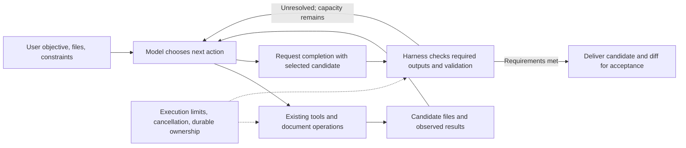

**Adaptive document workflows: source audit and design recommendation**

Reviewed local HEAD `3958a96edd453938e023f163c1aa5b358854d89d`, 2026-09-05.
This is a design study, not an implementation or a model-quality benchmark.
Production code was not changed. Existing proposal files were left untouched.

> **Status (2026-09-06): not planned.** The owner does not want the adaptive
> design recommended below; this document is retained as a design study only
> and is not scheduled for implementation.

**Recommendation.** Let the model choose how to work on a document, while the
harness owns the candidate files, execution limits, recovery, and delivery.
Reuse the existing tool-use loop and script runner. The main missing capability
is a document candidate that can be generated, inspected, edited, and selected
for delivery without first overwriting the user's workspace.

Changing `rounds` into a larger or optional number would provide much less
freedom. Replacing reflection with an ordinary chat agent would change more
behavior than the loop: output storage, file acceptance, result schemas,
continuation behavior, and recovery all differ.

**What the current source actually does**

| Area               | Observed behavior                                                                                                                                          | Consequence for this design                                                                                                                                                        |
| ------------------ | ---------------------------------------------------------------------------------------------------------------------------------------------------------- | ---------------------------------------------------------------------------------------------------------------------------------------------------------------------------------- |
| Pass count         | `runReflectionFlow` uses `max(settings.rounds ?? 2, userRequestTemplateCount(...))`. The YAML scanner derives the same floor.                              | A prompt array prescribes mandatory passes, not merely available guidance. Setting a two-template agent to one round does not make it single-pass.                                 |
| Prompt progression | `PromptBuilder.getRoundTemplate` indexes the array. After exhausting it, the code selects `min(1, length - 1)`.                                            | With three or more templates, later rounds repeat the second template, despite a nearby comment saying “last.” The earlier conversational answer followed that misleading comment. |
| Completion         | `RoundPersistedFlow` proceeds to the cap unless there is failure, cancellation, or `continueRounds = false`. That flag contributes to a cancelled outcome. | There is no successful model-requested early-stop decision to reuse as-is.                                                                                                         |
| Output             | `polish` requests complete documents twice, including reproducing unchanged output after a clean review.                                                   | Reviewing and revising cannot currently be separate actions for that agent.                                                                                                        |
| Delegation         | Neither `delegate_workflow` input nor script `agent()` options expose a rounds override.                                                                   | Wrapping `polish` in an adaptive outer controller still pays for its inner two passes.                                                                                             |
| Local tools        | Reflection resolves tool declarations, but its response graph has no local tool-dispatch node. Tool-use has an invocation/dispatch loop.                   | Advertising tools is not evidence that reflection can perform an ordinary local read/edit/review loop. Provider-managed tools are a separate capability.                           |
| Product guidance   | The checked-in remote orchestrator prompt repeatedly prefers workflows and asserts that their reflection produces more rigorous results.                   | Some rigidity is prompt policy. A new capability alone would leave these choices biased toward the old schedule. This audit did not verify the currently deployed remote prompt.   |

Sources: [round loop construction](../../src/agent/implementations/flows/reflection/runReflectionFlow.ts),
[round scheduling and outcome](../../src/agent/implementations/flows/reflection/RoundPersistedFlow.ts),
[prompt selection](../../src/agent/prompt/PromptBuilder.ts#L141),
[scanner](../../src/agent/index/agentYamlScanner.ts),
[polish](../../packages/extension/resources/agents/polish.yaml#L36),
[delegation inputs](../../src/tools/delegation/inputFields.ts#L52),
[script call options](../../src/agent/workflowScript/types.ts#L147),
[reflection response graph](../../src/agent/implementations/flows/reflection/ResponseCycleFlow.ts#L554),
[tool-use graph](../../src/agent/implementations/flows/tooluse/ToolUseRoundFlow.ts#L75),
[orchestrator source](../../prompts/agents/remote/tool_use/orchestrator.yaml#L64).

There is no source-backed reason here to assert that a mandatory second pass
improves rigor. That is a prompt claim requiring evaluation. The reverse claim,
that a stronger model will always make better stopping decisions, also remains
unproven.

**The multi-agent script already provides more flexibility than its headline description suggests**

`delegate_multi_agents` is the current tool name. Its description says to use it
when the complete orchestration structure is known before execution. The same
description permits data-dependent calls without `meta.tasks`, ordinary loops,
and structured tool-use results. The runtime executes those branches in
QuickJS. A program can inspect a model's structured judgment, request a repair,
and stop after a later judgment. A predetermined program does not require a
predetermined sequence of executed calls.

Two temporary probes exercised the actual script engine with simulated child
results:

- A review requesting revision issued `review-0`, `edit-0`, `review-1`, then
  stopped. An already-good candidate issued only one review. Replaying the
  completed journal invoked no children.
- A structured call reading simulated external state reused its old judgment
  after that state changed, when its prompt/options remained identical. The
  dependency-fingerprint callback was not invoked.

The second probe demonstrates a limitation at the engine boundary, not a live
product stale-cache incident. Structured calls currently cannot declare file
options, and only explicit file options activate file-byte fingerprinting.
A reviewer reading a mutable filename mentioned in prose therefore has an
undeclared dependency. An adaptive design must bind judgments to immutable
candidate inputs or track their actual versions. Merely returning a filename
from a model does not make it an immutable revision.

Script phases also advance monotonically. A loop can use one phase or distinct
iteration phases; it cannot repeatedly move backward from Edit to Review using
the same phase titles. Each script `agent()` call is a separate child call;
conversational follow-up to an existing child is provided by `delegate_agent`.
These are different useful execution patterns, not reasons to add another
scheduler.

Sources: [tool description](../../src/tools/delegation/WorkflowScriptTool.ts#L203),
[identity](../../src/agent/workflowScript/runWorkflowScript.ts#L44),
[fingerprinting gate](../../src/agent/workflowScript/runWorkflowScript.ts#L504),
[file hashing](../../src/tools/delegation/workflowScriptAgentRunner.ts#L90),
[structured input restriction](../../src/agent/workflowScript/types.ts#L185),
[phase progression](../../src/agent/workflowScript/workflowExecutionState.ts#L105),
[conversational delegation](../../src/tools/delegation/DelegationTools.ts#L215).

**The document contract is the important part to preserve**

The reflection output pipeline captures originals, writes generated revisions
into run storage, maps them back to source files, computes diffs, and exposes
artifacts for later acceptance. `accept_run_files` reads candidate content and
uses the existing per-file approval/write path. This lets a user inspect a
proposed manuscript revision before incorporating it into their working copy.

Ordinary editing has a different contract. `read_file` and `edit_file` resolve
filesystem paths against the active root. The `executions` tool understands
virtual run-storage paths, but that read does not satisfy the ordinary edit
tool's read-before-edit gate. `latexFixer` explicitly treats generated execution
output as inspect-only. Root overrides and external-root settings can permit
other filesystem locations, so this is not an absolute OS access prohibition;
it is a missing normal product operation.

A candidate working directory could reuse much of the existing file tooling.
It cannot simply reuse the current run directory as writable without inspection:
the output writer deliberately unlinks pre-staged symlinks before writing.
Support-file links can point back into the workspace. That handling must remain
correct for targeted edits and any enabled shell operations. Run storage is not
a general shell sandbox, and the current compile environment is not hermetic.

Sources: [snapshot preparation](../../src/utils/files/taskRunStorage.ts#L54),
[round dependency links](../../src/utils/files/taskRunStorage.ts#L251),
[output write behavior](../../src/agent/implementations/flows/reflection/output/XmlOutputManager.ts#L42),
[acceptance](../../src/tools/AcceptRunFilesTool.ts#L142),
[path policy](../../src/tools/pathResolution.ts#L63),
[edit flow](../../src/tools/fileEditFlow.ts),
[fixer instructions](../../packages/extension/resources/tool_use_agents/latexFixer.yaml#L20).

**Completion needs to refer to a candidate, not to a round number**

Suppose a task has two files. It generates both, revises only one, then performs
a review that changes nothing. The deliverable is the revised first file plus
the retained second file. The review is evidence about that candidate; it does
not need to emit either file again.

Today the result conversion flattens outputs from every round. One final-output
helper chooses the last file in the highest round with output. CLI directory
delivery selects the latest output per relative path. The next reflection round
uses the immediately previous output list. Those choices support current
consumers but do not define one selected candidate set for adaptive work.
Allowing empty or partial outputs without defining that set would leave
different consumers to infer different meanings.

The proposed task should therefore persist which files constitute the selected
candidate, their relation to the originals, and which checks examined those
versions. An unchanged completion retains that set explicitly. Selecting an
earlier candidate is also explicit. Do not silently use the newest file as a
proxy for the best or accepted file. A candidate selection is still distinct
from writing it into the user's workspace.

Sources: [output flattening](../../src/shared/schemas/output.ts#L303),
[final single-output selection](../../src/shared/schemas/output.ts#L237),
[next-round inputs](../../src/agent/implementations/flows/reflection/helpers.ts#L19),
[CLI publication](../../packages/cli/src/runtime/workflowOutput.ts#L255).

**Existing validation is useful but weaker than a task-success proof**

XML repair, extraction, compile invocation, and expected-output checking have
recover-and-continue paths. Expected-file checking reports missing configured
outputs; it does not enforce instruction satisfaction or preserve every equation.
Compilation is optional, can be unavailable, and skips non-root TeX fragments.
Compilation may also resolve support files from the original workspace. “No
compile failures recorded” must not be promoted to “this exact project was
verified.” CLI publication has additional output checks; those are not a
universal agent completion rule.

The stronger existing invariant is durable rejection after a detected compile
failure under the rejection policy. A later absent check does not clear that
rejection. However, its terminal predicate is tied to reaching the configured
round cap. Early completion must check unresolved rejection independently of
that old scheduling condition.

Likewise, `submit_output` validates JSON shape, not the truth of a review.
A script completing only means the script returned without a terminal script
error. Ordinary child failures can become `null`, which a script can filter.
An adaptive controller must distinguish “the program ran,” “the required
artifacts/checks are present,” and “the user's requested change is satisfactory.”
Only the first two are substantially amenable to mechanical enforcement here.

Sources: [output processing](../../src/agent/implementations/flows/reflection/nodes/OutputNode.ts),
[expected outputs](../../src/agent/implementations/flows/reflection/output/outputValidation.ts#L30),
[compile policy and execution](../../src/agent/implementations/flows/reflection/output/compileCheck.ts#L115),
[durable rejection predicate](../../src/agent/runtime/persistedCompileRejection.ts#L23),
[structured submission](../../src/tools/structuredOutput.ts#L174),
[script error handling](../../src/agent/workflowScript/runWorkflowScript.ts#L823).

**Proposed responsibility split**

This is a proposed responsibility diagram, not a new engine or fixed action
sequence. Tools still do the work. The model can make a local edit, generate a
whole document, request a specialist, inspect a PDF, or finish. A mandatory
reviewer agent after every action would simply introduce another fixed workflow.

The task supplies an objective and scope, plus explicit required checks where
appropriate. Mechanical checks report pass, fail, or unavailable for the checked
candidate; the model reasons about semantic adequacy. Required checks should be
chosen for the task: OCR, transcription, and a mathematical revision have
different completion conditions. A generic quality score or fixed confidence
threshold is not justified by this audit.

Limits remain independent of required work. The script runtime already has a
timeout and live-call cap. The session child budget limits concurrency, not
spend. Reflection has continuation/input ceilings that are not automatically
inherited by the tool-use loop. A production autonomous document task needs a
defined admission limit covering its controller and child work. Hitting a limit
must preserve candidate artifacts and report unresolved work; it must not imply
successful completion. Reuse current ownership/accounting boundaries instead of
creating an independent budget authority inside the model prompt.

Recovery also needs explicit granularity. Tool-use's persisted outer flow wraps
an entire inner tool cycle; it is not a per-edit checkpoint merely because tool
messages were logged. Durable document operations and the existing script
journal provide useful boundaries. Store a selected candidate and completion
decision through existing execution persistence/ownership, not a new journal
or second status store.

Sources: [script backstops](../../src/agent/workflowScript/runWorkflowScript.ts#L65),
[concurrency budget](../../src/agent/runtime/childRunBudget.ts#L1),
[reflection continuation limits](../../src/agent/modelHandlers/ModelHandler.ts#L959),
[tool-use persisted graph](../../src/agent/implementations/flows/tooluse/runToolUseFlow.ts#L492),
[cycle snapshot](../../src/agent/implementations/flows/tooluse/nodes/ToolUseCycleNode.ts#L198),
[waiting/one-shot behavior](../../src/agent/implementations/flows/tooluse/nodes/ToolUseWaitNode.ts#L37).

**Alternatives and sequencing**

| Approach                                                | Benefit                                                                    | Remaining cost                                                                            | Judgment                                                   |
| ------------------------------------------------------- | -------------------------------------------------------------------------- | ----------------------------------------------------------------------------------------- | ---------------------------------------------------------- |
| Add finish/continue to reflection                       | Avoids some mandatory later passes                                         | Still couples review to complete output; must fix successful-stop and rejection semantics | A limited feature if early stopping alone is the objective |
| Compose existing agents in adaptive scripts             | Branching, loops, durable completed calls already work                     | Inner fixed passes remain; structured review dependencies need care                       | Best starting point for a bounded experiment               |
| Give a tool-use task candidate-document operations      | Allows targeted revision, inspection, generation, and unchanged completion | Needs deliberate candidate editing, selection, checks, and result delivery                | Preferred product direction                                |
| Merge both agent categories or introduce a workflow DSL | Broad conceptual unification                                               | Changes many contracts before quality benefit is known                                    | Not justified as the first implementation                  |

First run a bounded experiment using the existing runtime and immutable input
copies. Compare current `polish` with an adaptive task on the same instructions.
To measure removal of the second generation, the experiment needs a one-pass
generation definition; neither lowering `rounds` below the template floor nor
wrapping the existing `polish` achieves that. Treat this as an experimental
definition, not a permanent duplicate public agent.

If the experiment supports the change, implement one complete product slice:
adaptive `polish` producing a reviewable candidate with targeted edits, optional
whole-document generation, and explicit completion. Reuse read/edit tools through
a properly owned candidate root, the existing run/child infrastructure, diff and
acceptance machinery, and host result delivery. Update the policy prompts as part
of that slice. Do not claim parity merely because the controller returns prose
or a valid JSON object.

Whole-document generation should remain available for substantial rewrites,
merging, OCR, transcription, and slide/poster creation. The long-term simplification
is to make fixed reflection a preset strategy where useful, rather than require
every document-producing agent to follow it. Retiring old scheduling paths should
follow measured replacement coverage and the repository's compatibility policy.

**What would establish that the adaptive version is better**

Use matched tasks/models and repeated trials, with blind review of document
changes. Do not rely on the controller's own approval as the evaluation score.
Include already-correct input, a tiny local correction, multi-file consistency,
a substantial rewrite, a requested new artifact, compile failure, and an
unavailable toolchain. Exercise interruption after producing a candidate and
after recording a review, and change a source/dependency before resuming.

Measure instruction satisfaction; omitted or altered mathematical content;
unrelated edits; coherent multi-file delivery; correct unchanged completion;
actual build coverage; user acceptance/rework; total cost, latency, and output
tokens. Record failed and limit-stopped attempts. Tool-use mode currently uses
70% of configured max output tokens, so compare actual behavior rather than
assuming that changing the agent category leaves generation conditions identical.
No quality, cost, or speed advantage has yet been measured.

Source: [mode-dependent output allowance](../../src/agent/modelHandlers/ModelHandler.ts#L369)
and [its factor](../../src/agent/modelHandlers/contextManagementConstants.ts#L8).

**Validation performed for this study**

Four focused groups passed, totalling **14 existing suites and 368 tests**:

- PromptBuilder, AgentYamlScanner, WorkflowOutputResolution: 28 tests.
- XmlOutputManager, CompileCheck, OutputProgressEvents, FileMapping,
  LineageMapping: 100 tests.
- WorkflowScriptEngine, WorkflowScriptAgentRunner, WorkflowScriptPersistence:
  179 tests.
- RoundPersistedFlowCompileRepair, ReflectionFlowStateRecovery, ToolUseWaitNode:
  61 tests.

The two additional temporary QuickJS probes described above passed. They used
simulated child results, not paid model calls or actual document revisions.
No new regression tests were added to the repository. These results establish
current runtime behavior and protect the analysis from some mistaken assumptions;
they do not validate the proposed document workflow or its quality.
