# Agent loops: an explicit interpreter on Effect, with one durable authority

Date: 2026-09-06. Research snapshot and recommendation; proposed states below are not existing production APIs. Read with the [decision document](2026-09-06-agent-architecture-study.md) and [LLM package study](2026-09-06-llm-package-architecture-study.md).

**Replace PocketFlow with domain procedures over explicit durable phases, implemented in Effect 4.** Build TeXRA's own LLM package beneath that interpreter. Do not introduce another framework that owns tools, history, retries, or persistence alongside it.

## 1. What TeXRA runs today

The local [node kernel](../../src/agent/node/index.ts) is a modified PocketFlow-style implementation. `BaseNode` separates preparation, execution/fallback, and postprocessing; `Flow` follows successor edges chosen by action strings. Its simplicity is real, but its node abstraction does not explain the full runtime.

[PersistedFlow](../../src/agent/node/persistedFlow.ts) adds the actual resumable record: shared state and an authoritative next-node cursor. `ensureRecord` writes the initial record before the first step. `stepWithResult` runs a node, leaves the cursor at a waiting node when appropriate, and persists the result and next position. Replacing the graph does not permit losing initial recoverability or waiting semantics.

The tool-use control flow has two levels:

| Level                | Current source                                                                                           | What it owns                                                                       |
| -------------------- | -------------------------------------------------------------------------------------------------------- | ---------------------------------------------------------------------------------- |
| Persisted outer flow | [runToolUseFlow](../../src/agent/implementations/flows/tooluse/runToolUseFlow.ts)                        | Prepare, cycle, wait, and resumed user interaction                                 |
| Cycle                | [ToolUseCycleNode](../../src/agent/implementations/flows/tooluse/nodes/ToolUseCycleNode.ts)              | Workspace reconstruction and a user turn containing multiple model/tool rounds     |
| Inner round          | [ToolUseRoundFlow](../../src/agent/implementations/flows/tooluse/ToolUseRoundFlow.ts)                    | Prepare messages, invoke the model, process the response, dispatch tools, continue |
| Tool scheduling      | [ToolUseDispatchNode](../../src/agent/implementations/flows/tooluse/toolUseRound/ToolUseDispatchNode.ts) | Bounded parallel read-only groups, mutation barriers, result construction          |
| Model attempts       | [ModelInvocationNode](../../src/agent/core/flows/ModelInvocationNode.ts)                                 | Automatic and user-authorized retries, route gates, compaction result installation |

The inner round is not individually persisted by `PersistedFlow`; the outer cycle boundary encloses multiple calls. The replacement proposal's response and tool records therefore improve the granularity of recoverable evidence rather than merely changing syntax.

Current ownership is also substantive. [ExecutionKVStore](../../src/agent/storage/ExecutionKVStore.ts), [executionLease](../../src/agent/storage/executionLease.ts), and [registration](../../src/agent/storage/executionLifecycle.ts) already claim and fence execution writes. A SQLite transaction alone is not the replacement for a logical run owner. The new substrate must reject stale owners inside the write decision, then retire the file-based authority.

## 2. What Effect changes—and what remains a design decision

| Question                        | Effect supplies                                                   | TeXRA still specifies                                                                      |
| ------------------------------- | ----------------------------------------------------------------- | ------------------------------------------------------------------------------------------ |
| How does work execute and fail? | Typed effects, error channels, interruption, scopes, finalization | Domain error categories and whether a failure permits retry, waiting, or termination       |
| How do tools run concurrently?  | Fibers, bounded concurrency, semaphores                           | Admission, dependencies, approval barriers, stable result ordering, replay eligibility     |
| How does generation stream?     | Streams and scoped foreign I/O                                    | Event vocabulary, complete-response validation, terminal settlement, provider continuation |
| What survives process death?    | No persistence merely from using a fiber                          | Committed facts, snapshots, attempt identity, ownership, recovery policy                   |
| Where does execution resume?    | Ordinary Effect code can interpret a state                        | The durable phase and legal next command                                                   |

The target remains a state machine in the mathematical sense. What goes away is the generic graph framework, not the need to represent state. Two readable domain loops are useful only if their internal phases are specified as carefully as their outer control flow.

## 3. Latest external designs

### OpenCode: explicit provider turns beneath its runtime

The newest [LLM design draft][oc-design] distinguishes a **provider turn** from a **model run**. Its proposed `generateTurn`/`streamTurn` execute one provider request and never local tools; `generate`/`stream` can run an automatic tool loop for library users. The draft explicitly tells OpenCode's durable session runtime to use the turn APIs. This is a design proposal, not a claim that the future package already exists.

The implemented [new core runner][oc-runner] already uses Effect loops around generation and queued inputs. It publishes normalized events and launches tool fibers when complete tool-call events arrive, then settles the batch after the model stream exits. That overlaps local execution with the remaining stream. The source also explicitly leaves durable continuation recovery to a future slice.

**Use:** the provider-turn boundary and direct Effect control flow. **Choose differently for TeXRA:** commit a completed, validated response before starting local tools. Document mutations and paid/resumable model calls make the extra recovery boundary more valuable than starting tools during a stream. This is a deliberate tradeoff, not a claim that OpenCode's strategy is universally wrong.

### Pi: the new durable harness, not just the older agent loop

Pi's [harness driver][pi-drive] dispatches tagged operation states through direct procedures. The vocabulary includes starting, checkpoints, assistant readiness/retry/effect-pending, tools, deferred work, summarization, and navigation. [Generation][pi-generation] commits the assistant operation intent before provider I/O.

[Recovery][pi-recovery] handles an orphaned assistant operation from committed evidence rather than blindly calling the provider again. It can settle an interrupted assistant result from bounded recorded frames. [Tool recovery][pi-tools] allows reexecution only when both the recorded invocation and the currently installed tool declare replay safe. Changed policy cannot retroactively authorize an unsafe recorded call.

[Session mutation][pi-session] commits entries and operation state transactionally and rejects a pending assistant entry as a finished transcript record. Its durable model is not simply “replay all UI events.” The live runtime reducer is a presentation projection; durable operation state is a separate concern. The coding-agent's [worker integration][pi-worker] is experimental, so this is evidence of the latest implemented design, not a blanket release-maturity claim.

Pi uses Promise/AbortSignal code here. A file called `effect-gate.ts` refers to side effects, not Effect-TS. TeXRA should learn its transition and recovery model while implementing execution in Effect.

### effect-agent: one interpreter and explicit recovery evidence

The [engine interpreter][ea-runtime] is shared by foreground, streaming, and background entry points. Its model invocation disables Effect AI's automatic tool resolution. It validates the completed model response and full tool arguments before tool preflight; durable recording can precede dispatch. Approval, authorization, and budget checks happen before handler launch; execution is bounded and results retain declaration order. Steering is admitted at a safe boundary after the batch, and follow-ups are considered before the run would otherwise end.

The [durable runtime][ea-durable] separates accepted work and fenced attempts from the conversation thread. [Recovery decisions][ea-recovery] distinguish a committed model response, an unprepared call, a prepared tool without a known result, and a known completed result. It does not claim exactly-once external side effects. Its [durability documentation][ea-durability] also distinguishes observer detachment from cancellation of an accepted command.

This is the closest reference for TeXRA's recovery requirements. It is not a small replacement we should import: the inspected interpreter is 8,678 physical lines and the durable runtime 9,132. Those counts include comments and blanks; they demonstrate framework scope, not poor quality. Borrow the boundaries and recovery rules without taking its entire generalized agent/thread/capability system.

### Effect AI and Workflow: useful primitives, different ownership

[LanguageModel][effect-lm] offers text/object generation and streaming. Tool resolution belongs to a generation call; it is not itself the multi-turn agent loop. The checked-in offline probe demonstrates that boundary at installed Effect 4 rc.112. [Chat][effect-chat] adds mutable conversation ownership, which would duplicate TeXRA's ledger if installed underneath it. Neither package is the proposed TeXRA LLM implementation.

[Workflow Activity][effect-activity] provides named durable activity semantics, and [WorkflowEngine][effect-engine] defines execution/resumption and deferred work. These can support a different architecture. They are not automatically a persistence layer for arbitrary Effects.

The current runtime proposal's comparison table rejects Workflow partly because memoized failures allegedly make resuming after failure impossible and one-shot deferreds allegedly drop batched follow-ups. Those conclusions are too broad: `Activity.retry` explicitly manages attempt identity, and a workflow can allocate a new deferred per decision or model a durable input queue. These APIs do not force the problematic sketches.

**Recommendation remains one TeXRA ledger interpreter**, for a more defensible reason: the agreed substrate already owns run admission, facts, approval state, conversation, and child work. Adding Workflow is useful only if it replaces that durable authority or is implemented directly against it with a demonstrated reduction in code. Running two engines to obtain a retry or wait primitive is not the desired target. This study does not claim that a custom Workflow engine is intrinsically impossible.

## 4. Proposed durable phase model

The [joint runtime/LLM implementation contract](2026-09-04-agent-runtime-on-effect.md#01-current-implementation-contract-runtime-and-llm-package)
supplies the preparation/acceptance barriers, continuation validity and tool
state/attachment settlement required by this table. Read it before implementing
the ledger rows; the phase names below are illustrative, not another schema.

This is a domain specification for implementation, not a new graph DSL. The exact names can change. Each phase must be reconstructible from the ledger and have a closed set of commands. `foldRunState` remains pure; it neither calls tools nor consults current clocks, credentials, or UI state.

| Phase / evidence        | Legal next action                                                               | Commit required before leaving                                                                                        |
| ----------------------- | ------------------------------------------------------------------------------- | --------------------------------------------------------------------------------------------------------------------- |
| Admitted run            | Load or initialize the model-visible request and policy                         | Run identity, owner/fence, initial continuation and phase before any external operation                               |
| Ready for generation    | Resolve an executable model; select an attempt                                  | Exact request, route/protocol identity, attempt ID, generation intent                                                 |
| Generation pending      | Stream/poll the existing operation; settle or classify interruption             | Completed response and provider continuation, or explicit attempt outcome; never treat deltas as a completed response |
| Response committed      | Validate tool batch or process a terminal/document response                     | Canonical assistant message, all calls, usage attribution, phase advance atomically as required                       |
| Tool batch ready        | Validate definitions; preflight permissions and approval; partition safe groups | Dispatch plan and intent before each externally ambiguous operation                                                   |
| Tool execution pending  | Execute admitted calls; settle known outcomes                                   | Result bound to call and attempt; retained result order independent of completion order                               |
| Batch settled           | Install tool-result messages; decide next model turn                            | Exact result messages and phase; committed results are never executed again                                           |
| Input decision          | Atomically admit queued steering/follow-ups or enter waiting                    | Message append and queue consumption together; waiting snapshot before releasing execution                            |
| Compaction pending      | Run a selected native/generic compaction operation                              | Exact replacement history and post-compaction context together before generation                                      |
| Document output pending | Reconcile or apply the recorded artifact plan; optionally compile               | Artifact identity/digest and outcome; uncertainty about a compile/run remains explicit                                |
| Reflection decision     | Choose the next document round or finish/wait                                   | Document-round state, selected inputs and output references                                                           |
| Terminal/waiting        | Present outcome or admit a new continuation command                             | Durable lifecycle fact consistent with the runtime phase                                                              |

The phase is evidence about how far an operation progressed. Do not persist an Effect, closure, configured SDK client, or generic node cursor. Keep process-local resources scoped to the interpreter; reconstruct them from a serializable descriptor when a new owner resumes.

Both flow families share the generation and settlement procedures. Tool-use repeatedly crosses the generation/batch/input boundaries. Reflection also crosses output/compilation/round decisions. Forcing reflection into “a chat loop with tools” would hide TeXRA's product-specific work again.

## 5. Recovery policy that can be reviewed

| Crash window / evidence                                                 | Recommended recovery                                                                                               | Why                                                                                              |
| ----------------------------------------------------------------------- | ------------------------------------------------------------------------------------------------------------------ | ------------------------------------------------------------------------------------------------ |
| Before durable generation intent                                        | Start a new attempt normally                                                                                       | No recorded admission of a provider effect                                                       |
| After generation intent; no completed response or resumable provider ID | Classify outcome unknown; an explicit policy or user retry starts a fresh attempt                                  | Provider may have consumed input or charged; absence of a response is not evidence of no request |
| After a durable background operation ID                                 | Retrieve/poll that operation first                                                                                 | Creating another remote job would duplicate accepted work                                        |
| After response commit; before tool dispatch                             | Use the committed response and run preflight                                                                       | No new model call is needed                                                                      |
| After mutation intent; before a known result                            | Reconcile through a tool-specific receipt if available; otherwise mark unknown and request a new authorized action | A timeout cannot establish whether an external mutation happened                                 |
| After a replay-safe observation intent; no result                       | Reexecute only under recorded and current replay permission, recording a new observation/attempt                   | A fresh read may differ even when it is safe to perform again                                    |
| After result commit                                                     | Reuse the result                                                                                                   | Completion order, process death, and UI reconnection do not authorize repetition                 |
| During follow-up consumption                                            | Replay the atomic append/consume transaction                                                                       | Prevents duplicate or lost user input                                                            |
| During compaction installation                                          | Use the committed replacement or the prior history, never a partial mixture                                        | Provider signatures and newly injected context must agree                                        |
| During document output                                                  | Reconcile the committed artifact plan; represent unknown compilation outcomes explicitly                           | File state and process execution are not one database transaction                                |
| After ownership changes                                                 | Reject the stale writer before it commits                                                                          | Serialization is not ownership                                                                   |

TeXRA's current [`parallelSafe`](../../src/agent/core/tools/ToolTypes.ts) already means side-effect-free **and** approval-free; it is not an arbitrary parallelism flag. There is no reproduced bug here. The new design should nevertheless make the replay decision explicit, because reobservation, current tool policy, and historical permission are distinct from scheduling a batch concurrently. Pi provides a concrete example of checking both historical and current permission.

Cancellation should interrupt a scoped in-process attempt and propagate to its foreign I/O. It must not turn into a successful completion or automatically erase an accepted durable command. A UI subscriber disconnecting should release its subscription; it is not inherently a user cancellation request. Remote/background cancellation has an explicit receipt or unknown outcome, just like other external effects.

## 6. Retry, input, and output details the small loop must retain

[ModelInvocationNode](../../src/agent/core/flows/ModelInvocationNode.ts) currently retries with more context than an exception type. It separates automatic retry from a user-authorized additional attempt, coordinates credential/endpoint and model retry gates, and rereads the [ModelCell](../../src/agent/runtime/ModelCell.ts) so a replacement client is used on the next attempt. These responsibilities move into runtime attempt policy. They should not become hidden provider retries multiplied by an outer retry schedule.

The LLM package classifies transport/provider failures and reports what became observable. The runtime decides whether and when another attempt is admitted, whether credentials change, and how usage is attributed. Native SDK automatic retries must be configured deliberately so one runtime attempt has a reviewable meaning. Retry after visible output or a known background ID differs from retrying before any response.

Queued input requires two decisions: when an input becomes model-visible, and when the queue item is consumed. Commit those together. A wait primitive is just the notification mechanism; the durable queue is the authority. Child runs and workflow-script checkpoints need the same accepted-command and attempt identity, not a second journal under another API.

The [runtime proposal](2026-09-04-agent-runtime-on-effect.md) already specifies full history replacement plus post-compaction context in one durable decision, and an `output.pending` artifact plan with reconciliation. Preserve and sharpen those rules rather than replacing them with vague `compact()` and `writeOutput()` helpers. Their clocks, digests, approvals, and uncertain external outcomes are the actual continuation contract.

## 7. Relation to September proposals and active work

The September 4 proposal is the target document to amend. [PR #11919](https://github.com/LionSR/TeXRA/pull/11919) records the owner's pure-Effect/no-PocketFlow ruling and later prohibition of pass-through adapters. Its open head at inspection also corrects the private-row vocabulary, atomic batching, checkpoint aggregate, and rollback semantics. The older bodies of [#11867](https://github.com/LionSR/TeXRA/issues/11867) and [#11868](https://github.com/LionSR/TeXRA/issues/11868) are not a safer authority than those explicit corrections.

Add the following to that shared design before the lane-D implementation freezes its contract:

1. The full phase/command table, including generation ambiguity and background recovery.
2. A canonical message and provider-continuation contract owned by TeXRA's new LLM package.
3. Exact transaction groups across stream/execution/checkpoint aggregates and their owner fence.
4. One tool-execution authority and one usage-settlement authority.
5. The package/runtime/output responsibility map, with deletion gates for the old classes.

Do not start an independent rewrite in the frozen flow/storage paths. The aggressive move is one coherent target integrated with the active cutover, not competing implementations of the same interpreter.

## 8. Validation scope

This study source-traced the current kernel, flow nesting, attempts, ownership, proposal, and latest external drivers. It did not execute live providers, a crash-recovery campaign, or multiprocess SQLite tests. The [offline Effect AI probe](evidence/2026-09-06-agent-architecture/effect-ai-boundary-probe.json) verifies a library boundary, not this proposed runtime.

When implemented, use existing behavioral suites and a small number of consequential integration scenarios: incomplete response before tools; completed response before dispatch; ambiguous mutation; committed result on resume; background handle recovery; atomic input/compaction; document reconciliation; competing owners. Do not create one unit test per new internal phase merely to mirror the implementation.

[oc-design]: https://github.com/anomalyco/opencode/blob/337fd144d2ba144743368f78d9579a99cce175bd/packages/llm/DESIGN.md
[oc-runner]: https://github.com/anomalyco/opencode/blob/337fd144d2ba144743368f78d9579a99cce175bd/packages/core/src/session/runner/llm.ts
[pi-drive]: https://github.com/earendil-works/pi/blob/9767ba275f3e9a5ee0f5c5342249b629ab1b2282/packages/agent/src/harness/runtime/drive.ts
[pi-generation]: https://github.com/earendil-works/pi/blob/9767ba275f3e9a5ee0f5c5342249b629ab1b2282/packages/agent/src/harness/runtime/drive/generation.ts
[pi-recovery]: https://github.com/earendil-works/pi/blob/9767ba275f3e9a5ee0f5c5342249b629ab1b2282/packages/agent/src/harness/runtime/drive/recovery.ts
[pi-tools]: https://github.com/earendil-works/pi/blob/9767ba275f3e9a5ee0f5c5342249b629ab1b2282/packages/agent/src/harness/runtime/drive/tools.ts
[pi-session]: https://github.com/earendil-works/pi/blob/9767ba275f3e9a5ee0f5c5342249b629ab1b2282/packages/agent/src/harness/session/session.ts
[pi-worker]: https://github.com/earendil-works/pi/blob/9767ba275f3e9a5ee0f5c5342249b629ab1b2282/packages/coding-agent/src/experimental/session-worker.ts
[pi-ai]: https://github.com/earendil-works/pi/blob/9767ba275f3e9a5ee0f5c5342249b629ab1b2282/packages/ai/package.json
[ea-runtime]: https://github.com/danieljvdm/effect-agent/blob/bedf7f8f016a50724390f436939488cf348a5400/packages/engine/src/internal/agent-runtime.ts
[ea-durable]: https://github.com/danieljvdm/effect-agent/blob/bedf7f8f016a50724390f436939488cf348a5400/packages/thread/src/DurableAgentRuntime.ts
[ea-recovery]: https://github.com/danieljvdm/effect-agent/blob/bedf7f8f016a50724390f436939488cf348a5400/packages/thread/src/Recovery.ts
[ea-durability]: https://github.com/danieljvdm/effect-agent/blob/bedf7f8f016a50724390f436939488cf348a5400/docs/concepts/durability.md
[effect-lm]: https://github.com/Effect-TS/effect/blob/77f85fe1613348f5c990016b49dc97e252576c82/packages/effect/src/unstable/ai/LanguageModel.ts
[effect-chat]: https://github.com/Effect-TS/effect/blob/77f85fe1613348f5c990016b49dc97e252576c82/packages/effect/src/unstable/ai/Chat.ts
[effect-activity]: https://github.com/Effect-TS/effect/blob/77f85fe1613348f5c990016b49dc97e252576c82/packages/effect/src/unstable/workflow/Activity.ts
[effect-engine]: https://github.com/Effect-TS/effect/blob/77f85fe1613348f5c990016b49dc97e252576c82/packages/effect/src/unstable/workflow/WorkflowEngine.ts
