# Effect runtime: architecture and delivery plan

**Recommendation:** finish the move to an Effect-native backend. Replace PocketFlow's
execution machinery with two ordinary Effect programs, and give those programs one durable
execution history. Preserve TeXRA's domain rules in explicit data and small functions.
The architecture should make future provider, host and workflow changes local.

The direction was accepted on 2026-09-06 with the requirement to start from latest main.
This is the delivery plan, not a claim that migration has completed. The [migration PRD][prd]
owns the ratified rules. The [runtime proposal][runtime] section 0.1 now specifies the joint
runtime/LLM contract, incorporating the [current-main study][study] and its review; the
[substrate proposal][substrate] and [SDK proposal][sdk] retain their respective ownership.
This document records work order and completion gates, without duplicating those contracts.

The objective is low continuing maintenance cost. Measure success by mechanisms and
competing authorities removed, preserved behavior, bounded resource use and the number
of places a normal product change touches. An Effect import count cannot establish that.

## 1. Verified starting point

Freshly fetched `origin/main`: `542aea6e8425ec574ffa0fa9fd4fd05a878feb03`.
Work starts on `codex/effect-runtime-delivery-20260906` in an isolated worktree based exactly
on that commit. The original workspace and its untracked proposals remain untouched.

Since the first assessment at `6d788c3c77`, main has merged the pure-Effect/0.41 ruling
(#11919), stricter ratchet enforcement (#11951), platform and tool conversions (#11957,
#11953), the joint agent/LLM study (#11947), the SDK Effect surface (#11936), and baseline
shrinkage (#11967). Those are inputs to this work, not tasks
to repeat. In particular, preserving the handler interface and importing old flow cursors
are no longer delivery goals.

| Current evidence                                                                                                                                                                                                                                             | Consequence for this plan                                                                                               |
| ------------------------------------------------------------------------------------------------------------------------------------------------------------------------------------------------------------------------------------------------------------ | ----------------------------------------------------------------------------------------------------------------------- |
| Root and agent package pin `effect@4.0.0-rc.112`; root pins matching `@effect/vitest` and configures the language service                                                                                                                                    | Continue the existing major-version direction. There is no dependency-adoption phase to repeat.                         |
| [`sessionLayer.ts`](../../src/controllers/session/sessionLayer.ts#L353) already composes Effect services with a per-root `LayerMap` and `Layer.fresh`                                                                                                        | Preserve and finish this owner. Do not introduce another runtime/session registry.                                      |
| [`processRuntime.ts`](../../src/platform/processRuntime.ts) still stores the runtime globally; [`RunContext.ts`](../../src/agent/runtime/RunContext.ts#L79) uses ALS                                                                                         | The migration is partial. Installing a runtime has not removed ambient dependency carriers.                             |
| [`runAgent.ts`](../../src/agent/runtime/runAgent.ts#L93), [`executeAgent.ts`](../../src/agent/runtime/executeAgent.ts#L404) and [`AgentRunLifecycle.ts`](../../src/agent/runtime/AgentRunLifecycle.ts#L474) still use Promise orchestration                  | Convert the complete launch/resume/settlement path, not just its innermost model invocation.                            |
| [`node/index.ts`](../../src/agent/node/index.ts#L27) implements `prep/exec/post`, successors, cloning and service propagation                                                                                                                                | Delete this generic interpreter when both flow families move; keep their substantive behavior as functions.             |
| [`persistedFlow.ts`](../../src/agent/node/persistedFlow.ts#L349) persists shared state and a graph-local cursor after a node; [`ExecutionKVStore.ts`](../../src/agent/storage/ExecutionKVStore.ts#L187) fences writes                                        | Preserve initial persistence, resume coordinates and exclusive write ownership when changing the representation.        |
| [`SessionEvents.ts`](../../src/agent/runtime/SessionEvents.ts#L11) explicitly describes its current log as in memory                                                                                                                                         | Its cursor/tail contract is useful existing work, but it is not yet the proposed durable execution ledger.              |
| [`ToolUseDispatchNode.ts`](../../src/agent/implementations/flows/tooluse/toolUseRound/ToolUseDispatchNode.ts#L147) preserves barriers, safe partitions, duplicate fan-out and result order                                                                   | A mechanical `Effect.forEach` replacement would be insufficient. These are product contracts.                           |
| [`FollowUpQueue.ts`](../../src/agent/followUp/FollowUpQueue.ts#L58), [`childRunLoop.ts`](../../src/agent/runtime/childRunLoop.ts) and [`runWorkflowScript.ts`](../../src/agent/workflowScript/runWorkflowScript.ts) own further coordination and persistence | Replacing PocketFlow alone does not finish the runtime. Include follow-up admission and the common child-call protocol. |

The current migration ratchet scans **1,552 production files**. It reports 156 `platform()`
calls, six `setServices()` calls, 13 `new AbortController()` sites, and **40 internal
`Effect.run*` calls across 16 files**. Its run row now excludes permitted boundary calls,
so it must not be compared numerically with the first assessment's 95 total calls.

The check **fails** on the fetched main: six growing entries, two stale baseline entries,
and one forbidden temporary-adapter marker. Findings overlap.
Correct owning code and shrink stale entries; the strengthened updater cannot admit new
debt. No baseline was widened or edited in this contract update. The remaining findings
span auth and host composition as well as the runtime, and require their own call-chain fixes.

Six focused existing suites passed on the earlier `2d98650458` base: **147 tests**, covering launch ownership, execution
leases, tool dispatch ordering, reflection compile repair, workflow persistence and child
runs. This is baseline evidence for those contracts, not full migration or release validation.

## 2. Technology choices that can endure

| Concern                    | Choice                                                                                                  | Reason and boundary                                                                                                                       |
| -------------------------- | ------------------------------------------------------------------------------------------------------- | ----------------------------------------------------------------------------------------------------------------------------------------- |
| Backend execution          | Effect 4, exact coordinated versions                                                                    | It already exists here and covers dependency requirements, concurrency, interruption, resource lifetime, time and typed failure together. |
| Construction and ownership | `Context.Service`, `Layer`, `Scope`, existing keyed session owner                                       | Use services for real capabilities and acquired resources. Plain data and pure helpers remain ordinary TypeScript.                        |
| Agent flow definition      | Named `Effect.fn` programs with explicit durable phases                                                 | Two flow families do not justify a generic graph runtime or a second workflow language.                                                   |
| Durable execution          | The substrate proposal's single event store and qualified execution/stream aggregates                   | One writer and one recovery model; no independent flow checkpoint writer after cutover.                                                   |
| SQL integration            | Evaluate official `@effect/sql-sqlite-node` first, at the same Effect version                           | Prefer maintained upstream code over copying a peer's SQL client. Confirm host compatibility and scheduling behavior before selection.    |
| Data contracts             | Existing Zod schemas, validated at storage/wire/tool boundaries                                         | A schema migration is independent work. Do not duplicate the same payload in Zod and Effect Schema.                                       |
| Providers                  | TeXRA-owned `packages/llm`, canonical turn/continuation data and direct Effect provider implementations | Preserve native capabilities; retire handler inheritance and raw SDK types in runtime control flow.                                       |
| External consumers         | SDK Effect surface with Promise/AsyncIterable rendering at actual host and package entry points         | Keep runtime machinery internal while first-party clients use the same supported operations.                                              |
| Verification               | Existing Vitest suites; matching `@effect/vitest` and `TestClock` where applicable                      | Exercise durable behavior and actual time-dependent invariants. Avoid tests for forwarding or deleted node protocols.                     |

The official site still labels Effect 4 a release candidate; npm inspection on this date
reports `latest=3.22.1` and `rc=4.0.0-rc.112`. Therefore “current” does not mean “stable 4”.
Keep the exact pin, read release changes, and move the Effect package family together through
the behavioral gates. Do not change the major version again to pursue the moving `latest`
tag. [Effect release](https://github.com/Effect-TS/effect/releases/tag/effect%404.0.0-rc.112),
[official site](https://effect.website/).

The upstream SQLite client already uses `node:sqlite`, WAL, serialized access and
`BEGIN IMMEDIATE`. Its synchronous busy wait defaults to five seconds and can block the
host event loop. Compare a short/zero busy wait with bounded Effect retry of **database-only
transactions** against a dedicated database worker if measurements require one. Never
replay a transaction body containing provider/tool work. Check the actual Node runtime in
CLI, Electron and the extension host, including each SQLite API used by the pinned driver.
Do not assume the CLI engine floor establishes Electron compatibility.
[Pinned SQLite client](https://github.com/Effect-TS/effect/blob/effect%404.0.0-rc.112/packages/sql/sqlite-node/src/SqliteClient.ts).

This is evaluation input to the existing substrate owner, not authorization to start a
competing database layer or discard its in-progress implementation. Compare the official
client against that implementation at the integration head and retain one implementation.
The schema and transaction invariants remain unchanged.
The substrate owner's [client comparison](2026-09-03-persistence-substrate-decision.md#client-selection-at-the-approved-host-floor)
retains the current implementation: rc.112's official client requires SQLite APIs
introduced after the approved Node 22.13.0 floor. This resolves the client-selection
comparison without a host-floor change or a second implementation. It does not
claim that the remaining responsiveness measurements or persistence cutover are complete.

Effect Solutions was consulted (`list`, `basics`, `services-and-layers`, `error-handling`,
`testing`). Its examples were checked against installed rc.112 source and the local
reference checkout at `2a30248b6eb739f22403456209bc468f2f4ef26a`. Follow its construction,
tracing and testing patterns; do not copy Schema examples over the repository's Zod rules
or hoist workspace-specific layers into module globals to obtain memoization.

## 3. Ownership is the durable architecture

The [Mermaid source](./figures/2026-09-06-effect-runtime.mmd) is the diagram's editable source.
Arrows in its lifetime tree mean ownership, not extra wrapper modules.

| Lifetime                | Owns                                                                                      | Ends when                                                    |
| ----------------------- | ----------------------------------------------------------------------------------------- | ------------------------------------------------------------ |
| Application/process     | The managed runtime, process capabilities and keyed session owner                         | Explicit application shutdown completes                      |
| Paper/workspace session | Rooted storage, event publication, execution admission, interaction routing and view fold | The application explicitly closes that session               |
| Live execution attempt  | Lease, run identity, current model cell, run policy, trace context and owned child work   | The attempt settles and its resources/required writes settle |
| Model/tool call         | Request cancellation, approval wait, stream handles and temporary resources               | That call settles or is interrupted                          |
| Reader/surface          | Subscription, cursor and local presentation choices                                       | That reader detaches                                         |

A reader detaching does not close a session. A suspended/completed execution can retain
durable conversation history without retaining a fiber. Resume keeps the logical execution
identity and constructs a fresh attempt, lease and resource scope. Fiber IDs never become
storage keys or approval IDs.

There is one managed runtime in each host process, constructed at its existing entry.
Backend services obtain capabilities through their Effect requirements, not a global
`effectRuntime()` accessor. First-party hosts and the SDK reference the same owner.
Finish the existing session map rather than adding `RuntimeManager`, `ExecutionService`
and an SDK facade that all forward to `SessionHandle`.

Use a small capability set: rooted storage, execution admission, model invocation, tool
dispatch and interaction admission. A service must own policy, state, a resource lifetime
or a substitutable external capability. Do not create one tag per existing class or method.
Layer construction captures dependencies whose lifetime matches the service. Dynamic run
identity and current model selection must not be captured in a process-scoped service.

The deliberate package boundary is `packages/llm`, as specified by the current-main study.
It owns canonical model values and provider protocol code; it has no session, document,
platform-global or billing dependency. Retire `IModelHandler` and its superclass when the
consumers switch. Keep other directory moves tied to changed ownership and avoid unrelated
package or layout restructuring.

## 4. Programs and persisted state

**Tool use:** prepare or restore → admit input → invoke model → commit normalized response
and extracted calls → dispatch unsettled calls → commit outcomes → continue or wait.

**Reflection:** prepare round → invoke/continue response → commit response → prepare and
materialize output → validate compile/output → commit acceptance or feedback → advance
the configured round or finish.

These are still state machines in the ordinary sense. Their states are named domain data;
there is no graph interpreter, node inheritance, successor map or `prep/exec/post` protocol.
Resume switches on the committed phase to choose the next operation. A code rearrangement
must not change what that phase means.

The proposed `RunLedger` owns durable append/load semantics. One pure execution-state fold
serves live committed state and recovery; snapshots accelerate that fold, rather than
creating another mutable source of truth. The presentation fold owns the different task
of deriving redacted UI state. It cannot reconstruct provider conversation state from
display text. Preserve the substrate's restrictions on separately persisted projections.

Mandatory commit boundaries:

1. Acquire exclusive write ownership before changing resumed metadata. Commit initial
   state before any provider/tool action. Keep the existing pre-registration cancellation
   guarantee while converting its controller machinery.
2. Record canonical LLM messages and the extracted tool-call IDs once. Reuse those
   IDs on recovery; do not re-extract a response and accidentally generate different IDs.
   Attribute reported usage once per logical result/attempt, including child rollups.
   A crash before usage is recorded does not prove the provider charged nothing; retain
   an explicit reconciliation gap where the provider cannot report the missing amount.
3. Commit a side-effecting/unknown tool's intent before dispatch. Commit its result and
   associated run/workspace state changes together. Tools currently mutate more than their
   return value; result-only journaling would miss those changes.
4. Build and validate a reserved follow-up batch, then atomically commit its messages and
   removal of exactly those queue item IDs. Concurrent arrivals survive. A failed append
   leaves the batch available, including media and provenance.
5. Preserve reflection's continuation coordinates, output materialization/reconciliation,
   compile feedback and hard round limit. A round is not a retry attempt. Copy current
   behavior from the implementation and tests, not old prose about extra repair rounds.
6. Commit terminal facts and required artifacts while ownership is still held. Release
   the lease only after writes and tracked external work have settled or been safely fenced.

Keep the canonical execution conversation and exact opaque provider values separate from
display/export redaction. Persist encoding identity and bind continuation to its covered
history, never to provider name alone. Unknown formats fail explicitly. The joint contract
owns prepared invocation, remote acceptance and immutable tool observations; do not
serialize SDK objects, closures, fibers or services. Private ledger rows stay outside the
public trace union. Completed histories remain until explicit deletion under the retention
decision; old-format resumability is a separate 0.41 breaking change.

Append-only does not mean unbounded resident memory: paginate history, use committed
snapshots for resume, bound streaming buffers and specify overload behavior. Do not put
token deltas or complete repeated conversation arrays into every durable event. Account
for attachments, snapshots and retained history in storage-growth measurements.

## 5. The hard semantics Effect does not choose for us

### External effects and recovery

| State after restart                | Required behavior                                                                                                     |
| ---------------------------------- | --------------------------------------------------------------------------------------------------------------------- |
| No committed intent                | Dispatch only if the saved phase proves this operation was not dispatched                                             |
| Intent and committed result        | Reuse the result; do not call the external system again                                                               |
| Intent without result              | Treat the outcome as unknown; reconcile with the external system or require an explicit recovery decision             |
| External idempotency key supported | Retry with the same key and reconcile its result according to that API's contract                                     |
| User authorizes another attempt    | Persist the decision and new attempt identity before dispatch; do not turn it into automatic retry permission forever |

No local transaction or fiber can make an arbitrary shell command or remote mutation
exactly-once. The ledger establishes what TeXRA committed, not everything the external
world did. The local commit and external action cannot generally be one transaction.

`ITool.parallelSafe` currently couples side-effect-free and approval-free execution.
Preserve that contract, but keep recovery policy distinct from concurrency eligibility.
Read-only does not imply deterministic output or zero cost. Unknown/custom tools default
to conservative recovery; YAML cannot grant replay safety.

### Interruption, failure and cleanup

Use `Effect.forkChild` for work owned by the current attempt. A child deliberately allowed
to outlive its parent must be admitted under the session's scope from the start, with
explicit durable parent/delivery policy; `forkDetach` is not an ownership policy. Existing
children cannot be assumed to become reparented just by changing a registry field.
If later detachment is allowed by product policy, that child needs a session-owned lifetime
at admission and explicit parent stop/delivery linkage. Preserve that behavior in the
child contract instead of depending on moving a running fiber between scopes.

Translate to `AbortSignal` only at real SDK, subprocess or host boundaries. `tryPromise`
can supply that signal; it cannot force a library that ignores cancellation to stop.
Subprocess cancellation must terminate the appropriate process tree and await exit.
Late foreign completions cannot write after terminal settlement or lease release.

Preserve distinctions between expected provider/storage failures, tool-result domain
errors, defects, interruption and ordinary outcomes such as waiting or rejected output.
Use `Data.TaggedError` for internal typed failures where needed; keep serialization in
the existing Zod contract. Do not turn every outcome into an exception, or every failure
into an untyped `unknown` channel.

The pinned `acquireRelease` release callback has an error channel of `never`. A required
durable final write can fail and must affect the execution result: perform and observe it
in the settlement program, before resource release. Finalizers still own release and
emergency cleanup; preserve their failures in diagnostics/`Cause` rather than swallowing
them. Do not label an execution successfully saved because its fiber stopped.

Mask only the small handoff/commit critical section. Keep model calls, tool work, media
preparation, lock waiting where possible and retry sleeps interruptible. An interruption
mask is not crash protection. A shutdown deadline must report incomplete cleanup honestly;
it cannot authorize releasing ownership while unfenced writes can still finish.

### Concurrency and retry

Preserve contiguous parallel-safe groups, serial barriers, original result order and
duplicate fan-out. A normal tool failure remains a recorded tool outcome, allowing its
siblings to settle as today. Do not accidentally adopt fail-fast sibling interruption by
feeding expected tool failures straight into `Effect.forEach`'s error channel.

One model operation owns automatic retries, backoff, deadlines and manual retry admission.
Audit provider SDK retries so retry counts do not multiply. Do not retry the entire turn
or output pipeline. Session-wide route probes and concurrency limits keep their existing
scope; independent run layers must not silently create independent copies of those limits.

Live queues/deferreds are coordination. Durable follow-up and approval records remain the
admission authority. A one-shot `Deferred` can wait for one request but cannot replace a
mailbox. Approval replies must identify the exact admitted request and attempt; a late
reply cannot settle a newer decision.

## 6. Why not adopt Effect Workflow for everything?

Prefer plain programs for the two interactive loops. Workflow-script replay still needs
its sandbox, script/input identity and deterministic call order; keep those product
semantics while giving its child calls the same durable attempt protocol as native delegation.
Do not rewrite the sandbox as an Effect DSL.

The pinned `effect/unstable/workflow` is a real option for a different durable-workflow
product, not an automatic replacement here. Its activities use Effect Schema and memoized
exits; its memory engine is not persistent, and a custom engine still owns persistence and
resume correctness. Importantly, `Activity.retry` exists and tracks attempts. The older
proposal's blanket claim that retry after a memoized failure is impossible is too strong.
The relevant objection is the extra schema/engine adaptation and fit with TeXRA's existing
interactive contract, not an asserted impossibility.
[Activity source](https://github.com/Effect-TS/effect/blob/effect%404.0.0-rc.112/packages/effect/src/unstable/workflow/Activity.ts),
[engine source](https://github.com/Effect-TS/effect/blob/effect%404.0.0-rc.112/packages/effect/src/unstable/workflow/WorkflowEngine.ts).

Reconsider that choice if distributed workers, durable scheduling and remote execution
become actual requirements, using one representative workflow comparison. Do not build
custom clustering, RPC or a generic activity engine now merely to prepare for that possibility.

## 7. Delivery order and deletion obligations

These are work packages with dependency gates, not calendar estimates. The largest package
is a coordinated runtime/LLM/data cutover. The first deliverable is the common contract
recorded in the runtime proposal section 0.1; implementation evidence is still required.

Live coordination was checked on 2026-09-06: [#11867](https://github.com/LionSR/TeXRA/issues/11867)
owns the active substrate integration and [#11868](https://github.com/LionSR/TeXRA/issues/11868)
tracks runtime lane D. The former reports native storage changes in progress on
`cutover/persistence-substrate`; that integration is not a landed-main capability.
The SDK Effect surface has landed as [#11936](https://github.com/LionSR/TeXRA/pull/11936):
`@texra-ai/agent/effect` owns the SDK operations, and the root entry renders them as
Promises/async iterables. Preserve that completed boundary and finish the remaining
internal runtime work. Refresh ownership before changing their files and integrate
this latest-main work explicitly; do not base it silently on one of those older lane branches.

| Package                                               | Concrete work                                                                                                                                                                          | Must disappear or become true before completion                                                                                                                                                        |
| ----------------------------------------------------- | -------------------------------------------------------------------------------------------------------------------------------------------------------------------------------------- | ------------------------------------------------------------------------------------------------------------------------------------------------------------------------------------------------------ |
| A. Joint runtime/LLM contract                         | Incorporate current-main rulings and review R1–R4; specify prepared invocation, remote acceptance, continuation validity and tool settlement together                                  | One common specification for both programs and helpers; current-main census and consumer/ownership inventory; existing ratchet violations tracked without widening                                     |
| B. Complete ownership foundation                      | Finish existing process/session ownership, native Effect ports and call chains that can convert completely against today's data format                                                 | Internal runtime getters/entries and redundant ambient carriers disappear for each converted subsystem; no Promise pass-through facade; two-paper isolation and reader/session lifetime contracts pass |
| C. Prove the final LLM/store/program contract         | Implement real helper and reflection/tool-use consumers against the proposed LLM operations; validate final data boundaries with the substrate lane                                    | Canonical provider fidelity, atomicity, host compatibility and restart cases demonstrated; no temporary handler facade or intermediate durable format                                                  |
| D. Switch runtime, LLM and durable execution together | Port providers directly into the LLM package; convert both programs, tool callers, follow-ups, lifecycle and native/script child settlement; switch writers/readers with the substrate | PocketFlow, old handler hierarchy/SDK message union, flow writers and duplicate settlement persistence removed; current-format recovery and the declared 0.41 break pass their gates                   |
| E. Complete consumers and retire remaining mechanics  | Finish direct host/SDK operations and remaining backend subsystems; delete obsolete dependencies and supported-window compatibility code when its actual condition is met              | First-party workflows use the public contract, package artifact works externally, migration rows reach their justified final state, obsolete instructions/tests/modules are deleted                    |

Package B may land only where the whole owned call chain converts without introducing an
adapter for another internal subsystem. If the shared Promise tool/model port forces a
bridge, that change belongs in D. Code can be reviewed in stacked changes on a short-lived
cutover branch, but only the integrated single-writer result lands on main. Independent
completed ownership fixes need not wait for a database conversion.

Use the existing runtime proposal's deletion ledger as the initial checklist and refresh
it against this head. Core targets include `src/agent/node/`, `ModelInvocationNode`,
`RoundPersistedFlow`, `ResponseCycleFlow`, `ToolUseRoundFlow`, the node classes and service
interfaces, the old flow checkpoint reader/writer, and the duplicate child/script
settlement writers. Preserve output algorithms, provider protocol logic, lease guarantees
and sandbox semantics. Moving these bodies is not counted as deleting their complexity.

Remove the old implementation and migrate every production consumer in the same authority
switch. There is no `legacyRuntime`, feature flag selecting two engines, dual write or
temporary internal Promise adapter. Actual foreign SDK/host interoperation remains at
its real boundary and does not pretend to be a temporary migration layer.

The final tool-port conversion includes built-ins, dispatch, delegation, direct callers
and custom-tool registration. Convert the internal contract to Effect; adapt a public
Promise-based custom tool once where the external package accepts it. If the caller
inventory makes D too large to review, revise the boundary plan before coding instead
of silently allowing internal Promise/Effect sandwiches.

Main already resolves the old graph, temporary-adapter, `executeAgent` runtime-entry and
flow-importer decisions in the PRD. This contract update adds the common runtime/LLM
section to the runtime proposal and points the studies and PRD to it. Historical sketches
are subordinate to these current rules. The remaining implementation work is to satisfy
those contracts and remove the old mechanisms, not reopen the settled design choices.

## 8. Migration safety and completion gates

Freeze the canonical runtime/LLM representation before the first write. Follow the current
PRD's 0.41 decision: **no importer for old `flow_<id>.json` resume state**. Report those
runs as not resumable under the named release; preserve the source record according to
the existing retention rule. Do not reconstruct provider history from UI text or guess a
new continuation. The substrate owner separately decides retained transcript/result and
other data handling; dropping the flow importer does not authorize deleting those stores.
The unreleased desktop uses the current format directly.

**Rollback:** the current PRD explicitly withdraws resumability across rollback for runs
that progressed under the ledger. It orders the old flow record's `.superseded` rename
before the first ledger append, so a reverted binary cannot resume a stale cursor and
repeat external work. Preserve this ordering and test both crash windows. New rows are
not readable by the old runtime; describe exceptional export/recovery and any data loss
honestly. There is no lossless rollback promise or old-runtime compatibility backend.

| Gate               | Evidence required                                                                                                                                                                                                |
| ------------------ | ---------------------------------------------------------------------------------------------------------------------------------------------------------------------------------------------------------------- |
| Ownership          | Two runs share one paper owner; two papers remain isolated; refused resume writes nothing; a second process cannot write under another owner's lease                                                             |
| Stop/close         | Cancellation before registration, during model/tool/approval, during queued admission and during settlement; child exit and finalizer failures; observer detach leaves owned work alive                          |
| Durable boundaries | Crash before/after intent, external completion and commit; follow-up messages/acknowledgement atomicity; replay reuses settled calls and surfaces unknown outcomes                                               |
| Domain fidelity    | Current tool partition/dedup order; model switch/compaction; reflection continuation/output reconciliation/hard limit; script skip/retry and native child delivery identity                                      |
| Data migration     | Old flow state reports the declared 0.41 non-resumable outcome; superseded-record ordering prevents stale rollback; retained histories/results follow substrate policy; exact canonical content survives restart |
| Performance        | Cold open, idle memory, two-paper concurrency, event-loop delay under SQLite contention, p95 commit/stop latency, replay memory and bytes written as history grows                                               |
| Consumer contract  | CLI, extension and desktop exercise the same commands; packed SDK runs without repository aliases and observes the same lifecycle/approval/error semantics                                                       |
| Deletion           | No old engine/writer, no new internal runtime-entry sites, no duplicate state authority, shrinking deep-import/architecture baselines and obsolete package removal                                               |

Record numeric performance budgets and the baseline hardware/datasets in package C before
the cutover implementation. Compare identical short and long retained sessions, with
representative media and tool concurrency. Budgets are not yet measured by this planning
pass; do not replace measurements with guessed percentage wins or a net-LOC promise.

Use existing behavior suites and migrate them to the new durable boundary when the old
implementation disappears. Add tests only for a consequential uncovered contract or a
reproduced defect, per repository rules. Crash/multiprocess checks require real processes;
`TestClock` and mocks alone cannot establish filesystem or database guarantees.

Each code change runs affected checks. Before committing run required formatting,
`compile:fast`, full `typecheck`, lint and the Vitest suite; boundary changes also run
the applicable architecture/dead-code/browser-safety ratchets. Validate the integrated
cutover and final package/host artifacts at their exact final head. Passing an isolated
spike does not establish delivery.

## 9. Verification performed for this plan

- Read the live runtime, flow engine, persistence, session composition, SDK and selected
  existing tests; checked Effect Solutions and pinned upstream implementations.
- Verified npm release tags; no dependency-version edit was made.
- Re-ran `node scripts/check-effect-migration-ratchet.mjs` in the isolated latest-main
  worktree: failed as recorded in section 1; no production or baseline changes were made.
- Re-ran six existing suites on `2d986504584cde8b607393b3dbdfec85ce095ee6`:
  `RunAgentOwnership`, `ExecutionLease`, `ToolUseDispatchParallel`,
  `RoundPersistedFlowCompileRepair`, `WorkflowScriptPersistence`, `ChildRunLoop`;
  147 tests passed. The isolated worktree installed dependencies with
  `corepack pnpm install --frozen-lockfile`; tracked package and lock files did not change.
- For PR preparation, advanced the branch to `542aea6e84`, incorporated the landed SDK
  surface and ratchet shrinkage, and reinstalled from the unchanged lockfile. Full
  `typecheck`, `lint`, `compile:fast` and repository formatting passed on that base.
  The documentation site's `docs:build` also passed. The full
  `npm test -- --maxWorkers=4` run passed: 764 suites and 9,092 tests, with one suite
  and five tests skipped. These checks exercise the existing runtime, not the proposed cutover.
- Checked formatting and local links for all six changed Markdown documents;
  `check-guidance-refs` passed for 58 guidance files, and `git diff --check` passed.
  The unchanged Mermaid diagram was rendered and visually inspected during the first
  assessment before SVG export; its copied SVG remains valid XML. External study clones
  were not revalidated by this contract-only update.
- Production behavior, data formats and public APIs were not changed. Database feasibility,
  live host behavior, migration and performance gates remain work
  for the implementation packages above.

[runtime]: ./2026-09-04-agent-runtime-on-effect.md
[substrate]: ./2026-09-03-persistence-substrate-decision.md
[sdk]: ./2026-09-05-agent-sdk-architecture.md
[prd]: ../prds/2026-08-26-effect-4-runtime-migration.md
[study]: ./2026-09-06-agent-architecture-study.md
