# From model handlers to TeXRA's own Effect-native LLM package

Date: 2026-09-06. Recommended design based on pinned source, not a completed extraction. The owner explicitly permits changing the model-handler design and wants **TeXRA's own package**, not a dependency on another Effect-native LLM package.

**Create `packages/llm` from the useful provider code in `src/agent/modelHandlers`, give it a new Effect-native contract, and retire `IModelHandler` and its superclass.** Keep the runtime, document workflow, settings, subscription selection, and billing authorities outside it. Learn the latest designs from OpenCode, Pi, and Effect AI without inheriting their APIs or migration requirements.

Read with the [architecture decision](2026-09-06-agent-architecture-study.md) and [runtime study](2026-09-06-agent-loop-architecture-study.md).

## 1. The current boundary is an agent component, not an LLM library

At TeXRA `cc22843af3fa7d8457b6899266a6e04bf15067e9`, the reproducible [source census](evidence/2026-09-06-agent-architecture/source-census.json) finds:

| Measure                                                               | Result              | Interpretation                                                                                |
| --------------------------------------------------------------------- | ------------------- | --------------------------------------------------------------------------------------------- |
| Tracked TypeScript files under `src/agent/modelHandlers`              | 71                  | Provider implementations and shared support code                                              |
| Physical lines                                                        | 21,370              | Includes comments and blanks; not an estimate of removable code                               |
| [`IModelHandler`](../../src/agent/types/IModelHandler.ts) members     | 41                  | A `Pick` from the generic implementation class, not an independently designed domain contract |
| [`ModelHandler`](../../src/agent/modelHandlers/ModelHandler.ts) lines | 2,032               | Provider operations mixed with workflow policy and application integration                    |
| Responses handler / Google Interactions handler                       | 2,422 / 2,421 lines | Significant current provider behavior; not just interchangeable HTTP calls                    |

The problem is visible in methods, not just size. `getEffectiveMaxOutputTokens` changes the output budget for agent mode. `checkStopConditions` understands output markers and continuation limits. `initializeOutputAndPrefill` reads and writes workspace files and mutates document assembly. `setLogger`, `setAgentCategory`, compaction request flags, and streaming presentation settings make the handler a mutable participant in a run.

The static import evidence also includes platform access, model routing, agent state, tracing, and LaTeX processing. The census distinguishes whole-import `typeOnly` declarations; those are architectural type coupling, not necessarily runtime dependencies. A directory move would preserve these dependencies.

[`ProviderMessage`](../../src/agent/types/ProviderMessage.ts) is a union of seven SDK/host shapes: OpenAI Chat, Responses, Anthropic, Google Content, Google Interactions, OpenRouter, and host language-model messages. Its current Zod predicate deliberately checks only a role/type/parts envelope. This protects a basic boundary but is not a canonical message language that an independent LLM consumer can use.

[`helperModel`](../../src/agent/runtime/helperModel.ts) is a concrete consumer demonstrating the cost: even a helper completion builds a handler/client kit with a `SessionHandle`, then initializes messages, performs generation, and extracts the response. The new package should make that entire agent-specific setup unnecessary for a plain model call.

## 2. Latest reference designs and what to take from them

### OpenCode: portable data and an explicit turn primitive

The newest checked-in [design draft][oc-design] proposes replacing private `@opencode-ai/llm` with `@opencode-ai/ai`. Its most relevant decisions are a clean API break, plain immutable requests separate from process-local executable models, deployment-only provider configuration, model defaults separate from deployment configuration, and distinct one-turn versus automatic-run APIs.

It also proposes distinct hosted-tool values, provider metadata for opaque round-trip data, tagged errors, capability-selected structured output, and ordinary Effect requirements rather than a mandatory package wrapper service. These are design statements; exact names and signatures remain unimplemented by the draft.

The implemented [route/client layer][oc-client] demonstrates a real protocol boundary: protocol, endpoint, auth, request lowering, transport, and normalized stream events are organized below the agent. The [current tool definitions][oc-tool] support both a typed schema mode and raw JSON Schema. The new design intentionally simplifies some of that existing API; copying the current route/client facade would miss the user's request to study the latest direction.

**For TeXRA:** adopt the separation of portable request data, executable model, and provider protocol. Make one provider turn the only generation primitive in our first package. We already have a durable runtime; an automatic tool-run API in the LLM package would create another control loop without a current consumer that needs it.

### Pi: a genuinely independent AI library and opaque continuation

Pi's [`packages/ai`][pi-ai] is separate from its agent package. Its [message types][pi-types] carry normalized assistant/tool content while retaining reasoning/text signatures, provider/API/model identity, and usage. Current provider APIs bind execution to models; the broader package also includes catalog/auth functionality, which is not automatically the right boundary for TeXRA.

Its [message transformation code][pi-transform] treats provider switching as a real operation. Opaque signatures can be retained for their originating model and stripped or transformed when they no longer apply; tool IDs also have protocol constraints. It can insert synthetic missing tool results. TeXRA should adopt explicit conversion rules but keep the decision to declare a tool interrupted or unknown in the runtime, not in a provider converter.

Pi uses a different execution/schema stack. The useful lesson is independent LLM ownership and provider fidelity, not a reason to introduce TypeBox or Promise-native provider ports into our Effect target.

### Effect AI: a small generation service and provider implementations

Current [Effect 4 `LanguageModel`][effect-lm] separates the generation service from concrete providers and supports provider functions that return normalized parts and streams. [Prompt][effect-prompt] and [Response][effect-response] retain provider-specific options on semantic parts. Dynamic [tools][effect-tool] accept JSON Schema, showing that Effect execution does not require every application's domain schema to be authored in Effect Schema.

This is a useful reference for our own Effect-native provider interface. It is **not the package we will put underneath `IModelHandler`**, and its Prompt/Response types are not the proposed permanent TeXRA domain. We own those contracts so current Responses, Interactions, host-model, and document needs do not depend on another LLM framework's release schedule.

The supplied [Effect v3 introduction](https://effect.website/docs/v3/ai/introduction) describes an older major's package layout. The inspected current source is Effect 4 at rc.112; TeXRA already has that Effect version installed. No new `@effect/ai` dependency is recommended.

## 3. Proposed package contract

The [joint runtime/LLM implementation contract](2026-09-04-agent-runtime-on-effect.md#01-current-implementation-contract-runtime-and-llm-package)
refines the sketch below with separate preparation, remote submission and
observation boundaries. In particular, a completed-only `generateTurn` signature
does not describe the durable caller's acceptance barrier. That contract also
binds continuation to immutable history and keeps tool-state settlement with
the runtime. These requirements remain subject to implementation validation.



The proposed workspace name is `@texra-ai/llm`. Establish it as an internal workspace package first; npm publication and broad public compatibility are separate product decisions. Its public surface is a deliberate package boundary, not a convenience barrel over old handler files.

| Value / operation            | Meaning                                                                                               | Explicitly excluded                                                                 |
| ---------------------------- | ----------------------------------------------------------------------------------------------------- | ----------------------------------------------------------------------------------- |
| Provider configuration       | Endpoint, credentials or resolver, headers, transport configuration                                   | Agent settings, default prompt, history, subscription selection                     |
| Executable `Model`           | Immutable model/protocol identity, capabilities, generation defaults, execution behavior              | Mutable conversation, retry approval state, output files                            |
| `TurnRequest`                | Serializable system/messages, tool definitions, generation/output intent and typed provider options   | SDK client, credential secret, tool handlers, hooks/closures                        |
| `TurnResult`                 | One completed assistant turn, tool calls, hosted-tool output, usage, finish reason, continuation data | A completed multi-turn agent run                                                    |
| `TurnEvent`                  | Normalized streaming content and terminal settlement                                                  | Session lifecycle, user approval decisions, durable commit receipts                 |
| `generateTurn`               | Exactly one logical generation attempt, producing a completed result                                  | Local tool execution or automatic conversation continuation                         |
| `streamTurn`                 | The same generation semantics with incremental events and one terminal result                         | A separate implementation with different normalization or accounting                |
| Provider-specific operations | Native compaction and background retrieve/cancel where supported                                      | Scheduling retries, installing history, or deciding that a durable run is cancelled |

Illustrative consumer shape, not compiled implementation:

```text
configured provider = OpenAI.configure(deployment)
model = configured provider.responses(modelId, generationDefaults)
result = yield* model.generateTurn(portableRequest)

stream = model.streamTurn(portableRequest)
runtime observes deltas, then durably commits the terminal TurnResult
runtime validates and executes local tools, then constructs the next request
```

The exact exported names should be finalized against those two real consumers: a one-shot helper and a durable agent turn. Do not preserve all 41 methods and rename the interface `LanguageModel`. Do not add an `LLMClient` service whose implementation simply forwards the same method to a model. A configured model may require standard Effect services and provider transport resources directly.

At the foreign SDK edge, an SDK Promise can be converted once into an Effect with its cancellation signal. Parsing, normalization, streaming and resource ownership above that edge are Effect-native. Retaining a complete Promise handler behind `Effect.tryPromise` would preserve the old abstraction and violate the intended conversion.

Transport connections may have scoped mutable state, such as an open WebSocket. That does not make the model a conversation owner. A resumed request must be reconstructible without the previous in-memory model object.

## 4. Canonical data without losing provider capabilities

Define Zod schemas first and derive the TypeScript types. Keep one schema authority for TeXRA-owned message, request, event, error and continuation data. Use Effect for execution and error composition; no parallel Effect Schema definitions of the same domain. Provider SDK types stay inside provider modules.

The canonical message language needs text, reasoning, supported media/file content, local tool calls/results, and provider-hosted output. It must preserve ordering and distinguish local calls from already executed hosted work. A closed semantic union can include a specifically typed opaque provider payload; an arbitrary SDK union must not become the runtime's message API again.

Opaque continuation needs an explicit envelope:

- Protocol and originating model/deployment identity, sufficient to decide whether replay is valid.
- A versioned provider-owned payload decoded by that protocol's schema.
- Exact signed/encrypted strings, IDs and other provider-required values; do not redact, truncate, reformat, or regenerate them.
- A reference from the canonical message/turn to the continuation that belongs to it.

“Byte-exact” here means preserving provider-required opaque values and the committed canonical payload, not a promise to preserve incidental JSON whitespace or key order from an HTTP response. Re-encoding a request must not alter signed text or attach a signature to different content.

The ledger stores the package's serializable messages and continuation evidence. It does not store configured models, clients, secrets, callbacks, or a second full transcript reconstructed from UI events. Display/export redaction occurs on projections. The LLM package must not import the session ledger or know which host displays the output.

Model switching is explicit. The runtime selects a new model; the destination protocol converts supported semantic content and validates provider metadata. Unsupported opaque state is either deliberately discarded under a known rule or produces a typed incompatibility. It must never masquerade as portable text or trigger a fabricated tool completion.

## 5. Streaming, background operations and errors

Use one provider parser/normalizer for streaming and collected generation, so a complete result does not differ depending on the caller's presentation choice. The public stream distinguishes text/reasoning deltas, call-argument accumulation, provider-hosted output, usage observations, and terminal completion. Incomplete argument JSON is not a callable tool.

The terminal `TurnResult` is the authoritative complete result of the package call. The runtime commits it before local tools begin. A stream ending without a valid terminal result fails or is interrupted; it does not silently produce a successful partial response. Provider-specific interrupted/background evidence can still be returned through the corresponding typed outcome for the runtime to record.

Background generation is a current capability, not a speculative extension. Avoid hiding an accepted remote operation ID in a handler field while the method polls for minutes. Expose a typed accepted-operation event or result as soon as the ID exists; the runtime must be able to commit it before continuing retrieval. The provider module owns protocol operations such as create/retrieve/cancel; the runtime owns whether to wait, resume, retry, or cancel the accepted operation. The LLM layer cannot guarantee recovery if a process dies before it receives the provider's ID.

Separate tagged errors for authentication, invalid request/capability, transport, provider rejection, and malformed provider output. Retain the provider/model/protocol/stage and available request/operation ID. Preserve the cause for diagnosis without copying credentials into errors. Interruption stays Effect interruption; it is not a successful stop reason or an ordinary retryable provider error.

The LLM package reports usage as observed, with normalized cache/input/output semantics and unknown usage kept unknown. TeXRA's runtime/accounting service settles attribution once per attempt or receipt. Estimated cost metadata is not a billing transaction. Provider-internal retries must be disabled or explicitly accounted for; the outer runtime must not unknowingly multiply attempts.

## 6. Responsibility map for the existing handlers

| Current responsibility / concrete source                                                                                                                                                                                                                                                                           | New owner                                                               | Intended disposition                                                                                   |
| ------------------------------------------------------------------------------------------------------------------------------------------------------------------------------------------------------------------------------------------------------------------------------------------------------------------ | ----------------------------------------------------------------------- | ------------------------------------------------------------------------------------------------------ |
| `createResponse`, provider request construction, parsers in [Responses](../../src/agent/modelHandlers/openai/modelHandlerOpenAIResponse.ts), [Anthropic](../../src/agent/modelHandlers/anthropic/modelHandlerAnthropic.ts), [Interactions](../../src/agent/modelHandlers/google/modelHandlerGoogleInteractions.ts) | LLM provider modules                                                    | Port useful protocol behavior directly to Effect; remove inheritance and runtime imports               |
| `initializeMessages`, follow-up message creation, extraction methods                                                                                                                                                                                                                                               | Canonical constructors and provider lowering/raising                    | Runtime constructs semantic messages once; providers translate at the wire edge                        |
| [`toolConversion`](../../src/agent/modelHandlers/toolConversion.ts)                                                                                                                                                                                                                                                | Portable definitions plus protocol-specific lowering                    | Keep Zod input authority, nullability and provider schema rules; move dispatch policy out              |
| `getClient`, `refreshClient`, `dispose`                                                                                                                                                                                                                                                                            | Scoped deployment/transport resource                                    | Acquire/release clients once in the relevant scope; no application-facing handler/client pair          |
| [`ModelCell`](../../src/agent/runtime/ModelCell.ts) atomic handler/model/client replacement                                                                                                                                                                                                                        | Runtime's selected model resource                                       | Preserve atomic replacement and retirement of resources; delete the triple-shaped contract             |
| [`ModelFactory`](../../src/agent/runtime/ModelFactory.ts) route, subscription, class selection                                                                                                                                                                                                                     | Application model selection and provider construction                   | Resolve deployment/model explicitly; remove handler-class names from persisted compatibility decisions |
| `setLogger`, trace lifecycle, progress/presentation settings                                                                                                                                                                                                                                                       | Runtime observation and host projection                                 | Provider emits normalized events/metadata; no `AgentTrace` dependency in LLM                           |
| `setAgentCategory`, mode-dependent output allowance                                                                                                                                                                                                                                                                | Runtime/document request policy                                         | Pass the resolved generation controls in the request                                                   |
| `checkStopConditions`, continuation limit, output-end marker                                                                                                                                                                                                                                                       | Reflection/document policy                                              | Delete from provider base; evaluate after canonical response                                           |
| `initializeOutputAndPrefill`, workspace/template processing                                                                                                                                                                                                                                                        | Output/input pipeline                                                   | Move file I/O and document assembly out of the LLM package                                             |
| `processThinkingBlock` and trace formatting                                                                                                                                                                                                                                                                        | Provider reasoning normalization plus runtime rendering                 | Provider preserves reasoning/signatures; runtime decides presentation and document interpretation      |
| Compaction trigger/request flags, installation of `updatedMessages`                                                                                                                                                                                                                                                | Runtime context policy and ledger                                       | Make compaction a first-class command; commit exact replacement and post-context once                  |
| Native `/responses/compact` or provider-native context operation                                                                                                                                                                                                                                                   | Provider capability                                                     | Keep actual protocol implementation, separate from when compaction is selected                         |
| Generic summarizing compaction                                                                                                                                                                                                                                                                                     | Runtime consumer of `generateTurn`                                      | No hidden model call inside every provider's base class                                                |
| Background create/poll/cancel and server-chain conversion                                                                                                                                                                                                                                                          | LLM protocol operations; runtime stores operation/continuation evidence | Retire hidden handler-held resume state; preserve the capability                                       |
| Credential refresh, subscription fallback, retry gates and quota choice                                                                                                                                                                                                                                            | Application/runtime services                                            | Inject resolved credentials and route identity; LLM reports failures and receipts                      |
| `createHelperModelKit` in [helperModel](../../src/agent/runtime/helperModel.ts)                                                                                                                                                                                                                                    | Simple application consumer of LLM                                      | Remove SessionHandle-dependent construction for a one-shot completion                                  |

This is a split by responsibility, not one new module per old method. The implementation should consolidate related operations around real protocol and runtime boundaries. Avoid a forest of forwarding services reproducing the superclass in distributed form.

## 7. Provider fidelity matrix

These are source-traced capabilities and design requirements. No live provider parity is claimed.

| Current TeXRA surface        | Evidence to preserve                                                                                                                                                                                                                                            | Reference value and limit                                                                                                                                                           | Package implication                                                                                                        |
| ---------------------------- | --------------------------------------------------------------------------------------------------------------------------------------------------------------------------------------------------------------------------------------------------------------- | ----------------------------------------------------------------------------------------------------------------------------------------------------------------------------------- | -------------------------------------------------------------------------------------------------------------------------- |
| OpenAI Responses             | [Handler](../../src/agent/modelHandlers/openai/modelHandlerOpenAIResponse.ts): encrypted reasoning, server chain, stored/stateless modes, background lifecycle; [WebSocket transport](../../src/agent/modelHandlers/openai/OpenAIResponseWebSocketTransport.ts) | Effect's [OpenAI provider][effect-openai] is Responses-based and retains encrypted/previous-response data. A request body option is not proof of complete background resume support | Own explicit Responses continuation, transport and operation contracts; carry existing specialized behavior                |
| Google Interactions          | [Handler](../../src/agent/modelHandlers/google/modelHandlerGoogleInteractions.ts): `previous_interaction_id`, background retrieve, thought signatures, grouped tool results                                                                                     | Inspected Effect 4 provider directories do not contain a Google Interactions provider; Pi/OpenCode Google protocol support is not evidence of Interactions parity                   | Keep a distinct Interactions implementation; do not substitute generateContent and call it equivalent                      |
| Anthropic                    | [Handler](../../src/agent/modelHandlers/anthropic/modelHandlerAnthropic.ts), provider message/tool helpers: thinking signatures, cache behavior, server tools                                                                                                   | All references show canonical content plus provider-specific metadata, with differing supported features                                                                            | Canonical reasoning/hosted output must preserve original signed values and block order                                     |
| OpenAI-compatible endpoints  | [Chat handler](../../src/agent/modelHandlers/openai/modelHandlerOpenAI.ts), [tool conversion](../../src/agent/modelHandlers/toolConversion.ts)                                                                                                                  | OpenCode separates wire protocol from deployment route                                                                                                                              | Model ID alone is insufficient; protocol, endpoint constraints and tool schema dialect remain explicit                     |
| OpenRouter native            | [Native handler](../../src/agent/modelHandlers/openrouter/modelHandlerOpenRouterNative.ts)                                                                                                                                                                      | A provider called OpenRouter may use a different wire route in another library                                                                                                      | Preserve supported native reasoning and multimodal behavior; merge routes only after exact wire equivalence is established |
| Host/Copilot language models | [Host LM handler](../../src/agent/modelHandlers/vscodelm/modelHandlerVscodeLm.ts), [host port](../../src/platform/languageModel.ts)                                                                                                                             | Generic libraries cannot supply the editor host capability by themselves                                                                                                            | Implement against an injected Effect-native host capability; no `vscode` or platform singleton import in the package       |
| TeXRA auth/subscriptions     | [ModelFactory](../../src/agent/runtime/ModelFactory.ts), current route helpers                                                                                                                                                                                  | OpenCode draft separates deployment config from model defaults; Pi includes a broader auth/catalog surface                                                                          | Keep TeXRA selection, quotas and refreshed credential ownership above LLM; pass only resolved deployment behavior          |
| Document generation          | Base handler output/prefill/stop methods                                                                                                                                                                                                                        | General coding agents do not establish TeXRA reflection/output semantics                                                                                                            | Preserve those behaviors in document policy, not a universal provider interface                                            |

“Modern” does not mean reducing all providers to their least capable common denominator. The common contract describes a turn and its semantic content; typed provider capabilities expose valuable nonuniform operations without making every caller understand every SDK.

## 8. Tool schema and capability rules

The runtime owns tool implementation and approval; the LLM package receives serializable definitions only. Zod schemas remain the source of truth for TeXRA tool inputs. Export JSON Schema at that boundary and let protocol code perform its required lowering. Validate actual model arguments with the authoritative tool schema at dispatch; JSON Schema conversion is not a substitute for that validation.

Preserve the repository's concrete schema rules: nullish optional tool inputs for compatible providers, defaults applied deliberately, and union branches tolerant of provider cross-branch null fields where required. Do not replace these with `unknown` everywhere in the name of provider neutrality. The generic LLM contract can carry unknown tool arguments while the runtime's named tool registry supplies their actual schema.

Capabilities should describe supported request behavior: tool choice, structured output strategy, modalities, context/output limits and special operations. They are not a permanent set of getter methods on a mutable handler. Unknown model IDs should inherit protocol guarantees, then accept explicit configuration overrides; a public model catalog should not be required for execution.

For structured output, choose native output schemas or a forced-output tool according to the selected protocol/capability. This is a provider request strategy, not permission to dispatch an application tool. Do not copy one universal forced-tool workaround if a provider supports a better native contract.

## 9. Proposed layout and dependency direction

The paths below are a suggested implementation structure, not existing files or a requirement to create every module immediately:

```text
packages/llm/
  src/
    model.ts                 executable model and supported operations
    message.ts               canonical messages, parts and Zod schemas
    turn.ts                  request/result/event schemas and constructors
    errors.ts                provider/transport domain errors
    providers/
      openaiResponses/...    protocol lowering, parsing and scoped transport
      openaiChat/...
      anthropic/...
      googleInteractions/...
      openrouter/...
      hostLanguageModel/...
```

Share implementation only where the same protocol or normalization behavior is actually repeated. Individual provider subpaths avoid loading every provider into every consumer. A documented root exports the small domain surface, not all SDKs or a new convenience barrel for agent internals.

Allowed dependencies are Effect, Zod, required provider SDKs/transports, and package-local protocol code. Forbidden architectural dependencies are `@agent/*`, `@latex/*`, `@platform/platform`, session storage, application settings, and concrete host modules. An injected capability is a typed dependency implemented by the composition root, not a hidden import back into the application.

Keep the main API Effect-native. Existing host callbacks and the public agent SDK Promise boundary can run the Effect at their true boundary. Do not add a second Promise API to the LLM package merely to keep current callers unchanged. A future independently demanded public Promise consumer can justify a real boundary later.

## 10. Cutover with the runtime, not a second provider stack

The package and durable runtime should share one integration target. Pick the canonical messages, turn results, operation IDs and compaction result contract **before** implementing permanent `model.message` ledger rows. Otherwise the runtime migration will encode the old SDK union only to migrate it again for the package.

Implementation can be partitioned into schema/protocol work, provider conversions and runtime consumers, but the release should have one active generation path. The helper call is an early integration check, not a separate finished mini-project that leaves the main runtime on handlers indefinitely. The full output/compaction/retry migration is required to delete the superclass honestly.

Completion means:

- `IModelHandler` and `ModelHandler` are deleted; no renamed class hierarchy or forwarding compatibility layer remains.
- Runtime state depends on canonical package values, not provider SDK unions or serialized handler-class names.
- Helpers, tool-use, reflection and resumed runs all use the same package providers.
- The runtime owns the sole tool gateway, attempt policy, compaction installation and usage settlement.
- Provider modules import no session, workspace, LaTeX, application settings or concrete host state.
- Specialized current provider capabilities survive in the new boundary or are explicitly removed as product decisions, not accidentally dropped during normalization.

## 11. Validation that earns its cost

Existing provider suites are valuable behavioral evidence; internal class-patching tests may need retirement when the class disappears. Do not reproduce every protected method as a new unit test.

Use a small set of high-value contract fixtures and integration scenarios: signed/opaque continuation round-trip; collected/streamed terminal equivalence; Responses and Interactions background handle recovery; provider-switch rules; tool schema lowering and complete argument validation; usage known/unknown semantics; failure after observable output; helper generation without a session; reflection output outside LLM.

The [offline Effect probe](evidence/2026-09-06-agent-architecture/effect-ai-boundary-probe.json) only tests a reference library's tool-resolution boundary. The [AST census](evidence/2026-09-06-agent-architecture/source-census.json) establishes current size/imports. No proposed package code or live-provider integration has been validated, and neither the source counts nor reference APIs establish a performance claim.

[oc-design]: https://github.com/anomalyco/opencode/blob/337fd144d2ba144743368f78d9579a99cce175bd/packages/llm/DESIGN.md
[oc-client]: https://github.com/anomalyco/opencode/blob/337fd144d2ba144743368f78d9579a99cce175bd/packages/llm/src/route/client.ts
[oc-tool]: https://github.com/anomalyco/opencode/blob/337fd144d2ba144743368f78d9579a99cce175bd/packages/llm/src/tool.ts
[pi-ai]: https://github.com/earendil-works/pi/blob/9767ba275f3e9a5ee0f5c5342249b629ab1b2282/packages/ai/package.json
[pi-types]: https://github.com/earendil-works/pi/blob/9767ba275f3e9a5ee0f5c5342249b629ab1b2282/packages/ai/src/types.ts
[pi-transform]: https://github.com/earendil-works/pi/blob/9767ba275f3e9a5ee0f5c5342249b629ab1b2282/packages/ai/src/api/transform-messages.ts
[effect-lm]: https://github.com/Effect-TS/effect/blob/77f85fe1613348f5c990016b49dc97e252576c82/packages/effect/src/unstable/ai/LanguageModel.ts
[effect-prompt]: https://github.com/Effect-TS/effect/blob/77f85fe1613348f5c990016b49dc97e252576c82/packages/effect/src/unstable/ai/Prompt.ts
[effect-response]: https://github.com/Effect-TS/effect/blob/77f85fe1613348f5c990016b49dc97e252576c82/packages/effect/src/unstable/ai/Response.ts
[effect-tool]: https://github.com/Effect-TS/effect/blob/77f85fe1613348f5c990016b49dc97e252576c82/packages/effect/src/unstable/ai/Tool.ts
[effect-openai]: https://github.com/Effect-TS/effect/blob/77f85fe1613348f5c990016b49dc97e252576c82/packages/ai/openai/src/OpenAiLanguageModel.ts
