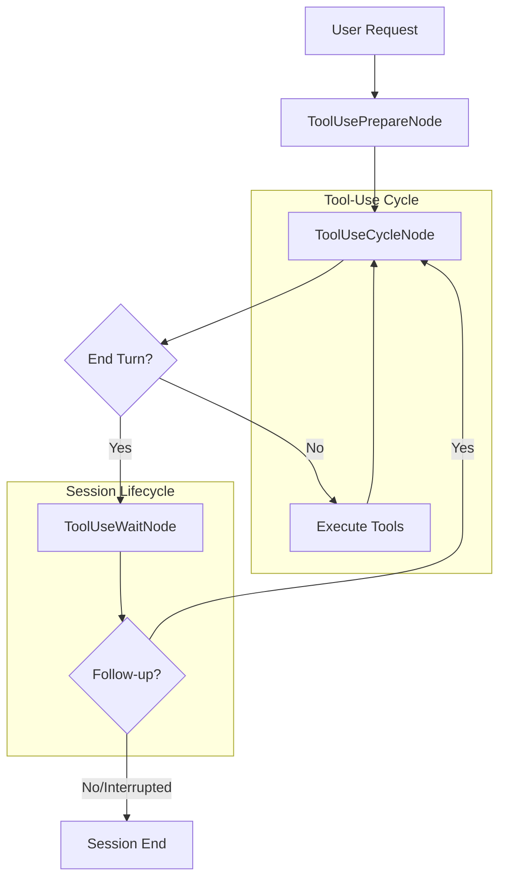
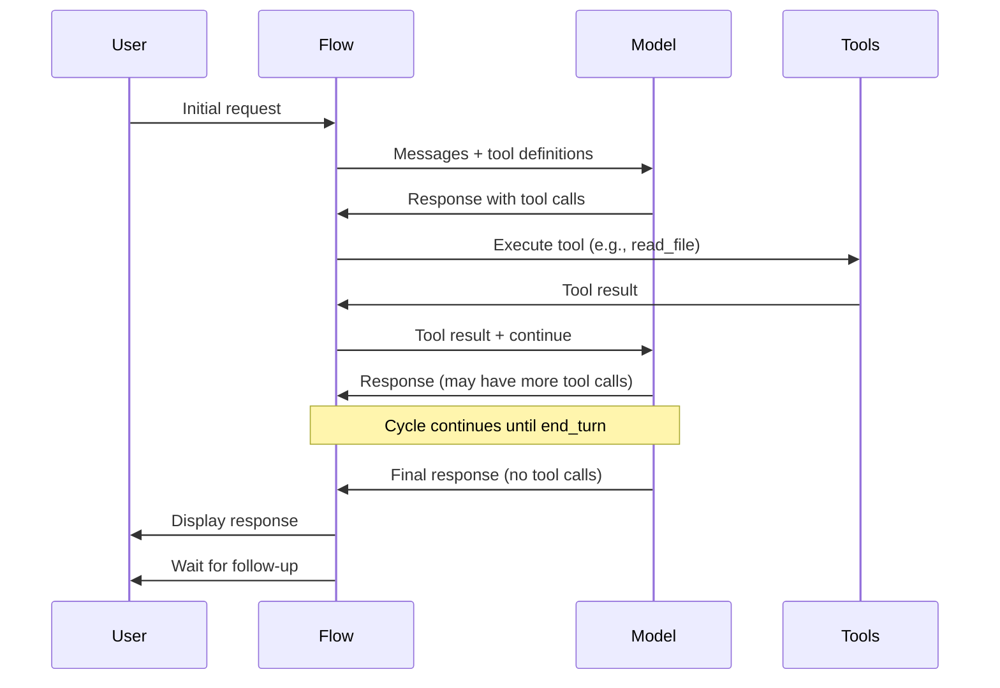
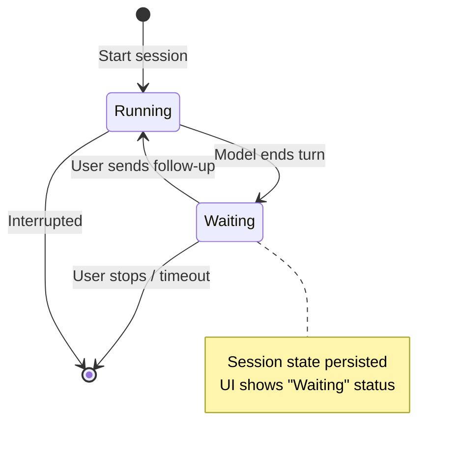

# Tool-Use Agents

Tool-use agents enable interactive, multi-turn conversations where the AI can call tools to accomplish tasks. Unlike workflow agents that run for a fixed number of rounds and produce structured LaTeX output, tool-use agents are designed for open-ended collaboration: exploring your codebase, performing research, editing files, and responding to follow-up questions.

## When to Use Tool-Use Agents

| Use Case | Recommended Agent |
|----------|------------------|
| Interactive research and literature discovery | `search`, `discuss` |
| File editing with back-and-forth refinement | `chat`, `research` |
| Formal proof development in Lean 4 | `lean` |
| Quick questions about your documents | `ask` |
| Automated linting fixes | `xml_validator`, `tex_linter_fix` |
| Computational research with symbolic math | `research` |

## Architecture Overview

Tool-use agents differ fundamentally from workflow agents:

| Aspect | Workflow Agents | Tool-Use Agents |
|--------|----------------|-----------------|
| Execution model | Fixed rounds (1-N) | Continuous cycles until task complete |
| Output format | Structured XML with document tags | Free-form responses + tool calls |
| Session persistence | Per-run state | Persistent sessions with follow-ups |
| User interaction | Single instruction | Multi-turn conversation |
| Primary use | Document transformation | Interactive assistance |

### Flow Diagram



## The Tool-Use Cycle

The tool-use cycle (`ToolUseCycleFlow`) is the core execution loop. Each cycle:

1. **Preparation**: Check for interruptions, reset cycle state
2. **Model Call**: Send messages to the LLM with tool definitions
3. **Response Processing**: Extract tool calls, text, and usage metrics
4. **Tool Dispatch**: Execute tool calls sequentially, collecting results
5. **Message Update**: Append tool results to conversation history
6. **Decision**: Continue cycling or end turn



### Cycle State Schema

The cycle maintains state across iterations:

```typescript
interface ToolUseCycleFields {
  messages: ProviderMessage[];      // Conversation history
  shouldStop: boolean;              // Interrupt flag
  endTurn: boolean;                 // Model signaled completion
  responseTimeMs: number;           // Current response time
  stopReason?: string;              // Why the model stopped
  cycleIndex: number;               // Current cycle number (0-based)
  toolCalls?: SdkToolCall[];        // Pending tool calls
  text?: string;                    // Model text response
}
```

## Built-in Tool-Use Agents

TeXRA includes 8 built-in tool-use agents in `resources/tool_use_agents/`:

### chat

**Purpose**: General-purpose interactive assistant for research collaboration.

**Tools**: File editing (`read_file`, `write_file`, `edit_file`), search (`glob`, `grep`, `ls`), literature (`arxiv_*`, `crossref_*`), LaTeX extraction tools

**Best for**: Writing assistance, document editing with feedback, general research tasks

```yaml
# Key characteristics
settings:
  agentType: toolUse
  tools:
    - bash
    - read_file
    - write_file
    - edit_file
    - glob
    - grep
    - ls
    - extract_figures
    - arxiv_search
    # ... more tools
```

### search

**Purpose**: Research assistant focused on web search and literature discovery.

**Tools**: Web (`web_search`, `web_fetch`), arXiv (`arxiv_search`, `arxiv_metadata`), Crossref (`crossref_search`, `crossref_doi`), LaTeX extraction

**Best for**: Literature reviews, finding papers, synthesizing research

```yaml
settings:
  agentType: toolUse
  tools:
    - web_search
    - web_fetch
    - arxiv_search
    - arxiv_metadata
    - crossref_search
    - crossref_doi
    - extract_figures
    - extract_bib_entries
```

### ask

**Purpose**: Read-only assistant for answering questions about your documents.

**Tools**: Read-only file access (`read_file`, `glob`, `grep`, `ls`), literature tools

**Best for**: Quick questions, exploring code/documents without modifications

```yaml
settings:
  agentType: toolUse
  tools:
    - read_file
    - glob
    - grep
    - ls
    - arxiv_search
    - arxiv_metadata
    - crossref_search
    - crossref_doi
```

### lean

**Purpose**: Lean 4 proof assistant with VS Code integration.

**Tools**: Lean-specific (`lean_diagnostics`, `lean_file`, `lean_project`, `lean_inspect`, `lean_loogle`), file operations, task tracking (`todo_write`)

**Best for**: Formal proof development, theorem proving, Mathlib exploration

```yaml
settings:
  agentType: toolUse
  tools:
    - todo_write
    - lean_diagnostics
    - lean_file
    - lean_project
    - lean_inspect
    - lean_loogle
    - bash
    - read_file
    - write_file
    - edit_file
```

### research

**Purpose**: Computational research with Wolfram Language support.

**Tools**: Wolfram (`wolfram`), file operations, task tracking, LaTeX utilities

**Best for**: Symbolic mathematics, numerical computation, analytical derivations

```yaml
settings:
  agentType: toolUse
  tools:
    - wolfram
    - todo_write
    - bash
    - read_file
    - write_file
    - edit_file
    - texcount
```

### discuss

**Purpose**: Academic discussion partner for exploring research directions.

**Tools**: Literature discovery (`arxiv_*`, `crossref_*`, `download_arxiv_source`), file reading

**Best for**: Intellectual discourse, literature exploration, research direction guidance

### xml_validator

**Purpose**: Validates and fixes XML syntax errors.

**Tools**: `str_replace_editor` only

**Best for**: Automated XML repair (typically invoked internally)

### tex_linter_fix

**Purpose**: Automatically fixes LaTeX linter warnings.

**Tools**: `str_replace_editor`, `diagnostics`, LaTeX extraction tools

**Best for**: Automated linting fixes (typically invoked internally)

## Available Tools Reference

### File Operations

| Tool | Description | Key Parameters |
|------|-------------|----------------|
| `read_file` | Read file contents (first 2000 lines) | `path`, `range` (optional) |
| `write_file` | Create or overwrite a file | `path`, `content` |
| `edit_file` | Apply targeted edits to existing files | `path`, `old_str`, `new_str` |
| `glob` | Find files matching a pattern | `pattern`, `path` (optional) |
| `grep` | Search file contents with ripgrep | `pattern`, `path`, `output_mode` |
| `ls` | List directory contents | `path`, `ignore` (optional globs) |
| `bash` | Execute shell commands | `command`, `timeout` |

### Literature Discovery

| Tool | Description |
|------|-------------|
| `arxiv_search` | Search arXiv for papers |
| `arxiv_metadata` | Get metadata for an arXiv paper |
| `download_arxiv_source` | Download arXiv paper source files |
| `crossref_search` | Search Crossref for publications |
| `crossref_doi` | Get metadata by DOI |

### Web

| Tool | Description |
|------|-------------|
| `web_search` | Search the web |
| `web_fetch` | Fetch and process a URL |

### LaTeX

| Tool | Description |
|------|-------------|
| `extract_figures` | Extract figure references from LaTeX |
| `extract_bib_entries` | Extract bibliography entries |
| `extract_tikz_figures` | Compile TikZ diagrams |
| `texcount` | Count words in LaTeX documents |
| `diagnostics` | Get linter diagnostics for a file |

### Specialized

| Tool | Description |
|------|-------------|
| `wolfram` | Execute Wolfram Language code |
| `todo_write` | Track multi-step tasks |
| `memory` | Persist information across sessions |
| `str_replace_editor` | SWE-bench style text editor |
| `lean_*` | Lean 4 proof assistant tools |

## Session Persistence and Follow-ups

Tool-use agents support persistent sessions that survive VS Code restarts and enable multi-turn conversations.

### Session Lifecycle



### How Persistence Works

1. **State Snapshot**: After each cycle, the session state is serialized:
   - Conversation messages
   - Agent configuration
   - Run state (rounds, metrics)
   - Workspace state (file interactions, todos)

2. **Storage**: State is persisted via `PersistedFlow` to execution-scoped storage

3. **Resume**: When you send a follow-up:
   - State is restored from snapshot
   - New user message is appended
   - Cycle continues from where it left off

### Follow-up Queue

The `ToolUseSessionLifecycle` manages follow-up messages:

```typescript
interface IToolUseSession {
  appendFollowUp(text: string): void;
  hasQueuedFollowUp(): boolean;
  waitForFollowUp(checkInterruption: () => boolean): Promise<string | null>;
  enterWaitingState(): Promise<void>;
  markRunning(): Promise<void>;
}
```

Multiple follow-ups sent while waiting are combined into a single message.

## Creating Custom Tool-Use Agents

### Basic Structure

Create a YAML file in your custom agents directory:

```yaml
name: my_custom_agent
description: Description shown in the agent picker.

settings:
  agentType: toolUse
  tools:
    - read_file
    - write_file
    - edit_file
    - glob
    - grep
    - ls
    # Add more tools as needed

prompts:
  systemPrompt: |
    Define the agent's role, capabilities, and constraints.

    Guidelines:
    (1) Specific instruction 1
    (2) Specific instruction 2

  userRequest: |
    {{ INSTRUCTION }}
```

### Tool Configuration Options

Tools can be specified as strings or objects with custom descriptions:

```yaml
settings:
  agentType: toolUse
  tools:
    # Simple string reference
    - read_file
    - write_file

    # Object form with custom description (optional)
    - name: bash
      description: "Execute safe shell commands only"
```

### Example: Domain-Specific Agent

Here's an example of a Python development assistant:

```yaml
name: python_dev
description: Python development assistant with testing support.

settings:
  agentType: toolUse
  tools:
    - bash
    - read_file
    - write_file
    - edit_file
    - glob
    - grep
    - ls
    - todo_write

prompts:
  systemPrompt: |
    You are a Python development assistant. Help users write, test, and debug Python code.

    Workflow:
    (1) Understand the task requirements
    (2) Explore the codebase with glob/grep/read_file
    (3) Make changes with edit_file or write_file
    (4) Run tests with bash to verify changes
    (5) Track complex tasks with todo_write

    Code Quality:
    (1) Follow PEP 8 style guidelines
    (2) Add type hints to function signatures
    (3) Write docstrings for public functions
    (4) Prefer small, focused functions

    Testing:
    (1) Always run existing tests after changes
    (2) Suggest new tests for new functionality
    (3) Use pytest conventions

    Bash Safety:
    (1) Safe commands (execute without asking): ls, cat, grep, python -c, pytest
    (2) Ask before: pip install, rm, mv with wildcards

  userRequest: |
    {{ INSTRUCTION }}
```

### Example: Read-Only Analysis Agent

For agents that should never modify files:

```yaml
name: code_reviewer
description: Reviews code without making changes.

settings:
  agentType: toolUse
  tools:
    # Only read-only tools
    - read_file
    - glob
    - grep
    - ls

prompts:
  systemPrompt: |
    You are a code reviewer. Analyze code and provide feedback, but never modify files.

    Review Checklist:
    (1) Code organization and structure
    (2) Naming conventions
    (3) Error handling
    (4) Performance considerations
    (5) Security concerns
    (6) Test coverage

    Output Format:
    Provide findings organized by severity (Critical, Warning, Suggestion).
    Include file paths and line numbers when referencing specific code.

  userRequest: |
    {{ INSTRUCTION }}
```

### Prompt Variables

Tool-use agents support these template variables in prompts:

| Variable | Description |
|----------|-------------|
| `{{ INSTRUCTION }}` | User's instruction text |
| `{{ INPUT_FILE }}` | Primary input file path |
| `{{ INPUT_CONTENT }}` | Content of primary input file |
| `{{ ERROR_CONTEXT }}` | Error context (for fix agents) |
| `{{ IS_ANTHROPIC_MODEL }}` | Boolean for model-specific prompts |

### Conditional Prompts

Use Jinja2 conditionals for model-specific behavior:

```yaml
prompts:
  systemPrompt: |
    You are a research assistant.

    
    Do not create excessive documentation files unless explicitly requested.
    
```

## Best Practices

### Tool Selection Guidelines

1. **Minimal toolset**: Only include tools the agent actually needs
2. **Read vs write**: Separate read-only agents from editing agents when possible
3. **Safety**: Consider which bash commands should be allowed

### System Prompt Design

1. **Clear role definition**: State what the agent is and what it does
2. **Structured guidelines**: Use numbered lists for instructions
3. **Tool usage hints**: Explain when to use specific tools
4. **Safety boundaries**: Define what the agent should/shouldn't do

### Handling Complex Tasks

1. **Use todo_write**: For multi-step tasks, have the agent track progress
2. **Iterative refinement**: Encourage the agent to verify changes before moving on
3. **User confirmation**: For significant changes, ask for confirmation

## Troubleshooting

### Session Not Resuming

If follow-ups aren't working:
1. Check the stream status in the Progress Board (should show "Waiting")
2. Verify the execution storage hasn't been cleared
3. Reload VS Code window if state appears corrupted

### Tool Not Found

If a tool isn't available:
1. Verify the tool name matches exactly (see Available Tools Reference)
2. Check for typos in the YAML tools list
3. Ensure the tool is registered in `src/tools/registry.ts`

### Model Not Calling Tools

If the model ignores tools:
1. Make tool usage explicit in the system prompt
2. Provide examples of when to use specific tools
3. Check that the model supports tool use (some models don't)

## Related Documentation

- [Custom Agents Guide](../guide/custom-agents.md) - General agent creation
- [Agent Architecture](../guide/agent-architecture.md) - How agents execute
- [Built-in Agents Reference](../guide/built-in-agents.md) - All available agents
